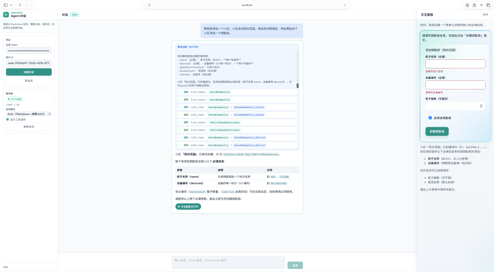
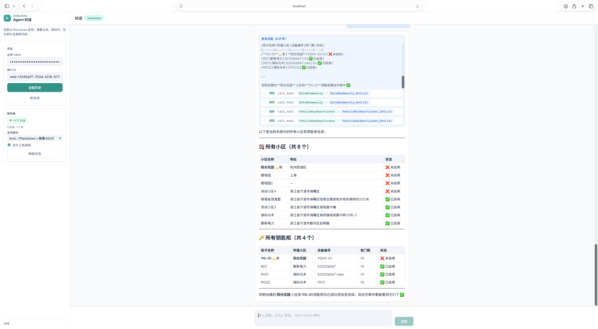

# Hubloom

**Hubloom —— Agentic Runtime：让大模型真正「长进」业务系统，把存量 API 与数据资产升级为可编排、可交互、可自动化、可审计的智能运营能力。**

> Hubloom 是一套 Agentic Runtime：把 OpenAPI/Swagger 与业务数据接进来，让智能体在真实系统上完成「理解 → 调用工具 → 呈现结果」。说明用 Markdown，办事用 A2UI；扩展靠 **配置与 Skill**，业务逻辑仍留在自有系统。
>
> 作为 Agent 基座，把工具调用、上下文与会话、结果呈现、鉴权透传和过程可观测打通成一条可运行链路：经 MCP 连接真实 REST，用 Markdown / A2UI 双通道交付结果，并为上层能力留出扩展位——可选记忆、RAG 与 A2A 跨 Agent 协作。在此之上，从对话闭环再走向事件触发任务、Agent 主动推送、IM 多端触达，以及自动化、自主运营与多智能体协同。

协议栈上：**MCP** 连接业务 API 与数据，**A2A** 支撑跨 Agent 委托，**A2UI** 生成式界面已就绪；下一步对齐 **AG-UI** 标准交互协议，更远期探索 **ANP** 开放互联。

## 特性

- **嵌入式智能，而非旁路助手**：智能体站在流程与数据平面上办事，直接触达企业 API，结果可核对、过程可复盘
- **契约即能力**：OpenAPI/Swagger 动态映射工具面，换业务域主要换配置，快速复用存量数字化资产
- **认知—决策—呈现一体**：Think → Present → Respond 编排环，复杂目标可拆解、可调工具、可自适应选交互形态
- **双通道体验**：Markdown 承载洞见与结论，A2UI 即时生成表单 / 列表 / 确认等操作界面（`auto | markdown | a2ui`）
- **从建议到闭环**：经 MCP 元工具调用真实 REST，把「能说会道」变成「能做完事」
- **可演进的运营智能**：配置 + Skill 固化领域 Know-how；记忆与 RAG 沉淀上下文；A2A 支撑多智能体协同与自动化闭环
- **过程可审计**：轨迹、工具链与 SSE 契约可上屏、可复盘，满足落地对透明与可控的要求

---

## 界面预览

一句多任务：先创建小区，再补全钥匙柜——对话说明 + 右侧 A2UI 交互面板。



创建完成后用表格核对系统状态（工具调用过程可展开查看）。



## 架构文档

示例站（`examples/chat`）负责开箱演示；Runtime（`HubloomRuntime` / `/v1/chat`）负责嵌入门户与自有应用。分层与协议边界见 [docs/](./docs/)：

| 文档                                      | 说明                                                  |
| ----------------------------------------- | ----------------------------------------------------- |
| [产品定位](./docs/Hubloom产品定位.md)     | 是什么 / 不是什么、交付形态与主路径                   |
| [架构边界](./docs/Hubloom架构边界.md)     | MCP / A2A / A2UI 收敛原则与包边界                     |
| [总体架构图](./docs/Hubloom总体架构图.md) | 系统分层与主链路示意                                  |
| [SSE 契约](./docs/Hubloom-SSE契约.md)     | `/v1/chat` 事件名与字段（当前前端契约）               |
| [MCP 适配](./docs/Hubloom-MCP适配.md)     | OpenAPI 管线、元工具、Token 透传                      |
| [A2A 互联](./docs/Hubloom-A2A互联.md)     | 双向 A2A、远程过程上屏                                |
| [工具层](./docs/Hubloom-工具层.md)        | ToolRegistry、ToolRunner 与内置工具                   |
| [记忆系统](./docs/Hubloom-记忆系统.md)    | 会话 / 长期记忆                                       |
| [RAG 知识库](./docs/Hubloom-RAG知识库.md) | 文档入库与检索                                        |
| [ADP 编排](./docs/Hubloom-ADP编排.md)     | 历史双路径说明（文档待与 Think/Present/Respond 对齐） |

---

## 快速开始

### 环境要求

- Python 3.12+
- [uv](https://github.com/astral-sh/uv)（推荐）或 pip
- Node.js（仅跑示例站前端时需要）

### 1. 安装依赖

```bash
uv sync
```

或使用 pip：

```bash
pip install -r requirements.txt
```

### 2. 配置

```bash
cp config/env.example.yaml config/env.yaml
```

在 `config/env.yaml` 中填写 LLM 与 MCP（OpenAPI 规格、业务 API 地址等）。业务 Token 由前端会话传入，不要写进配置文件。

### 3. 启动示例站

```bash
# 后端 API（默认 :8010）
PYTHONPATH=src:. uv run python main.py

# 前端（另开终端）
cd examples/chat/web && npm install && npm run dev
```

- **Web 对话页**：http://127.0.0.1:5173/（Vite 代理 `/v1` → `:8010`）
- **API 文档**：http://127.0.0.1:8010/docs

可通过 `CORTEX_API_HOST`、`CORTEX_API_PORT`、`HUBLOOM_CONFIG` 调整。

**健康检查**

```bash
curl http://127.0.0.1:8010/health
```

**调用对话接口**

```bash
curl -s http://127.0.0.1:8010/v1/chat \
  -H "Content-Type: application/json" \
  -H "X-Session-Id: demo-session" \
  -H "X-MCP-Token: your-business-token" \
  -d '{"message":"你好，你能做什么？","stream":false}'
```

默认 SSE（`"stream": true`）。历史：`GET /v1/chat/history?session_id=demo-session`。  
呈现模式可在请求或侧栏选择 `auto` / `markdown` / `a2ui`。

---

## 路线图

### 当前版本（重构后）

- [x] OpenAPI → MCP 工具面（catalog + 元工具 `list_tools` / `call_tool`）
- [x] **Think → Present → Respond** 统一编排环
- [x] **双呈现**：Markdown + A2UI（含 `present_mode=auto`）
- [x] 自研 HTTP / **SSE** 流式契约与 Web 对话页（交互面板、本轮 A2UI 生命周期）
- [x] 多轮会话与工具链感知的历史裁剪
- [x] 可选长期记忆与 RAG 知识库
- [x] **A2A 双向 MVP**：入站 Server、出站 `list_agents` / `delegate_task`、远程过程上屏

### 下一步

- [ ] **AG-UI**：将现有自研 SSE 交互契约对齐 / 适配 [AG-UI](https://docs.ag-ui.com/)（标准 Agent↔UI 事件协议）；A2UI 继续作为生成式 UI 载荷，传输与回传走 AG-UI
- [ ] **事件驱动与主动任务**：监听业务/系统事件（Webhook、消息队列、定时与告警等）触发 Agent 任务，支持 Agent **主动推送**结果与待办，而不只被动应答对话
- [ ] **IM / 多端触达**：接入企业微信、钉钉、飞书、Slack 等 IM 与通知通道，把对话、审批与推送延伸到日常工作入口
- [ ] **自动化运营增强**：在配置 + Skill 之上强化流程编排与无人值守执行，向自主运营与多智能体协同再进一步
- [ ] **文档对齐**：总体架构图 / ADP 编排文档与 Think–Present–Respond、元工具单轨表述一致
- [ ] **A2A 增强**：链式委托、动态发现、正式凭证 Provider
- [ ] **可观测与运维**：更完整的出站指标与部署约定

### 协议栈演进

| 协议      | 角色                               | 状态                                 |
| --------- | ---------------------------------- | ------------------------------------ |
| **MCP**   | Agent ↔ 企业 API / 数据            | 已落地                               |
| **A2A**   | Agent ↔ Agent 委托                 | 双向 MVP                             |
| **A2UI**  | 声明式生成式 UI（表单等）          | 已落地（经自研 SSE 下发）            |
| **AG-UI** | Agent ↔ 用户应用的标准交互事件协议 | **下一步**（替换/并行自研 SSE 契约） |
| **ANP**   | 更开放的 Agent 互联                | 探索中                               |

> **A2UI ≠ AG-UI**：A2UI 描述「画什么界面」；AG-UI 描述「Agent 与前端如何用标准事件对话」。二者互补，可叠加使用。

---

## 许可证

本项目基于 [Apache License 2.0](LICENSE) 开源发布。
