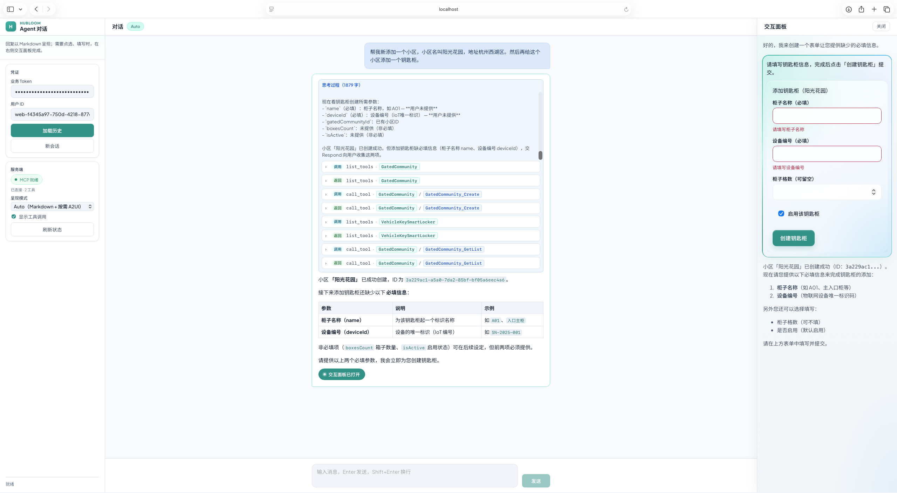
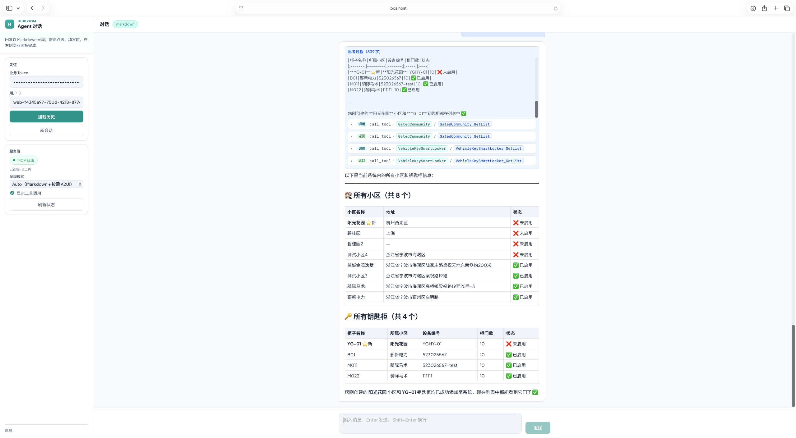

# Hubloom

如果说 Spring Boot 是后端接口的「地基」，Vue Admin 是后台页面的「脚手架」，那 **Hubloom 就是 AI Agent 时代的基座脚手架**。

它不是一个独立的聊天机器人，而是一层让**现有业务系统**长出 AI 手脚的胶水：接上你现有的 Swagger/OpenAPI 文档，Agent 就能在真实 API 上完成「决策 → 调工具 / 追问 / 确认 → 收工」。回复用 Markdown；网页可挂起等人（interactive），企微等入口用跨轮交班。**业务逻辑依然留在你的系统里，Hubloom 只做「翻译」和「路由」。**

**你主要做：** 配 LLM 与 Swagger、写 Skill（含可选 Playbook）、按需定制前端或嵌入门户。  
**底座替你搞定：** 工具调用（MCP）、Typed ReAct 编排、SSE 流式回合、会话记忆、鉴权透传与过程可观测。

交付分两层：**Hubloom Serve**（`src/server/` / `main.py`）产品 API；**演示前端**（`examples/chat/web`）开箱对话。记忆、RAG、A2A、Events、企微等为可选能力，默认不挡主路径。

**推荐部署：** 浏览器 / App → **企业 BFF** → Hubloom（不建议公网直连 Serve）。登录与限流放在 BFF；Hubloom 侧重办事编排。

协议要点：**MCP** 把 HTTP 变成工具；产品出站为**简洁 JSON SSE**（无 A2UI / AG-UI）。完整手册见 [docs/](./docs/)（Docsify）。

## 特性

- **嵌入式智能，而非旁路助手**：智能体站在流程与数据平面上办事，直接触达企业 API，结果可核对、过程可复盘
- **契约即能力**：OpenAPI/Swagger 动态映射工具面，换业务域主要换配置，快速复用存量数字化资产
- **Policy-Bounded Typed ReAct**：单环 Decide → Gate → `act` / `ask` / `await_confirm` / `finish`；Skill Playbook 可硬拦
- **Wait Profile**：网页 `interactive` 挂起续跑；企微等 `turn_based` 跨轮；事件入口 `no_wait`
- **Markdown 体验**：结论与过程用 Markdown；工具调用可展开复盘（演示前端无 A2UI 面板）
- **从建议到闭环**：经 MCP 元工具调用真实 REST，把「能说会道」变成「能做完事」
- **会话历史可选后端**：`memory.conversation_store` = `sqlite` | `postgres`（库不存在时可自动建库）
- **Redis 必填**：挂起态、按 session 锁、Events 幂等/串行、企微会话队列
- **Events / 企微已挂 Serve**：`POST /v1/events`、`GET|POST /v1/im/wecom/callback`
- **过程可审计**：轨迹、工具链与 SSE 事件可上屏、可复盘

---

## 界面预览

对话办事：自然语言驱动 MCP 工具，Markdown 呈现结论（工具调用过程可展开查看）。



创建完成后用表格核对系统状态（工具调用过程可展开查看）。



## 架构文档

Hubloom Serve 负责产品 HTTP API；`examples/chat/web` 负责开箱演示前端；Runtime（`HubloomRuntime`）可嵌入门户与自有应用。生产推荐由企业 BFF 转发，演示前端仅用于本地联调。

**本地预览文档站（Docsify）：**

```bash
npx --yes serve docs -p 3000
```

浏览器打开 `http://127.0.0.1:3000`。文档按学习路径组织：

| 部分 | 说明 |
|------|------|
| [文档首页](./docs/README.md) | Docsify 入口 |
| [入门指南](./docs/guide/README.md) | 是什么、安装、快速上手、第一个 Skill |
| [核心概念](./docs/core-concepts/README.md) | 架构与 MCP / Skill / Wait Profile |
| [使用指南](./docs/usage/README.md) | 配 LLM、接 Swagger、写 Skill、定制与嵌入 |
| [进阶功能](./docs/advanced/README.md) | 记忆、RAG、A2A、事件、企微 |
| [模块说明](./docs/modules/README.md) | Serve / Runtime / Events / 企微等实现向 |
| [参考文档](./docs/reference/README.md) | API、配置项、FAQ |
| [社区](./docs/community/README.md) | 贡献与更新日志 |

产品 API 速查：[Hubloom Serve](./docs/modules/hubloom-serve.md)。

---

## 快速开始

### 环境要求

- Python 3.12+
- [uv](https://github.com/astral-sh/uv)（推荐）或 pip
- **Redis**（必填）
- Node.js（仅跑演示前端时需要）
- Postgres（仅当 `memory.conversation_store=postgres` 时需要）

### 1. 安装依赖

```bash
uv sync
```

或使用 pip：

```bash
pip install -r requirements.txt
```

### 2. 配置

```bash
cp config/env.example.yaml config/env.yaml
```

在 `config/env.yaml` 中填写：

- `llm.*`、`redis.url`（必填）
- `mcp.swagger_url` / `base_url`（启用 MCP 时）
- 可选：`memory.conversation_store`（`sqlite` | `postgres`）、`events.*`、`im.wecom.*`

业务 Bearer 由请求传入（`Authorization` / `X-MCP-Token` 或事件体 `bearer_token`），不要写进配置文件。

### 3. 启动 Hubloom Serve + 演示前端

```bash
# 产品 API（默认 :8765，见 config http.port）
PYTHONPATH=src uv run python main.py
# 或：PYTHONPATH=src uv run python -m server serve --config config/env.yaml

# 前端（另开终端；本地演示用）
cd examples/chat/web && npm install && npm run dev
```

- **Web 对话页**：http://127.0.0.1:5173/（Vite 代理 `/v1` → Serve）
- **API 文档**：http://127.0.0.1:8765/docs

**健康检查**

```bash
curl http://127.0.0.1:8765/health
```

**调用对话接口**

```bash
curl -s http://127.0.0.1:8765/v1/chat \
  -H "Content-Type: application/json" \
  -H "X-Session-Id: demo-session" \
  -H "X-MCP-Token: your-business-token" \
  -d '{"message":"你好，你能做什么？","stream":false,"wait_profile":"interactive"}'
```

默认 SSE（`"stream": true`）。历史：`GET /v1/chat/history?session_id=demo-session`。  
缺参续跑：`POST /v1/chat/resume`（interactive）。

**事件入站**

```bash
# 需 events.enable=true；若配置了 shared_secret 则带上 X-Event-Secret
curl -sS -X POST "http://127.0.0.1:8765/v1/events" \
  -H "Content-Type: application/json" \
  -H "X-Event-Secret: change-me" \
  -d '{"event_id":"evt-1","type":"locker.created","session_id":"demo-1","payload":{"deviceId":"LK-A-001"}}'
```

**企业微信**

- Serve：`GET|POST /v1/im/wecom/callback`（`im.wecom.enable=true`）
- 企微后台「接收消息 URL」填公网 HTTPS，例如 `https://<tunnel>/v1/im/wecom/callback`
- 管道联调（不经 Agent）：`tests/test_im_wecom.py` 的 `send` / `echo`
- 说明见 [企业微信入口](./docs/advanced/wecom-integration.md)、[模块文档](./docs/modules/im-wecom.md)

---

## 测试计划

目标：用分层测试证明「换 Swagger 能办事、多入口行为一致、并发与幂等正确」。本地演示前端仅联调；生产路径以 **BFF → Serve** 为准。

### A. 冒烟（CI / 无真 LLM）

| 场景 | 命令 / 入口 | 期望 |
|------|-------------|------|
| Serve 路由与 SSE | `pytest tests/test_hubloom_serve.py` | chat / resume / health |
| Events + 企微挂载 | `pytest tests/test_hubloom_serve_events_wecom.py` | 幂等、503 开关、回调 ACK |
| 会话存储工厂 | `pytest tests/test_conversation_store_factory.py` | sqlite / postgres 配置选择 |
| Agent 内核步进 | `pytest tests/test_agent_v2_*.py` | Decide / Gate / Wait / Journal |
| Runtime 装配任务 | `python tests/test_runtime_agent_assembly.py` | 完整加宠故事（ScriptedLLM） |

```bash
PYTHONPATH=src .venv/bin/python -m pytest \
  tests/test_hubloom_serve.py \
  tests/test_hubloom_serve_events_wecom.py \
  tests/test_conversation_store_factory.py \
  tests/test_agent_v2_step1.py \
  tests/test_agent_v2_step2.py \
  tests/test_agent_v2_step3.py \
  tests/test_agent_v2_step4.py \
  tests/test_agent_v2_flow.py -q
```

### B. 不同业务 Swagger（真 MCP）

换 `mcp.swagger_url` / `base_url`（及按需 Bearer），验证「契约即能力」：

| 场景 | 做法 | 关注点 |
|------|------|--------|
| Petstore 等公开样例 | 默认 / 示例 swagger | `list_api` / `call_api`、SSE 工具事件 |
| 企业内部 OpenAPI | 换真实 swagger + Token | 鉴权透传、错误码、分页/过滤 |
| 多分组大规格 | 复杂 tag / 路径 | catalog 加载、工具选择、超时 |
| 规格变更回归 | 同一 Skill，换版本 swagger | Playbook 是否仍拦得住违规动作 |

辅助脚本：`tests/test_mcp_list_tools.py`、`tests/test_mcp_serve_swagger.py`；端到端对话：`tests/test_hubloom_serve_chat_task.py`（需已启动 Serve + 真 LLM）。

### C. 事件（Events）

| 场景 | 命令 / 入口 | 期望 |
|------|-------------|------|
| 调度层幂等 / 串行 | `python tests/test_events.py`（需 Redis） | 同 `event_id` 不双跑；同 session 串行 |
| HTTP 真链路 | Serve + `POST /v1/events` | 返回 `ok` / `summary`；历史可查 |
| 类型覆盖 | `locker.created` / `locker.offline` / `order.refund` 等 | 分册字段校验、触发文正确 |
| 无人值守 | `no_wait` | 误 `ask` 不挂死会话 |
| 密钥 | 配 / 不配 `shared_secret` | 401 vs 放行 |

### D. 企业微信（IM）

| 场景 | 命令 / 入口 | 期望 |
|------|-------------|------|
| 出站推送 | `python tests/test_im_wecom.py send --to <UserId>` | 手机收到 text |
| 回调管道 | `python tests/test_im_wecom.py echo` + 公网隧道 | GET 验 URL；POST 收信并回声 |
| Redis 队列 | `python tests/test_im_wecom.py queue` | 同 session FIFO、MsgId 去重 |
| 正式 Serve | 后台 URL → Serve 回调 | ACK 快、异步 Agent、短回复截断 |
| Web 一致 | 同一 `wecom:{UserId}` 查 history | 企微短、网页可看全文 |

### E. 并发与稳定性

| 场景 | 做法 | 期望 |
|------|------|------|
| 同 session 多入口 | chat + events（同 `session_id`）交错 | Redis session 锁，历史不乱序撕裂 |
| 同 session 多事件 | 并发 `POST /v1/events` | 串行执行、结果可复现 |
| 多 session 并行 | 多 `session_id` 同时 chat | 吞吐上来、互不堵死 |
| 挂起续跑 | interactive ask → resume | await_token 校验、无串台 |
| 存储后端 | sqlite ↔ postgres 切换 | 历史读写一致；Postgres 自动建库/表 |
| 故障注入 | Redis 短暂不可用、错误 Bearer、工具 4xx/5xx | 可恢复错误有提示；幂等键不丢 |

### F. 记忆 / RAG / Skill（按需）

| 场景 | 入口 | 期望 |
|------|------|------|
| 会话 remember/recall | `tests/test_memory_conversation.py` | 工具消息可回放 |
| Postgres 连通 | `tests/test_conversation_postgres_connect.py` | 读写 `conversation_memory` |
| 长期记忆 | `tests/test_memory_longterm.py` | Qdrant / Neo4j（需 enable） |
| RAG | `tests/test_retrieval.py` | 文档检索 |
| Skill 加载 | `tests/test_skill.py` | 卡片进提示、`read_skill` |

### G. 高强度复杂问题（建议清单）

人工 / 脚本构造，优先覆盖：

- [ ] 多轮追问 + 确认 + 真实写操作（含 Gate 打回）
- [ ] 工具失败重试、部分成功、空结果
- [ ] 长对话历史裁剪后仍能办完事
- [ ] Events 重放与并发同 session
- [ ] 企微短回复 vs Web 长历史一致性
- [ ] `thought_delta` 与最终答案是否冗余刷屏
- [ ] 换业务域 swagger 后旧 Skill/Playbook 是否仍成立

---

## 路线图

### 当前版本

- [x] OpenAPI → MCP 工具面（catalog + 元工具 `list_api` / `call_api`）
- [x] **Policy-Bounded Typed ReAct** 单环（Decide → Gate → Act / Ask / AwaitConfirm / Finish）
- [x] Evidence Journal + Wait Profile（`interactive` / `turn_based` / `no_wait`）
- [x] **Hubloom Serve** 产品 HTTP API（简洁 SSE，无 A2UI / AG-UI）
- [x] 演示前端：Markdown 对话 + interactive 挂起续跑
- [x] 会话历史 **SQLite / Postgres** 可配置；Redis 挂起态与 session 锁
- [x] 可选长期记忆与 RAG 知识库
- [x] **A2A 双向 MVP**：入站 Server、出站 `list_agents` / `delegate_task`
- [x] **Events 入站已挂 Serve**（`POST /v1/events`，Redis 幂等 + 串行）
- [x] **企微回调已挂 Serve**（`/v1/im/wecom/callback`，Redis 队列，短回复）

### 下一步

- [ ] **高强度测试与文档**：按上方测试计划推进；README / 模块文档与现状持续对齐
- [ ] **事件驱动增强**：消息队列 / 定时告警入站、结果回调完善、打开会话时主动推屏
- [ ] **IM 增强**：事件结果推企微、钉钉 / 飞书 / Slack、企微内表单/卡片
- [ ] **体验打磨**：`thought_delta` 与最终答案去重、企微/Web 话术分层
- [ ] **自动化运营增强**：流程编排与无人值守、多智能体协同再进一步
- [ ] **A2A 增强**：链式委托、动态发现、正式凭证 Provider
- [ ] **可观测与运维**：出站指标、部署与 BFF 对接约定（Hubloom 侧服务鉴权按需再加）

### 协议栈

| 协议 | 角色 | 状态 |
| --- | --- | --- |
| **MCP** | Agent ↔ 企业 API / 数据 | 已落地 |
| **A2A** | Agent ↔ Agent 委托 | 双向 MVP |
| **产品 SSE** | Serve ↔ 前端 / BFF | 已落地（简洁 JSON 事件） |
| **ANP** | 更开放的 Agent 互联 | 探索中 |

> 产品路径不再依赖 A2UI / AG-UI；演示与集成以 Markdown + Serve SSE 为准。

---

## 许可证

本项目基于 [Apache License 2.0](LICENSE) 开源发布。
