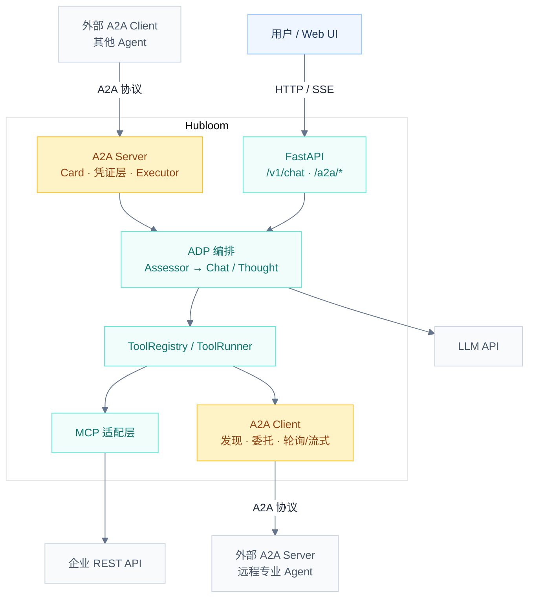
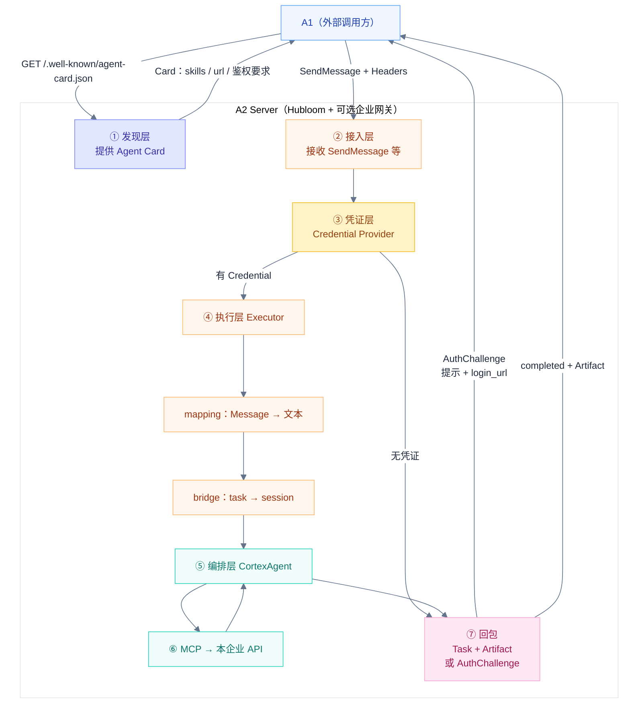
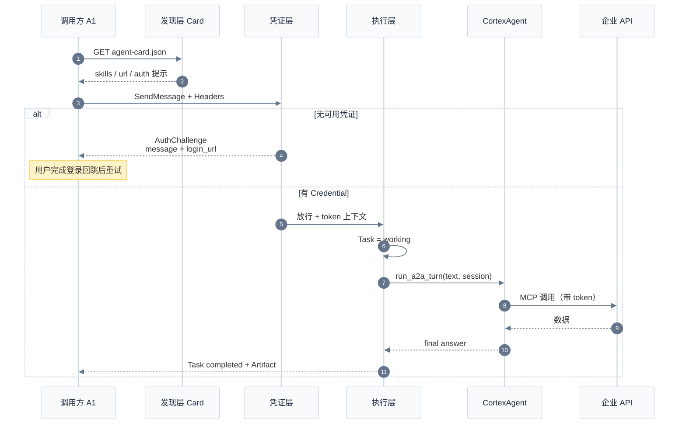
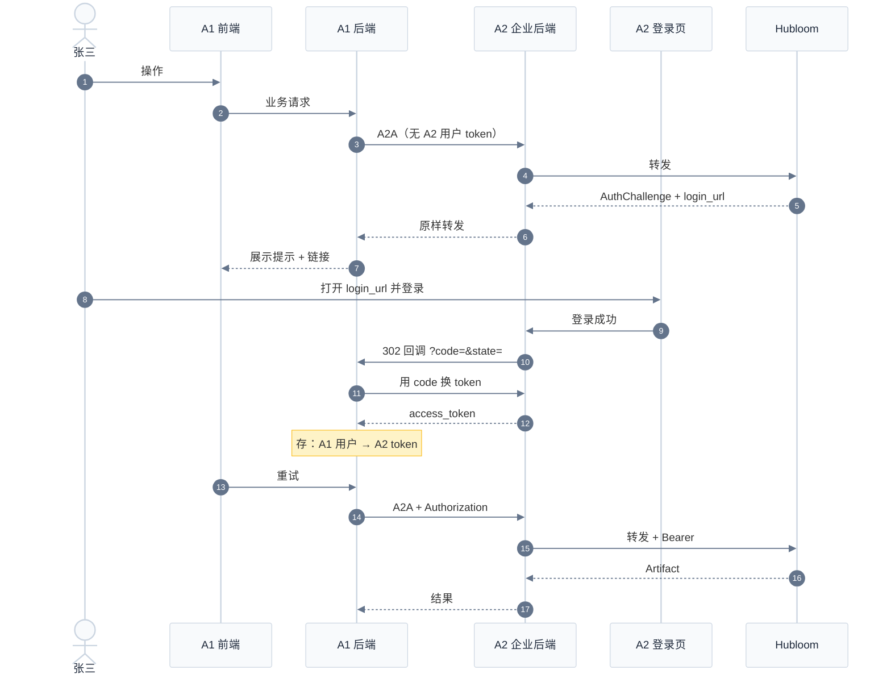
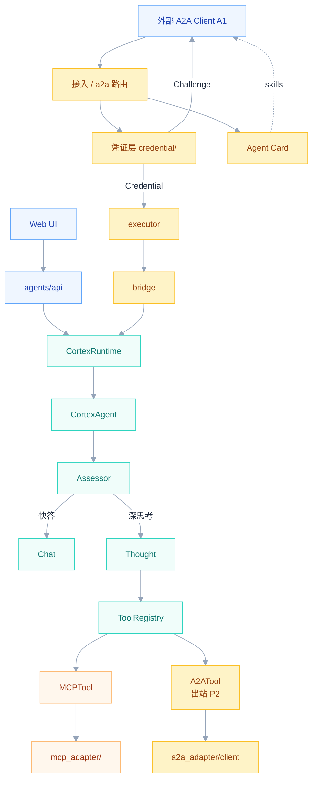
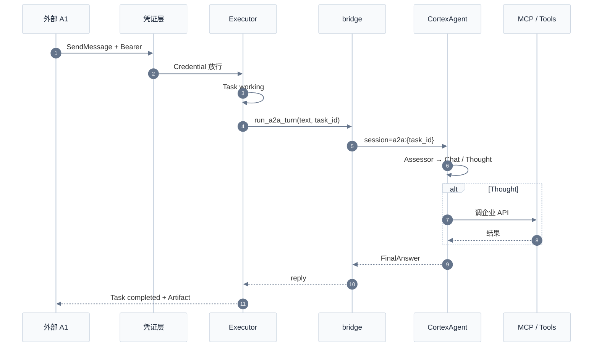
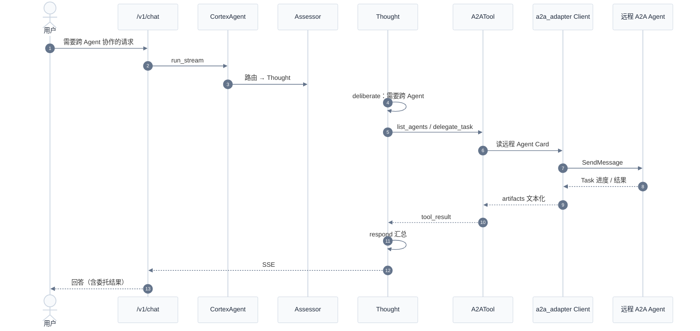
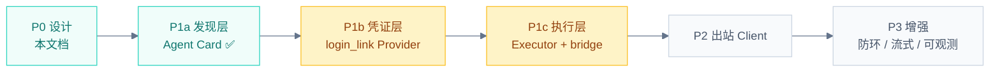

# Hubloom A2A 互联（设计稿）

本文档描述 Hubloom **双向 A2A（Agent-to-Agent）** 接入的整体架构、流程与分阶段实现计划。当前为设计约定，随实现逐步落地与修订。

← 返回 [总体架构图](./Hubloom总体架构图.md) · [MCP 适配层](./Hubloom-MCP适配.md) · [ADP 编排层](./Hubloom-ADP编排.md)

---

## 背景与定位

| 协议 | 解决什么 | Hubloom 状态 |
|------|----------|--------------|
| **MCP** | Agent ↔ 工具 / API / 数据 | 已支持 |
| **A2A** | Agent ↔ Agent（发现、委托、回传结果） | 设计中 / Card 已落地（本文档） |
| **ANP** | 更开放的 Agent 互联 | 路线图 |

一句话：

- **MCP** 给 Agent 装「手」（调企业 REST）。
- **A2A** 让 Agent 能「找同事、派活」（跨 Agent 任务委托）。

Hubloom 目标做成**双向**：

| 方向 | Hubloom 角色 | 含义 |
|------|--------------|------|
| **入站** | A2A Server | 发布 Agent Card，接收外部 Agent 的任务 |
| **出站** | A2A Client | 发现远程 Agent，在 Thought 路径中委托子任务 |

下文以 **A1 = 外部调用方**、**A2 = Hubloom（本系统作 Server）** 描述入站链路。

---

## 设计原则

1. **对称 MCP**：新增 `a2a_adapter/` 对标 `mcp_adapter/`；出站走工具层，入站走 HTTP 协议端点。
2. **编排仍归 ADP**：入站任务进入 `CortexAgent`；出站委托只在 Thought 路径通过工具发生。
3. **边界清晰**：MCP = Agent↔工具；A2A = Agent↔Agent；二者可叠加，不互相替代。
4. **防环**：入站任务默认不再二次出站委托（或加深度 / 白名单），避免 A↔B 互相派活死循环。
5. **凭证与执行分离**：执行前由**凭证层**解决「有没有、从哪来」；Executor 不负责登录页与换票。

---

## 1. 目标总览（双向）



---

## 2. A2 Server：A1 发现并建立通信后的处理流程

站在 **A2（Hubloom）** 视角：A1 发现 A2 并建立通信后，请求在 A2 内部如何处理。



### 分层职责

| 顺序 | 层 | A2 在做什么 |
|------|----|-------------|
| ① | **发现层** Agent Card | 被动提供名片（skills / 端点 / 鉴权要求） |
| ② | **接入层** | 收 JSON-RPC；生产上常经 A2 企业后端转发 |
| ③ | **凭证层** | 有 Bearer → 放行；无 → 返回 AuthChallenge |
| ④ | **执行层** Executor | Task 状态机；调 bridge；写 Artifact |
| ⑤ | **编排层** ADP | `CortexAgent`（Assessor → Chat / Thought） |
| ⑥ | **工具层** MCP | 调本企业 REST（透传 token） |
| ⑦ | **回包** | 成功 Artifact，或需登录的 Challenge |

一句话：

```text
A1 发现 A2 → A2 返回 Card
A1 发起通信（SendMessage）
  → A2 凭证层
      → 无凭证：Challenge（login_url）→ 等 A1 带 token 再来
      → 有凭证：Executor → CortexAgent → MCP → Artifact 回 A1
```

A1 侧的「登录回跳、存 token、重试」发生在 **A1**，不画进 A2 主链。

### 时序图（含凭证层）



---

## 3. 凭证层（Credential Layer）

执行层之前的一层：解决 **token / 凭证从哪来**，与 Executor 解耦，做成**可配置、可插拔**模块。

```text
发现层（Agent Card）
    ↓
凭证层（Credential Layer）  ← 可插拔 Provider
    ↓  Credential 或 AuthChallenge
执行层（Executor）
    ↓
编排层（CortexAgent / ADP）
```

| 名称 | 说明 |
|------|------|
| **凭证层** | 层名：执行前解析/索取凭证 |
| **Credential Provider** | 插件实现：`none` / `login_link` / `oauth` / `sso` / `bearer_passthrough` 等 |
| **Credential** | 有可用凭证（如 Bearer），放行执行 |
| **AuthChallenge** | 无凭证时的结构化响应：提示文案 + `login_url` 等 |

Hubloom 侧宜薄：读请求头 / 拼 Challenge。  
**发 code、换 token、登录回跳** 放在 **A2 企业后端**（或独立 Auth 服务），不塞进 Agent 对话逻辑。

### 当前简化实现（联调优先）

凭证层暂不接 login_link / OAuth，只提供静态入口，便于先做执行层：

| 路径 | 说明 |
|------|------|
| `agents/a2a/credential/base.py` | `Credential` / `AuthChallenge` |
| `agents/a2a/credential/static.py` | `resolve_credential()`：返回程序内或 `A2A_STATIC_TOKEN` 的固定 token |

执行层调用：`credential = resolve_credential()`，再把 `credential.token` 写入请求上下文 / MCP 透传。  
完整可插拔 Provider（`login_link` 等）后续再加，接口形状保持 `Credential | AuthChallenge`。

### 建议目录（完整版，后续）

```
agents/a2a/credential/
  base.py                        # Credential / AuthChallenge ✅
  static.py                      # 静态 token ✅（当前）
  providers/
    login_link.py                # 方案一：登录链接 + 回跳
    # oauth.py / sso.py
  factory.py                     # 按配置创建 Provider
```

---

## 4. 跨系统鉴权：凭证从哪来

生产形态建议：**前端不直连 Agent**，经企业后端转发；Chat 与 A2A 可共用 A2 企业网关。

两套不同系统（A1 财务 / A2 合同）时：A1 的用户 token **不能**直接当 A2 的用户 token；浏览器里 A2 的登录态也 **不会**自动出现在 A1 后端的服务端请求中。

### 三种常见方案

| 方案 | 做法 | 企业改动 | 体验 |
|------|------|----------|------|
| **登录链接 + 回跳** | 去 A2 登录，回调把凭证带回 A1（类似第三方登录的简化版） | 小 | 跳一次 |
| **OAuth / 授权码** | 标准「允许财务系统访问合同系统」 | 中（有 IdP 则小） | 正规、可 scope |
| **同一 SSO** | 公司统一身份，A1/A2 都认 | 大（一次建设） | 最好、常无感 |

产品语义上，**登录链接 + 回跳 ≈ 简化版第三方账号登录**；OAuth 是其标准形态；SSO 是公司级统一登录。

### 方案一（登录链接 + 回跳）可实行性

**前提（go/no-go）：**

1. A2 有可打开的登录页  
2. 登录成功后能回跳到 A1 回调地址  
3. A2 能发一次性 code/ticket，A1 后端兑换短期 token  
4. A1 能按当前用户存储 A2 凭证并在重试时带上  
5. A1→A2 走后端调用  



### 企业侧最小改动（方案一）

| 系统 | 前端 | 后端 | 业务核心 |
|------|------|------|----------|
| **A2** | 登录页支持 `redirect_uri` / `state`，成功后回跳带 `code` | 发/换票、redirect 白名单、网关透传 Bearer 或返回 Challenge | 尽量不动 |
| **A1** | 展示 Challenge、打开链接、授权后重试 | 调 A2、回调收 code、存 token、重试带 Bearer | 尽量不动 |
| **Hubloom** | — | 凭证层：有头执行 / 无头 Challenge | — |

---

## 5. 执行层（Executor）设计要点

与凭证层分离：Executor **只**做 Task 状态机 + 调业务桥接。

| 模块 | 职责 |
|------|------|
| `a2a_adapter/server/executor.py` | 实现 SDK `AgentExecutor`；注入 `run_turn` |
| `a2a_adapter/server/mapping.py` | Message ↔ 文本；回答 ↔ Artifact |
| `agents/a2a/bridge.py` | `run_a2a_turn` → `CortexRuntime` → `CortexAgent` |
| `a2a_adapter/server/app.py` | Card 路由 + JSON-RPC 组装 |

映射约定：

| A2A | Hubloom |
|-----|---------|
| `task.id` | `session_id = f"a2a:{task_id}"` |
| Message 文本 | `CortexAgent.run_stream` 输入 |
| `FinalAnswerEvent.content` | Artifact 文本 |
| 异常 | Task `FAILED` |

实现顺序建议：E1 假执行打通协议 → E2 接 CortexAgent → E3 挂主 FastAPI。

---

## 6. 内部模块展开（建议落点）



### 建议目录结构

```
a2a_adapter/
  simple_client.py / simple_server.py   # 协议学习用 demo
  serve_card_only.py                    # Card 调试入口
  server/
    app.py / executor.py / mapping.py   # 入站协议与执行
agents/a2a/
  card.py / card_polish.py              # Card：tag→skill + LLM 润色（已落地）
  bridge.py                             # 入站 → CortexAgent（待做）
  credential/                           # 凭证层（待做）
tools/builtin/a2a_tool.py               # 出站工具（P2）
docs/Hubloom-A2A互联.md
```

### 与现有分层对照

| 层 | 现状 | 双向 A2A 后 |
|----|------|-------------|
| FastAPI | `/v1/chat` 等 | + Agent Card、A2A 协议端点 |
| 凭证层 | — | 可插拔 Credential Provider |
| ADP | Assessor / Chat / Thought | 入站复用；Thought 可调出站 A2A 工具 |
| Tool 层 | MCPTool + 内置工具 | + A2ATool（出站） |
| 适配层 | `mcp_adapter/` | + `a2a_adapter/` |
| 外部 | Swagger / REST / LLM | + 远程 Agents |

---

## 7. A2A 核心概念（接入时用到的对象）

| 对象 | 作用 |
|------|------|
| **Agent Card** | Agent「名片」JSON，通常在 `/.well-known/agent-card.json` |
| **Task** | 工作单元：`submitted → working → completed / failed / canceled` |
| **Message** | 对话 / 指令，由多个 **Part** 组成 |
| **Artifact** | 任务产出 |
| **Credential / AuthChallenge** | 凭证层产物（Hubloom 扩展约定） |

Hubloom **优先采用 JSON-RPC 2.0 over HTTPS**；流式用 SSE；长任务可轮询 `GetTask`。

---

## 8. Agent Card（发现层）落地约定

### 设计定案

- **skills 按 OpenAPI tag 生成**（一个 tag ≈ 一个 `AgentSkill`），与 `GatewayCatalog` 对齐。  
- **一次 LLM 润色**：Agent `description` + 各 skill 的 `description` / `examples`；**不改** `skill.id`（保持为 tag）。  
- **不做通用 skill 回退**：能 build Card 时假定 Swagger/catalog 已就绪。  
- 细粒度 REST 仍归 MCP，不把每个 operation 做成 A2A skill。

```mermaid
%%{init: {"theme":"base","themeVariables":{"background":"#ffffff","primaryColor":"#ffffff","primaryBorderColor":"#cbd5e1","primaryTextColor":"#1e293b","lineColor":"#64748b","fontSize":"14px"}}}%%
flowchart LR
    SW["Swagger / OpenAPI"] --> CAT["GatewayCatalog<br/>tag → 工具列表"]
    CAT --> SK["规则：tag → AgentSkill"]
    SK --> LLM["一次 LLM 润色文案"]
    LLM --> CARD["Agent Card JSON"]
    CARD --> EP["/.well-known/agent-card.json"]

    classDef src fill:#f8fafc,stroke:#cbd5e1
    classDef step fill:#f0fdfa,stroke:#2dd4bf
    classDef out fill:#fef3c7,stroke:#fbbf24

    class SW,CAT src
    class SK,LLM step
    class CARD,EP out
```



### 已实现代码

| 路径 | 说明 |
|------|------|
| `agents/a2a/card.py` | `skills_from_catalog` / `build_agent_card` |
| `agents/a2a/card_polish.py` | `polish_card_copy` |
| `a2a_adapter/serve_card_only.py` | 仅挂 Card 的调试服务 |

调试：

```bash
uv run python -m a2a_adapter.serve_card_only
curl -s http://127.0.0.1:9999/.well-known/agent-card.json
```

---

## 9. 流程：入站执行（有凭证之后）



### 入站数据映射

| A2A | Hubloom |
|-----|---------|
| Task.id | `session_id = f"a2a:{task_id}"` |
| Message.parts(text) | 用户输入 |
| Task.state | submitted / working / completed / failed |
| Artifact | 最终回答 + 可选工具轨迹摘要 |

---

## 10. 流程：出站（Hubloom = A2A Client）



### 出站工具面（对标 MCP 的 meta-tools）

| 工具 | 作用 |
|------|------|
| `list_agents` | 列出已配置 / 已发现的远程 Agent 与 skills |
| `delegate_task` | 向指定 Agent 发 Message，等待或流式取回 Artifact |
| `get_delegation_status`（可选） | 查长任务状态 |

P2 先做 **静态 Agent 目录**，再演进到动态发现。

---

## 11. 双向同时存在时的协作


典型场景：

1. **用户 → Hubloom → 企业 API**（现状，纯 MCP）
2. **用户 → Hubloom → 远程 Agent**（出站 A2A）
3. **外部 Agent → Hubloom → 企业 API**（入站 A2A + 内部 MCP）
4. **外部 Agent → Hubloom → 再委托远程**（双向叠加，需防环）

---

## 12. 分阶段实现计划



| 阶段 | 交付 | 状态 |
|------|------|------|
| **P0** | 架构与流程约定 | 进行中（本文档迭代） |
| **P1a** | Agent Card：tag→skill + LLM 润色 + 发现端点 | ✅ 已落地 |
| **P1b** | 凭证层：先静态 `resolve_credential()`；完整 login_link 后补 | ✅ 占位已建 |
| **P1c** | Executor + bridge → CortexAgent | 进行中 |
| **P2** | 出站 Client / A2ATool | 未开始 |
| **P3** | 防环、流式、挂主应用、可观测 | 未开始 |

---

## 13. 待拍板决策

| # | 议题 | 建议默认 | 状态 |
|---|------|----------|------|
| 1 | 协议绑定 | JSON-RPC over HTTP | 倾向确认 |
| 2 | 入站是否允许再出站 | 默认禁止（`inbound_depth=0`） | 待确认 |
| 3 | 远程 Agent 目录 | P2 先静态 Card URL 列表 | 待确认 |
| 4 | 凭证层首版 Provider | `login_link`（登录链接 + 回跳）；开发可用 `none` | **已倾向** |
| 5 | 发 code / 换票位置 | A2 企业后端，不在 Hubloom Agent 内 | **已倾向** |
| 6 | 生产接入形态 | Chat + A2A 经 A2 企业后端转发；前端不直连 Agent | **已倾向** |

---

## 14. 修订记录

| 日期 | 变更 |
|------|------|
| 2026-07-09 | 初稿：双向 A2A 总览、模块落点、入站/出站时序、分阶段计划 |
| 2026-07-09 | 增补：A2 Server 处理流程、凭证层、跨系统鉴权（登录回跳 / OAuth / SSO）、Executor 要点、Card 落地约定与阶段状态 |

---

## 相关文档

- [总体架构图](./Hubloom总体架构图.md)
- [ADP 编排层](./Hubloom-ADP编排.md)
- [MCP 适配层](./Hubloom-MCP适配.md)
- [工具层](./Hubloom-工具层.md)
- 官方规范：[A2A Protocol](https://a2a-protocol.org/) · [a2aproject/A2A](https://github.com/a2aproject/A2A)
