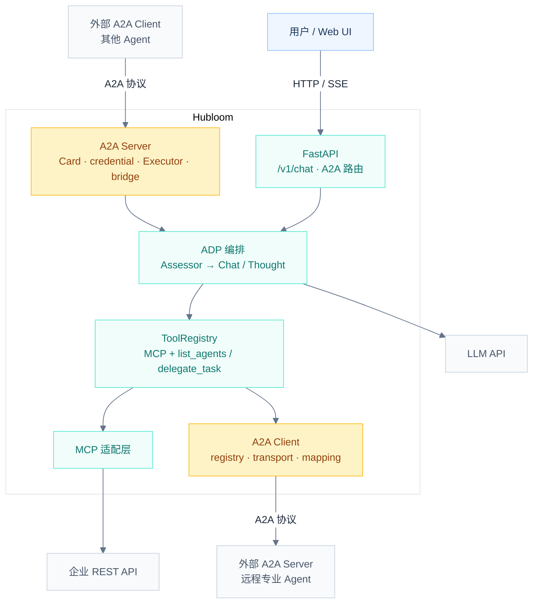
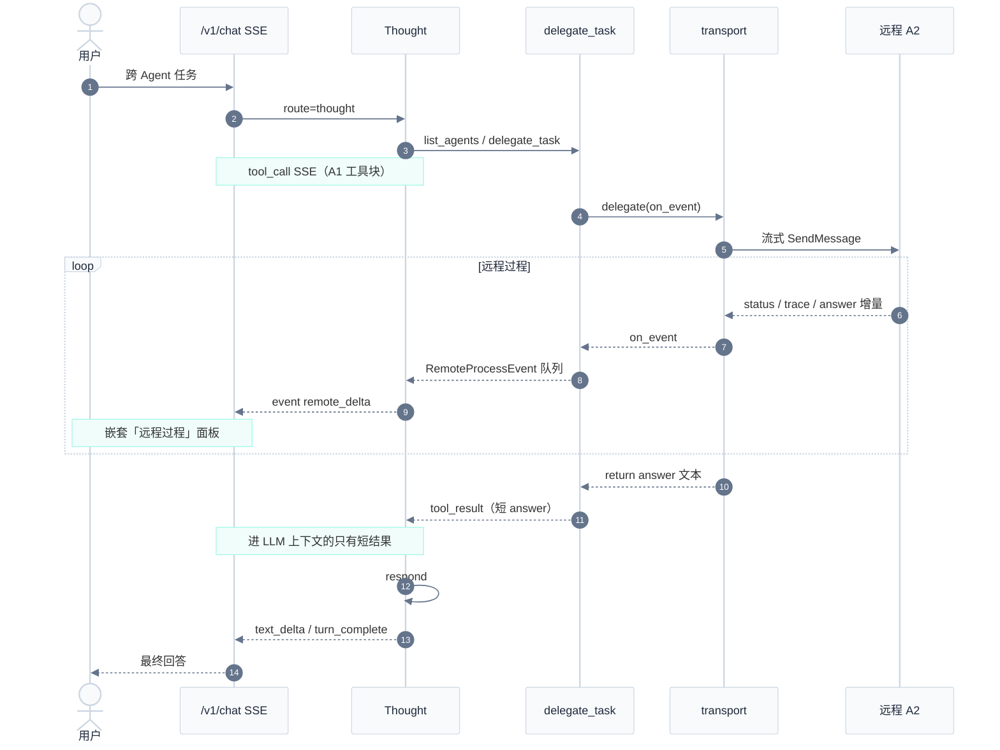
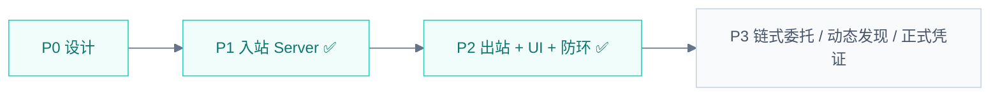

# Hubloom A2A 互联

本文档描述 Hubloom **双向 A2A（Agent-to-Agent）** 的架构、已落地实现、联调方式与演进约定。

← 返回 [总体架构图](./Hubloom总体架构图.md) · [MCP 适配层](./Hubloom-MCP适配.md) · [ADP 编排层](./Hubloom-ADP编排.md) · [工具层](./Hubloom-工具层.md)

---

## 背景与定位

| 协议 | 解决什么 | Hubloom 状态 |
|------|----------|--------------|
| **MCP** | Agent ↔ 工具 / API / 数据 | ✅ 已支持 |
| **A2A** | Agent ↔ Agent（发现、委托、回传结果） | ✅ **双向 MVP 已闭环**（本文档） |
| **ANP** | 更开放的 Agent 互联 | 路线图 |

一句话：

- **MCP** 给 Agent 装「手」（调企业 REST）。
- **A2A** 让 Agent 能「找同事、派活」（跨 Agent 任务委托）。

Hubloom 做成**双向**：

| 方向 | Hubloom 角色 | 含义 | 状态 |
|------|--------------|------|------|
| **入站** | A2A Server | 发布 Agent Card，接收外部 Agent 的任务，进 ADP | ✅ |
| **出站** | A2A Client | 静态目录 + Thought 工具委托远程 Agent | ✅ |

命名约定（全文统一）：

| 符号 | 含义 |
|------|------|
| **A1** | 调用方（用户 Chat 所在的 Hubloom，或外部编排 Agent） |
| **A2** | 被委托方（远程 Hubloom / 其他 A2A Server） |
| **A3** | 更下游的被委托方（**当前防环策略下，入站后不可再派到 A3**，见 §12） |

---

## 设计原则

1. **对称 MCP**：`a2a_adapter/` 对标 `mcp_adapter/`；出站走工具层，入站走 HTTP 协议端点。
2. **编排仍归 ADP**：入站任务进入 `CortexAgent`；出站委托**只在 Thought** 路径通过工具发生（Chat 不 function-call）。
3. **边界清晰**：MCP = Agent↔工具；A2A = Agent↔Agent；二者可叠加。
4. **防环（已落地）**：入站 A2A 回合禁止再 `delegate_task`（一刀切，暂不允许 A2→A3 链式委托）。
5. **凭证与执行分离**：联调用静态 Credential；正式 login_link / OAuth 后补。
6. **双通道**：远程**过程**上屏（SSE / UI），**最终 answer** 才进 LLM 的 `tool_result`，避免把 A2 全文塞进上下文。

---

## 1. 目标总览（双向）



---

## 2. 已落地代码地图

```
a2a_adapter/
  client/
    registry.py          # A2A_REMOTE_AGENTS 静态目录
    transport.py         # 发现 Card → 流式 SendMessage → on_event / 返回 answer
    mapping.py           # Task / stream → 最终 answer 文本（忽略 trace）
    __init__.py
  server/
    app.py / executor.py / mapping.py   # 入站协议、Task 状态机、answer+trace Artifact
  simple_client.py / simple_server.py / serve_card_only.py   # 学习 / 调试

agents/a2a/
  card.py / card_polish.py
  bridge.py              # 入站 → CortexAgent；set_a2a_inbound(True)
  credential/            # 静态假身份（联调）

tools/builtin/a2a_tool.py
  ListAgentsTool         # list_agents
  DelegateTaskTool       # delegate_task（防环 + on_event）

agents/api/
  request_context.py     # a2a_inbound · remote_process 旁路队列
  events.py              # SSE：remote_delta
  static/chat.js         # 嵌套「远程过程」面板
  static/a2a-remote-ui-mock.html   # 交互示意页
```

挂载：主 FastAPI（`agents/api/app.py` lifespan）把 A2A 路由与 Card 挂到**同一进程/端口**（常见 `CORTEX_API_PORT=8001`）。

---

## 3. 入站（Hubloom = A2A Server）

### 3.1 流程摘要

1. 外部拉 `/.well-known/agent-card.json`（skills 来自 OpenAPI tags，可 LLM 润色）。
2. `SendMessage` → Executor → `run_a2a_turn`（bridge）。
3. 凭证层 `resolve_credential()` → 静态 `user_id` + `token`（MCP 透传用；**不是**远程 A2A 的业务身份由 A1 指定）。
4. `set_request_context` + **`set_a2a_inbound(True)`** → `CortexAgent.run_stream`。
5. 过程经 `on_stream` 写成 Artifact：
   - `name=answer`：最终回答增量  
   - `name=trace`：phase / thought / tool_call / tool_result  

### 3.2 Session 约定（实现）

| 项 | 实现 |
|----|------|
| session | `format_session_id(cred.user_id)`，如 `mem:a2a_dev_user:default` |
| 说明 | **不**使用文档早期草案的 `a2a:{task_id}`；与 Chat「一用户一会话」对齐 |
| task_id | 主要用于日志与 A2A Task，不单独隔离会话 |

### 3.3 鉴权心智模型

- A1→A2 的 Bearer：远程 A2 **接受**的凭证（可与 MCP/企业 token 分离）。
- A2 会话用户：由 **A2 凭证层**解析，**不得**把 A1 的 user 原样当成 A2 session。
- 出站目录里的 `RemoteAgent.token`：可选的「打给远程 A2A」的 Bearer，**不是** Hubloom 调 MCP 的企业 token。

---

## 4. 出站（Hubloom = A2A Client）

### 4.1 静态目录

环境变量 `A2A_REMOTE_AGENTS`（JSON 数组）：

```bash
A2A_REMOTE_AGENTS='[
  {"id":"hubloom-a2","name":"Hubloom-A2","url":"http://127.0.0.1:8002"}
]'
```

| 字段 | 必填 | 说明 |
|------|------|------|
| `id` | ✅ | Thought 委托用的 agent_id |
| `url` | ✅ | 远程基址（可写 `card_url` 别名） |
| `name` | | 展示名，默认用 id |
| `token` | | 可选，出站 `Authorization: Bearer …` |

实现：`a2a_adapter/client/registry.py` → `load_agents()` / `get_agent()`。

### 4.2 传输层

`a2a_adapter/client/transport.py`：

1. 拉 Agent Card；若 Card 未声明 streaming，**强制** `capabilities.streaming=True`（SDK 要求 Client 与 Card 都开流式）。
2. `ClientConfig(streaming=True)` 发 `SendMessage`。
3. 边收边：
   - `echo_live`：打到终端（CLI 联调）  
   - `on_event(channel, text)`：`status` / `trace` / `answer` 旁路给 UI  
4. `collect_answer_from_stream`：**只抽出最终 answer**（忽略 `trace`）作为返回值。

### 4.3 Thought 工具

| 工具 | 参数 | 返回给 LLM |
|------|------|------------|
| `list_agents` | 无 | 目录文本：id / name / url（**不暴露 token**） |
| `delegate_task` | `agent_id`, `message` | **仅最终 answer**；失败或防环时返回说明文案 |

注册：`CortexAgent.attach_readonly_tools()` 始终挂上上述两个工具（与 memory/RAG 并列）。

仅 **Thought.execute** 会真正 function-call；Chat 路径 `tools=None`，只在 prompt 里可能看到工具摘要。

### 4.4 出站时序（含双通道）



---

## 5. 双通道与前端展示

### 5.1 为什么要双通道

| 通道 | 内容 | 去向 |
|------|------|------|
| **过程** | A2 的 phase / thought / 工具轨迹（trace） | SSE `remote_delta` → UI「远程过程」 |
| **结果** | A2 最终 answer | `delegate_task` 的 `tool_result` → LLM + UI「返回 · delegate_task」 |

禁止把 A2 全文塞进 `tool_result`，否则上下文爆炸且与 A1 工具块混在一起。

### 5.2 SSE 事件

| event | 含义 |
|-------|------|
| `tool_call` / `tool_result` | A1 侧工具（含 list_agents / delegate_task） |
| `remote_delta` | 出站过程旁路：`call_id`, `agent_id`, `channel`(`status`\|`trace`\|`answer`), `delta`, `status` |
| `thought_delta` / `text_delta` / `phase` / `turn_complete` | 原有 Chat 事件 |

实现要点：

- Thought 对 `delegate_task` **串行**执行，并用 `asyncio.Queue` + `set_remote_process_sink` 边跑边 `yield RemoteProcessEvent`。
- 前端把「远程过程」**嵌在「调用 · delegate_task」卡片内部**；解析 trace 中的 `[tool_call]` / `[tool_result:…]` 为嵌套工具卡片。
- 示意页：`/static/a2a-remote-ui-mock.html`。

### 5.3 如何从 UI 判断走了 A2A

过程区出现 **`list_agents` / `delegate_task`**（及绿色「远程过程 · {agent_id}」）即走了出站；若只有 `list_tools` / `call_tool` 则是本机 MCP。

---

## 6. 防环（已落地，详细约定）

### 6.1 规则（当前）

> **只要当前请求是入站 A2A 回合（`is_a2a_inbound() == True`），禁止再执行 `delegate_task`。**

实现：

1. `agents/a2a/bridge.py`：`set_a2a_inbound(True)`（`clear_request_context` 时清掉）。
2. `DelegateTaskTool.execute`：若入站 → 直接返回拒绝文案，**不发远程请求**。

`list_agents` 入站时仍可调用（只读目录）；真正危险的是再次委托。

### 6.2 允许 / 禁止对照

| 场景 | 能否 `delegate_task` |
|------|----------------------|
| 用户打开 A1 Chat → Thought 出站到 A2 | ✅ |
| 外部 / A1 经 A2A **入站**打到本机 → 本机 Thought | ❌ |
| 入站后本机再派到 **A3**（链式） | ❌（**当前一刀切，暂不做**） |
| 用户**直接**打开 A2 的 Chat（非入站）再派到 A3 | ✅（该请求不是入站标记） |

### 6.3 为何暂不做 A1→A2→A3

一刀切实现简单、能切断 A↔B 互委托死循环。  
链式接力需要额外机制（深度上限、`visited` agent_id 集合、协议头传深度等），**明确延期**；需要时再演进，勿在未设计头字段前放开入站出站。

### 6.4 与「同进程自指」的关系

单进程 dogfood（`A2A_REMOTE_AGENTS` 指自己）时：出站 HTTP 会再进一次 bridge，**内层**带 `a2a_inbound=True`。若内层 Thought 再调 `delegate_task` 会被拒——符合防环。外层用户 Chat **没有**入站标记，仍可发起第一次委托。

另：同进程自指时，bridge 的 `set_request_context` 若只设 session/bearer，可能冲掉外层请求的 LLM Key（见历史联调 401）。**推荐双实例联调**（见 §8）。

---

## 7. 凭证层（联调现状 + 生产方向）

### 当前（联调）

| 路径 | 说明 |
|------|------|
| `agents/a2a/credential/static.py` | `A2A_STATIC_USER_ID` / `A2A_STATIC_TOKEN`（有默认假值） |

### 生产方向（未完全落地）

- Provider：`login_link` / OAuth / SSO；Challenge 回跳由 **A2 企业后端**换票。  
- 前端不直连 Agent；Chat + A2A 经企业网关转发。

---

## 8. 配置与双实例联调

### 8.1 常用环境变量

| 变量 | 作用 |
|------|------|
| `CORTEX_API_PORT` | 监听端口（如 8001 / 8002） |
| `CORTEX_PUBLIC_URL` | Card / 对外公布的基址（勿用 0.0.0.0） |
| `A2A_REMOTE_AGENTS` | 出站静态目录 JSON |
| `A2A_STATIC_USER_ID` / `A2A_STATIC_TOKEN` | 入站静态凭证 |
| `OPENAI_*` | 各进程各自的 LLM（双实例可不同） |

### 8.2 推荐：两个进程（A1 Chat + A2 被委托）

**终端 A2（被委托，8002）：**

```bash
CORTEX_API_PORT=8002 \
CORTEX_PUBLIC_URL=http://127.0.0.1:8002 \
A2A_REMOTE_AGENTS='' \
CORTEX_MEMORY_DB=data/memory-a2.db \
uv run python -m agents.api.app
```

**终端 A1（前端，8001）：**

```bash
CORTEX_API_PORT=8001 \
CORTEX_PUBLIC_URL=http://127.0.0.1:8001 \
A2A_REMOTE_AGENTS='[{"id":"hubloom-a2","name":"Hubloom-A2","url":"http://127.0.0.1:8002"}]' \
uv run python -m agents.api.app
```

打开 http://127.0.0.1:8001 ，示例提示：

> 先用 list_agents，再用 delegate_task 让 hubloom-a2 查询当前有哪些小区（必须调用工具）。不要自己直接调业务工具。

- A2 走 Thought 时，远程面板里应看到 A2 的 `list_tools` / `call_tool` 等。  
- 仅「介绍自己」类问题，A2 常走 Chat，远程区可能只有 `[replying] route=chat`。

### 8.3 CLI 冒烟（不出站 UI）

```bash
uv run python -m a2a_adapter.client.transport
# 或
uv run python -c "
import asyncio
from tools.builtin.a2a_tool import ListAgentsTool, DelegateTaskTool
print(asyncio.run(ListAgentsTool().execute()))
print(asyncio.run(DelegateTaskTool().execute(agent_id='hubloom-a2', message='用一句话介绍你自己')))
"
```

---

## 9. Agent Card（发现层）

- skills 按 OpenAPI **tag** 生成；可一次 LLM 润色文案。  
- 主服务挂载后：`http://127.0.0.1:{PORT}/.well-known/agent-card.json`。  
- 代码：`agents/a2a/card.py`、`card_polish.py`。

---

## 10. 分阶段状态（更新）

| 阶段 | 交付 | 状态 |
|------|------|------|
| **P0** | 架构与流程约定 | ✅ 文档持续修订 |
| **P1a** | Agent Card | ✅ |
| **P1b** | 凭证层静态占位 | ✅（login_link 后补） |
| **P1c** | Executor + bridge + 挂主 FastAPI | ✅ |
| **P2** | 出站 Client + `list_agents` / `delegate_task` | ✅ |
| **P2.1** | 双通道 SSE + 前端嵌套远程过程 | ✅ |
| **P2.2** | 防环：入站禁止 `delegate_task` | ✅ |
| **P3** | 链式 A2→A3、动态发现、完整凭证 Provider、可观测增强 | ⏳ 未做 |



---

## 11. 决策一览（已拍板）

| # | 议题 | 结论 | 状态 |
|---|------|------|------|
| 1 | 协议绑定 | JSON-RPC over HTTP + 流式 | ✅ |
| 2 | 入站是否允许再出站 | **默认禁止**（当前实现）；链式 A2→A3 **暂不做** | ✅ 已落地 |
| 3 | 远程 Agent 目录 | 静态 `A2A_REMOTE_AGENTS` | ✅ |
| 4 | 出站结果进 LLM | 仅最终 answer；过程走 `remote_delta` | ✅ |
| 5 | 凭证层首版 | 静态 Credential；login_link 后补 | ✅ / ⏳ |
| 6 | 生产接入形态 | Chat + A2A 经企业后端转发；前端不直连 Agent | 倾向 |

---

## 12. 修订记录

| 日期 | 变更 |
|------|------|
| 2026-07-09 | 初稿：双向总览、入站/出站时序、分阶段计划 |
| 2026-07-09 | 增补：凭证层、Card、跨系统鉴权约定 |
| 2026-07-13 | **实现闭环**：出站 client/工具、双通道 SSE 与前端远程过程、入站防环；明确暂不支持入站后再派 A3；双实例联调与配置说明 |

---

## 相关文档

- [总体架构图](./Hubloom总体架构图.md)
- [ADP 编排层](./Hubloom-ADP编排.md)
- [MCP 适配层](./Hubloom-MCP适配.md)
- [工具层](./Hubloom-工具层.md)
- 官方规范：[A2A Protocol](https://a2a-protocol.org/) · [a2aproject/A2A](https://github.com/a2aproject/A2A)
