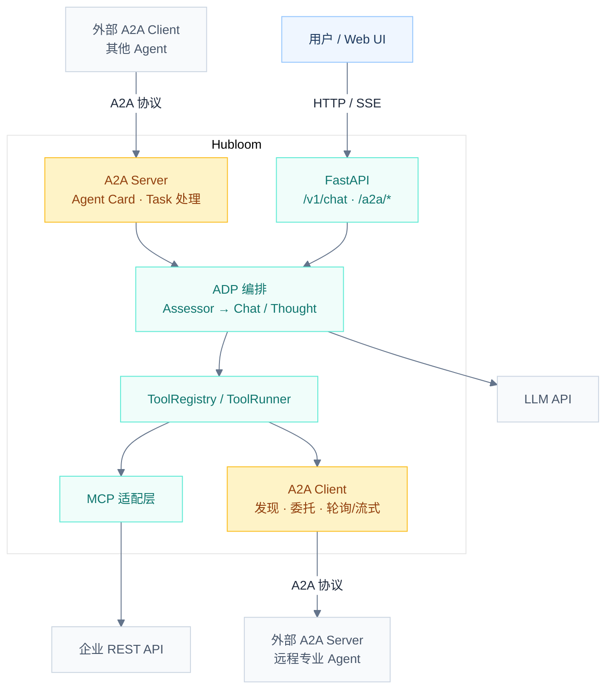
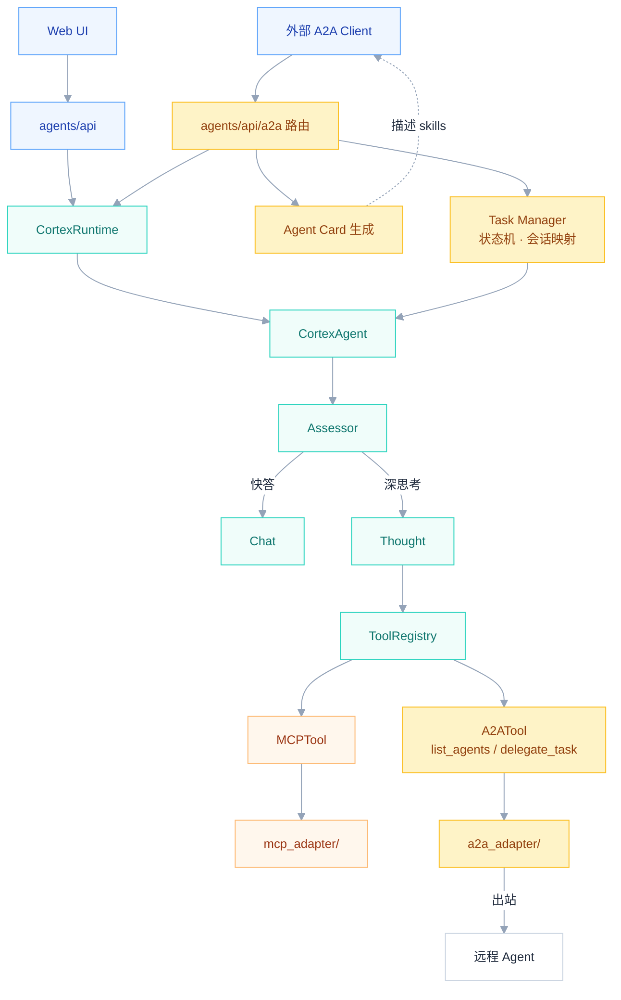
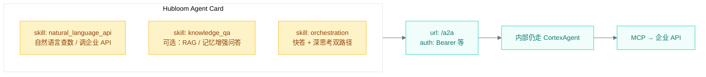
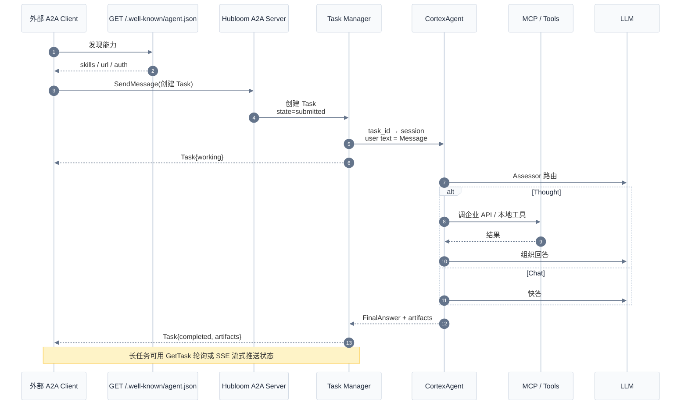
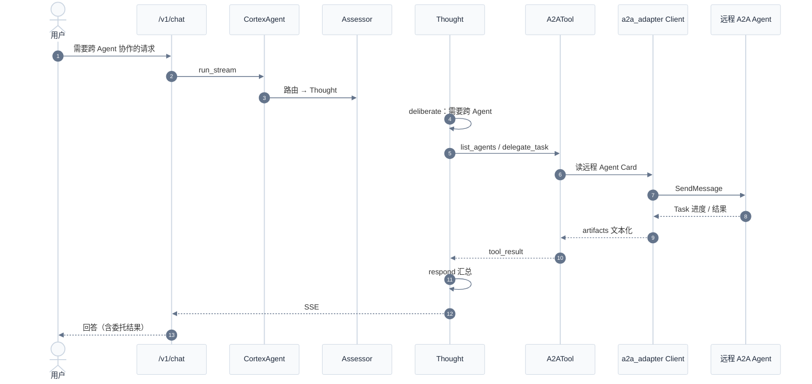
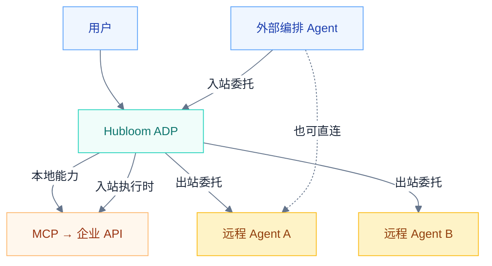
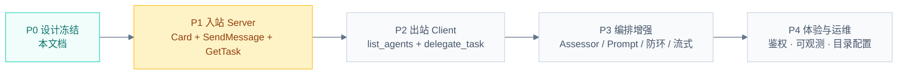

# Hubloom A2A 互联（设计稿）

本文档描述 Hubloom **双向 A2A（Agent-to-Agent）** 接入的整体架构、流程与分阶段实现计划。当前为设计约定，随实现逐步落地与修订。

← 返回 [总体架构图](./Hubloom总体架构图.md) · [MCP 适配层](./Hubloom-MCP适配.md) · [ADP 编排层](./Hubloom-ADP编排.md)

---

## 背景与定位

| 协议 | 解决什么 | Hubloom 状态 |
|------|----------|--------------|
| **MCP** | Agent ↔ 工具 / API / 数据 | 已支持 |
| **A2A** | Agent ↔ Agent（发现、委托、回传结果） | 设计中（本文档） |
| **ANP** | 更开放的 Agent 互联 | 路线图 |

一句话：

- **MCP** 给 Agent 装「手」（调企业 REST）。
- **A2A** 让 Agent 能「找同事、派活」（跨 Agent 任务委托）。

Hubloom 目标做成**双向**：

| 方向 | Hubloom 角色 | 含义 |
|------|--------------|------|
| **入站** | A2A Server | 发布 Agent Card，接收外部 Agent 的任务 |
| **出站** | A2A Client | 发现远程 Agent，在 Thought 路径中委托子任务 |

---

## 设计原则

1. **对称 MCP**：新增 `a2a_adapter/` 对标 `mcp_adapter/`；出站走工具层，入站走 HTTP 协议端点。
2. **编排仍归 ADP**：入站任务进入 `CortexAgent`；出站委托只在 Thought 路径通过工具发生。
3. **边界清晰**：MCP = Agent↔工具；A2A = Agent↔Agent；二者可叠加，不互相替代。
4. **防环**：入站任务默认不再二次出站委托（或加深度 / 白名单），避免 A↔B 互相派活死循环。

---

## 1. 目标总览（双向）



---

## 2. 内部模块展开（建议落点）



### 建议目录结构

```
a2a_adapter/                 # 协议适配（出站 Client + 入站协议类型）
  client/                    # Card 拉取、SendMessage、GetTask、SSE
  server/                    # 可选：协议 handler 实现细节
  models.py                  # Task / Message / Artifact 映射
agents/api/a2a.py            # 入站路由：Agent Card + JSON-RPC / REST
agents/a2a/                  # 业务侧：Card 组装、Task↔session 映射、防环策略
tools/builtin/a2a_tool.py    # list_agents / delegate_task
docs/Hubloom-A2A互联.md      # 本文档
```

### 与现有分层对照

| 层 | 现状 | 双向 A2A 后 |
|----|------|-------------|
| FastAPI | `/v1/chat` 等 | + Agent Card、A2A 协议端点 |
| ADP | Assessor / Chat / Thought | Thought 可调用 A2A 工具；入站复用同一编排 |
| Tool 层 | MCPTool + 内置工具 | + A2ATool |
| 适配层 | `mcp_adapter/` | + `a2a_adapter/` |
| 外部 | Swagger / REST / LLM | + 远程 Agents |

---

## 3. A2A 核心概念（接入时用到的对象）

| 对象 | 作用 |
|------|------|
| **Agent Card** | Agent「名片」JSON，通常在 `/.well-known/agent.json`：名称、skills、端点、鉴权、模态 |
| **Task** | 工作单元，状态机：`submitted → working → completed / failed / canceled` |
| **Message** | 对话 / 指令，由多个 **Part** 组成（文本、文件、结构化 JSON） |
| **Artifact** | 任务产出（最终回答、文件、结构化结果等） |

协议分层（官方）：

```
Layer 3  Protocol Bindings     JSON-RPC / gRPC / HTTP REST
Layer 2  Abstract Operations   SendMessage, GetTask, Cancel…
Layer 1  Data Model            Task, Message, AgentCard…
```

Hubloom **优先采用 JSON-RPC 2.0 over HTTPS**（官方主路径）；流式用 SSE；长任务可轮询 `GetTask` 或后续支持 Push。

---

## 4. Hubloom Agent Card 暴露什么

入站时，外部 Agent 看到的不是「整个 FastAPI」，而是一张能力名片：



要点：

- Card 描述的是 **Hubloom 作为 Agent 的技能**，不是把每个 REST 接口都列成 A2A skill（细粒度 API 仍归 MCP）。
- 入站 Message → 映射为一次 `CortexAgent` 会话（`task_id ↔ session_id`）。

---

## 5. 流程 A：入站（Hubloom = A2A Server）



### 入站数据映射

| A2A | Hubloom |
|-----|---------|
| Task.id | 内部 task 记录 + 绑定 `session_id` |
| Message.parts(text) | 用户输入 |
| Task.state | submitted / working / completed / failed |
| Artifact | 最终回答 + 可选工具轨迹摘要 |
| 流式事件 | 复用现有 SSE / `AgentEvent`，再映射为 A2A 状态更新 |

---

## 6. 流程 B：出站（Hubloom = A2A Client）



### 出站工具面（对标 MCP 的 meta-tools）

| 工具 | 作用 |
|------|------|
| `list_agents` | 列出已配置 / 已发现的远程 Agent 与 skills |
| `delegate_task` | 向指定 Agent 发 Message，等待或流式取回 Artifact |
| `get_delegation_status`（可选） | 查长任务状态 |

配置侧建议：P2 先做 **静态 Agent 目录**（环境变量 / YAML 列表），再演进到动态发现与注册中心。

---

## 7. 双向同时存在时的协作



典型场景：

1. **用户 → Hubloom → 企业 API**（现状，纯 MCP）
2. **用户 → Hubloom → 远程 Agent**（出站 A2A）
3. **外部 Agent → Hubloom → 企业 API**（入站 A2A + 内部 MCP）
4. **外部 Agent → Hubloom → 再委托远程**（双向叠加，需防环策略）

---

## 8. 分阶段实现计划



| 阶段 | 交付 | 说明 |
|------|------|------|
| **P0** | 本文档 | 架构与流程约定，可迭代修订 |
| **P1 入站** | Hubloom 可被发现、可接任务 | 立刻成为「可被编排的企业 API Agent」 |
| **P2 出站** | Thought 可委托外部 Agent | 真正双向 |
| **P3 增强** | 路由提示、SSE↔A2A、防环、长任务 | 生产可用 |
| **P4** | 配置 UI、鉴权透传、追踪 | 与现有 Web 配置体验对齐 |

---

## 9. 待拍板决策

实现前需明确（可在本表更新结论）：

| # | 议题 | 建议默认 | 状态 |
|---|------|----------|------|
| 1 | 协议绑定 | JSON-RPC over HTTP（官方主路径） | 待确认 |
| 2 | 入站是否允许再出站 | 默认禁止（`inbound_depth=0`），或白名单 | 待确认 |
| 3 | 远程 Agent 目录 | P2 先静态配置 Card URL 列表 | 待确认 |
| 4 | 鉴权 | 入站独立 A2A token；出站凭证对标 MCP Token 透传 | 待确认 |

---

## 10. 修订记录

| 日期 | 变更 |
|------|------|
| 2026-07-09 | 初稿：双向 A2A 总览、模块落点、入站/出站时序、分阶段计划 |

---

## 相关文档

- [总体架构图](./Hubloom总体架构图.md)
- [ADP 编排层](./Hubloom-ADP编排.md)
- [MCP 适配层](./Hubloom-MCP适配.md)
- [工具层](./Hubloom-工具层.md)
- 官方规范：[A2A Protocol](https://a2a-protocol.org/) · [a2aproject/A2A](https://github.com/a2aproject/A2A)
