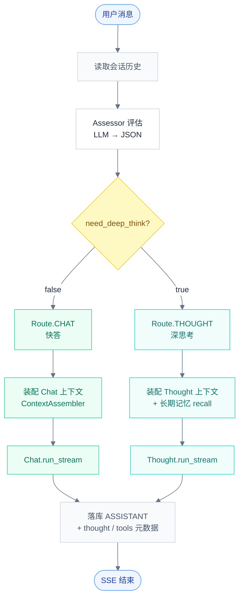
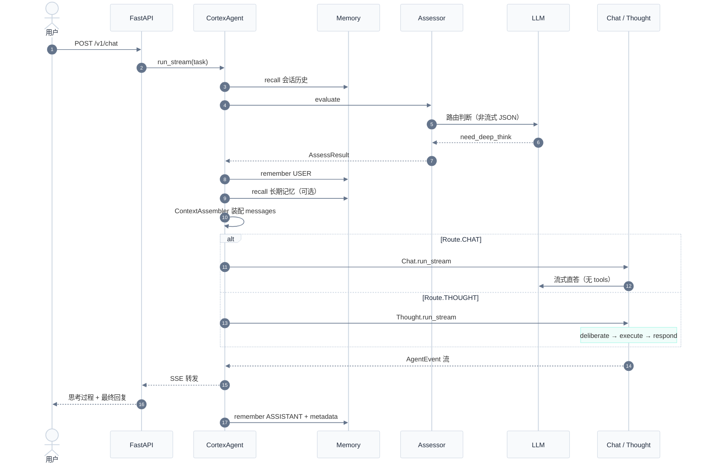
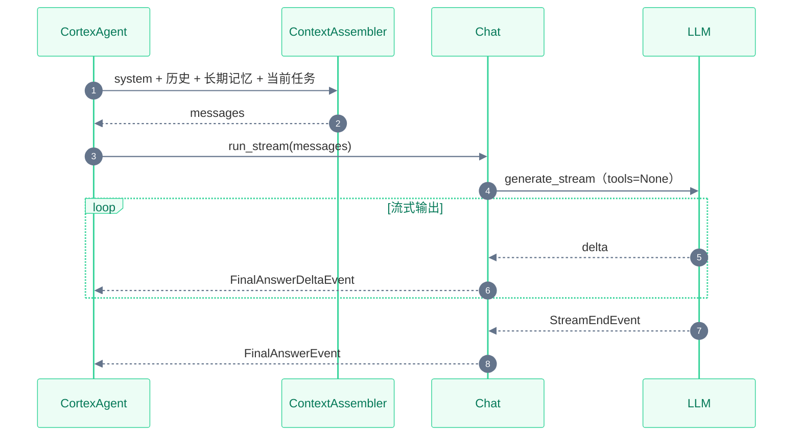
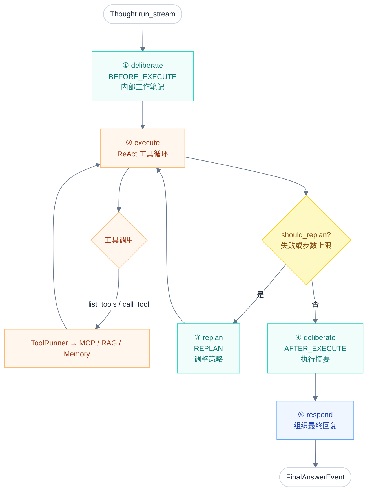
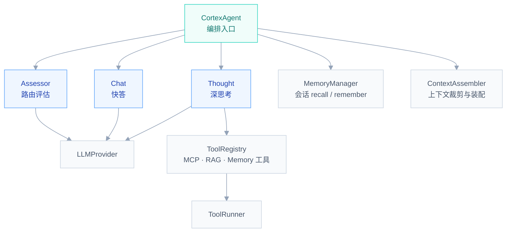

# Hubloom ADP 编排层

ADP（Agent Decision Path）是 Hubloom 的**编排中枢**：接收用户消息，评估路由，分流到快答或深度思考，并负责上下文装配与落库。

← 返回 [总体架构图](./Hubloom总体架构图.md)

---

## 模块组成

| 组件 | 文件 | 职责 |
|------|------|------|
| **CortexAgent** | `agents/adp/cortex_agent.py` | 单轮编排入口：recall → 路由 → 执行 → 落库 |
| **Assessor** | `agents/adp/assessor.py` | 静默评估，输出 `need_deep_think` |
| **Chat** | `agents/adp/chat.py` | 快答路径：流式直答，不调用工具 |
| **Thought** | `agents/adp/thought.py` | 深思考路径：研判 → 执行 → 重规划 → 回复 |

---

## 1. 路由决策

Assessor 用 LLM 非流式输出 JSON，判断本轮走 Chat 还是 Thought。



### Assessor 输出

```json
{
  "need_deep_think": true,
  "reason": "需要查询库存数据"
}
```

| 路由 | 典型场景 |
|------|----------|
| **Chat** | 寒暄、能力介绍、概念解释、无需调 API |
| **Thought** | 查数、创建/更新/删除、需多步工具调用 |

评估过程**不对用户展示**；路由结果通过 `PhaseEvent` 告知前端（`replying` / `thinking`）。

---

## 2. 单轮编排时序

CortexAgent 每轮对话的完整链路。



---

## 3. Chat 快答路径

简单直接：装配上下文后，LLM 流式输出，**不注册 tools、不执行 tool_call**。



SSE 事件：`text_delta` → `turn_complete`

---

## 4. Thought 深思考循环

Thought 分四个阶段，思考过程与最终回复**分区展示**。



### 阶段与 SSE 事件

| 阶段 | 方法 | 用户可见 | SSE 事件 |
|------|------|----------|----------|
| 执行前研判 | `deliberate(BEFORE_EXECUTE)` | 思考过程区 | `thought_delta` |
| 工具执行 | `execute()` | 思考过程区 | `tool_call` · `tool_result` |
| 重规划 | `replan()` → `deliberate(REPLAN)` | 思考过程区 | `thought_delta` |
| 执行后总结 | `deliberate(AFTER_EXECUTE)` | 思考过程区 | `thought_delta` |
| 最终回复 | `respond()` | **最终结果区** | `text_delta` · `turn_complete` |

### 重规划触发条件

`should_replan()` 在以下情况进入 replan 循环（最多 `max_replan_rounds` 次）：

- 工具调用失败（`_execute_had_errors`）
- 达到最大执行步数（`_execute_hit_step_limit`）
- **不触发**：鉴权失败（`_auth_failure_detected`）— 直接结束执行，由 respond 告知用户

---

## 5. 组件关系



---

## 关键代码路径

```
agents/adp/
├── cortex_agent.py   # run_stream() 单轮编排主入口
├── assessor.py       # Assessor.evaluate() 路由 JSON
├── chat.py           # Chat.run_stream() 快答
├── thought.py        # Thought.run_stream() 深思考四阶段
└── prompts.py        # ASSESSOR_SYSTEM / THOUGHT_CONTEXT_SYSTEM

agents/api/app.py     # HTTP → CortexAgent.run_stream → SSE
agents/events.py      # ThoughtDeltaEvent / ToolCallEvent / FinalAnswerEvent …
memory/context.py     # ContextAssembler 上下文装配
```

---

## 下一步

- [MCP 适配层](./Hubloom-MCP适配.md) — Thought 工具调用的底座
- [工具层](./Hubloom-工具层.md) — ToolRegistry / ToolRunner 与内置工具
