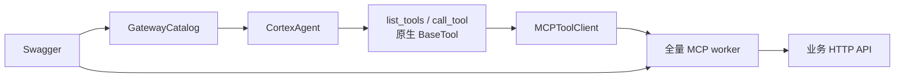

# Hubloom MCP 适配层

MCP 适配层把企业 **Swagger/OpenAPI** 转成可调用的工具，由 **单个全量 MCP worker** 代理 REST。  
Agent **只注册两个原生元工具** `list_tools` / `call_tool`（见 `tools/builtin/meta_tools.py`），按 tag 过滤与转发在 Agent 进程内完成，**不再**按 tag 启动多个 MCP 子进程，也**不再**使用网关 MCP（`BackendPool` 已移除）。

← 返回 [总体架构图](./Hubloom总体架构图.md) · [ADP 编排层](./Hubloom-ADP编排.md)

---

## 模块组成

| 组件 | 目录 / 文件 | 职责 |
|------|------|------|
| **Spec 管线** | `mcp_adapter/spec/` | 加载 Swagger → 规范化 →（可选）过滤 → 推断 base URL |
| **Catalog** | `mcp_adapter/gateway/catalog.py` | OpenAPI tag → 工具目录；格式化为 prompt 中的「API 分组」 |
| **Discovery** | `mcp_adapter/discovery.py` | `mcp_full_stdio_cmd` / `connect_full_mcp` / `load_agent_mcp_bindings` |
| **Worker** | `mcp_adapter/server/` | **一个**全量 FastMCP.from_openapi 子进程（`--full`） |
| **Client** | `mcp_adapter/client/` | Agent 侧 stdio 客户端（`MCPToolClient`） |
| **Auth** | `mcp_adapter/auth.py` | Token 透传：会话 → `_meta` → Authorization |
| **元工具** | `tools/builtin/meta_tools.py` | Agent 可见的 `list_tools` / `call_tool` |

---

## 主路径

```
HubloomAgent.create / runtime
  → load_catalog → api_catalog_prompt（注入 Thought）
  → worker --full（单一 MCP 子进程）
  → build_meta_tools(catalog, client)
  → ToolRegistry（仅元工具）
```



调用约定不变：

1. 对照 prompt 中的 API 分组选 `tag`
2. `list_tools(tag=...)` 看 schema（按 catalog 过滤全量 MCP 的工具列表）
3. `call_tool(tag=..., tool_name=..., arguments=...)` 执行

本地自检：

```bash
PYTHONPATH=src uv run python -m mcp_adapter.test_mcp --list
PYTHONPATH=src uv run python -m mcp_adapter.test_mcp --tools Banner
```

---

## Auth 透传

会话 token → 元工具 → `MCPToolClient` 的 `call_tool(..., meta=...)` → Worker 中间件写入 HTTP `Authorization`。细节见 `mcp_adapter/auth.py`。

---

## 目录结构（当前）

```
mcp_adapter/
├── discovery.py          # 全量 worker 启动与 Agent 绑定
├── auth.py
├── log.py
├── test_mcp.py           # 人工测试（元工具路径）
├── client/               # MCPToolClient + 结果解析
├── gateway/
│   └── catalog.py        # 仅分组目录（无 pool / 无网关 FastMCP）
├── server/
│   ├── worker.py         # python -m …worker --full
│   ├── app.py            # FastMCP.from_openapi 全量
│   └── http_client.py
└── spec/                 # OpenAPI 管线
```
