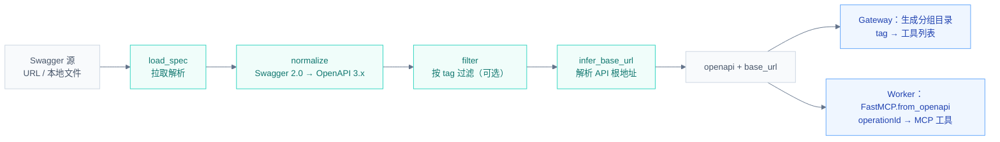
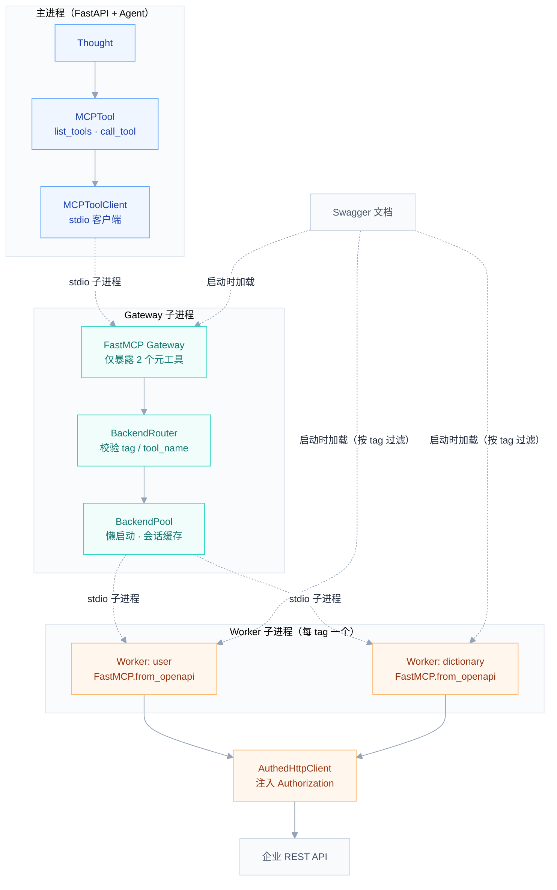
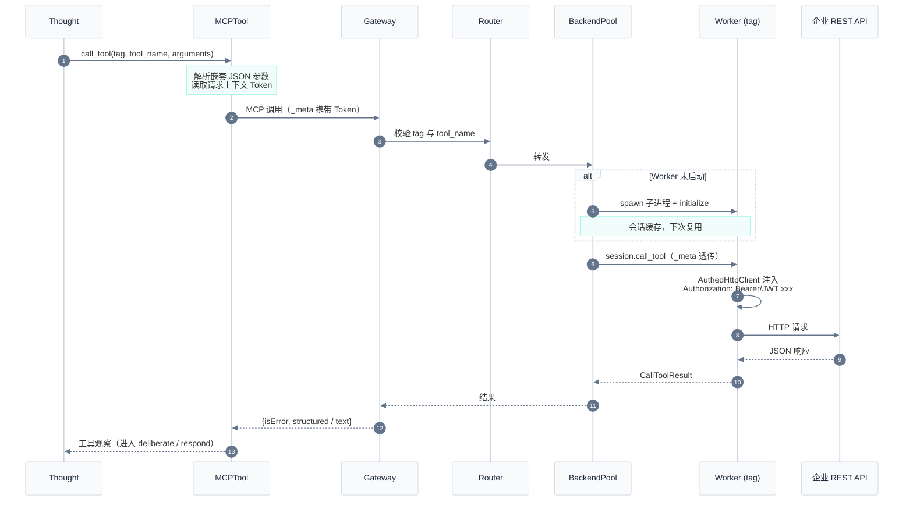

# Hubloom MCP 适配层

MCP 适配层把企业 **Swagger/OpenAPI 文档**转换为 LLM 可调用的 **MCP 工具**，并在运行时代理真实的 REST API 调用。Agent 只看到两个元工具 `list_tools` / `call_tool`，全量 API 由网关按 tag 分组管理。

← 返回 [总体架构图](./Hubloom总体架构图.md) · [ADP 编排层](./Hubloom-ADP编排.md)

---

## 模块组成

| 组件 | 目录 / 文件 | 职责 |
|------|------|------|
| **Spec 管线** | `mcp_adapter/spec/` | 加载 Swagger → 规范化 → 按 tag 过滤 → 推断 base URL |
| **Discovery** | `mcp_adapter/discovery.py` | 启动网关子进程、发现工具、包装为 `MCPTool` |
| **Gateway** | `mcp_adapter/gateway/` | stdio MCP 服务，只暴露元工具，按 tag 转发 |
| **BackendPool** | `mcp_adapter/gateway/pool.py` | 按 tag 懒启动 Worker 子进程，缓存会话 |
| **Worker** | `mcp_adapter/server/` | 单 tag MCP 子进程，`FastMCP.from_openapi` 执行真实 HTTP |
| **Client** | `mcp_adapter/client/` | Agent 侧 stdio 客户端（`MCPToolClient`） |
| **Auth** | `mcp_adapter/auth.py` | Token 透传：请求头 → `_meta` → Authorization |

---

## 1. OpenAPI 准备管线

`prepare_openapi()`：把任意 Swagger/OpenAPI 源转成可用的规范化 spec。网关启动和每个 Worker 启动时都会执行。



- base URL 解析顺序：`MCP_BASE_URL` 环境变量 → spec 内推断 → Swagger 源 URL 推断；均失败则报错。
- 分组目录（`GatewayCatalog`）由 spec 中每个 operation 的 `tags` 自动生成，**不手写分组**；同时格式化为「API 分组」片段注入 Chat / Thought 的 system prompt。

---

## 2. 运行时进程架构

关键点：**Gateway 和 Worker 都是独立子进程**，通过 stdio 通信。Agent 主进程只连 Gateway；Worker 由 Gateway 按 tag 懒启动（首次调用该分组时才 spawn）。



### 为什么分两级进程？

| 设计 | 原因 |
|------|------|
| Agent 只见 `list_tools` / `call_tool` | 大型 Swagger 可能有数百个接口，全量注入 LLM 上下文会爆 token；按需 `list_tools(tag)` 查 schema |
| 每 tag 一个 Worker | 每个 Worker 只加载自己分组的 spec，启动快、隔离好 |
| 懒启动 + 会话缓存 | 首次调用某 tag 时才 spawn（`PREWARM_TAGS` 可配置预热）；后续复用 stdio 会话 |
| Worker 跑在独立后台事件循环 | 避免与网关 stdio 服务争用同一 asyncio 循环导致死锁 |

---

## 3. 一次 call_tool 的完整链路

从 Thought 发起工具调用，到企业 API 返回 JSON。



---

## 4. Token 透传链路

用户在 Web 页填的业务 Token **不落服务端配置**，随每次请求逐层透传到 Worker 的 HTTP 客户端。

```mermaid
%%{init: {"theme":"base","themeVariables":{"background":"#ffffff","primaryColor":"#ffffff","primaryBorderColor":"#cbd5e1","primaryTextColor":"#1e293b","lineColor":"#64748b","fontSize":"14px"}}}%%
flowchart LR
    B["浏览器<br/>请求头 X-MCP-Token"] --> RC["request_context<br/>contextvar 保存"]
    RC --> MT["MCPTool<br/>resolve_auth_token"]
    MT --> META["MCP _meta<br/>随协议传递"]
    META --> GW["Gateway<br/>AuthPassthroughMiddleware"]
    GW --> WK["Worker<br/>contextvar 恢复"]
    WK --> HD["AuthedHttpClient<br/>Authorization 头"]

    classDef node fill:#f0fdfa,stroke:#2dd4bf,color:#0f766e
    classDef edge_node fill:#f8fafc,stroke:#cbd5e1,color:#475569

    class RC,MT,META,GW,WK node
    class B,HD edge_node
```



- 认证前缀由 `MCP_AUTH_SCHEME` 或请求头指定：`Bearer`（默认）或 `JWT`。
- 未从请求头拿到 Token 时，回退到服务端 `.env` 的 `MCP_TOKEN`。

---

## 关键代码路径

```
mcp_adapter/
├── discovery.py          # load_mcp_tools() 启动网关 + 包装 MCPTool
├── auth.py               # Token 透传：middleware / _meta / header
├── server.py             # 网关子进程入口（run_gateway）
├── spec/
│   ├── pipeline.py       # prepare_openapi() 准备管线
│   ├── loader.py         # load_spec 拉取
│   ├── normalize.py      # Swagger 2.0 → OpenAPI 3.x
│   ├── filter.py         # ToolFilter 按 tag / 数量过滤
│   └── base_url.py       # base URL 推断
├── gateway/
│   ├── app.py            # build_gateway_mcp / run_gateway
│   ├── meta_tools.py     # list_tools / call_tool 元工具
│   ├── catalog.py        # tag → 工具目录，注入 system prompt
│   ├── router.py         # BackendRouter 校验转发
│   └── pool.py           # BackendPool worker 生命周期
├── server/
│   ├── worker.py         # Worker 入口（python -m … <tag>）
│   ├── app.py            # FastMCP.from_openapi 构建后端
│   └── http_client.py    # AuthedHttpClient
└── client/
    └── session.py        # MCPToolClient stdio 客户端
```

---

## 相关文档

- [ADP 编排层](./Hubloom-ADP编排.md) — Thought 如何发起工具调用
- [工具层](./Hubloom-工具层.md) — MCPTool 如何注册进 ToolRegistry
