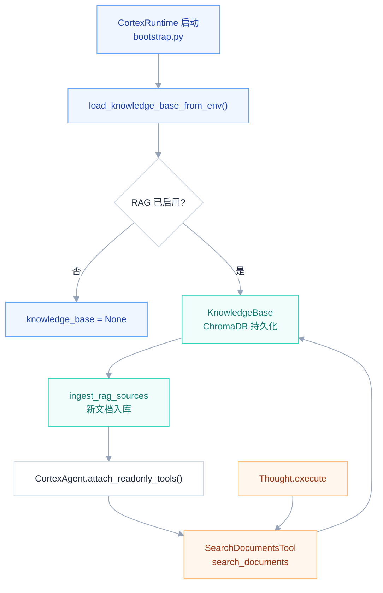
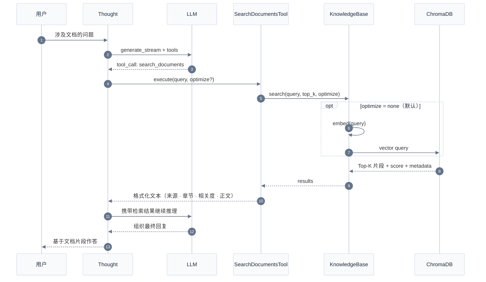
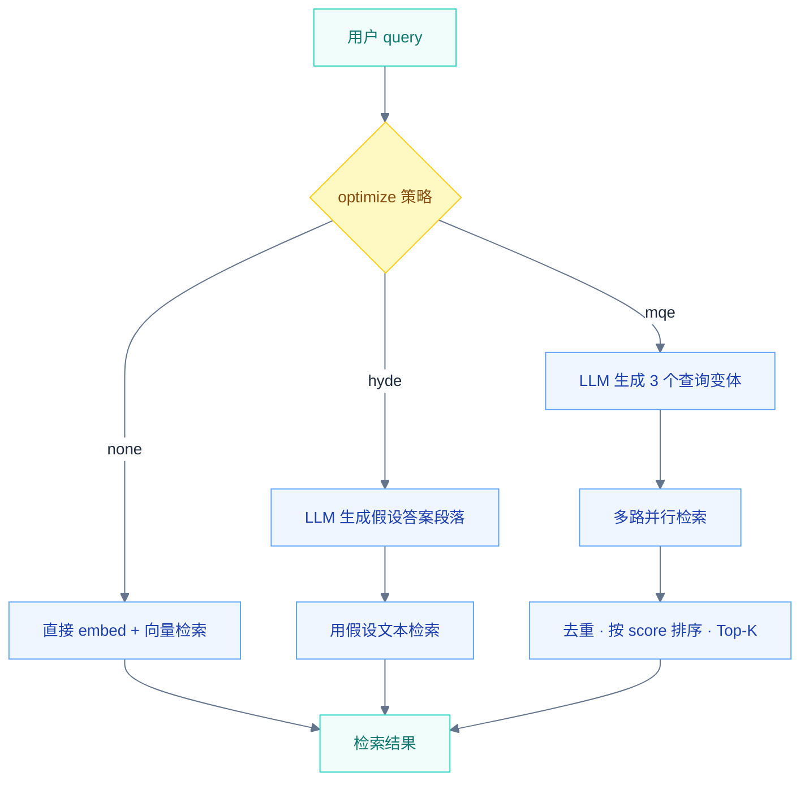

# Hubloom RAG 知识库

RAG（Retrieval-Augmented Generation）负责把**外部文档**变成可检索的知识库，供 Agent 在对话中按需查资料。与 [记忆系统](./Hubloom-记忆系统.md) 独立：RAG 管产品手册、政策文档等静态知识；记忆管对话历史与用户经验。

← 返回 [总体架构图](./Hubloom总体架构图.md) · [工具层](./Hubloom-工具层.md) · [记忆系统](./Hubloom-记忆系统.md)

---

## 模块组成

| 组件 | 文件 | 职责 |
|------|------|------|
| **rag_bootstrap** | `retrieval/rag_bootstrap.py` | 解析环境变量、收集文件、启动入库 |
| **KnowledgeBase** | `retrieval/knowledge_base.py` | 文档入库 + 向量检索（ChromaDB） |
| **DocumentLoader** | `retrieval/loader.py` | MarkItDown 多格式 → Markdown |
| **SemanticSplitter** | `retrieval/semantic_splitter.py` | 结构感知分块（标题层级、重叠） |
| **QueryOptimizer** | `retrieval/query_optimizer.py` | 可选：HyDE / MQE 查询改写 |
| **OpenAIEmbedder** | `embedders/openai_embedder.py` | 文本 → 向量 |
| **SearchDocumentsTool** | `tools/builtin/retrieval_tool.py` | Agent 侧 `search_documents` 工具 |

---

## 1. 入库流水线

启动时（或首次配置 `CORTEX_RAG_DOCS`），将源文档写入 ChromaDB 持久化目录。

```mermaid
%%{init: {"theme":"base","themeVariables":{"background":"#ffffff","primaryColor":"#ffffff","primaryBorderColor":"#cbd5e1","primaryTextColor":"#1e293b","lineColor":"#64748b","fontSize":"14px"}}}%%
flowchart LR
    ENV["CORTEX_RAG_DOCS<br/>文件或目录路径"] --> PARSE["parse_rag_doc_paths"]
    PARSE --> COLLECT["collect_document_files<br/>展开目录 · 去重 · 跳过隐藏项"]

    COLLECT --> LOAD["DocumentLoader<br/>MarkItDown / 代码块"]
    LOAD --> SPLIT["SemanticSplitter<br/>标题感知分块 + 重叠"]
    SPLIT --> EMB["OpenAIEmbedder<br/>批量 embed"]
    EMB --> CHROMA[("ChromaDB<br/>CORTEX_KB_DIR")]

    classDef step fill:#f0fdfa,stroke:#2dd4bf,color:#0f766e
    classDef io fill:#f8fafc,stroke:#cbd5e1,color:#475569
    classDef store fill:#fff7ed,stroke:#fdba74,color:#9a3412

    class PARSE,COLLECT,LOAD,SPLIT,EMB step
    class ENV io
    class CHROMA store
```



### 入库细节

| 步骤 | 说明 |
|------|------|
| **加载** | PDF / Word / Excel / HTML 等走 MarkItDown；`.py` 等代码文件包装为 Markdown 代码块 |
| **分块** | 默认 ~384 token/块，64 token 重叠；支持 `# 标题` 与中文编号（一、（一）等） |
| **元数据** | 每块携带 `doc_name`、`section_path`、`chunk_id`、`indexed_at` 等，便于溯源 |
| **去重** | 同名 `doc_name` 已索引则跳过，避免重复入库 |

触发入口：`load_knowledge_base_from_env()` → `bootstrap.py` 进程启动时调用。

---

## 2. 运行时架构

RAG 是**可选模块**：未配置 `CORTEX_RAG_DOCS` 时不创建 KnowledgeBase，也不注册 `search_documents` 工具。



**与记忆的区别**：RAG 不在 `ContextAssembler` 热路径预注入 `[DOCUMENTS]`；Agent 在 Thought 执行阶段**主动调用** `search_documents` 检索，结果作为 tool 观察回流。

---

## 3. 检索链路

用户提问 → Thought 判断需要查文档 → 调用 `search_documents` → 向量检索 → Top-K 片段返回。



### 返回格式示例

```
[1] | 来源: 员工手册.pdf | 章节: 请假流程 > 年假 | 相关度: 0.87
年假需提前 3 个工作日提交申请……
```

---

## 4. 查询优化（可选）

`QueryOptimizer` 支持两种策略，提升模糊或抽象问题的检索质量：



| 策略 | 适用场景 | 原理 |
|------|----------|------|
| **none** | 问题明确、关键词清晰 | 直接向量检索 |
| **hyde** | 抽象/概括性问题（如「产品定位是什么」） | 先生成假设文档段落，用段落 embedding 检索 |
| **mqe** | 模糊/开放性问题（如「有哪些方法」） | 生成多个语义变体，并行检索后合并 |

> 注意：`KnowledgeBase` 需在构造时传入 `QueryOptimizer(llm)` 才会启用 hyde/mqe。当前 `create_knowledge_base()` 默认未挂载；`retrieval/demo_rag.py` 中有完整示例。`SearchDocumentsTool` 已支持 `optimize` 参数，接入 Optimizer 后即可生效。

---

## 5. RAG vs 记忆

两者都增强 Agent 上下文，但数据来源与用法不同：

| | **RAG 知识库** | **记忆系统** |
|---|----------------|--------------|
| **存什么** | 外部文档（手册、政策、技术文档） | 对话历史 + 用户经验案例 |
| **存储** | ChromaDB（`data/knowledge_db`） | SQLite + 可选 Qdrant/Neo4j |
| **写入时机** | 启动时批量入库 | 每轮在线落库 + 离线提炼 |
| **读取方式** | Thought 主动调 `search_documents` | 每轮 recall 预注入 `[MEMORY]` |
| **环境变量** | `CORTEX_RAG_DOCS` | `CORTEX_MEMORY_DB` 等 |

---

## 配置速查

| 变量 | 说明 | 默认 |
|------|------|------|
| `CORTEX_RAG_DOCS` | 源文档路径，逗号分隔文件或目录 | 未配置 = 不启用 |
| `CORTEX_ENABLE_RAG` | `0` 强制关闭；`1` 无文档路径时仅启用已有索引检索 | 有 `CORTEX_RAG_DOCS` 则启用 |
| `CORTEX_KB_DIR` | ChromaDB 持久化目录 | `data/knowledge_db` |
| `OPENAI_EMBEDDING_MODEL` | 嵌入模型 | `text-embedding-v3` |

示例：

```bash
CORTEX_RAG_DOCS=docs/,data/policies/
CORTEX_KB_DIR=data/knowledge_db
```

---

## 关键代码路径

```
retrieval/
├── rag_bootstrap.py      # parse / collect / ingest / create_knowledge_base
├── knowledge_base.py     # add_document / search / ChromaDB
├── loader.py             # DocumentLoader（MarkItDown）
├── semantic_splitter.py  # SemanticSplitter 分块
└── query_optimizer.py    # HyDE / MQE（可选）

embedders/openai_embedder.py

tools/builtin/retrieval_tool.py   # SearchDocumentsTool

agents/adp/cortex_agent.py        # load_knowledge_base_from_env()
agents/app/bootstrap.py           # 启动时加载 + attach_readonly_tools
```

---

## 相关文档

- [工具层](./Hubloom-工具层.md) — `SearchDocumentsTool` 注册与调用链
- [记忆系统](./Hubloom-记忆系统.md) — 对话记忆与长期记忆（与 RAG 互补）
- [ADP 编排层](./Hubloom-ADP编排.md) — Thought 执行阶段发起 tool_call
