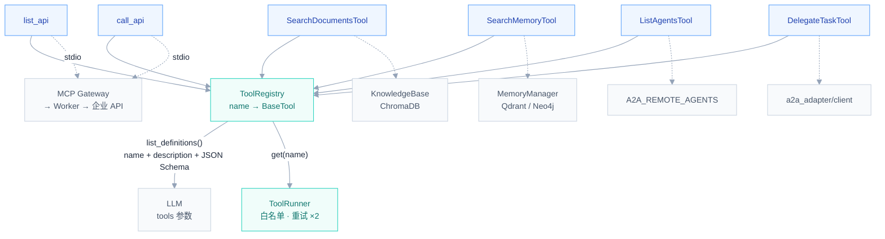
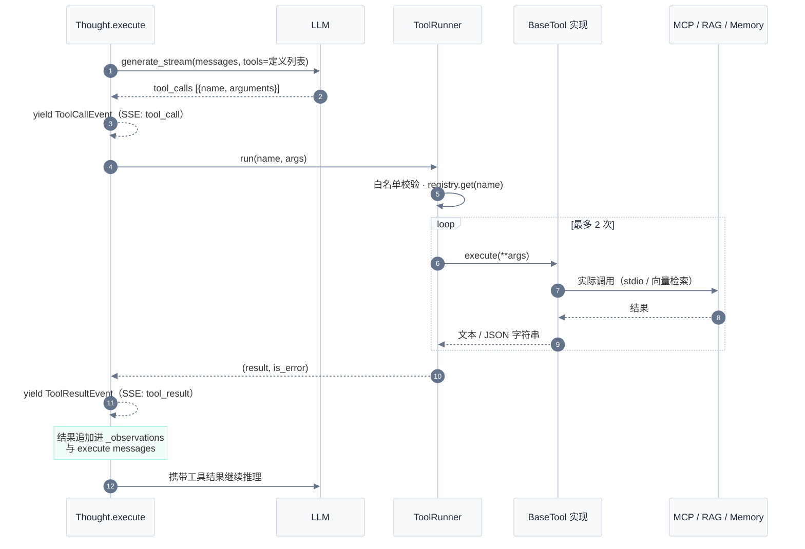
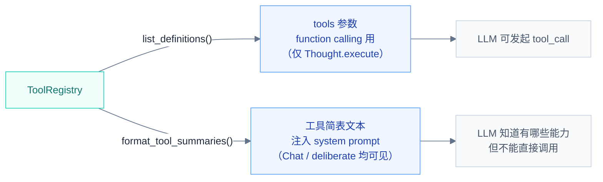

# Hubloom 工具层

工具层是 LLM 与外部能力之间的**统一接口**：所有能力（企业 API、文档检索、长期记忆、跨 Agent 委托）都被抽象成 `BaseTool`，注册进 `ToolRegistry`，由 `ToolRunner` 统一执行。LLM 不直接碰 HTTP 或数据库，只认注册表里的工具定义。

← 返回 [总体架构图](./Hubloom总体架构图.md) · [ADP 编排层](./Hubloom-ADP编排.md) · [MCP 适配层](./Hubloom-MCP适配.md) · [A2A 互联](./Hubloom-A2A互联.md)

---

## 模块组成

| 组件                    | 文件                              | 职责                                                          |
| ----------------------- | --------------------------------- | ------------------------------------------------------------- |
| **BaseTool**            | `tools/base.py`                   | 抽象基类：`name` / `description` / `parameters` / `execute()` |
| **ToolRegistry**        | `tools/registry.py`               | 注册表：name → tool；生成给 LLM 的 tools 定义                 |
| **ToolRunner**          | `tools/runner.py`                 | 执行器：白名单校验、重试、错误兜底                            |
| **APITools**            | `tools/builtin/api_tools.py`      | 原生 `list_api` / `call_api`，转发全量 MCP |
| **SearchDocumentsTool** | `tools/builtin/retrieval_tool.py` | RAG 文档检索（可选 hyde / mqe 查询优化）                      |
| **SearchMemoryTool**    | `tools/builtin/memory_tool.py`    | 长期记忆检索（情景 + 语义 + 可选联想图）                      |
| **ListAgentsTool**      | `tools/builtin/a2a_tool.py`       | 出站 A2A：列出 `A2A_REMOTE_AGENTS` 静态目录                   |
| **DelegateTaskTool**    | `tools/builtin/a2a_tool.py`       | 出站 A2A：委托远程 Agent；入站回合防环拒绝；过程旁路上屏      |

---

## 1. 组件关系

`ToolRegistry` 居中：启动时注册各类工具，运行时向 LLM 提供定义、向 Runner 提供实例。



### 工具从哪里来？

| 工具                       | 注册时机                                                   | 位置                         |
| -------------------------- | ---------------------------------------------------------- | ---------------------------- |
| `list_api` / `call_api` | `HubloomAgent.create` → `build_api_tools`（原生 Tool，转发全量 MCP） | `tools/builtin/api_tools.py` · `hubloom/runtime.py` |
| `search_memory`            | `CortexAgent.attach_readonly_tools()`，需开启长期记忆      | `agents/adp/cortex_agent.py` |
| `search_documents`         | 同上，需配置 RAG 知识库                                    | 同上                         |
| `list_agents` / `delegate_task` | 同上，始终注册（出站 A2A）                            | 同上；详解见 [A2A 互联](./Hubloom-A2A互联.md) |

Agent 侧看到的业务 API 相关工具**只有 2 个元工具**（`list_api` / `call_api`），不是全量业务接口——见 [MCP 适配层](./Hubloom-MCP适配.md)。出站 A2A 另有 2 个工具，与之并列。

---

## 2. 一次工具调用链

Thought 执行阶段：LLM 产出 `tool_call` → Runner 分发 → 具体工具执行 → 观察结果回流。



### ToolRunner 的兜底策略

- **白名单**：`allowed_tools` 之外的调用直接拒绝（当前默认不限制）。
- **重试**：`execute()` 抛异常时最多重试 2 次，间隔递增（0.3s × attempt）。
- **不抛出**：所有失败都转成 `(错误文本, is_error=True)` 返回，由 Thought 决定是否 replan，不会中断整轮对话。

---

## 3. 工具定义如何进入 LLM

同一份注册表，喂给 LLM 两种形态：



- **Thought.execute** 是唯一真正传 `tools` 参数、允许 function calling 的阶段。
- **Chat / deliberate / respond** 只在 system prompt 里看到工具简表和「API 分组」目录，用于介绍能力、规划步骤，但 `tools=None`，不会产生调用。

---

## 关键代码路径

```
tools/
├── base.py               # BaseTool 抽象：name / description / parameters / execute()
├── registry.py           # ToolRegistry：register / get / list_definitions
├── runner.py             # ToolRunner：白名单 + 重试 + 错误兜底
└── builtin/
    ├── api_tools.py     # list_api / call_api（主路径）
    ├── retrieval_tool.py # SearchDocumentsTool：RAG 检索 + hyde/mqe 优化
    ├── memory_tool.py    # SearchMemoryTool：情景/语义/联想图检索
    └── a2a_tool.py       # list_agents / delegate_task（出站 A2A + 防环）

hubloom/runtime.py        # create 时：catalog + 全量 MCP + build_api_tools
agents/adp/thought.py     # execute() 消费 tool_defs；delegate_task 时旁路 RemoteProcessEvent
agents/adp/cortex_agent.py # attach_readonly_tools 注册 memory/RAG/A2A
a2a_adapter/client/       # registry / transport / mapping
```

---

## 相关文档

- [ADP 编排层](./Hubloom-ADP编排.md) — Thought.execute 的 ReAct 循环
- [MCP 适配层](./Hubloom-MCP适配.md) — 全量 worker + 原生元工具
- [A2A 互联](./Hubloom-A2A互联.md) — 出站委托、双通道 UI、入站防环
- [记忆系统](./Hubloom-记忆系统.md) — SearchMemoryTool 背后的 MemoryManager
- [RAG 知识库](./Hubloom-RAG知识库.md) — SearchDocumentsTool 背后的 KnowledgeBase
