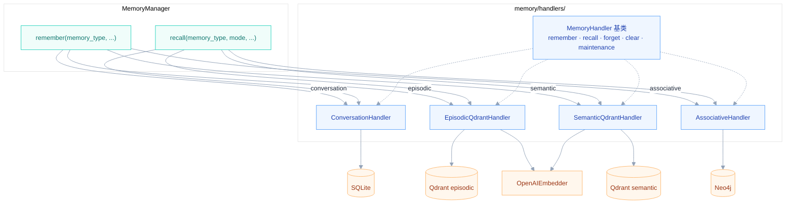
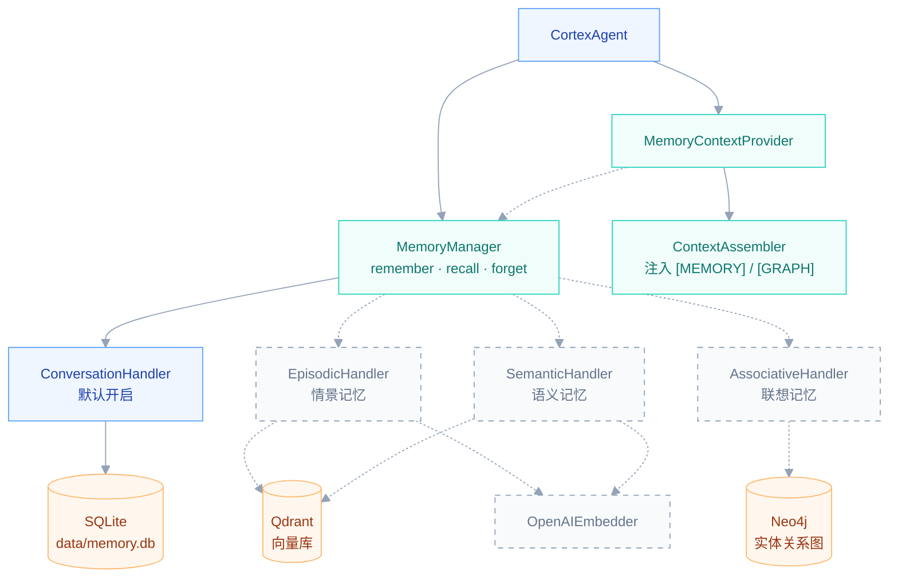
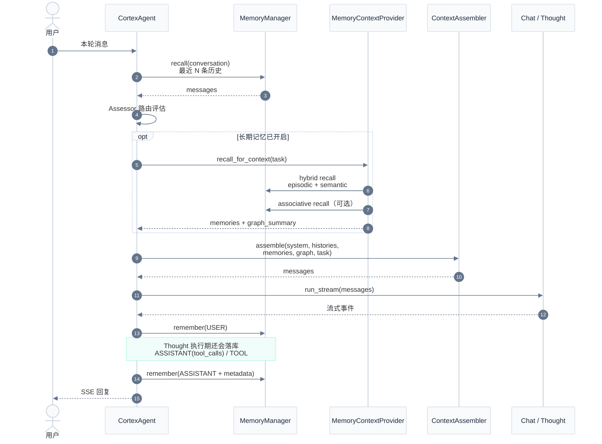
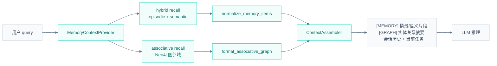
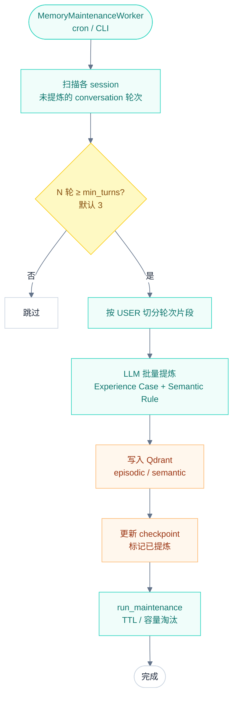
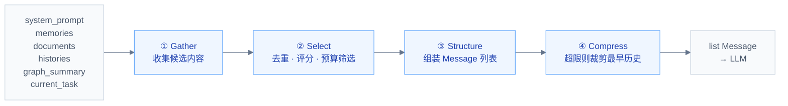

# Hubloom 记忆系统

记忆系统负责**多轮对话持久化**与**可选的长期记忆增强**。默认只启用 SQLite 会话记忆；开启长期记忆后，还会用 Qdrant 存情景/语义记忆、Neo4j 存实体关系图。编排层（CortexAgent）只做在线 recall / remember；离线提炼由独立 Worker 异步完成。

← 返回 [总体架构图](./Hubloom总体架构图.md) · [ADP 编排层](./Hubloom-ADP编排.md) · [工具层](./Hubloom-工具层.md)

---

## 模块组成

| 组件 | 文件 / 目录 | 职责 |
|------|------|------|
| **MemoryManager** | `memory/manager.py` | 统一入口：`remember` / `recall` / `forget`，按 `memory_type` 分派 |
| **Factory** | `memory/factory.py` | 按配置组装 Handler + Store（conversation 必选，长期记忆可选） |
| **ConversationHandler** | `memory/handlers/conversation_handler.py` | 会话记忆：按时间取最近 N 条 Message |
| **EpisodicQdrantHandler** | `memory/handlers/episodic_qdrant_handler.py` | 情景记忆：具体事件、案例（向量检索） |
| **SemanticQdrantHandler** | `memory/handlers/semantic_qdrant_handler.py` | 语义记忆：稳定规则、偏好（向量检索） |
| **AssociativeHandler** | `memory/handlers/associative_handler.py` | 联想记忆：实体关系图（Neo4j 图检索） |
| **MemoryContextProvider** | `memory/memory_context.py` | 长期记忆 hybrid recall → 供 ContextAssembler 消费 |
| **ContextAssembler** | `memory/context.py` | GSSC 流水线：Gather → Select → Structure → Compress |
| **BatchConsolidator** | `memory/batch_consolidator.py` | 离线：conversation 片段 → LLM 提炼 → 写入 Qdrant |
| **MemoryMaintenanceWorker** | `memory/memory_worker.py` | 离线编排：定量提炼 + TTL/容量淘汰 |

---

## Handler 层（`memory/handlers/`）

记忆系统的核心分层是：**Manager 统一入口 → Handler 分类型处理 → Store 落库**。

```
调用方（CortexAgent / Worker）
        ↓
  MemoryManager          ← 按 memory_type 路由
        ↓
  MemoryHandler（抽象）   ← 每种记忆一个「专员」
        ↓
  Store（SQLite / Qdrant / Neo4j）
```

| Handler | 文件 | 绑定 Store | 特点 |
|---------|------|------------|------|
| **ConversationHandler** | `conversation_handler.py` | `ConversationSQLitesStore` | 存完整 `Message`；按 `session_id` 隔离；`recall` 取最近 N 条，不做向量检索 |
| **EpisodicQdrantHandler** | `episodic_qdrant_handler.py` | `QdrantMemoryStore`（scope: episodic） | 情景案例；写入时 embed；检索支持 keyword / semantic |
| **SemanticQdrantHandler** | `semantic_qdrant_handler.py` | `QdrantMemoryStore`（scope: semantic） | 稳定规则；与 episodic 共用 Qdrant 集合，scope 隔离 |
| **AssociativeHandler** | `associative_handler.py` | `Neo4jStore` | 实体节点 + 关系边；`recall_graph` 做图邻域检索；可挂接 Qdrant 记忆引用 |

所有 Handler 继承 `MemoryHandler` 基类，统一实现 5 个方法：

- `remember` — 写入
- `recall` — 检索
- `forget` — 删除单条
- `clear_all` — 清空命名空间 / 会话
- `run_maintenance` — TTL / 容量淘汰

`factory.py` 按配置注册到 `MemoryManager.handlers` 字典：

```python
handlers = {
    "conversation": ConversationHandler(...),   # 必选
    "episodic":     EpisodicQdrantHandler(...), # vector_backend=qdrant 时
    "semantic":     SemanticQdrantHandler(...), # 同上
    "associative":  AssociativeHandler(...),    # graph_backend=neo4j 时
}
```



**ConversationHandler 的特殊之处**：它的 `remember` 实际走 `append(message=Message(...))`，支持 ASSISTANT + tool_calls 等完整结构；其他 Handler 的 `remember` 接收 `content` 文本 + `metadata`。

---

## 1. 记忆架构

`MemoryManager` 居中，按类型分派到不同 Handler 和存储后端。虚线部分为**可选**（需 `CORTEX_ENABLE_LONG_TERM_MEMORY=1` 且配置 Qdrant / Neo4j）。



### 四种记忆类型

| 类型 | 存什么 | 存储 | 检索方式 | 默认 |
|------|--------|------|----------|------|
| **conversation** | 完整 Message（含 tool_calls） | SQLite | 按时间取最近 N 条 | ✅ 开启 |
| **episodic** | 具体案例：用户意图、处理方式、教训 | Qdrant | 向量 + 关键词 hybrid | 可选 |
| **semantic** | 稳定规则：跨案例复用的偏好/约束 | Qdrant | 向量语义检索 | 可选 |
| **associative** | 实体与关系：人、项目、工具间的关联 | Neo4j | 图邻域检索（hops） | 可选 |

---

## 2. 在线读写（热路径）

每轮对话中，CortexAgent 在编排层完成 recall 和 remember；**不在此路径写入长期记忆**。



### 写入时机

| 时机 | 写入内容 | memory_type |
|------|----------|-------------|
| 路由评估后 | 本轮 USER 消息 | conversation |
| Thought 执行中 | ASSISTANT + tool_calls、TOOL 结果 | conversation |
| 本轮结束 | ASSISTANT 最终回复 + thought/tools 元数据 | conversation |
| 离线 Worker | Experience Case、Semantic Rule | episodic / semantic |

---

## 3. 长期记忆如何进入上下文

`MemoryContextProvider` 把 Qdrant / Neo4j 的召回结果规范化后，由 `ContextAssembler` 以 `[MEMORY]`、`[GRAPH]` 标签注入 system 区域。



补充检索：Thought 执行阶段还可主动调用 `search_memory` 工具（见 [工具层](./Hubloom-工具层.md)），在预取 `[MEMORY]` 不足时按需补充。

---

## 4. 离线提炼（冷路径）

会话满 N 轮后，由 `MemoryMaintenanceWorker` 异步读取 SQLite 片段，经 LLM 提炼为 Experience Case，写入 Qdrant。**不在 CortexAgent 热路径执行**。



### Experience Case 包含什么？

离线提炼的 JSON 结构（简化）：

- **user_intent** — 用户想做什么
- **approach** — 实际处理方式
- **lesson** — 给下次的教训
- **tools_used** — 调用了哪些工具
- **outcome** — success / partial / failed / unknown
- **semantic_rules** — 跨案例复用的稳定规则

---

## 5. ContextAssembler（GSSC）

上下文装配遵循四阶段流水线，控制 token 预算并过滤低相关性内容。



默认参数：`max_tokens=5000`，`min_relevance=0.3`（CortexAgent 中配置）。

---

## 配置速查

| 变量 | 说明 | 默认 |
|------|------|------|
| `CORTEX_MEMORY_DB` | SQLite 会话库路径 | `data/memory.db` |
| `CORTEX_ENABLE_LONG_TERM_MEMORY` | `1` 开启 Qdrant；`0` 仅 SQLite | `1` |
| `CORTEX_CONSOLIDATE_MIN_TURNS` | 满 N 轮触发离线提炼 | `3` |
| `QDRANT_URL` / `QDRANT_COLLECTION` | Qdrant 向量库 | — |
| `NEO4J_URI` / `NEO4J_USER` / `NEO4J_PASSWORD` | Neo4j 图记忆 | — |

在线 Demo（Render 免费实例）通常只有 SQLite，重启后会话历史会丢失。

---

## 关键代码路径

```
memory/
├── manager.py            # MemoryManager 统一 remember / recall
├── factory.py            # create_memory_manager() 按 backend 组装
├── memory_context.py     # MemoryContextProvider → assembler 输入
├── context.py            # ContextAssembler GSSC 流水线
├── batch_consolidator.py # conversation → Experience Case → Qdrant
├── memory_worker.py      # MemoryMaintenanceWorker 离线编排
├── handlers/
│   ├── conversation_handler.py
│   ├── episodic_qdrant_handler.py
│   ├── semantic_qdrant_handler.py
│   └── associative_handler.py
└── store/
    ├── conversation_sqlite_store.py
    ├── qdrant_memory_store.py
    └── neo4j_store.py

agents/adp/cortex_agent.py  # 在线 recall / remember 调用方
```

---

## 相关文档

- [ADP 编排层](./Hubloom-ADP编排.md) — CortexAgent 如何 recall 与落库
- [工具层](./Hubloom-工具层.md) — `search_memory` 主动检索工具
- [RAG 知识库](./Hubloom-RAG知识库.md) — SearchDocumentsTool 背后的 KnowledgeBase
