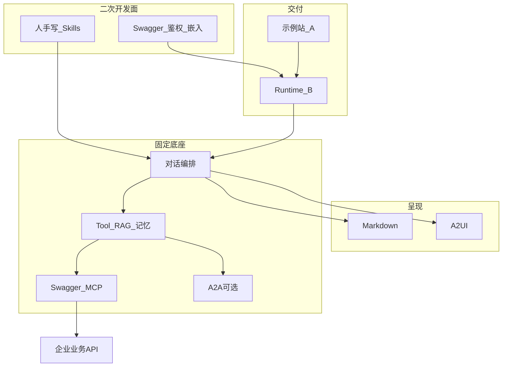

# Hubloom 产品定位

本文档是 Hubloom 的**产品定稿**：目标、用户、交付形态与边界。架构与实现细节见 [总体架构图](./Hubloom总体架构图.md) 与 [架构边界（收敛方向）](./Hubloom架构边界.md)。

---

## 一句话定位

Hubloom 是面向企业的 **Swagger 嵌入式智能体运行时模板**（类后台管理系统脚手架，而非 Agent 平台）：内置对话编排、工具调用、Markdown/A2UI 呈现与 Skill 扩展；开发者做轻量二次开发即可接入自有业务 API，**业务逻辑仍留在企业内部系统**。

---

## 产品是什么 / 不是什么

**是**

- 可私有化部署的二次开发底座（模板工程 + 运行时）
- 契约驱动：接 OpenAPI/Swagger → 自然语言操作企业 API
- 双呈现：Markdown（说明/结论）+ A2UI（表单/列表/确认等业务界面）
- 业务编排入口：人手写 Skill（`SKILL.md`），固化领域规则与多步约定
- 可选协作：A2A 入站/出站委托
- 可选增强：会话记忆、长期记忆、RAG（默认可关，不挡主路径）

**不是**

- 通用 Agent 开发平台 / 应用商店 / 多租户运营中台
- 个人多通道助手网关（区别于 OpenClaw 类产品）
- 重型工作流/BPM 引擎或可视化编排器
- 替企业重做业务系统；业务能力不搬进 Hubloom

---

## 交付形态（C）

| 层 | 角色 | 仓库对应 |
|----|------|----------|
| **A. 示例站** | 开箱体验、演示、文档与销售入口；克隆 → 配置 → 启动即可对话 | `examples/chat`、`main.py` |
| **B. Runtime** | 企业真实集成面：HTTP/SSE API、`HubloomAgent` 等可嵌入门户/App | `src/hubloom/`、`/v1/chat` 等 |

原则：**演示靠 A，落地靠 B。** 示例站皮肤可换；引擎与二次开发面以 Runtime 为准。

---

## 谁在用

| 角色 | 职责 | 上手目标 |
|------|------|----------|
| **集成方**（IT / 中台 / 实施） | 部署、配 LLM 与 Swagger、鉴权、写/维护 Skill、嵌入门户、可选 A2A | 半天内跑通「对话 → 调真实 API」 |
| **业务用户**（运营 / 客服等） | 在对话或嵌入界面用自然语言办事 | 零代码，不感知 MCP/A2A |

---

## 企业怎么用（主路径）

```text
1. 私有化部署 Hubloom（单实例即可）
2. 配置：LLM + swagger_url + API base（业务 Token 走会话，不进配置文件）
3. 启动示例站验证：自然语言操作 API → Markdown / A2UI
4. 二次开发：按业务域写 Skill；按需嵌进自有门户（调 Runtime API）
5. 可选：RAG / 长期记忆 / A2A 远程 Agent
```

**MVP 上手成功标准（仅 1–3）：** 无需 Skill、无需 A2A，至少打通 1 个真实 API。

---

## 能力分层（产品视角）



- **固定底座**：编排、Tool、MCP(Swagger)、记忆/RAG、A2A 能力位 — 开箱提供，少改核心。
- **二次开发面**：配置 Swagger/鉴权、写 Skill、嵌入 UI、按需开 A2A/RAG/记忆。
- **企业业务**：始终在企业 API；Hubloom 只编排调用与呈现。

---

## 与相近产品的边界

- **vs OpenClaw 等助手网关**：对方是多通道个人/团队助手；Hubloom 是企业 API 业务运行时模板。可互补，不拼插件生态。
- **vs 纯 OpenAPI→MCP 工具**：对方多是给 Claude/Cursor 的工具面；Hubloom 自带编排 + 双呈现 + Skill 二次开发闭环。
- **vs 后台管理模板**：同类「底座 + 二次开发」逻辑；领域从 CRUD 后台换成「NL 操作企业 API」。
