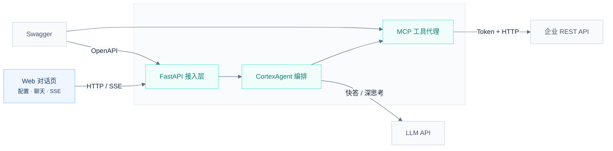
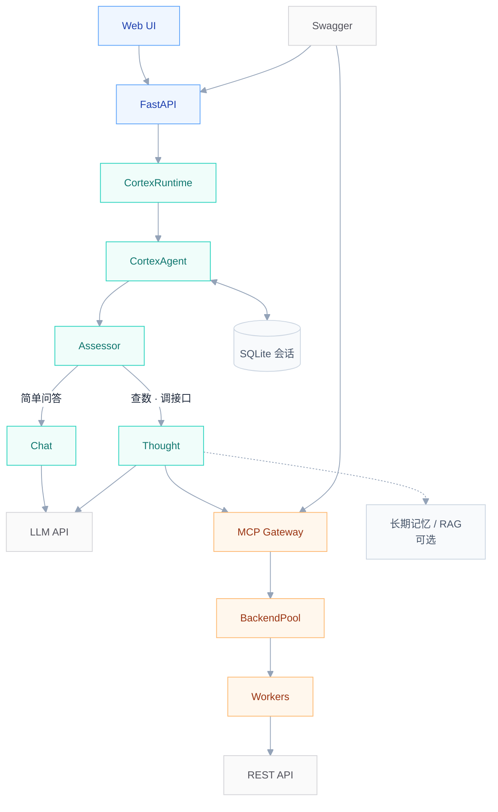
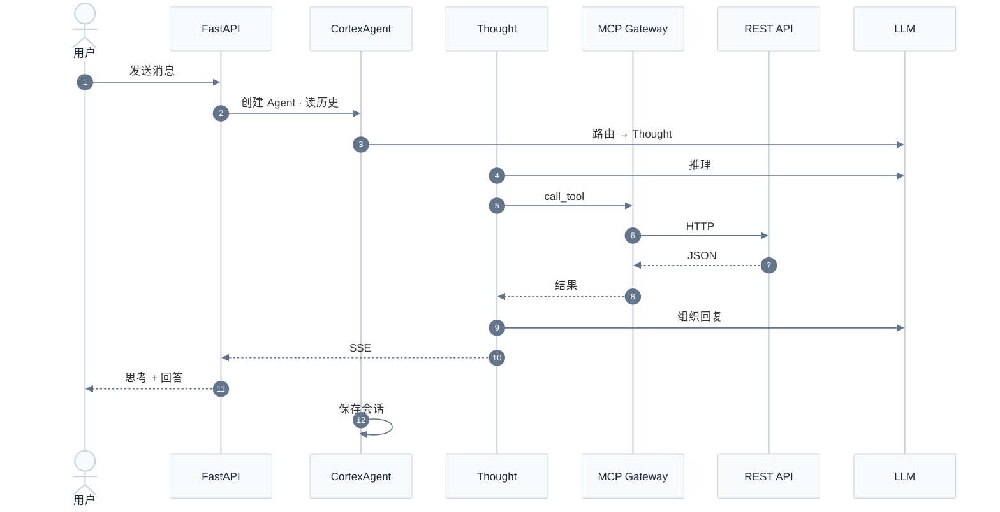

# Hubloom 总体架构图

本文档描述 Hubloom 的系统分层与深度思考对话链路。在 VS Code、GitHub、Typora 中可预览 Mermaid 图。

---

## 1. 总览架构

三层结构：用户 → Hubloom → 外部系统。白底浅灰边框，无黄色分组背景。

| 模块 | 作用 |
|------|------|
| Web 对话页 | 填写 API Key / Swagger；密钥仅存浏览器 |
| FastAPI | `/v1/chat`、`/v1/config/apply`、会话历史 |
| CortexAgent | Assessor 路由 → Chat 快答 / Thought 深思考 |
| MCP 层 | Swagger 转工具，代理调用企业 API |
| 外部系统 | LLM 推理、OpenAPI 文档、真实业务数据 |

---

## 2. Hubloom 内部展开

纵向主链路，扁平节点 + 配色区分，避免多层嵌套子图。

---

## 3. 深度思考路径（时序图）

### 说明

- **Chat 快答**：不经过 MCP，直接 LLM 回复。
- **Thought 深思考**：经 MCP Gateway → Worker → 企业 API。
- SSE 事件：`thought_delta` · `tool_call` · `text_delta` · `turn_complete`

---

## 模块详解

- [ADP 编排层](./Hubloom-ADP编排.md) — 路由决策、Chat / Thought 双路径
- [MCP 适配层](./Hubloom-MCP适配.md) — Swagger → 工具、网关与 Worker、Token 透传
- [A2A 互联](./Hubloom-A2A互联.md) — 双向 A2A 设计：入站 Server / 出站 Client（设计稿）
- [工具层](./Hubloom-工具层.md) — BaseTool / Registry / Runner 与内置工具
- [记忆系统](./Hubloom-记忆系统.md) — 会话 / 长期记忆 / 离线提炼
- [RAG 知识库](./Hubloom-RAG知识库.md) — 文档入库 / 向量检索 / search_documents

---

## 导出高清图

预览仍不满意时，可复制代码到 [Mermaid Live Editor](https://mermaid.live) 导出 SVG/PNG。
