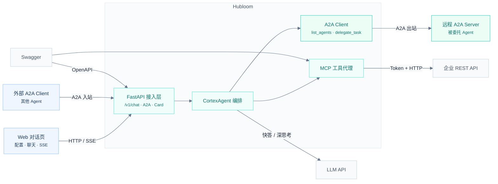
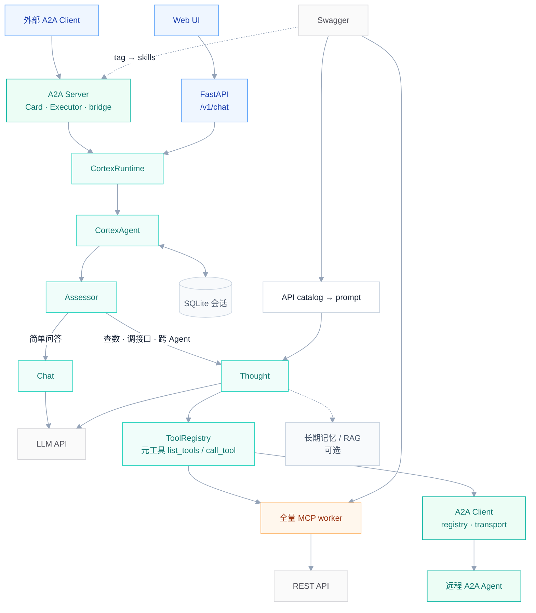
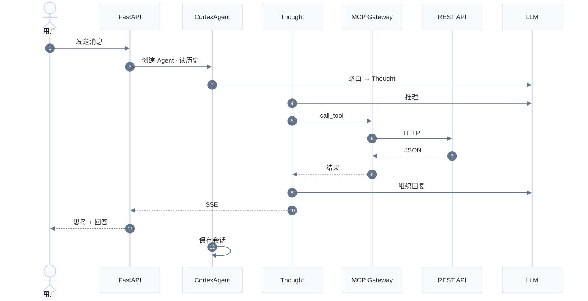
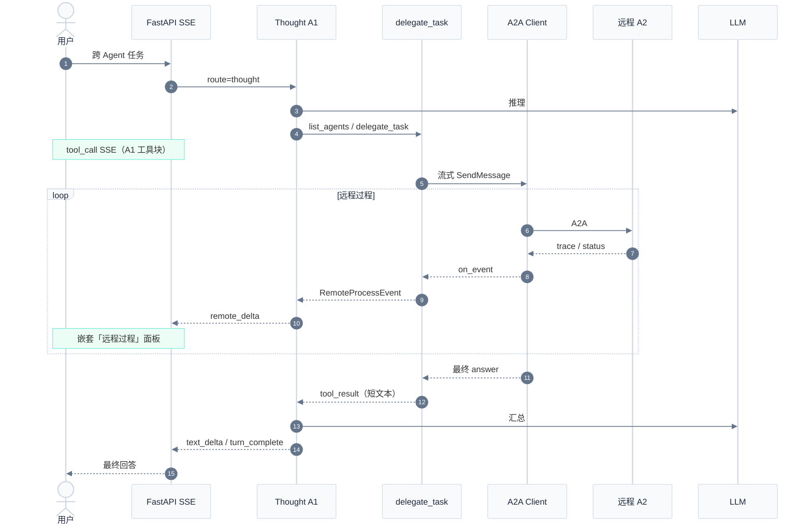

# Hubloom 总体架构图

本文档描述 Hubloom 的系统分层与主对话 / A2A 链路。在 VS Code、GitHub、Typora 中可预览 Mermaid 图。

---

## 1. 总览架构

用户与外部 Agent 均可进入 Hubloom；对内走 MCP 调企业 API，对外可作 A2A Server / Client。

| 模块 | 作用 |
|------|------|
| Web 对话页 | 填写 API Key / Swagger；密钥仅存浏览器；展示工具与远程过程 |
| FastAPI | `/v1/chat`、`/v1/mcp/status`、会话历史、**A2A 路由与 Agent Card** |
| CortexAgent | Assessor 路由 → Chat 快答 / Thought 深思考；入站 A2A 复用同一编排 |
| MCP 层 | Swagger 转工具，代理调用企业 API |
| A2A Client | Thought 工具 `list_agents` / `delegate_task` → 远程 Agent |
| 外部系统 | LLM、OpenAPI、企业 REST、远程 A2A Server |

---

## 2. Hubloom 内部展开

纵向主链路：编排之下并列 **MCP（调 API）** 与 **A2A（调 Agent）**。

---

## 3. 深度思考路径（时序图 · MCP）

用户经 Thought 调企业 API 的典型路径：

---

## 4. 跨 Agent 路径（时序图 · A2A）

用户经 Thought **出站委托**；过程双通道上屏，短 answer 回 LLM。入站时禁止再 `delegate_task`（防环）。

入站（外部 → Hubloom）摘要：外部拉 Card → SendMessage → bridge（`a2a_inbound=True`）→ CortexAgent → Artifact `answer` + `trace`。详解见 [A2A 互联](./Hubloom-A2A互联.md)。

### 说明

- **Chat 快答**：不经过 MCP / A2A，直接 LLM 回复。
- **Thought + MCP**：经 Gateway → Worker → 企业 API。
- **Thought + A2A**：`list_agents` / `delegate_task` → 远程 Agent；过程走 `remote_delta`，结果短文本进 LLM。
- **防环**：入站 A2A 回合禁止再 `delegate_task`（暂不支持入站后再派 A3）。
- SSE 事件：`thought_delta` · `tool_call` · `tool_result` · `remote_delta` · `text_delta` · `turn_complete`

---

## 模块详解

- [ADP 编排层](./Hubloom-ADP编排.md) — 路由决策、Chat / Thought 双路径
- [MCP 适配层](./Hubloom-MCP适配.md) — Swagger → 工具、网关与 Worker、Token 透传
- [A2A 互联](./Hubloom-A2A互联.md) — 双向 A2A：入站 Server + 出站 Client / 双通道 UI / 防环
- [工具层](./Hubloom-工具层.md) — BaseTool / Registry / Runner 与内置工具（含 A2A meta-tools）
- [记忆系统](./Hubloom-记忆系统.md) — 会话 / 长期记忆 / 离线提炼
- [RAG 知识库](./Hubloom-RAG知识库.md) — 文档入库 / 向量检索 / search_documents

---

## 导出高清图

预览仍不满意时，可复制代码到 [Mermaid Live Editor](https://mermaid.live) 导出 SVG/PNG。
