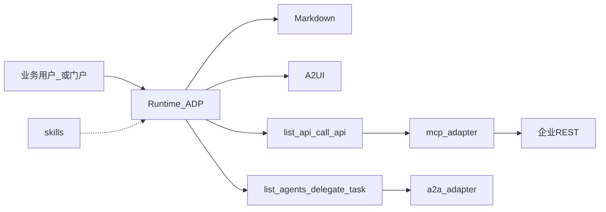

# Hubloom 架构边界（收敛方向）

本文档把 [产品定位](./Hubloom产品定位.md) 映射到当前代码包，并给出 MCP / A2A / A2UI 的收敛原则。  
**本文是方向说明，不是一次性大重构清单**；改代码时按此边界分步进行。

← 产品定稿见 [产品定位](./Hubloom产品定位.md) · 现状图见 [总体架构图](./Hubloom总体架构图.md)

---

## 1. 产品层 → 代码层

| 产品层 | 职责 | 主要代码 |
|--------|------|----------|
| **示例站 A** | 开箱演示 UI | `examples/chat/`、`main.py`；A2UI 演示见 `examples/a2ui_demo/` |
| **Runtime B** | 可嵌入引擎与 HTTP/SSE | `src/hubloom/`（`HubloomAgent` / config / runtime） |
| **对话编排** | Assessor → Chat / Thought | `src/agents/adp/` |
| **Tool 底座** | 统一工具注册与执行 | `src/tools/` |
| **RAG / 记忆** | 可选增强 | `src/rag/`、`src/memory/`（以仓库实际包名为准） |
| **Swagger → API** | 企业 API 调用主路径 | `src/mcp_adapter/` + `tools/builtin/api_tools.py` |
| **A2A（可选）** | 跨 Agent 委托 | `src/a2a_adapter/` + `src/agents/a2a/` + `tools/builtin/a2a_tool.py` |
| **呈现** | Markdown / A2UI | Thought/Chat 文本；`src/agents/a2ui_*.py`、SSE `a2ui` |
| **二次开发 Skill** | 业务规则注入 | `skills/*/SKILL.md`、`src/skills/` |

原则与产品一致：

- **少改固定底座**（编排、Tool、MCP、记忆/RAG 能力位）
- **二次开发走配置与 Skill**，不把企业业务搬进核心包
- **示例站可换皮**；对外集成契约以 Runtime API 为准

---

## 2. 三协议在产品中的角色

| 能力 | 产品角色 | 收敛原则 |
|------|----------|----------|
| **MCP** | 主路径：Swagger → 自然语言操作 API | 保持「全量 worker + 元工具」；去掉误导性 Gateway 叙事与遗留双轨 |
| **A2UI** | 呈现通道（与 Markdown 并列） | 不是业务 Skill；prompt/split/bind 应成清晰呈现子模块，技能目录仅作参考模板 |
| **A2A** | 可选协作，不抢主叙事 | 协议适配与领域（Card/bridge/凭证）边界保持清晰；目录可空则工具可空转 |

---

## 3. MCP 收敛方向

**现状要点**：`mcp_adapter` 已是主路径；Agent 只见 `list_api` / `call_api`；`gateway/` 名存实亡（ predominantly catalog）。

**建议**

1. 文档与目录命名对齐「catalog + full worker」，不再宣传多 Worker Gateway。
2. 主路径只保留 api-tools（`list_api` / `call_api`）；已移除低层 `MCPTool` 代理。
3. Runtime 装配以 `hubloom/runtime.py` 为唯一入口，避免 Thought/smoke 双路径漂移。
4. 鉴权：会话 Token 透传为一等；配置文件不落业务 Token（与产品主路径一致）。

---

## 4. A2A 收敛方向

**现状要点**：`a2a_adapter`（协议）与 `agents/a2a`（Card / bridge / credential）分层合理。

**建议**

1. 保持「协议适配 / 领域逻辑」二分，避免再拆第三套入口。
2. 产品叙事中标明 **可选**：未配置 `remote_agents` 时出站为空目录即可。
3. AgentCard skills 与 MCP catalog 同源（OpenAPI tags）——共享 catalog，不复制第三份分类逻辑。
4. 与 A2UI：入站仍以文本 + trace 为主；不把 A2UI Artifact 强行塞进 A2A MVP。

---

## 5. A2UI 收敛方向

**现状要点**：无 `a2ui_adapter`；逻辑在 `agents/a2ui_prompt|split|bind`、SSE、示例前端；`skills/a2ui` 默认 exclude。

**建议**

1. **产品上**：A2UI = 呈现通道；业务编排 = 人手写 Skill（非 `skills/a2ui`）。
2. **代码上**：将 `a2ui_*` 收拢为明确呈现子包（例如 `agents/a2ui/` 或未来的 `a2ui_adapter/`），与 ADP 编排解耦接口（prompt 片段 / 事件 / bind）。
3. **仓库上**：根目录 `a2ui/` 学习脚本、`skills/a2ui` 参考、`examples/a2ui_demo` 演示三者职责写进 README，避免「三套 A2UI」观感。
4. 补齐产品级说明：本文 + 产品定位已覆盖角色；实现细节可后续单开 `Hubloom-A2UI呈现.md`。

---

## 6. 二次开发面（保持轻量）

| 动作 | 位置 |
|------|------|
| 接企业 API | `config/env.yaml` → `mcp.*` |
| 写业务规则 | `skills/<id>/SKILL.md` |
| 嵌入门户 | 调 `/v1/chat`（SSE）或使用 `HubloomAgent` |
| 开 A2A / RAG / 记忆 | 配置开关与目录，不改核心编排 |

Skill 形态维持「扫描 Markdown → 注入 prompt」；是否扩大注入到 Thought 研判/执行阶段，属后续产品决策，**不在本次定稿强制变更**。

---

## 7. 建议落地顺序（后续重构）

1. **文档先行**：README / 总体架构 / MCP 文档去掉平台化与过时 Gateway 表述（产品定位已完成）。
2. **MCP 清理**：catalog 命名、api-tools 单轨、runtime 单入口。
3. **A2UI 收拢**：模块归位 + 职责说明；示例站与 demo 分工写清。
4. **A2A 叙事降级为可选**：配置与工具注册保持，文档不居中。
5. **命名债**（Cortex → Hubloom）：与功能重构解耦，可分批改。

---

## 8. 一句话架构准则

> **Runtime 固定、Skill 扩展、Swagger 连业务、MD/A2UI 呈现、A2A 可选协作。**  
> 示例站证明能跑；企业用嵌入 API 落地。
