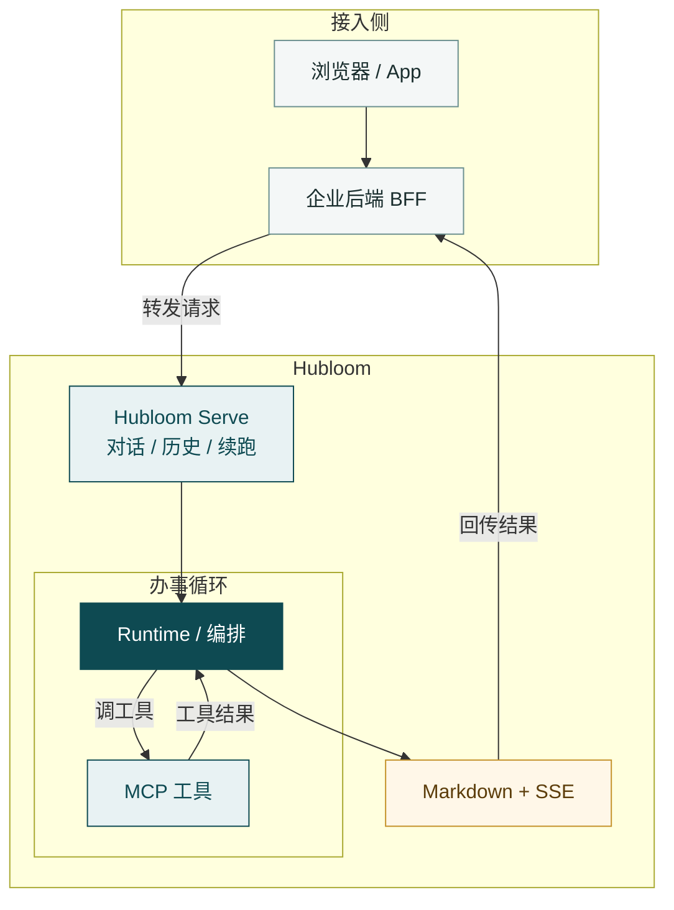

# 架构

本篇建立一张「整机怎么拼」的心智图：请求从哪进、经过哪些层、结果怎么出。  
不讲协议细节和源码目录——那些分别见 [MCP](mcp-protocol.md)、[Skill](skill.md) 与 [模块导读](../modules/README.md)。

---

## 主链路

推荐生产形态是经企业后端转发：

**浏览器 / App → 企业后端（BFF）→ Hubloom Serve → 编排 ⇄ MCP → Markdown / SSE 回传**

可以这样读这条链：

- **BFF** — 登录、鉴权、限流放在你这边；再把对话请求转到 Hubloom
- **Serve** — 产品 HTTP 门面（对话、历史、续跑；事件 / 企微按需挂载）
- **Runtime / 编排** — 决定这一轮是调工具、追问、确认，还是收工；可与 MCP 多轮来回
- **MCP** — 按 OpenAPI/Swagger 调用企业 HTTP，把结果交回编排（图上不单独画出企业系统）
- **回传** — 编排收工或需要追问时，用 Markdown + SSE 经 BFF 回到前端

本地演示时，可用 `examples/chat/web` 直连 Serve，把 BFF 省略掉；落地时再补上即可。

---

## 核心零件

**Hubloom Serve**  
对外提供 `/v1/chat`、`/v1/chat/resume`、`/v1/chat/history` 等接口。它把 HTTP 请求交给 Runtime，再把编排结果以 JSON / SSE 送出。OpenAPI 文档一般在 `http://<host>:<port>/docs`。

**Runtime**  
可嵌入的办事内核：装配配置、Agent、工具、会话等。Serve 是一种宿主；你也可以在自有应用里直接持有 Runtime（见 [嵌入 Runtime](../usage/embed-runtime.md)）。

**编排（Agent）**  
单轮/多轮决策中枢。根据用户话、历史、工具结果与 Skill，选择下一步动作：调用工具、向用户追问、等待确认，或结束并回复。

**工具层 + MCP**  
Agent 不直连随便写死的 HTTP。业务接口经 MCP 进入工具面（常见是 `list_api` / `call_api` 这类元工具），契约来自你配置的 Swagger。细节见 [MCP 协议](mcp-protocol.md)。

**Skill**  
领域规程（Markdown）。告诉 Agent「该怎么办事、禁止什么」，**不**代替后端落库。名片进提示，细则按需 `read_skill`。见 [Skill](skill.md)。

**会话与 Redis**  
会话历史用于多轮上下文；Redis 承担挂起态、按 session 锁等（必填）。没有 Redis，Serve 主路径起不来。

---

## 多入口，同一内核

换入口，不换业务内核。概念上三种常见用法：

- **网页对话** — 多为 `interactive`：缺参时可挂起，等前端续跑
- **事件 Webhook** — 多为 `no_wait`：业务系统推事件，Agent 主动跑一轮
- **企业微信等 IM** — 多为 `turn_based`：跨轮交班，适合消息通道

配置与联调细节见 [进阶功能](../advanced/README.md)。入门阶段只需知道：它们最终都进同一套 Runtime / 编排。

---

## 你改什么，底座管什么

你通常改这些：

- `config/env.yaml`（LLM、Redis、Swagger 等）
- `skills/` 领域规程
- 演示前端，或经 BFF 嵌入自有门户
- 按需打开事件、企微、记忆、RAG 等

底座替你维持这些：

- 对话 API 与 SSE 回传
- 编排循环与工具调用
- 会话历史、挂起与 session 串行
- 鉴权透传到企业 API（Token 由请求传入，不写进配置）

业务逻辑与数据仍在你的服务里；Hubloom 负责翻译意图、调用工具、把过程与结果交还给入口。

---

## 接下来

- 工具面怎么来的 → [MCP 协议](mcp-protocol.md)
- 规程卡在哪 → [Skill](skill.md)
- 要对照源码 → [模块导读](../modules/README.md)
