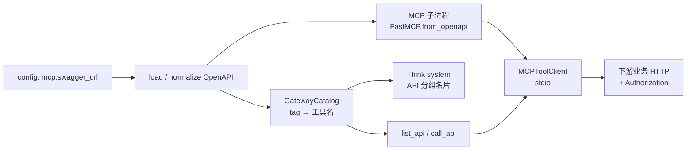
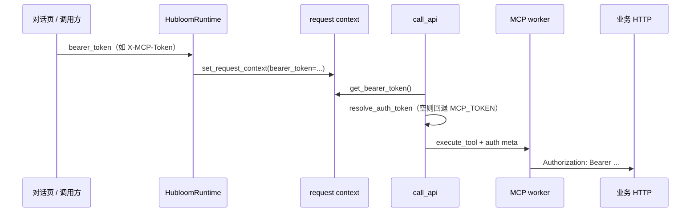

# MCP 协议（API → 工具）

本章讲清：**MCP 是什么**，以及在 Hubloom 里如何把 **OpenAPI / Swagger 变成 Agent 可调用的工具**。

读完你应能：画出「契约 → 工具 → 真实 HTTP」主链路，并指出仓库里该改/该看的目录。  
**不**要求背 MCP 官方消息格式；按配置接入业务 API 见 [接入 Swagger](../usage/import-swagger.md)。

---

## 本章读什么 / 不读什么

| 读                                         | 不读（或点到为止）                |
| ------------------------------------------ | --------------------------------- |
| MCP 在本项目中的角色与设计取舍             | MCP 规范全文 / JSON-RPC 细节      |
| `list_api` / `call_api` 与背后全量工具目录 | FastMCP 库 API 手册               |
| Token 如何透传到下游 HTTP                  | 逐字段 OpenAPI→tool schema 映射表 |
| 代码地图（目录 + 入口）                    | 手把手改 yaml（→ 使用指南）       |

---

## MCP 是什么（简单介绍）

**MCP（Model Context Protocol）** 可以粗理解为：给大模型一条**标准的「工具通道」**——模型侧用统一方式发现/调用能力，服务侧把真实能力（读文件、调 HTTP、查库等）暴露成 **tools**。

和「在应用里手写一堆 function calling」相比：

- 工具描述、调用约定更**协议化**，便于换模型、换宿主；
- 工具实现可以放在**独立进程**里，通过 stdio / HTTP 等与宿主通信。

在 Hubloom 里，我们主要用它做一件事：**把你们已有的 REST API（OpenAPI）暴露成工具**，让 Agent 在对话里真正办事，而不是空口编结果。

官网（介绍与文档入口）：[https://modelcontextprotocol.io/](https://modelcontextprotocol.io/)

> 官方规范不必先读完。下面全部落到「本仓库怎么用」；需要对照协议细节时再打开官网即可。

---

## MCP 在 Hubloom 里干什么

一句话：

> **配置 `swagger_url` → 拉 OpenAPI → 生成 MCP 工具 → Agent 经元工具调用 → 带鉴权打到企业 HTTP。**

| 层级               | 职责                                               |
| ------------------ | -------------------------------------------------- |
| 企业 API           | 真正的业务与鉴权                                   |
| OpenAPI / Swagger  | 「有哪些接口、参数长什么样」的契约                 |
| MCP 后端（子进程） | 契约 → 可调用 tools；执行时发真实 HTTP             |
| Agent 元工具       | 模型只看见 `list_api` / `call_api`，按需发现再调用 |
| Skill              | **不**替代 MCP；只约束「该怎么调、禁止什么」       |

业务逻辑**不**搬进 Hubloom 核心；换业务域主要换 Swagger 与 Token，而不是重写 Runtime。

---

## 为什么是「两个元工具」，而不是把每个接口都塞给模型

若把 Swagger 里上百个 operation 全部塞进模型的 tools 列表：

- 上下文又长又吵，模型更难选对；
- 每次改契约都要重新灌一整表工具定义。

Hubloom 的取舍：

1. **背后**仍有一个**全量** OpenAPI MCP（子进程，不按 tag 拆多个 Server）。
2. **模型面前**只挂两个元工具：
   - `list_api(tag)` — 按 OpenAPI **tag** 列出该组工具名与 parameters schema；
   - `call_api(tag, tool_name, arguments)` — 真正调用。
3. System 里注入 **「API 分组」名片**（tag + 工具数量 + 简述），引导先选分组再 `list_api`。

直觉：目录在 prompt 里，详情按需 `list_api`，办事必须 `call_api`。

---

## 主链路总览

启动时（`HubloomRuntime.from_config`，且 `mcp.enable=true`）：

1. 用同一 `swagger_url` **建 catalog**（给 prompt + 校验 tag/工具归属）；
2. **拉起**全量 MCP worker 子进程，父进程用 stdio 客户端连接；
3. 把 `build_api_tools(catalog, client)` 得到的两个元工具挂进 Agent 工具面。

一次用户回合里（简化）：

1. Think 看到「API 分组」+ Skills 名片；
2. 需要调业务时：`list_api` →（按 Skill/缺参策略）→ `call_api`；
3. `call_api` 经 MCP 打到真实 API；结果回到编排，再 Markdown / A2UI 呈现。

---

## OpenAPI 如何变成工具

子进程侧核心在 `mcp_adapter.server.app`：

1. **`prepare_openapi`**：加载 spec → 规范成 OpenAPI 3.x → 解析 `base_url`（配置优先，否则从 spec / URL 推断）。
2. **`FastMCP.from_openapi`**：每个（过滤后的）operation 变成 MCP tool；工具名与 `operationId` 相关（实现上常取 `__` 前一段，与 catalog 对齐）。
3. **`AuthedHttpClient` + `AuthPassthroughMiddleware`**：调用工具时，把透传的 Token 写成下游 `Authorization`。

父进程侧 **catalog**（`gateway/catalog.py`）再次读同一份 Swagger，按 **OpenAPI tags** 聚合成分组，供：

- `format_catalog_for_prompt` 注入 Think system；
- `list_api` / `call_api` 校验「这个 tool 是否属于该 tag」。

> 细节映射（参数怎么进 schema）以 adapter 的 `spec/` 管线为准；二开时优先改过滤/规范化，而不是改 Agent 提示词硬编码接口名。

---

## Agent 侧：`list_api` / `call_api`

实现：`src/tools/builtin/api_tools.py`。

| 工具           | 作用 | 要点                                                                              |
| -------------- | ---- | --------------------------------------------------------------------------------- |
| **`list_api`** | 发现 | 参数 `tag`；返回该组工具列表（含 parameters JSON Schema）。**不能**代替业务调用。 |
| **`call_api`** | 执行 | 参数 `tag`、`tool_name`、可选 `arguments`；先校验归属，再转发全量 MCP。           |

推荐模型行为（与 prompt 一致）：

1. 看「API 分组」选 tag；
2. `list_api` 确认工具名与必填参数；
3. 缺参则交 Respond 问用户，**禁止编造**；
4. `call_api` 办事。

`list_api` 会缓存一次 MCP `list_tools` 结果；工具名以 catalog 与 MCP 注册名为准。

---

## 鉴权与 Token 怎么跟着走

要点：

- **业务用户 Token 跟请求走**，不要写进 `config/env.yaml`。
- 配置里的 `mcp.auth_scheme`（如 `Bearer`）决定头前缀；经 context / 子进程 env 传到 MCP。
- `mcp_token` / 环境变量 `MCP_TOKEN` 仅作**无用户 Token 时的回退**（本地演示偶用；生产应靠请求透传）。
- Token 走 MCP `_meta` 与中间件，**不**塞进给模型看的工具参数里。

相关代码：`src/context.py`、`src/mcp_adapter/auth.py`、`runtime.run_stream(..., bearer_token=...)`。

---

## 进程与配置边界

| 进程                              | 做什么                                                                  |
| --------------------------------- | ----------------------------------------------------------------------- |
| **主进程**（`main.py` / Runtime） | 编排 Agent、挂元工具、维护 catalog 与 stdio 客户端                      |
| **MCP 子进程**                    | `python -m mcp_adapter.server.worker --full`；持有 FastMCP OpenAPI 后端 |

子进程关键环境变量由 Runtime 注入，例如：`MCP_SWAGGER_URL`、`MCP_BASE_URL`、`MCP_AUTH_SCHEME`、可选 `MCP_TOKEN`。

配置（`config/env.yaml` → `HubloomConfig`）概念项：

| 项                | 含义                                                   |
| ----------------- | ------------------------------------------------------ |
| `mcp.enable`      | 是否加载 MCP / 元工具（为 true 时 `swagger_url` 必填） |
| `mcp.swagger_url` | OpenAPI / Swagger JSON 地址                            |
| `mcp.base_url`    | 下游 API 根；省略则从 spec 推断                        |
| `mcp.auth_scheme` | `Authorization` 前缀                                   |

全表见 [配置项说明](../reference/configuration.md)；手顺见 [接入 Swagger](../usage/import-swagger.md)。

改 Swagger 内容或 MCP 相关配置后，通常需要**重启后端**，以便重建 catalog 与子进程。

---

## 代码地图

| 你想了解…                                | 优先看                                                      |
| ---------------------------------------- | ----------------------------------------------------------- |
| 何时启用 MCP、注入 child_env             | `src/runtime.py`（`from_config`）                           |
| catalog + 连子进程 + 元工具组装          | `src/mcp_adapter/discovery.py`（`load_agent_mcp_bindings`） |
| stdio 客户端、`list_tools` / `call_tool` | `src/mcp_adapter/client/session.py`                         |
| tag 分组、prompt 名片                    | `src/mcp_adapter/gateway/catalog.py`                        |
| Agent 仅见的两个工具                     | `src/tools/builtin/api_tools.py`                            |
| OpenAPI 加载 / 规范化 / base_url         | `src/mcp_adapter/spec/`（`pipeline.py` 入口）               |
| FastMCP.from_openapi 后端                | `src/mcp_adapter/server/app.py`                             |
| 子进程入口                               | `src/mcp_adapter/server/worker.py`                          |
| Token 解析与透传中间件                   | `src/mcp_adapter/auth.py`                                   |
| 每轮 Bearer 进 context                   | `src/context.py`、`HubloomRuntime.run_stream`               |
| 配置模型                                 | `src/config.py`、`config/env.example.yaml`                  |

更细的包内拆分见模块导读：[MCP Adapter](../modules/mcp-adapter.md)。

调试子进程异常时，可看仓库下 `logs/mcp-worker.stderr.log`（客户端把 worker stderr 落到此文件）。

---

## 和 Skill / 呈现的边界

| 能力                | 解决什么                               | 不解决什么                         |
| ------------------- | -------------------------------------- | ---------------------------------- |
| **MCP**             | 能调哪些 HTTP、参数 schema、鉴权怎么带 | 业务上「该不该删」「要不要先选型」 |
| **Skill**           | 领域规程、禁区、多步顺序               | 不执行脚本、不代替 `call_api`      |
| **Markdown / A2UI** | 怎么把结果/表单给用户                  | 不负责发业务 HTTP                  |

典型顺序：意图匹配 Skill → `read_skill` → `list_api` / `call_api` → Respond（Markdown 或 A2UI）。  
Skill 见 [Skill](skill.md)；呈现见 [A2UI](a2ui-protocol.md)、[AG-UI](ag-ui-protocol.md)。

---

## 常见误解 / 排障指针

| 现象或误解                             | 说明                                                           |
| -------------------------------------- | -------------------------------------------------------------- |
| 「配了 Swagger 就会自动回答业务数据」  | 仍须模型走 `call_api`；契约只提供工具面                        |
| 「每个接口都是 Agent 的一个顶层 tool」 | 否；顶层是元工具，接口在 MCP 全量目录里                        |
| 「Token 写进 yaml 最省事」             | 用户 Token 应请求传入；yaml 勿提交密钥                         |
| `/v1/mcp/status` 异常 / 不起工具       | 检查 `swagger_url` 可达、`mcp.enable`、重启后 catalog          |
| 401 / 403                              | Token 或 scheme 不对；对照 `account-access` Skill 引导侧栏更新 |
| 有回复但不调 API                       | 问题是否需要工具；分组名片是否进 prompt；看 `logs/debug.log`   |

---

## 下一步

| 需求 | 去哪 |
|------|------|
| 改配置接自家 API | [接入 Swagger](../usage/import-swagger.md) |
| MCP 代码怎么拆 | [MCP Adapter 模块导读](../modules/mcp-adapter.md) |
| 全仓模块地图 | [模块导读总览](../modules/README.md) |
| 表单 / 事件通道 | [A2UI](a2ui-protocol.md) · [AG-UI](ag-ui-protocol.md) |
| 约束怎么调 | [Skill](skill.md) · [创建第一个 Skill](../guide/first-skill.md) |

← [核心概念](README.md) · 👉 [A2UI 协议 →](a2ui-protocol.md)
