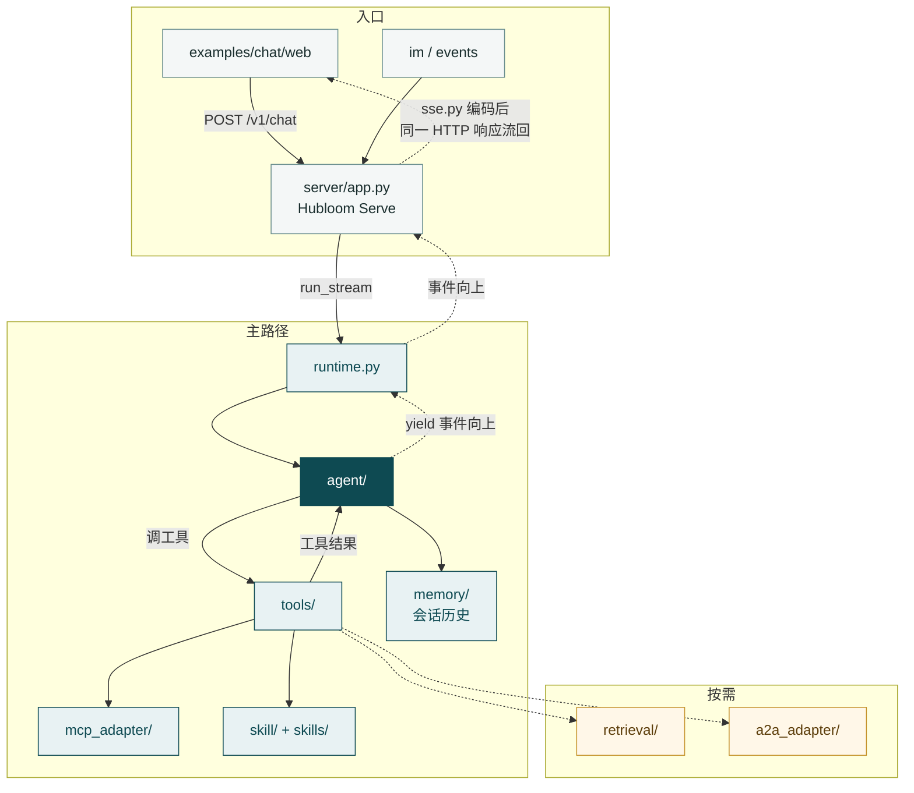

# 模块导读

本部分是**全仓代码地图**：按 `src/`（及示例前端）说明各模块职责、边界和关键入口，方便二开与排障。

- 想先建立「是什么」→ [核心概念](../core-concepts/README.md)
- 想改配置、写 Skill、嵌入 → [使用指南](../usage/README.md)
- **本部分** → 代码在哪、模块怎么拼、一轮请求怎么穿仓

读完概览，你应能指着仓库说：改编排看哪、改工具面看哪、改规程看哪。

---

## 代码版主链路

粗链路：入口请求进 Serve → Runtime → **Agent ⇄ Tools**（MCP / Skill）→ 会话写入 Memory；编排过程中的事件**沿调用栈向上**回到 Serve，由 `server/sse.py` 编成 SSE，经**同一次** `/v1/chat` 响应流回前端（不是 Agent 另开一条推送通道）。

---

## 一次 `/v1/chat` 怎么穿过仓库

以主路径对话为例（细节在各模块文展开）：

1. **`src/server/app.py`** — 接收 `POST /v1/chat`，解析 session / Token 等
2. **`src/runtime.py`** — `run_stream`：按会话准备上下文与工具，启动一轮
3. **`src/agent/run.py`** — 编排循环：决策 → 调工具 / 追问 / 确认 / 收工
4. **`src/tools/`** — 执行元工具（如 `list_api` / `call_api` / `read_skill`）
5. **`src/mcp_adapter/`** — 按 OpenAPI 契约打企业 HTTP，把结果交回
6. **`src/skill/` + `skills/`** — 加载规程；需要时经 `read_skill` 读正文
7. **`src/memory/`** — 写入会话历史
8. 事件向上回到 **`src/server/app.py`** 的 `_stream_chat`：用 **`src/server/sse.py`** 的 `event_to_sse` 编码后，经同一次 `StreamingResponse` 流回调用方

改配置看 `src/config.py`；请求级上下文看 `src/context.py`。

---

## 模块分组

### 主路径（优先读）

- **[Hubloom Serve](hubloom-serve.md)** — `src/server/`：产品 HTTP API（chat / resume / history 等）
- **[Runtime](runtime.md)** — `src/runtime.py`、`config.py`、`context.py`：装配并按会话启动一轮
- **[Agent](agent.md)** — `src/agent/`：编排决策与 Wait Profile
- **[Tools](tools.md)** — `src/tools/`：工具基类、Runner、内置元工具
- **[MCP Adapter](mcp-adapter.md)** — `src/mcp_adapter/`：OpenAPI → MCP → 真实 HTTP
- **[Skill](skill.md)** — `src/skill/`、`skills/`：加载 `SKILL.md`、名片、`read_skill`

### 入口

- **[示例站](examples-chat.md)** — `examples/chat/web/`：演示前端，代理到 Serve
- **[Events](events.md)** — `src/events/`：业务 Webhook 入站
- **[企业微信](im-wecom.md)** — `src/im/wecom/`：企微回调与推送

### 按需

- **[Memory](memory.md)** — `src/memory/`：会话历史；可选长期记忆
- **[Retrieval](retrieval.md)** — `src/retrieval/`、`src/embedders/`：RAG
- **[A2A Adapter](a2a-adapter.md)** — `src/a2a_adapter/`：跨 Agent 委托

协议直觉仍读概念章（如 [MCP](../core-concepts/mcp-protocol.md)）。本部分不重复科普，只挖代码边界与入口。

---

## 建议阅读顺序

主路径：

1. [Runtime](runtime.md)
2. [Agent](agent.md)
3. [Tools](tools.md)
4. [MCP Adapter](mcp-adapter.md)
5. [Skill](skill.md)

需要看 HTTP 门面或演示页时，加读 [Hubloom Serve](hubloom-serve.md)、[示例站](examples-chat.md)。  
事件、企微、记忆、RAG、A2A 等用到再进对应篇。

---

## 各模块文怎么写

后续详解尽量统一为：

1. **一句话职责**
2. **边界**（管什么 / 不管什么）
3. **关键入口与目录**
4. **主调用链**（步骤或图）
5. **和上下游模块的关系**
6. **延伸阅读**（概念章 / 使用指南 / 进阶）

从 [Runtime](runtime.md) 开始即可。
