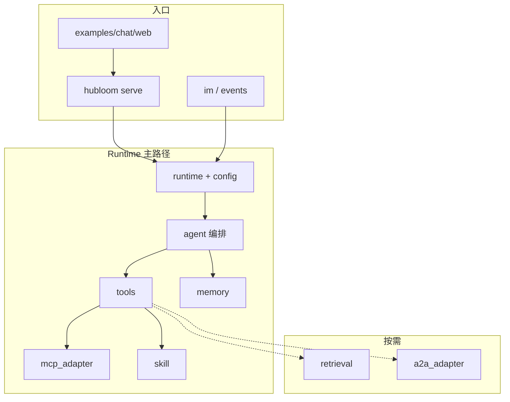

# 模块导读

本部分是**全仓代码地图**：按 `src/`（及示例站）说明各模块**职责、边界、关键入口**，方便二开与排障。

| 章节类型                                                       | 看什么                             |
| -------------------------------------------------------------- | ---------------------------------- |
| [核心概念](../core-concepts/README.md)                         | 协议与角色（为什么）               |
| [使用指南](../usage/README.md) / [进阶](../advanced/README.md) | 怎么配、怎么开                     |
| **模块导读（本部分）**                                         | 代码在哪、模块怎么拼、调用链怎么走 |

读完总览，你应能指着仓库说：改工具面看哪、改编排看哪、改记忆看哪。

---

## 总览图

一次对话的粗链路：演示前端或其它入口 → Hubloom Serve / Runtime → `agent`（Typed ReAct）→ `tools`（含 MCP 元工具、`read_skill` 等）→ SSE 回前端；会话写入 `memory`。

---

## 一级模块名单

| 模块            | 仓库位置                                            | 一句话                                           | 详解                          |
| --------------- | --------------------------------------------------- | ------------------------------------------------ | ----------------------------- |
| **Runtime**     | `src/runtime.py`、`src/config.py`、`src/context.py` | 进程级装配：LLM / MCP / Playbook / Wait Profile | [Runtime](runtime.md)         |
| **Hubloom Serve** | `src/server/`                                   | 产品 HTTP API：`hubloom serve`（无 A2UI/AG-UI） | [Hubloom Serve](hubloom-serve.md) |
| **Agent**       | `src/agent/`                                        | Typed ReAct 单环、Journal、Gate、SSE 事件        | [Agent](agent.md)             |
| **Tools**       | `src/tools/`                                        | 工具基类、Runner、内置元工具注册                 | [Tools](tools.md)             |
| **MCP Adapter** | `src/mcp_adapter/`                                  | OpenAPI → MCP → `list_api` / `call_api`          | [MCP Adapter](mcp-adapter.md) |
| **Skill**       | `src/skill/`、`skills/`                             | 加载 `SKILL.md`、名片注入、`read_skill`          | [Skill](skill.md)             |
| **Memory**      | `src/memory/`                                       | 会话历史；可选长期记忆 / 巩固                    | [Memory](memory.md)           |
| **Retrieval**   | `src/retrieval/`、`src/embedders/`                  | RAG 检索与向量相关                               | [Retrieval](retrieval.md)     |
| **Events**      | `src/events/`                                       | 业务 Webhook 入站、分册注入、幂等                | [Events](events.md)           |
| **企业微信**    | `src/im/wecom/`                                     | 企微回调、换票、推送 Markdown                    | [企业微信](im-wecom.md)       |
| **A2A**         | `src/a2a_adapter/`                                  | 跨 Agent 委托（可选）                            | [A2A Adapter](a2a-adapter.md) |
| **示例前端**    | `examples/chat/web/`                                | Vue 对话页，代理到 Hubloom Serve                 | [示例站](examples-chat.md)    |

协议直觉仍读概念章：[MCP](../core-concepts/mcp-protocol.md)。本部分不重复「协议科普」，只挖代码设计。

---

## 建议阅读顺序

**主路径（优先）：**

1. [Runtime](runtime.md) → 2. [Agent](agent.md) → 3. [Tools](tools.md) → 4. [MCP Adapter](mcp-adapter.md) → 5. [Skill](skill.md)

**按需：**

- 会话与长期记忆 → [Memory](memory.md)
- 文档问答 → [Retrieval](retrieval.md)
- 事件驱动 → [Events](events.md)
- 企微入口 → [企业微信](im-wecom.md)
- 多 Agent → [A2A](a2a-adapter.md)
- 对前端/嵌入 → [示例站](examples-chat.md)

`mcp_adapter` 内部（`discovery` / `spec` / `gateway` / `server` / `client` / `auth`）在 [MCP Adapter](mcp-adapter.md) 中展开；过长时再拆子页，仍挂在本目录下。

---

## 每篇详解的固定结构

后续模块文尽量统一为：

1. **一句话职责**
2. **边界**（管什么 / 不管什么）
3. **关键入口与目录**
4. **主调用链**（步骤或图）
5. **和上下游模块的关系**
6. **延伸阅读**（概念章 / 使用 / 进阶）
