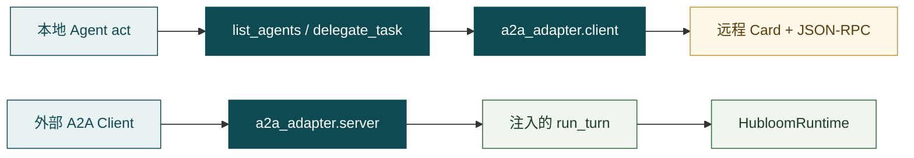
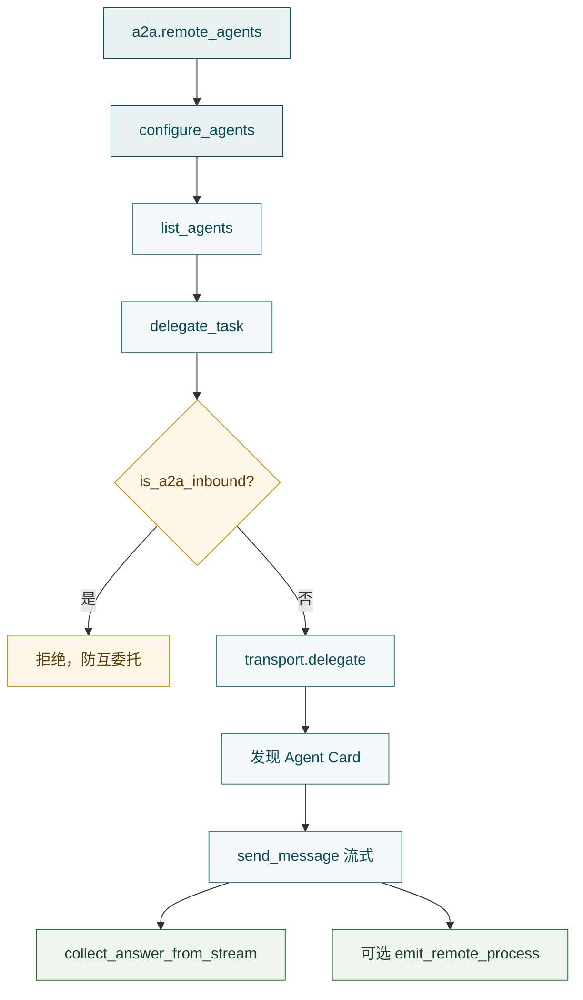

# A2A Adapter

**A2A Adapter**（`src/a2a_adapter/`）把**跨 Agent 委托**接到协议与工具面上：出站靠静态目录 + `delegate_task`；入站靠 Agent Card + Executor（需注入 `run_turn`）。它不是第二套编排引擎，也不是 MCP。

一句话：

> **本地 `act` → `list_agents` / `delegate_task` → 发现对端 Card → 流式收包 → 抽最终 answer；入站则 Card + JSON-RPC → Executor → 注入的 `run_turn`。**



协议实现依赖官方 [`a2a-sdk`](https://pypi.org/project/a2a-sdk/)；本包装配、映射与 Hubloom 侧约定。协议本身的权威说明见下文官网链接。

---

## 什么是 A2A（协议层）

**A2A** 全称 **Agent2Agent（Agent-to-Agent）Protocol**：一套开放标准，让**不同框架、不同厂商、不同进程里的 Agent** 能互相发现、委托任务、交换结果——通信对象是「另一个 Agent」，不是「一个 REST 工具」。

它和 MCP 互补、不互相替代：

| | MCP | A2A |
| --- | --- | --- |
| 解决什么 | Agent **怎么连工具 / API / 资源** | Agent **怎么和另一个 Agent 协作** |
| 典型动作 | 列接口、调 HTTP、读库表 | 发现对端、发任务、收回答 / 过程流 |
| 在 Hubloom | [MCP Adapter](mcp-adapter.md) + `list_api` / `call_api` | 本篇 + `list_agents` / `delegate_task` |

协议里几个会反复出现的词：

- **Agent Card** — 对端的「名片」（能力、接口 URL、是否支持流式等），通常经  
  `/.well-known/agent-card.json` 一类路径被发现  
- **JSON-RPC / Task** — 委托以任务形式推进（工作中 → 完成 / 失败），可带流式分片  
- **Artifact** — 任务产出物；Hubloom 约定主结论叫 `answer`，过程轨迹叫 `trace`

**官网（协议文档首页）：** [https://a2a-protocol.org/latest/](https://a2a-protocol.org/latest/)  
规范正文可从同站进入 [Specification](https://a2a-protocol.org/latest/specification/)；源码与社区见 [a2aproject/A2A](https://github.com/a2aproject/A2A)。

Hubloom **不重新发明协议**，只做适配：出站当 Client，入站当 Server（能力见下节；产品挂载现状见「现状（必读）」）。

---

## 入站与出站（必读直觉）

站在**本机这份 Hubloom 进程**上看网络方向，不要和「用户从网页进来」混为一谈：

| | **出站（outbound）** | **入站（inbound）** |
| --- | --- | --- |
| 本机角色 | **Client**（主动去找别人） | **Server**（被人来找） |
| 谁先开口 | 本地 Agent 决定委托 | 外部 A2A Client 发来任务 |
| 本机代码 | `a2a_adapter.client` + `list_agents` / `delegate_task` | `a2a_adapter.server`（Card + Executor） |
| 对端是谁 | 配置里的 `remote_agents[].url` | 任意能打到本机 Card/RPC 的客户端 |
| 成功长什么样 | 本地拿到一段**最终 answer 文本**（可给模型当观察） | 本机跑完一轮，把 answer（+ 可选 trace）推回调用方 |
| Hubloom 现状 | 代码可用；须显式 `configure_agents` + 注册工具 | 适配器壳可用；**Serve 未挂**；产品级 Card/`run_turn` 桥未齐 |

### 出站：本地委托别人

场景：用户在网页 / 企微跟 **本机 Agent** 说话；Decide 发现本地 MCP 不够，或业务上就该问「另一个专家 Agent」，于是 `act` → `delegate_task`。

链路直觉：

1. 从静态目录取出对端 `id` / `url`（`a2a.remote_agents`）  
2. HTTP 拉取对端 **Agent Card**  
3. 按协议发消息（Hubloom 客户端走**流式**收包）  
4. 只把最终 **answer** 收回来当工具结果；过程分片可另路 `emit_remote_process` 给前端 SSE  

此时本机是**主动方**；对端是别人的 A2A Server（可以是另一份 Hubloom，也可以是任意兼容 A2A 的实现）。

### 入站：别人委托本地

场景：别的系统 / 别的 Agent 把本机当成「可协作的远程 Agent」：先发现本机 Card，再 JSON-RPC 丢任务过来。

链路直觉：

1. 本机公布 **Agent Card** + JSON-RPC 路由（`build_a2a_routes`）  
2. `HubloomExecutor` 接 Task：标 `WORKING` → 调注入的 **`run_turn`** → `COMPLETED` / `FAILED`  
3. `run_turn` 理想情况下接到 `HubloomRuntime.run_stream`，用同一套编排办事  
4. 流式约定：结论进 `answer` Artifact，思考/工具过程进 `trace`  

此时本机是**被调方**。为避免「A 委托 B、B 再委托 A」死循环，入站回合应置 `set_a2a_inbound`；工具侧若发现该标记，会**拒绝**再调 `delegate_task`。

### 和「入口」别弄混

- **Events / 企微 / 网页 chat** — 换的是**人 / 业务系统怎么敲开 Hubloom**（入口）。  
- **A2A 入站** — 换的是**另一个 Agent 怎么敲开 Hubloom**（仍是 Agent 协议，不是企微回调）。  
- **A2A 出站** — 本地 Agent **出门找同伴**；MCP 出站则是**出门调 API**。

同一进程可以同时具备出站与入站能力；Hubloom 当前更接近「出站积木齐、入站壳在、产品挂载未齐」。

---

## 为何需要（在 Hubloom 里）

MCP 解决「怎么调**业务 API**」。现场还有另一类协作：本地工具不够，或能力在**另一个 Agent**里——这时要的是委托，不是再包一层 REST。

A2A 在 Hubloom 里是**可选插件**，不是主卖点：主路径仍是 Runtime → Agent → MCP / Skill / Memory。配了远端目录、并把工具显式挂进 Runner，本地 Agent 才能 `list_agents` / `delegate_task`。

| | MCP | A2A | Events / 企微 |
| --- | --- | --- | --- |
| 对象 | 业务 HTTP API | 另一个 Agent | 入口通道 |
| Agent 可见面 | `list_api` / `call_api` | `list_agents` / `delegate_task` | 无（入口侧） |
| 配置开关感 | `mcp.enable` 等 | `a2a.remote_agents` 非空 + **显式注册工具** | `events.enable` / `im.wecom.enable` |

---

## 边界

**管：**

- 出站：远程目录（`client/registry`）、发现 Card、流式发送与 answer 抽取（`client/transport` / `mapping`）
- 入站：`build_a2a_routes`、`HubloomExecutor`（answer / `trace` Artifact）、Message ↔ 文本映射（`server/`）
- 学习用最小 Server / Client（`simple_server` / `simple_client`）

**不管：**

- 何时 `act`、Wait Profile → [Agent](agent.md)
- `ToolRegistry` / `ToolRunner`、元工具类文件位置 → [Tools](tools.md)（`builtin/a2a_tool.py`）
- 进程是否注册 A2A 工具、`configure_agents` 谁调用 → 上层装配（**当前 Runtime / Serve 默认不做**）
- 业务 HTTP → [MCP Adapter](mcp-adapter.md)
- 对话 / 事件 / 企微入口 → [Hubloom Serve](hubloom-serve.md) · [Events](events.md) · [企业微信](im-wecom.md)

---

## 现状（必读）

| 事实 | 含义 |
| --- | --- |
| 出站代码可用 | `client/*` + `tools/builtin/a2a_tool.py` |
| 配置 | `a2a.remote_agents`（YAML 列表 → 内部 JSON 字符串）；空 = 目录空 = 功能「关」 |
| Runtime | `_make_runner` **不**挂 `ListAgentsTool` / `DelegateTaskTool`（与 [Tools](tools.md) 一致：需上层显式注册） |
| `configure_agents` | 目录靠进程级注入；**Runtime / Serve 当前不会自动调用**；不配则 `load_agents()` 为空 |
| Serve | **无** A2A Card / JSON-RPC 挂载 |
| 入站适配器 | `build_a2a_routes` + `HubloomExecutor` 在；默认 `run_turn` 为回声 `_echo_turn` |
| 产品桥 | `server/app.py` / `serve_card_only.py` 仍引用不存在的 `agents.a2a.*`（Card / `run_a2a_turn`）→ 产品级入站路径**未齐** |
| 防死循环 | `delegate_task` 在 `is_a2a_inbound()` 时拒绝；入站 `run_turn` 需 `set_a2a_inbound`——产品桥缺失时该标记通常不会被置位 |
| 测试 | `tests/` **无**专项用例；动手靠 simple_* 与 transport demo |

装配出站（示意，非 Serve 现状）：

```python
from a2a_adapter.client.registry import configure_agents
from tools.builtin import ListAgentsTool, DelegateTaskTool

configure_agents(cfg.a2a_remote_agents)  # 或等价 JSON 字符串
tools = [..., ListAgentsTool(), DelegateTaskTool()]
# → ToolRegistry.from_tools(tools) → 交给本轮 Agent
```

---

## 出站主调用链



要点：

1. **静态目录** — `RemoteAgent(id, name, url, token?)`；`url` 也可用字段名 `card_url`。不读环境变量目录。  
2. **`list_agents`** — 打印 id / name / url；空则提示去配 `a2a.remote_agents`。  
3. **`delegate_task(agent_id, message)`** — 调 `delegate`；工具侧 `echo_live=False`，把 status / trace / answer 增量经 `emit_remote_process` 交给 UI（若本轮挂了队列）。  
4. **传输** — 拉 Card；若对端未标 streaming，客户端会**强制打开**再发；超时默认约 180s。  
5. **返回值** — 只要最终 **answer** 文本（优先 `name=answer` 的 Artifact）；**不含**对端内部 trace。失败以异常 / 「委托失败：…」回给模型。

独立试出站（需目录已 `configure_agents`，且对端可达）：

```bash
# 先保证进程内目录已注入；demo 默认 agent_id=hubloom-self
A2A_DEMO_AGENT_ID=hubloom-self A2A_DEMO_MESSAGE='你好' \
  PYTHONPATH=src .venv/bin/python -m a2a_adapter.client.transport
```

（`registry` 的 `__main__` 可打印解析后的目录，便于核对 YAML。）

---

## 入站：适配器能力与缺口

**已有：**

- `build_a2a_routes(card, run_turn)` — Agent Card 发现路由 + JSON-RPC → `HubloomExecutor`  
- `HubloomExecutor` — Task：`WORKING` → 调 `run_turn(query, task_id, on_stream)` → `COMPLETED` / `FAILED`  
- 流式约定：`answer` → 主 Artifact；`thought` / `tool_*` / `phase` → 名为 **`trace`** 的第二 Artifact  
- 未注入 `run_turn` 时用 `_echo_turn`（回声），便于单测协议壳  
- `simple_server` / `simple_client` — 不依赖 `agents.a2a`，可本机学协议

**缺口（写清以免误用）：**

- Hubloom Serve **未**挂载上述路由  
- 产品级 Card 构建与 `run_a2a_turn`（曾规划在 `agents/a2a/`）**当前仓库中不存在**；`a2a_adapter.server.app` / `serve_card_only` 的 `__main__` 因此不可直接跑通产品入站  
- `cancel` 未实现（`NotImplementedError`）

要把 Hubloom 真正做成可被委托的对端：自备 `AgentCard` + 把 `run_turn` 接到 `HubloomRuntime.run_stream`，并在入站回合 `set_a2a_inbound(True)`，再 `build_a2a_routes` 挂到自有 FastAPI / Starlette。

---

## 与 Tools 的分工

| 层 | 职责 |
| --- | --- |
| [Tools](tools.md) `builtin/a2a_tool.py` | Agent 可见的 `list_agents` / `delegate_task`；入站禁委托；错误转成观察文本 |
| `a2a_adapter.client` | 目录、HTTP/Card、流式、answer 抽取 |
| `a2a_adapter.server` | 被委托时的协议壳与 Task 状态机 |
| Runtime / 宿主 | **是否** `configure_agents` + 把两工具塞进 `_make_runner`（现状：默认不做） |

模型侧 A2A 与 MCP **同构为 `act`**；差别只在工具名与背后传输。

---

## 配置

见 `config/env.example.yaml` 的 `a2a:`：

| 项 | 作用 |
| --- | --- |
| `remote_agents` | 列表：`id`（委托键）、`name`、`url`（对端 Base / Card）；可选 `token` → `Authorization: Bearer` |
| `public_url` | 对外公布的本 Agent Card URL（**入站挂载用**；Serve 未用则仅占位） |

不配 `remote_agents`（或未 `configure_agents`）时，`list_agents` 返回「当前未配置远程 Agent」。

---

## 关键入口与目录

```text
src/a2a_adapter/
  client/
    registry.py    # RemoteAgent / configure_agents / load_agents
    transport.py   # discover / send_and_wait / delegate
    mapping.py     # 流式 → 最终 answer
  server/
    app.py         # build_a2a_routes / build_app
    executor.py    # HubloomExecutor + run_turn
    mapping.py     # Message ↔ 文本 / Artifact parts
  simple_server.py # 学习用最小入站
  simple_client.py # 学习用最小出站
  serve_card_only.py  # 仅 Card（依赖缺失的 agents.a2a）
src/tools/builtin/a2a_tool.py  # list_agents / delegate_task
```

---

## 设计取舍

| 若做成… | 我们选择… | 主要理由 |
| --- | --- | --- |
| 运行时自动发现全网 Agent | 静态 `remote_agents` 目录 | 可控、可审计、配置即开关 |
| A2A 另写编排环 | 同构为 Tool `act` | 与 MCP 一致，Decide 不特殊分支 |
| 入站仍允许再委托 | `is_a2a_inbound` 时拒绝 `delegate_task` | 避免互委托死循环 |
| 过程与结论混在一个 Artifact | `answer` + `trace` 分离 | 出站只要结论；UI 可另路看过程 |
| Serve 默认挂 A2A | 适配器可挂、产品未挂 | 主路径先稳对话 / 事件 / 企微 |

---

## 动手（压缩）

**学协议（不经 Hubloom Runtime）：**

```bash
# 终端 A
PYTHONPATH=src .venv/bin/python -m a2a_adapter.simple_server

# 终端 B
PYTHONPATH=src .venv/bin/python -m a2a_adapter.simple_client
```

**出站 demo：** 配好 `remote_agents` 并在同进程 `configure_agents` 后，再跑 `-m a2a_adapter.client.transport`（见上节）。

**不要假设：** `hubloom-serve` 开箱提供 Card URL；也不要跑 `serve_card_only` / `server.app` 的产品 `__main__` 当现行路径（`agents.a2a` 缺失）。

无正式 pytest；联调以 simple_* 与手工委托为准。

---

## 和上下游

| 模块 | 关系 |
| --- | --- |
| [Tools](tools.md) | 元工具入口；Runtime 默认工具面**不含** A2A |
| [Agent](agent.md) | `act` → Runner；A2A 与 MCP 同为行动 |
| [Runtime](runtime.md) | 当前不装配 A2A；嵌入时可自行注册 |
| [MCP Adapter](mcp-adapter.md) | 调 API；A2A 调 Agent——对象不同 |
| [Hubloom Serve](hubloom-serve.md) | HTTP 门面；**尚未**挂 A2A 路由 |

---

## 常见误解

- **A2A = 第二套 Agent** — 只是委托通道；办事仍可回到同一 Runtime  
- **配了 `remote_agents` Serve 就会委托** — 还需 `configure_agents` + 工具进 Runner；Serve/Runtime 默认都不管  
- **A2A 和 MCP 一样是调 REST** — MCP 对业务 API；A2A 对远程 Agent  
- **入站开着仍可 `delegate_task`** — 设计上禁止；标记需入站路径置位  
- **`simple_server` = 生产挂载** — 仅协议学习；生产要自备 Card + `run_turn` + 挂路由  
- **仓库里已有完整 `agents/a2a` 产品桥** — 当前没有；文档与 `__main__` 引用是缺口  

---

## 延伸阅读

- 协议官网：[A2A Protocol](https://a2a-protocol.org/latest/) · [Specification](https://a2a-protocol.org/latest/specification/)
- 配置：`config/env.example.yaml` 的 `a2a` · [配置项](../reference/configuration.md)
- 工具面：[Tools](tools.md)（可选元工具）
- 对照能力插头：[MCP Adapter](mcp-adapter.md)
- 编排：[Agent](agent.md)
- 进阶大纲（正文待写）：[A2A 协作](../advanced/a2a.md)
- 回 [模块导读](README.md)
