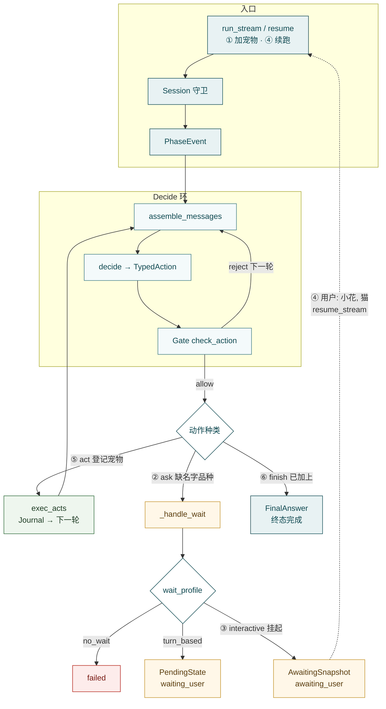
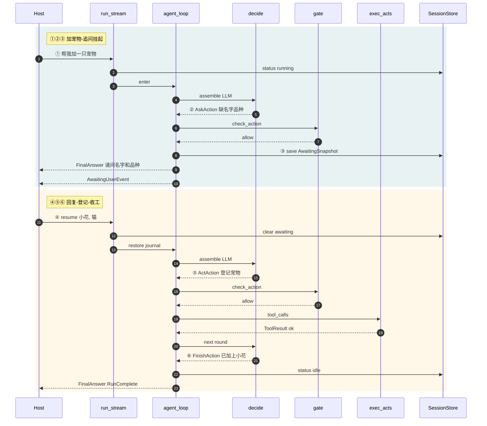
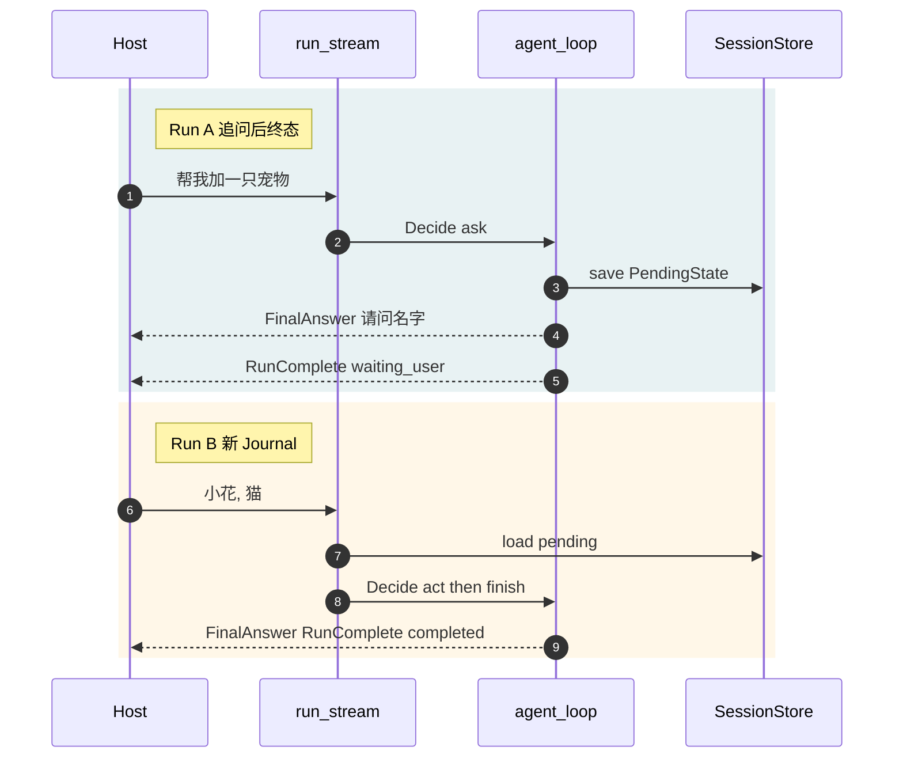
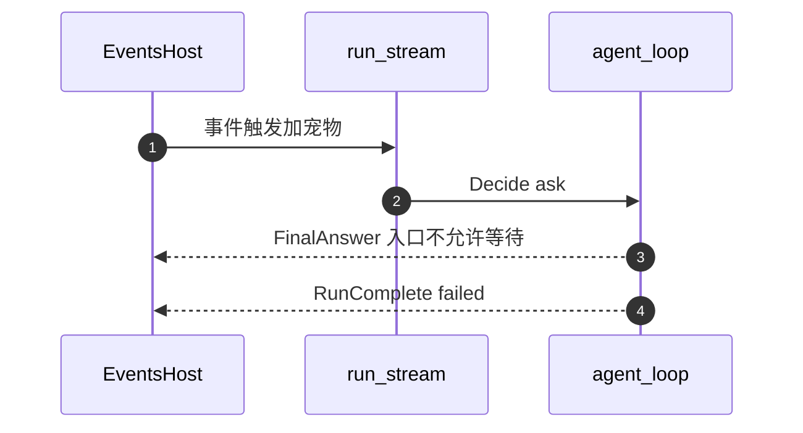

# Agent

**Agent**（`src/agent/`）是 Hubloom 的**编排内核**：在一轮 Run 里反复决定「下一步做什么」，把工具结果记进证据账，并在该问人、该确认、该收工时停下来。它不负责起 HTTP、不装配 MCP 子进程，也不自己画前端——那些分别在 Serve、Runtime 与宿主 UI。

一句话：

> **Policy-Bounded Typed ReAct：Decide → Gate → `act` | `ask` | `await_confirm` | `finish`；观察进 Evidence Journal；等人方式由 Wait Profile 决定。**

概念速览见 [Agent（核心概念）](../core-concepts/agent.md)。下文按源码主路径展开。

---

## 这套设计是什么

名字拆开有三层含义，对应代码里三块机制：

| 词                 | 含义                                                                                     | 代码落点                                |
| ------------------ | ---------------------------------------------------------------------------------------- | --------------------------------------- |
| **ReAct**          | 决策 → 行动/等人 → 观察 → 再决策，**一条环**办完；不再拆「思考模型 / 定稿模型 / 画表单」 | `_agent_loop`                           |
| **Typed**          | 每一步只能是互斥的四种动作之一：办事、追问、确认、收工（由控制工具或纯文本收成）         | `actions.parse_decide_output`           |
| **Policy-Bounded** | Skill 编译成 Playbook，Decide 之后、执行之前 **Gate 硬拦**；不是只靠 prompt 自觉         | `gate.check_action` + `policy.Playbook` |

再补两块配套能力：

- **Evidence Journal**：本 Run 的观察/拒绝/收工账本；进 prompt 用摘要，`finish` 可 `cites` 引用
- **Wait Profile**：同一种 `ask` / `await_confirm`，按入口变成「挂起同一 Run」「跨 Run 交班」或「直接失败」

产品里常见分工是：

```text
宿主（Serve / 门户 / 企微 / Events）
  → Runtime：装配 LLM、MCP、system、Playbook、Redis…；绑定 Token / session
    → Agent：run_stream / resume_stream 跑环，yield 事件与 RunResult
      → Tools / MCP：真正执行业务调用
宿主再把事件编成 SSE、JSON 或推到 IM
```

演示前端默认传 `wait_profile=interactive`（可挂起续跑）；配置与 Agent API 的默认值是 `turn_based`；Events 装配常用 `no_wait`。**换的是等人策略，不是换一套编排。**

读本文可按这条线往下走：边界 → 加宠物例子（含变体）→ 总览与三种 Wait 时序 → 环内逐步 → Journal / Playbook → 事件。

---

## 边界

**管：**

- 单环编排：`run_stream` / `resume_stream` / `_agent_loop`
- Typed 动作解析与互斥（业务工具 vs 控制工具）
- Gate（Playbook 硬拦）与 Evidence Journal
- Wait Profile：`interactive` / `turn_based` / `no_wait`
- 对外 **事件对象**（`events.py`）与 `RunResult`

**不管：**

- HTTP 路由、SSE 文本编码 → [Hubloom Serve](hubloom-serve.md)（`sse.py`）
- LLM / MCP / Redis / system 文案的**进程级装配** → [Runtime](runtime.md)
- 工具怎么执行、`call_api` 怎么打企业 HTTP → [Tools](tools.md) · [MCP Adapter](mcp-adapter.md)
- Skill 文件怎么写、名片怎么扫 → [Skill](skill.md)

本包 **不依赖** `HubloomRuntime`：只要传入 `llm` / `memory` / `runner` / `tools` / system 字符串即可跑环。Runtime 是最常见的调用方，不是唯一调用方。

---

## 解决什么问题

| 痛点                        | 没有这套时                         | 这套怎么挡                      |
| --------------------------- | ---------------------------------- | ------------------------------- |
| 企业要**办事**不只陪聊      | 模型空口答应                       | 主路径就是 `act` 调真实工具     |
| 参数不全就瞎调              | 直接失败一堆                       | 先 `ask`，问清再 `act`          |
| 高风险写操作                | 一句话删数据                       | `await_confirm`，人点头再执行   |
| 各厂流程不同                | 改代码堆 if/else                   | Skill → Playbook，Gate **硬拦** |
| 架构太碎难嵌                | 多相位（思考 / 展示 / 定稿）拆太开 | **单环**；入口只选 Wait Profile |
| 网页能挂着等、企微/事件不能 | 一种等人打天下                     | 三种 Wait Profile               |

设计取舍记成：**换入口只换「等人策略」，不换「决策环」**。宿主自绘输入框/确认按钮；事件流**不带** UI DSL。

---

## 例子：加一只宠物（interactive）

用网页聊天最常见的路径，把上面的词落到一次真实办事（`wait_profile=interactive`）：

| 步  | 用户 / 系统                | 环内动作                            | 图上标记                         |
| --- | -------------------------- | ----------------------------------- | -------------------------------- |
| ①   | 用户：「帮我加一只宠物。」 | `run_stream` 开跑 → Decide          | 总览入口；时序青底开头           |
| ②   | Agent 发现缺名字、品种     | `ask` → Gate 放行                   | 总览 `ask` 分支                  |
| ③   | 页面展示追问；Run **挂起** | `_handle_wait` → `AwaitingSnapshot` | 总览 `interactive`；时序青底结尾 |
| ④   | 用户：「小花，猫。」       | `resume_stream` 恢复同一 Run        | 时序暖底开头                     |
| ⑤   | Agent 调业务工具登记       | `act` → `exec_acts` → Journal       | 总览 `act`；时序 `tool_calls`    |
| ⑥   | 「已经加上小花。」         | `finish` → 终态 `completed`         | 总览 `finish`；时序暖底结尾      |

若同一场景走企微（`turn_based`），②③ 不会挂起同一 Run，而是本轮 `waiting_user` 结束，用户再回一句时新开 `run_stream` 并带上 pending。事件入口（`no_wait`）则不允许停在 ②，会直接 `failed`。

### 变体：信息一次给齐

用户直接说：「新添加一个宠物小花、猫。」（名字、品种已在一句里）

```text
run_stream
  → Decide → act（登记小花 / 猫）
  → Decide → finish
  → completed
```

通常**不会**走 ②③④（无 `ask`、无挂起、无 `resume`）。总览图上相当于入口后直接 ⑤→⑥。  
是否仍先 `ask`，取决于模型是否还觉得缺参（例如业务还要其它必填字段）——协议不强制「有名字就必须 act」。

### 变体：挂起追问中，用户改口做别的事

假设已走到 ③（`awaiting_user`），用户不答名字，却说：「帮我查一下柜子。」

**演示站（`examples/chat/web`）实际行为：**

- 前端只要还握着 `pendingAwait`，下一句一律打 **`/v1/chat/resume`**，不会新开 `/v1/chat`
- 新任务文案被当成对上一问的 **`user_reply`**，进入**同一 Run**（同一 Journal / `await_token`）
- Agent 再 Decide：可能改去做查柜子，也可能仍按「补宠物资讯」理解——**没有「自动取消挂起、另起炉灶」的协议**，靠模型临场选

**若宿主强行再调 `run_stream`（同 `session_id`）：**

- 编排软锁会直接失败：`session 正在 awaiting_user，请先 resume 或 cancel`
- 内核有 `cancel_awaiting`；**Serve 当前未暴露 cancel HTTP**。演示站「新会话」是换本地 `session_id`，旧挂起留在旧 session 上

**产品侧建议（宿主二开）：**

1. 用户点「取消 / 新任务」→ 先调 `cancel_awaiting`（或将来暴露的 cancel API）清掉 `awaiting_user`，再 `run_stream` 新意图
2. 或新开 `session_id`（演示站现状）
3. 不要在挂起态直接对同一 session 再 `run_stream`（会撞软锁）

**`turn_based`：** 追问已是本轮终态 + `pending`；用户下句是新的 `run_stream`，pending 摘要仍进 prompt，模型同样要在「继续加宠物」和「新任务」之间选。

对照：

| 用户说法                                 | 典型路径                                                   |
| ---------------------------------------- | ---------------------------------------------------------- |
| 「帮我加一只宠物。」→ 再答「小花，猫。」 | ①→⑥ 全路径（上文主表）                                     |
| 「新添加一个宠物小花、猫。」             | 多半一轮 `act`→`finish`，无挂起                            |
| 已挂起，却说「查柜子」                   | 演示站 = resume 进同一 Run；干净切换需 cancel 或新 session |

下面两张图按主路径 **①→⑥**（缺参再补）标注。

---

## 总览



读代码时抓住三条线：

1. **环**：Decide → Gate → 四分支（`run.py` + `loop/`）；Gate reject / parse 失败未熔断时 **continue 下一轮**（`rounds` 仍 +1）
2. **账**：Observation / reject / finish 进 Journal（`evidence.py`）
3. **等人**：同一套 `_handle_wait`，按 Wait Profile 分流（`wait.py` + `session.py`）

加宠物走的是：① 入口 → 环内 Decide → ② `ask` → ③ `interactive` 挂起 → ④ `resume_stream` 再进入口 → ⑤ `act` → 再 Decide → ⑥ `finish`。虚线表示「同一 session，换一次 API 入口续跑」，不是环内 `continue`。

### 时序：加宠物 ask → resume → act → finish

`wait_profile=interactive`。青底：①～③ 开跑到挂起；暖底：④～⑥ 用户回复后续跑收工。挂起时先发 `FinalAnswerEvent`（追问文案），再发 `AwaitingUserEvent`（令牌），**不发** `RunCompleteEvent`。



`turn_based` / `no_wait` 与上面同一句「加宠物但缺参」时的差别，见下面两小节图（不再展开全环内部）。

### 时序：同一句加宠物 · turn_based（跨轮）



要点：两次都是 `run_stream`；第二次是**新** Journal，靠 pending 摘要接上意图，不是 `resume_stream`。

### 时序：同一句加宠物 · no_wait（事件）



要点：模型一旦选 `ask` / `await_confirm`，本 Run **失败收口**；上游应改交互入口，或保证触发文案已带齐参数好走 `act`。

---

## 包与文件地图

```text
src/agent/
  run.py              # 编排入口：run_stream / resume_stream / _agent_loop / _handle_wait
  actions.py          # Typed 动作 + 控制工具 schema + 互斥解析
  gate.py             # Playbook 硬校验
  policy.py           # Playbook / PlaybookProgress；Skill frontmatter 编译
  evidence.py         # Evidence Journal
  wait.py             # Wait Profile 归一化
  session.py          # PendingState / AwaitingSnapshot / SessionRecord
  redis_session.py    # Redis 实现 + 分布式 session 锁（宿主层常用）
  assemble.py         # 上下文装配；build_agent_systems / select_system
  prompts.py          # 单环 system 文案
  events.py           # 对外事件 dataclass
  loop/decide.py      # 一轮 LLM → DecideResult
  loop/exec_act.py    # 执行业务 tool_calls
```

| 你想了解…                | 优先看                                  |
| ------------------------ | --------------------------------------- |
| 一整轮从哪进、从哪出     | `run.py`                                |
| 模型输出如何变成互斥动作 | `actions.parse_decide_output`           |
| 厂规怎么拦               | `gate.check_action` + `policy.Playbook` |
| ask 在三种入口下有何不同 | `run._handle_wait` + `wait.py`          |
| 宿主该订阅哪些事件       | `events.py`（编码见 Serve）             |

---

## `run_stream` 入口（逐步）

签名要点（由 Runtime 传入；也可自测直接调）：

- `llm` / `memory` / `runner` / `tools` — 能力面
- `trigger` — 用户 `Message` 或消息列表
- `system_before` / `system_after` — 工具前长 system / 工具后短 system
- `max_rounds` — 默认 **32**（每一轮 Decide 计 1）
- `wait_profile` — `interactive` \| `turn_based` \| `no_wait`。本函数默认 `turn_based`；Runtime 未覆盖时用配置 `agent.default_wait_profile`（示例配置亦为 `turn_based`）；演示聊天页常显式传 `interactive`
- `pending` — 可选；`turn_based` 跨轮交班
- `session_id` + `store` — 挂起态 / pending 持久化（interactive **必需**）
- `playbook` — 可选；空则 Gate 放行

步骤：

1. **`normalize_wait_profile`** — 非法值直接抛错，避免静默落到错误等人策略。
2. 新建（或注入）**`EvidenceJournal`**、`PlaybookProgress`，记下 `started`。
3. **Session 软锁**（仅当传入 `store` + `session_id` 时；单测可不传）：
   - 若 `rec.status == "awaiting_user"` → `ErrorEvent` + `RunCompleteEvent(failed)` + `RunResult(failed)` → **return**。挂起中禁止再 `begin`，必须 `resume_stream` 或 `cancel_awaiting`，否则会开出并行环、快照对不上。
   - 否则：`status=running`，写入 `active_run_id`，清掉 `awaiting`。
   - 若 `wait_profile == turn_based` 且调用方未传 `pending`，**沿用** store 里已有的 `rec.pending`（企微/跨轮场景靠这个接上）。
4. 若 `pending.kind == "await_confirm"` → **`progress.mark_confirmed()`**：本轮用户消息视为对上一轮确认的答复，Gate 才允许 `confirm_tools`。
5. `trigger` 为空 → 失败终态。
6. 每条 trigger **`memory.remember`**，并写入本轮 `turn_messages`。
7. Yield **`PhaseEvent(phase="running", route="typed_react:{profile}")`**。
8. 进入 **`_agent_loop`**（`rounds=0`，`parse_retries=0`）。

Runtime 侧还会先写 request context、建 memory/runner；那些不在本包，见 [Runtime](runtime.md)。

---

## 环内一轮（核心）

`_agent_loop` 在 `while rounds < max_rounds` 中重复下列步骤。**每一轮 = 一次 Decide**（可能含多次业务 tool call，但仍算一轮）。

### 1. 选 system + 装配上下文

**做什么**

- `select_system`：本轮 `turn_messages` 里**已有** `Role.TOOL` 时用 `system_after`，否则用 `system_before`。
- `assemble_messages`：
  1. `memory.recall` 拉会话历史，去掉与本轮 `turn_messages` 重叠的尾部（避免重复）
  2. system + **当前时间块**（相对日期以本机时间为准）
  3. 可选附加 system：Playbook 摘要、Journal 摘要、Pending 摘要
  4. 按 token 预算裁剪历史
  5. 拼成：`[system, …history, …extra_system, …turn]`

**为什么**

- 工具前需要 Skill 名片 / API catalog（长）；工具后反复灌同一长目录浪费上下文、干扰决策 → **切短 system**。
- Journal / Pending / Playbook 用**摘要**进 prompt，全量 detail 不灌模型（控长、也减少噪声）。

**代码**：`assemble.py` · `prompts.py`

---

### 2. Decide：一轮 LLM → Typed 动作

**做什么**

- 工具列表 = **业务 `tools` + 控制工具**（`agent_ask` / `agent_await_confirm` / `agent_finish`）。
- `decide()` 对流式输出：
  - 内容 / reasoning delta → yield **`ThoughtDeltaEvent(phase="decide", …)`**
  - 流错误 → `ErrorEvent` + `DecideResult(stream_error=…)` → 环 **失败终态**
  - 结束后 `parse_decide_output` → 一个互斥 `TypedAction`

**解析规则（硬约束）**

| LLM 输出                | 收成                               |
| ----------------------- | ---------------------------------- |
| 无 tool_calls，只有文本 | `FinishAction`（纯文本当 summary） |
| 仅业务工具              | `ActAction`                        |
| 仅一个控制工具          | `Ask` / `AwaitConfirm` / `Finish`  |
| 控制 + 业务同一步       | **parse_error**                    |
| 多个控制工具同一步      | **parse_error**                    |

**parse_error 时**

1. `decide` 已 yield `ErrorEvent(recoverable=True)`（宿主可展示）
2. Journal 记 `parse_reject`
3. 向 `turn_messages` 追加一条 user 提示（说明只能选一类动作）
4. `parse_retries += 1`；若 **≥ 2** → 再 yield 不可恢复 `ErrorEvent` + 失败终态；否则 **continue** 进入下一轮（允许最多约两次解析失败后熔断）

**为什么互斥**：同一步又调 API 又 `ask`，宿主无法判断「已经办了还是在等人」；互斥让事件语义清晰，也让 Gate / Wait 分支简单。

**失败时事件长什么样（parse 耗尽）**

```text
ThoughtDeltaEvent …
ErrorEvent(recoverable=True)          # 第 1 次 parse_error（decide 内）
# … 环 continue，再 Decide …
ErrorEvent(recoverable=True)          # 第 2 次 parse_error（decide 内）
ErrorEvent(recoverable=False)         # run 判定 parse_retries >= 2
RunStatsEvent
RunCompleteEvent(status=failed)
RunResult(status=failed, ok=False)
```

中间两轮之间会往 `turn_messages` 塞纠正提示，Journal 记 `parse_reject`。

**代码**：`loop/decide.py` · `actions.py`

---

### 3. Gate：规程硬拦

**做什么**：`check_action(action, playbook, progress)` → `GateVerdict`。

| 动作                    | Gate 行为                                                             |
| ----------------------- | --------------------------------------------------------------------- |
| `ask` / `await_confirm` | 始终允许（等人本身不违规）                                            |
| `act`                   | 禁 `forbid_tools`；`confirm_tools` 须已 `progress.confirmed`          |
| `finish`                | 所有 `require_steps` 须已在 progress 中完成（对应工具曾**成功**执行） |
| 空 Playbook             | 一律放行                                                              |

**拒绝时**

1. Journal 记 `policy_reject`
2. Yield **`PolicyRejectEvent`**（含 `code` / `reason` / `fused`）
3. 追加 user 提示，请模型改选合规动作
4. 同 `code` 累计达到 **`fuse_limit`（默认 2）** → `fused=True` → **失败终态**；否则 **continue** 进入**下一轮** Decide（`rounds` 照常 +1）

**为什么硬拦而不是只靠 prompt**：厂规要可审计、可复现；模型「自觉」不够。reject **回环**给一次纠错机会；熔断防止死循环烧 token。

**失败时事件长什么样**

未熔断（同 `code` 第 1 次，默认 `fuse_limit=2`）：

```text
PolicyRejectEvent(code=require_steps, fused=False)
# 环 continue → 再 Decide（宿主仍会看到后续 ThoughtDelta…）
```

熔断（同 `code` 累计达上限）：

```text
PolicyRejectEvent(code=require_steps, fused=True)
ErrorEvent(recoverable=False)
RunStatsEvent
RunCompleteEvent(status=failed)
RunResult(status=failed, ok=False)
```

`code` 常见：`forbid_tool` / `need_confirm` / `require_steps`。不同 code 分别计数。

**代码**：`gate.py` · `policy.py`

---

### 4a. `act`：执行业务工具

**做什么**

1. `exec_acts`：对每个 `ToolCall` yield `ToolCallEvent` → `runner.run` → `ToolResultEvent`
2. 每个结果写入 Journal（`kind=observation`），并把 `journal_id` 打回 `ToolResultEvent`
3. 非错误结果 → `progress.mark_tool_success`（推进 `require_steps`）
4. Yield `StepEvent(action="act", …)`
5. assistant + tool 消息写入 memory 与 `turn_messages`
6. `parse_retries = 0`，**continue** 下一轮 Decide（带着工具观察再决策）

**不做什么**：不在这里决定「该不该调」——那是 Decide + Gate；也不拼 OpenAPI / 发 HTTP——那是 Tools / MCP。

**代码**：`loop/exec_act.py`

---

### 4b. `ask` / `await_confirm`：进入等人

两者都走 **`_handle_wait`**，差别在语义字段与后续 Gate：

|            | `ask`                | `await_confirm`                                     |
| ---------- | -------------------- | --------------------------------------------------- |
| 控制工具   | `agent_ask`          | `agent_await_confirm`                               |
| 主字段     | `question` + `slots` | `prompt` + `payload`                                |
| 用户回复后 | 继续补参 / 办事      | `progress.confirmed = True`，才允许 `confirm_tools` |

`_handle_wait` 公共步骤：

1. Journal 记 `ask` 或 `await_confirm`；yield `StepEvent`
2. 按 **Wait Profile** 分流（见下一节）
3. 分流结束后 **return**（离开 `_agent_loop`；interactive 是挂起，不是环内 continue）

#### `await_confirm` 专例：删宠物前确认（interactive）

与「缺参追问」不同：参数可能已齐，但操作高风险，必须人点头。假设 Playbook 把删除类工具放进 `confirm_tools`。

```text
用户：「删掉宠物小花。」
  → Decide → await_confirm（「确认删除小花？」）
  → interactive 挂起（事件顺序同 ask：FinalAnswer → AwaitingUserEvent → …）
用户 resume：「确认。」
  → progress.mark_confirmed()
  → Decide → act(删除工具)   # 若未确认就 act，Gate code=need_confirm
  → Decide → finish
```

| 对比    | `ask`         | `await_confirm`                |
| ------- | ------------- | ------------------------------ |
| 目的    | 信息不够      | 信息可能够，但要授权           |
| 宿主 UI | 输入框 / 填槽 | 确认 / 取消按钮更合适          |
| Gate    | 不拦 ask 本身 | 拦「未确认就调 confirm_tools」 |

若模型跳过确认直接 `act(confirm_tools 里的工具)` → `PolicyRejectEvent(code=need_confirm)`，回环或熔断，逻辑与 `require_steps` 相同。

---

### 4c. `finish`：收工

1. Journal 记 `finish`
2. Yield `StepEvent(action="finish")`
3. 助手总结写入 memory
4. 若有 session：清 `pending` / `awaiting`，`status=idle`
5. Yield `FinalAnswerEvent` → `_emit_terminal`（`RunStats` + `RunComplete` + `RunResult(completed)`）

---

### 5. 触顶 `max_rounds`

循环条件不满足时：

- `ErrorEvent(recoverable=True)`（提示换说法或补信息）
- `RunResult(status="incomplete")` + 完整终态事件

默认 32 是安全阀，防止工具来回空转。

---

## Wait Profile：三种等人方式

同一套环，**只换等人策略**——这是多入口（网页 / 企微 / 事件）共用内核的关键。

### `interactive`（人对着屏幕）

- 需要 `session_id` + `SessionStore`，否则失败。
- 构造 **`AwaitingSnapshot`**（journal、turn_messages、rounds、进度、system…）写入 store；`status=awaiting_user`；清掉 `pending`。
- Yield 顺序：`FinalAnswerEvent(prompt)` → **`AwaitingUserEvent`**（`run_id` / `await_token`）→ `RunStatsEvent` → `RunResult(status="awaiting_user")`。
- **不发 `RunCompleteEvent`**：挂起 ≠ 终态；宿主应用 `resume_stream` 续跑。

**解决什么问题**：HTTP 可以等用户填表/点确认，**同一 Run、同一 Journal** 接着办，不必把「办到一半」压成跨轮摘要。演示站 `examples/chat/web` 走这条。

### `turn_based`（企微等不能挂 HTTP）

- 构造 **`PendingState`**，写入 `rec.pending`；`status=idle`，清掉 `awaiting`。
- Yield `FinalAnswerEvent` → **完整终态**（`RunStats` + `RunComplete` + `RunResult(status="waiting_user", pending=…)`）。
- 用户下次开口：新的 `run_stream`（**新** Journal）；若未显式传 `pending` 且 profile 仍是 `turn_based`，入口会**沿用** store 里的 pending，摘要进 assemble。

**解决什么问题**：回调不能阻塞等待；用「本 Run 结束 + 跨轮待办」交班，避免假挂起。配置默认与 Agent API 默认都是这一档。

### `no_wait`（事件 / 自动化）

- 不能等人：把追问/确认收成失败说明，`status=failed`，走完整终态。

**解决什么问题**：Webhook 触发时「问人」没有同步通道；与其静默卡住，不如明确失败，由上游重试或改交互入口。Serve 装配 Events 时常用这一档。

对照：

| Profile       | 等人时状态                | 续跑方式                    | 典型入口  |
| ------------- | ------------------------- | --------------------------- | --------- |
| `interactive` | `awaiting_user`（非终态） | `resume_stream`             | 网页 chat |
| `turn_based`  | `waiting_user`（终态）    | 下次 `run_stream` + pending | 企微      |
| `no_wait`     | `failed`                  | 不适用                      | Events    |

另有一层 **`RedisSessionLock`**（`redis_session.py`）：同 session 分布式串行，通常由 **Serve / 宿主**在调 Runtime 外包一层；编排内的软锁只管 `awaiting_user` 禁并行 begin。

---

## `resume_stream`（逐步）

仅服务 **interactive** 挂起。

1. 读 session；无 `rec.awaiting` → 失败（无 `RunComplete`，因从未进入合法挂起）。
2. 可选校验 `run_id` / `await_token`（防串 Run、防过期令牌）。
3. 规范化 `user_reply` → 写入 memory；接到 `snap.turn_messages` 末尾。
4. Journal 追加 `observation`（`tool_name="user_reply"`），便于后续 cite。
5. 清 awaiting：`status=running`。
6. Yield `PhaseEvent(route="typed_react:interactive:resume")`。
7. 恢复 `progress`；若挂起种类是 `await_confirm` → **`mark_confirmed()`**。
8. 再进 **`_agent_loop`**：同一 `journal`、同一 `rounds` / 计数器 / system / `max_rounds`，`wait_profile="interactive"`，`pending=None`。

**为什么不是再开一次 `run_stream`**：新开会丢掉挂起快照里的回合轨迹与规程进度；确认类工具也会丢 `confirmed` 标志。Serve 的 `/v1/chat/resume` 最终落到这里。

取消挂起用 `cancel_awaiting(store, session_id, run_id=…)`，不经过模型。Serve 暂无对应路由时，宿主可在进程内调该函数，或换 `session_id`；**不要**在 `awaiting_user` 上并行 `run_stream`。

---

## Evidence Journal

**是什么**：单次 Run 的证据账（`EvidenceJournal`），interactive 挂起时随 Snapshot 进 Redis。

**记什么**：`observation`（工具结果、用户 resume 回复）、`ask` / `await_confirm` / `finish`、`parse_reject` / `policy_reject`。每条有稳定 `id`（`{run_id}:{seq}`），可供 `agent_finish(cites=[…])` 引用。

**怎么进模型**：`summary_for_prompt` 只带近期摘要行，不带全量 `detail`。形如：

```text
## Evidence Journal (run=a1b2c3d4e5f6)
近期观察（可 cite id）：
- [a1b2c3d4e5f6:1] step=1 ask: 请问宠物叫什么名字？什么品种？
- [a1b2c3d4e5f6:2] step=1 observation tool=user_reply: 小花，猫
- [a1b2c3d4e5f6:3] step=2 observation tool=call_api: {"id": 12, "name": "小花"}
- [a1b2c3d4e5f6:4] step=3 finish: 已经加上小花。
```

`finish(cites=["a1b2c3d4e5f6:3"])` 时，`RunResult.cites` / 事件侧可带上这些 id，便于宿主做溯源 UI。

**解决什么问题**：结论要对得上工具结果；拒绝/解析失败也要可回放；挂起恢复后模型仍看得到「已经发生过什么」。

---

## Playbook（规程）

- 来源：Skill frontmatter `playbook:`，Runtime `from_config` 时 `compile_playbook_from_skills` **合并**各 Skill（同 id 的 `require_steps` 会并工具列表）。
- **空 Playbook = 纯能力环**（Gate 全放行）。
- 最小字段：`forbid_tools`、`require_steps`（id + tools）、`confirm_tools`。
- 进度在 **`PlaybookProgress`**：工具**成功**推进步骤；确认答复置 `confirmed`；reject 按 `code` 计数触发熔断（默认 2）。

Skill 里最小样子（工具名须与注册名一致，例如测试里的 `echo_pet`，或真实环境的 `call_api` 等）：

```yaml
playbook:
  forbid_tools: [echo_bad]
  require_steps:
    - id: register_pet
      tools: [echo_pet]
  confirm_tools: [echo_pet]
```

进 prompt 的摘要形如：

```text
## Playbook（硬规程，Gate 会拦截）
- 禁止工具: echo_bad
- 必经步骤 `register_pet`：须先成功调用 [echo_pet] 才可 finish
- 须先 agent_await_confirm 再调用: echo_pet
```

写法细节见 [Skill](skill.md)；编译逻辑在 `policy.py`。

---

## 事件与 `RunResult`

Agent **yield 的是 Python 对象**；Serve 的 `sse.py` 再编成 SSE 文本。宿主也可以只消费事件、忽略编码。

| 事件                                | 何时                                                              |
| ----------------------------------- | ----------------------------------------------------------------- |
| `PhaseEvent`                        | `run_stream` / `resume_stream` 开始                               |
| `ThoughtDeltaEvent`                 | Decide 流式输出                                                   |
| `ErrorEvent`                        | 流错误、解析耗尽、Gate 熔断、空 trigger、session 冲突等           |
| `PolicyRejectEvent`                 | Gate 拒绝（未熔断则环继续）                                       |
| `ToolCallEvent` / `ToolResultEvent` | `act` 执行中                                                      |
| `StepEvent`                         | 某 Typed 动作已落账（act / ask / await_confirm / finish）         |
| `FinalAnswerEvent`                  | 面向用户的可见文案（finish 或等人时的 prompt / no_wait 失败说明） |
| `AwaitingUserEvent`                 | 仅 interactive 挂起                                               |
| `RunStatsEvent`                     | 路径结束前（含 interactive 挂起）                                 |
| `RunCompleteEvent`                  | **真终态**；interactive 挂起**不发**                              |
| `RunResult`（非 AgentEvent）        | 路径最后一包；宿主收口用                                          |

`RunResult.status`：

| status          | 含义                                             |
| --------------- | ------------------------------------------------ |
| `completed`     | `finish` 成功收工                                |
| `waiting_user`  | turn_based 等人（终态，带 `pending`）            |
| `awaiting_user` | interactive 挂起（**非**终态，带 `await_token`） |
| `failed`        | 不可恢复错误 / no_wait 等人 / 熔断等             |
| `incomplete`    | 触顶 `max_rounds`                                |

`TextDeltaEvent` / `RemoteProcessEvent` 在 `events.py` 中定义，**本编排主路径不产生**（留给其它通道如 A2A）。

---

## 端到端例子

### A. 加宠物（interactive）— 与上文①～⑥同一条

见上文「例子：加一只宠物」与总览 / 时序图上的 ①～⑥。要点：

1. ① `run_stream`：「帮我加一只宠物。」
2. ②③ `ask` → 挂起；宿主展示追问，拿着 `await_token` 等用户
3. ④ `resume_stream`：「小花，猫。」
4. ⑤ `act` 调业务工具（经 Tools / MCP）→ Journal
5. ⑥ `finish` → `FinalAnswerEvent` + `RunCompleteEvent(completed)`

信息一次给齐、或挂起中改口，见同节两个**变体**。`turn_based` / `no_wait` 时序见总览后两张图。

### B. Gate：必经步骤未完成就想 finish

在加宠物之后若 Playbook 还要求「必须再调登记接口才能 finish」：

1. 模型直接 `finish` → Gate `require_steps` → `PolicyRejectEvent` → 提示回环
2. 模型改 `act(登记工具)` 成功 → `mark_tool_success` → 再 `finish` 放行

用户侧仍是「Agent 帮我办完」；差别是厂规写在 Skill 里，不必改环代码。事件轨迹见上文 Gate「失败时事件长什么样」。

### C. await_confirm：高风险操作先确认

见上文环内「`await_confirm` 专例：删宠物前确认」。要点：resume 后才 `mark_confirmed`；未确认就调 `confirm_tools` → `need_confirm`。

---

## 常见误解

- **主路径还是多相位思考 / 展示 / 定稿** — 已是单环 Typed ReAct；宿主自绘追问与确认 UI。
- **Agent 直接发 SSE 字符串** — Agent 只 yield 事件；编码在 Serve。
- **interactive 挂起后再调一次 `run_stream`** — 会被软锁拒绝；应 `resume_stream`。
- **`waiting_user` 与 `awaiting_user` 一样** — 前者是 turn_based **终态**；后者是 interactive **挂起**。
- **Gate 拒绝 = 整轮失败** — 默认回环再 Decide；同因达熔断才失败。
- **空 Playbook 也要配规程** — 不必；空即纯能力环。
- **纯文本回复不是合法收工** — 无 tool_calls 的文本会收成 `FinishAction`。
- **挂起中发新任务会自动开新 Run** — 演示站会当 resume；同 session 再 `run_stream` 会被软锁拒绝。要换任务需 cancel（HTTP 尚未暴露）或新 session。
- **配置默认 interactive** — Agent / 示例配置默认是 `turn_based`；演示网页才显式传 `interactive`。

---

## 怎么验证

仓库内分步与整流程脚本（见 `src/agent/README.md`），例如：

```bash
PYTHONPATH=src .venv/bin/python tests/test_agent_v2_flow.py
```

---

## 延伸阅读

- 上一篇：[Runtime](runtime.md) — 谁装配、谁调用 `run_stream`
- 下一篇：[Tools](tools.md) — `act` 落到 Runner 之后
- HTTP / SSE：[Hubloom Serve](hubloom-serve.md)
- Skill / Playbook 写法：[Skill](skill.md)
- 模块总览：[模块导读](README.md)
