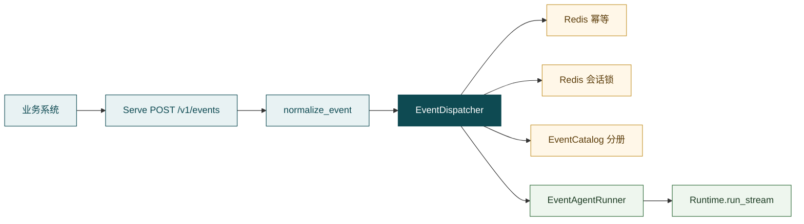
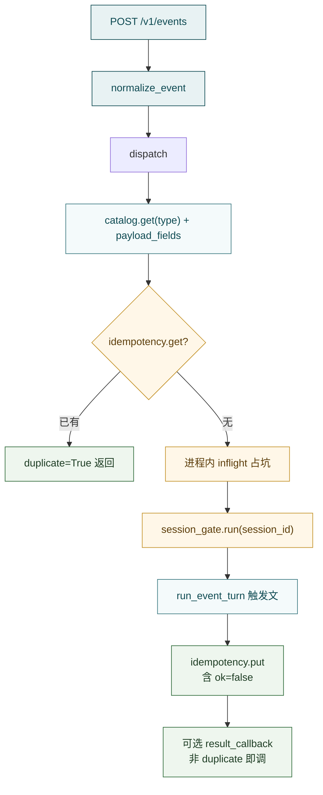

# Events

**Events**（`src/events/`）把业务系统的 Webhook 通知变成**一轮合法的 Agent 触发**：规范化 → Redis 幂等 → 同会话串行 → 注入事件分册 → 复用 Runtime / Agent。它不是第二套执行引擎，也不是消息队列。

一句话：

> **Webhook → `event_id` 幂等 → `session_id` 串行 → `skills/events` 规程 → Agent 一轮（`wait_profile=no_wait`）。**



HTTP 与密钥校验在 [Hubloom Serve](hubloom-serve.md)；本包不绑 FastAPI，可嵌进自有后端直接 `dispatch`。

---

## Events 是什么（为何需要）

对话入口的起点是**人**发一句。业务现场还有另一类需求：事情已在系统里发生（柜登记、设备离线、退款发起），人不一定盯着聊天窗。Events 让业务系统也能「开口」——推一条结构化通知，Hubloom 按分册规程**主动跑一轮 Agent**，结论写入对应 `session_id` 会话历史（可选再回调业务方）。

| | 对话入口 | 事件入口 |
| --- | --- | --- |
| 输入 | 用户自然语言 | `type` + `payload` + `event_id` + `session_id` |
| 规程 | 通用 `skills/` + `read_skill` | `skills/events/` 分册（类型真相源） |
| Wait Profile | 常 `interactive` / `turn_based` | 默认 **`no_wait`**（无人值守，避免 ask 挂死） |
| 执行 | Runtime → Agent | **同一套** Runtime → Agent |

两件必须分清的键：

- **`event_id`** — 同一业务事实只真正执行一次（幂等）；重放返回 `duplicate=True`  
- **`session_id`** — 同一对话线串行，防历史/工具交错；**不同会话可并行**

---

## 边界

**管：**

- `HubloomEvent` / `normalize_event`
- 从 `skills/events/*.md` 建 `EventCatalog`（`events.catalog` 可覆盖/追加）
- Redis 幂等（`event_id`）与会话串行（`session_id`）
- 拼触发文、调用 `EventAgentRunner.run_event_turn`
- 可选 `result_callback` HTTP POST
- 进程内同 `event_id` inflight 等待（补强热路径并发）

**不管：**

- `POST /v1/events`、`X-Event-Secret`、`events.enable` 开关 → [Hubloom Serve](hubloom-serve.md)（`app.py` / `assembly.py`）
- Think / Gate / Wait Profile 编排细节 → [Agent](agent.md)
- 业务 HTTP / OpenAPI → [MCP Adapter](mcp-adapter.md) · [Tools](tools.md)
- 通用 Skill 名片 / `read_skill` → [Skill](skill.md)（事件分册是另一套约定）
- MQ 削峰、定时入站、打开会话实时推屏 → 未做（MVP 边界）

---

## 现状（必读）：Serve 挂载

| 事实 | 含义 |
| --- | --- |
| `events.enable: true` | `build_event_dispatcher(runtime)` 装配；否则路由 503 |
| 产品 Redis | 用配置 **`redis.url`**（与会话锁同源）；`enable=true` 且无 Redis 时**装配报错** |
| HTTP | Serve：`POST /v1/events`、`GET /v1/events/types` |
| 密钥 | 配置了 `events.shared_secret` 时校验 `X-Event-Secret`；未配置则跳过 |
| Bearer | 事件体可选 `bearer_token`；**无配置级 Token 回退**（见 `env.example.yaml`） |
| Wait Profile | Dispatcher / `StreamHostAgentRunner` 默认 `no_wait` |
| 同步语义 | 尽量跑完再返回（含 `duplicate` / `summary` / `ok` / `error`）；高峰会堵在 Agent 耗时上 |
| 推屏 | 用户正开着对话页时，**不会**像 chat SSE 那样实时推事件结果 |
| 幂等写入 | Agent **成功或失败都会** `idempotency.put`；同一 `event_id` 之后只返回 `duplicate`，不会自动重跑 |

装配（`server/assembly.py`）：

```python
dispatcher = EventDispatcher(
    catalog=catalog,
    idempotency=create_idempotency_store(redis_url=..., redis=client),
    session_gate=create_session_gate(redis_url=..., redis=client),
    result_callback_url=cfg.events_result_callback_url,
    wait_profile="no_wait",
)
dispatcher.bind_agent(StreamHostAgentRunner(runtime, wait_profile="no_wait"))
```

Serve 在 `dispatch` 外还会 `session_lock.hold(session_id)`（Runtime 会话锁）；Dispatcher 内部另有 Redis 事件会话门闩——两层都是保护同会话，键空间不同。

---

## 主调用链



并发语义：

| 情况 | 行为 |
| --- | --- |
| 同 `event_id` 已 put（含上次失败） | 不跑 Agent，`duplicate=True`，带回当时的 `ok` / `summary` / `error` |
| 同 `session_id`、不同 `event_id` | Redis 事件锁排队串行（默认等锁 TTL / 等待约 600s） |
| 不同 `session_id` | 可并行 |
| 同 `event_id` 并发未 put | 进程内 inflight 等待首个；跨实例靠 Redis 幂等最终收敛 |

Redis 键：

| 能力 | 键 | 备注 |
| --- | --- | --- |
| 幂等 | `hubloom:event:idem:{event_id}` | 默认 TTL **7 天** |
| 会话锁 | `hubloom:event:lock:session:{session_id}` | SET NX + TTL |

契约字段（`normalize_event`）：必填 `event_id` / `type` / `session_id`；`payload` 默认 `{}`；可选 `occurred_at` / `bearer_token` / `instruction`（有 `instruction` 时**覆盖**分册正文作为规程段）。

---

## 事件类型与分册

真相源：`skills/events/` 下带 frontmatter 的 md（跳过 `SKILL.md` / `README.md`）：

```yaml
---
event: locker.created
title: 钥匙柜已登记
description: ...
payload_fields:
  - deviceId
hint_tags:
  - VehicleKeySmartLocker
---
# 规程正文（步骤 / 禁止 / 完成标准）
```

`EventCatalog.load(events_dir=..., config_catalog=...)`：先扫分册，再被 `events.catalog` 同名 **merge 覆盖字段** / 追加纯 YAML 类型（YAML 条目最终仍须有 playbook 正文）。  
`GET /v1/events/types` 列出当前 `type`。新增类型：加一份 md → 重启进程（不必改 Dispatcher）。

触发文由 `render_event_trigger` 拼成一轮 USER 消息：事件元信息 + payload + **已注入的分册规程**（避免模型未 `read_skill` 就空转总结）；并可提示 `read_skill(skill='events')`。`trigger_source="event"` 写入会话。

---

## 关键入口与目录

```text
src/events/
  models.py          # HubloomEvent / normalize_event
  catalog.py         # EventCatalog / render_event_trigger
  idempotency.py     # Redis 幂等
  session_gate.py    # Redis 会话串行
  agent_runner.py    # EventAgentRunner / StreamHostAgentRunner
  dispatcher.py      # EventDispatcher.dispatch
  callback.py        # 可选结果回调
skills/events/*.md   # 类型真相源
src/server/assembly.py   # build_event_dispatcher
src/server/app.py        # POST /v1/events · GET /v1/events/types
```

| 角色 | 路径 |
| --- | --- |
| 调度主路径 | `dispatcher.py` |
| 契约 | `models.py` |
| 分册 | `catalog.py` · `skills/events/` |
| 解耦 Agent | `agent_runner.py`（`bind_agent` 优先；`bind_runtime` 兼容） |
| Serve 装配 / HTTP | `server/assembly.py` · `app.py` |

---

## 设计取舍

| 若做成… | 我们选择… | 主要理由 |
| --- | --- | --- |
| 事件专用执行引擎 | 复用 Agent 一轮 | 能力与对话一致 |
| 规程写在代码里 | `skills/events` 分册 | 加类型少改代码 |
| 按 session 幂等 / 全局串行 | `event_id` 幂等 + `session_id` 串行 | 语义对齐真实约束 |
| 进程内字典做正式幂等 | 仅 Redis | 多实例正确 |
| Dispatcher 直接 import Runtime | `EventAgentRunner` Protocol | 解耦、可测、可替换 |
| 模块内置 HTTP + MQ + 推屏 | 模块只调度；HTTP 在 Serve | 边界清晰 |

---

## 动手（压缩）

需本机 Redis。脚本用 **FakeAgent**，只验调度（幂等 / 串行），不调 LLM。

```bash
docker run -d --name redis -p 6379:6379 redis:7

HUBLOOM_EVENTS_REDIS_URL=redis://localhost:6379/0 \
  PYTHONPATH=src .venv/bin/python tests/test_events.py
```

关注：重放同 `event_id` → Agent 只调一次；并发同 session → 调用顺序串行。  
端到端：`events.enable=true` + 配好 `redis.url` 后，对 Serve 打 `POST /v1/events`。

---

## 和上下游

| 模块 | 关系 |
| --- | --- |
| [Hubloom Serve](hubloom-serve.md) | HTTP、密钥、`build_event_dispatcher`、外层 `session_lock` |
| [Runtime](runtime.md) / [Agent](agent.md) | `StreamHostAgentRunner` → `run_stream`；事件只是另一种 trigger |
| [Memory](memory.md) | 结论落在事件的 `session_id` 历史（`trigger_source=event`） |
| [Skill](skill.md) | 分册在 `skills/events/`；与通用 `SKILL.md` 名片路径不同 |
| [Tools](tools.md) / [MCP](mcp-adapter.md) | 分册规程仍靠 `list_api` / `call_api` 办事 |

---

## 常见误解

- **Events = 第二套 Agent** — 只是入口适配；办事仍走 Runtime  
- **HTTP 在示例前端里** — 路由在 Serve；前端只是可能展示带「事件」标记的历史  
- **用 `session_id` 做幂等** — 幂等键是 `event_id`；同会话可先后处理多件不同的事  
- **上次失败了再推同 `event_id` 会重跑** — 失败结果也会 put；要重跑须换新 `event_id` 或清幂等键  
- **开了 enable 就不用 Redis** — 幂等与串行仅 Redis；`enable=true` 必须能连上 `redis.url`  
- **事件会实时推到打开的聊天 SSE** — MVP 不推屏；刷新历史可见  
- **配置里有业务 Token 回退** — 当前须事件体自带 `bearer_token`  
- **result_callback 只在成功时发** — 非 `duplicate` 就会 POST（含 `ok=false`）  

---

## 延伸阅读

- 配置：[配置项](../reference/configuration.md) · `config/env.example.yaml` 的 `events:`
- 测试：[`tests/test_events.py`](../../tests/test_events.py) · [测试计划](../community/testing.md)
- Serve：[Hubloom Serve](hubloom-serve.md)
- 规程写法：[编写 Skill](../usage/write-skill.md)
- 编排：[Agent](agent.md)（Wait Profile / `no_wait`）
- 回 [模块导读](README.md)
