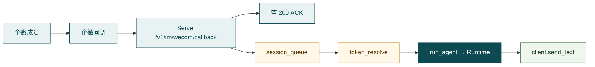
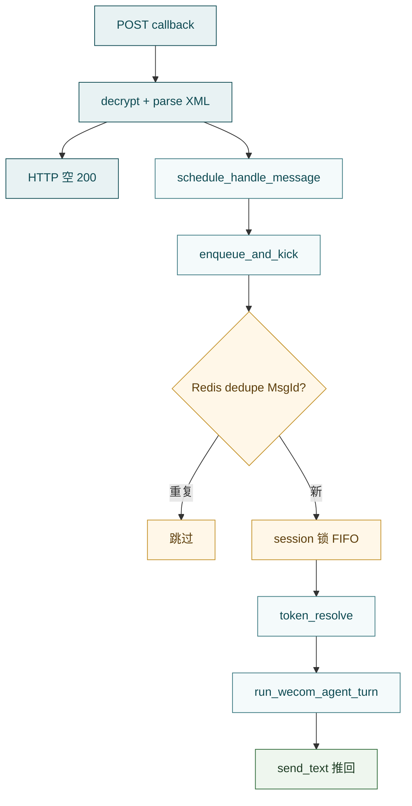

# 企业微信（IM）

**企业微信入口**（`src/im/wecom/` + `src/im/session_queue/`）让成员在企微自建应用里跟**同一套 Agent**对话：加密回调 → 尽快 ACK → 按 session 入队串行 → UserId 换业务 Bearer → `run_stream` → 应用消息推回手机。它是通道适配，不是第二套编排引擎。

一句话：

> **回调验签解密 → 空 200 ACK → Redis 按 session 串行 → 换票 → Agent（默认 `turn_based`）→ `send_text` 推送。**



HTTP 在 [Hubloom Serve](hubloom-serve.md)；`src/im/` 不绑 FastAPI，可嵌进自有后端。

---

## 企业微信是什么（为何需要）

网页对话要人打开浏览器；运维、客服、一线同事更常在**企微里发一句**。企微入口换的是**门**，不是大脑：后面仍走 Runtime / Agent / MCP / Memory，和网页对话共用同一套编排与工具权限模型。

和另外两条入口对照：

| | 网页对话 | 企微 IM | Events |
| --- | --- | --- | --- |
| 谁开口 | 浏览器用户 | 企微成员文字 | 业务系统结构化事件 |
| 入站 | `POST /v1/chat`（可 SSE） | 加密回调 XML | `POST /v1/events` |
| 出站 | 同响应 / SSE | 应用消息 `send_text` | HTTP 响应 + 可选 callback |
| Wait Profile | 常 `interactive` | 默认 **`turn_based`** | **`no_wait`** |
| 会话键 | 请求带来的 `session_id` | `{prefix}:{UserId}`（默认 `wecom:`） | 事件体 `session_id` |

必须先钉死的约束：

1. **回调要快 ACK** — 企微要求数秒内应答；Agent 往往更慢 → 先空 200，再异步处理并主动推送。  
2. **MsgId 去重** — 回调可能重试；队列用 Redis `dedupe`，无队列时用进程内 `MsgIdDeduper`。  
3. **换票** — 企微 UserId ≠ 业务 Bearer；经可配置的 `token_resolve` HTTP 换票后再调 MCP。  
4. **同用户串行** — Serve 正式路径注入 Redis `session_queue`，按 session FIFO 一条一条跑。

---

## 边界

**管：**

- 回调验签 / 加解密 / 明文 XML 解析（`crypto`）
- 应用 `gettoken` + 成员消息推送（`client`；主路径用 **`send_text`**）
- `WeComChatAdapter`：ACK 后调度、非文字提示、换票、调 `run_agent`、截断推送
- `im/session_queue`：按 session 入队、持锁消费、MsgId 幂等
- UserId → Bearer（`token_resolve`）

**不管：**

- `GET|POST /v1/im/wecom/callback` 路由与 lifespan 装配 → [Hubloom Serve](hubloom-serve.md)（`app.py` / `assembly.py`）
- Decide / Gate / Wait Profile 细节 → [Agent](agent.md)
- 业务 API → [MCP Adapter](mcp-adapter.md) · [Tools](tools.md)
- 事件 Webhook → [Events](events.md)
- 企微长期固定域名、卡片/表单交互产品化 → 部署与进阶（开通只交代联调所需）

---

## 现状（必读）：Serve 已挂 Redis 队列

| 事实 | 含义 |
| --- | --- |
| `im.wecom.enable: true` | `build_wecom_adapter(runtime)`；否则回调 503 |
| 必备配置 | `corp_id` / `corp_secret` / `agent_id` / `token` / `encoding_aes_key`；另需 **`redis.url`** |
| 队列 | Serve 装配时**总会** `create_session_queue` 并注入 Adapter（`session_queue=queue`） |
| 无队列时 | 仅当自行构造 Adapter 且不传 `session_queue` → 进程内 `create_task` + `MsgIdDeduper`（联调脚本可能如此） |
| Wait Profile | `run_wecom_agent_turn` 默认 **`turn_based`**；注入企微专用 `system_extra`（要求短纯文本、勿 Markdown） |
| 推送 | Adapter 只调 **`send_text`**（`send_markdown` 在 client 里保留，主路径不用） |
| 截断 | `max_reply_chars` 默认 650（配置可覆盖，装配时夹在约 200–2000） |
| 换票 | 配了 `token_resolve.url` 用 `BusinessTokenResolver`；未配则 resolver 返回空串（Agent 可能无业务鉴权） |
| `trigger_source` | `"user"`（与网页对话同属用户触发，不是 `event`） |

装配要点（`server/assembly.py`）：

```python
queue = create_session_queue(redis_url=..., redis=client)
adapter = WeComChatAdapter(
    crypto=...,
    client=...,
    token_resolver=...,          # 或空实现
    run_agent=_run_agent,        # → run_wecom_agent_turn(..., wait_profile=turn_based)
    config=WeComAdapterConfig(session_prefix=..., max_reply_chars=...),
    session_queue=queue,
)
```

Serve：`handle_callback_sync_ack` → 立即空响应 → `schedule_handle_message`（有队列则入队）。

---

## 开通（配置与后台）

目标：企微后台能把回调打到 Serve，Hubloom 能换票、跑 Agent、再 `send_text` 推回成员。建议按「后台 → 配置 → 出站可达 → 联调顺序」走，避免一上来就开全链路。

### 1. 企微管理后台

1. **自建应用** — 企业微信管理后台 → 应用管理 → 自建 → 创建应用。  
2. **记下三元组** — 企业 ID（`corp_id`）、应用 Secret（`corp_secret`）、AgentId（`agent_id`）。这三项负责 **`gettoken` + 应用消息推送**。  
3. **接收消息** — 在该应用里开启「接收消息」：  
   - **URL**：正式路径是  
     `https://<你的公网主机>/v1/im/wecom/callback`  
     （与 Serve / echo 脚本路径一致；本地无公网时用临时 HTTPS 隧道，见下。）  
   - **Token** / **EncodingAESKey**：自行设定或随机生成，**原样写入** `im.wecom.token` / `encoding_aes_key`（AESKey 一般为 43 字符）。  
4. **保存时会走 URL 验证** — 企微发 **GET**（`msg_signature` / `timestamp` / `nonce` / `echostr`）；Serve 解密后回明文 `echostr`。验证失败时检查：隧道是否指到正确端口、路径是否含 `/v1/im/wecom/callback`、Token/AESKey/`corp_id` 是否与配置一字不差。  
5. **可见范围** — 把联调账号放进应用可见范围，否则成员侧看不到应用、也发不进回调。

### 2. Hubloom 配置（`config/env.yaml`）

对照 `config/env.example.yaml` 的 `im.wecom`：

| 项 | 作用 |
| --- | --- |
| `enable: true` | 才装配 Adapter；否则回调 503 |
| `corp_id` / `corp_secret` / `agent_id` | 推送与 gettoken |
| `token` / `encoding_aes_key` | 回调验签加解密（**不是**业务 Bearer） |
| `redis.url` | Serve 正式路径**必填**（会话队列） |
| `session_prefix` | 默认 `wecom` → session 为 `wecom:{UserId}` |
| `max_reply_chars` | 默认 650；宜短 |
| `token_resolve.*` | UserId → 业务 Bearer（强烈建议配，见下节） |

注意：

- `token` / `encoding_aes_key` 是**企微回调协议**用的，和业务登录 Token、MCP Bearer 不是一回事。  
- `token_resolve.url` 填的是**业务换票 HTTP**，不要填回调 URL。  
- 联调脚本 [`tests/test_im_wecom.py`](../../tests/test_im_wecom.py) 会要求 `enable: true` 且上述五项凭证齐全（即使 `send` 模式理论上只需三元组，脚本仍统一校验）。

### 3. 公网回调 vs 企业可信 IP（两件不同的事）

| | 解决什么 | 常见做法 |
| --- | --- | --- |
| **入站（回调）** | 企微服务器要 HTTPS 打到你的机器 | 本地：`cloudflared tunnel --url http://127.0.0.1:<端口>`，把后台 URL 设为隧道给出的 `https://….trycloudflare.com/v1/im/wecom/callback`；线上：正式域名 + TLS |
| **出站（主动推送）** | 你的进程调企微 `message/send` 时，源 IP 须在企业「可信 IP」白名单 | 把**本机/出口公网 IP**配进企微后台；隧道**不能**代替出站白名单 |

本地常见组合：隧道只保证「收得到回调」；`send` / 回推失败且报 IP 相关错误时，去查可信 IP，而不是再换一条隧道。

### 4. 换票要不要先配

- **只验加解密 / 回声**：`send` / `echo` 不经 Agent，可不配 `token_resolve`。  
- **要跑真 Agent 且调需鉴权的 MCP**：必须配 `token_resolve`（或接受 Bearer 为空、工具侧无权限）。  
- 未绑定企微账号时，业务接口常返回 404 等；可用 `unbound_http_statuses` / `unbound_codes` 转成对人可读的提示（见下节「换票」）。

### 5. 建议联调顺序

1. **`send`** — 本机 → 企微一条文字（验 Secret、AgentId、可信 IP）。  
2. **`echo`** — 企微 → 本机解密 → 固定文案回推（验 Token/AES、HTTPS URL、入站出站管道；**不**跑 Agent）。  
3. **`queue`**（可选）— 只验 Redis 串行与 MsgId 幂等。  
4. **Serve 端到端** — `im.wecom.enable=true` + `redis.url` +（建议）`token_resolve`，后台 URL 指到 Serve 的同一回调路径；在企微发一句，应收到 Agent 短回复。

命令细节见文末「动手」。

---

## 主调用链



文字路径细节：

1. 非 `text` → 直接推「暂只支持文字消息…」，不入队 / 不跑 Agent  
2. 空内容 → 推「请发送非空文字消息」  
3. 换票抛 `TokenResolveError` → 把错误文案推给用户（含未绑定账号等）  
4. Agent 失败 → 推「处理失败：…」  
5. 等人（`awaiting_user` 等）→ 正文后附提示：可到网页打开该 `session_id` 继续，或在企微再回  

会话键：`session_id_for(userid)` → `{session_prefix}:{UserId}`（默认 `wecom:ZhangSan`）。与网页是否同一条线，取决于产品是否共用该键。

---

## Redis 会话队列

正式 Serve 路径已注入。键前缀默认 `hubloom:im:`：

| 键 | 作用 |
| --- | --- |
| `q:{session_id}` | 待处理 List |
| `processing:{session_id}` | 在途（防崩溃丢任务） |
| `lock:{session_id}` | 消费者锁 |
| `dedupe:{key}` | MsgId 等幂等（默认 TTL **24h**） |
| `active:{session_id}` | 当前 Job（供后期打断） |
| `cancel:{session_id}` | 取消标记（API 已暴露；主路径暂不自动打断） |

行为：同 session **一条一条**消费；Handler 现为 `len(jobs)==1`，预留合并。`dedupe_key` 一般是企微 `MsgId`。

---

## 换票（token_resolve）

配置块 `im.wecom.token_resolve`（见 `env.example.yaml`）：

- `url` / `method` / `body_template`（可用 `{wecom_userid}`）  
- `token_path`（默认 `accessToken`）  
- 可选 `headers` / `service_token`  
- `unbound_http_statuses`（默认含 404）等 → 转成对人说的未绑定提示  

未配置 `url` 时 Serve 仍能装配 Adapter，但 Bearer 为空——调需鉴权的 MCP 会失败或行为受限。

---

## 关键入口与目录

```text
src/im/
  session_queue/     # Redis 队列 / Worker / Job
  wecom/
    crypto.py        # 验签、加解密、parse_message_xml
    client.py        # gettoken、send_text / send_markdown
    adapter.py       # WeComChatAdapter
    token_resolve.py # BusinessTokenResolver
src/server/assembly.py   # build_wecom_adapter / run_wecom_agent_turn
src/server/app.py        # GET|POST /v1/im/wecom/callback
```

| 角色 | 路径 |
| --- | --- |
| 适配器主路径 | `wecom/adapter.py` |
| 队列 | `session_queue/` |
| Serve 装配 / HTTP | `server/assembly.py` · `app.py` |

---

## 设计取舍

| 若做成… | 我们选择… | 主要理由 |
| --- | --- | --- |
| IM 内另写对话引擎 | 注入 `run_agent` → Runtime | 与网页能力一致 |
| 等 Agent 完再回 HTTP | 先 ACK 再异步推送 | 满足企微回调时限 |
| 仅进程内去重/排队 | Serve 正式路径用 Redis 队列 | 多实例、同用户串行 |
| 默认推 markdown 卡片 | 主路径 `send_text` + 短截断 | 企微宜短、少踩格式坑 |
| UserId 当业务 Token | 可配置 HTTP 换票 | 权限仍在业务系统 |

---

## 动手（压缩）

脚本 [`tests/test_im_wecom.py`](../../tests/test_im_wecom.py)。读 `config/env.yaml` 的 `im.wecom.*`（或 `HUBLOOM_CONFIG`）。开通步骤与后台说明见上文「开通」。

**send**（本机 → 企微，不经 Agent）：

```bash
PYTHONPATH=src .venv/bin/python tests/test_im_wecom.py send \
  --to 你的UserId --text "联调：你好"
```

**echo**（企微 → 本机解密 → 固定文案回推，不经 Agent）— 回调须 **HTTPS**；本地示例：

```bash
# 终端 A：脚本监听
PYTHONPATH=src .venv/bin/python tests/test_im_wecom.py echo --port 8765

# 终端 B：临时隧道（把后台 URL 指到给出的 https://…/v1/im/wecom/callback）
cloudflared tunnel --url http://127.0.0.1:8765
```

**queue**（只验 Redis 串行 / MsgId 幂等，不连企微）：

```bash
HUBLOOM_IM_REDIS_URL=redis://localhost:6379/0 \
  PYTHONPATH=src .venv/bin/python tests/test_im_wecom.py queue
```

（亦兼容环境变量 `HUBLOOM_EVENTS_REDIS_URL`。）

端到端：Serve 开启 `im.wecom` + `redis.url` +（建议）`token_resolve`，企微「接收消息」URL 指到同一回调路径。

---

## 和上下游

| 模块 | 关系 |
| --- | --- |
| [Hubloom Serve](hubloom-serve.md) | 回调路由、`build_wecom_adapter`、空 200 ACK |
| [Runtime](runtime.md) / [Agent](agent.md) | `run_wecom_agent_turn` → `run_stream`（`turn_based` + 企微 system_extra） |
| [Memory](memory.md) | 历史落在 `wecom:{UserId}`（或自定义前缀） |
| [Events](events.md) | 同属入口；Events 无人值守 `no_wait`，企微是人对人 `turn_based` |
| [MCP](mcp-adapter.md) | 换到的 Bearer 经 request context 调业务 API |

---

## 常见误解

- **企微入口 = 另一套 Agent** — 只是通道；办事仍走 Runtime  
- **HTTP 在示例前端里 / 队列未装配** — 正式路径在 **Serve**，且 **已注入** Redis 队列  
- **等模型说完再回企微回调** — 必须先 ACK；结果靠主动 `send_text`  
- **主路径推 markdown** — Adapter 当前只 `send_text`  
- **未配 token_resolve 也能带业务权限** — 未配时 Bearer 为空  
- **Events 与企微同一 Wait Profile** — Events 默认 `no_wait`；企微默认 `turn_based`  
- **cloudflared 解决可信 IP** — 只解决回调打进来；本机出站 `message/send` 仍看公网 IP 白名单  
- **回调 Token = 业务 Bearer** — 前者验签解密；后者来自 `token_resolve`  

---

## 延伸阅读

- 配置：`config/env.example.yaml` 的 `im.wecom` · [配置项](../reference/configuration.md)
- 测试：[`tests/test_im_wecom.py`](../../tests/test_im_wecom.py) · [测试计划](../community/testing.md)
- Serve：[Hubloom Serve](hubloom-serve.md)
- 对照入口：[Events](events.md)
- 编排：[Agent](agent.md)（Wait Profile）
- 回 [模块导读](README.md)
