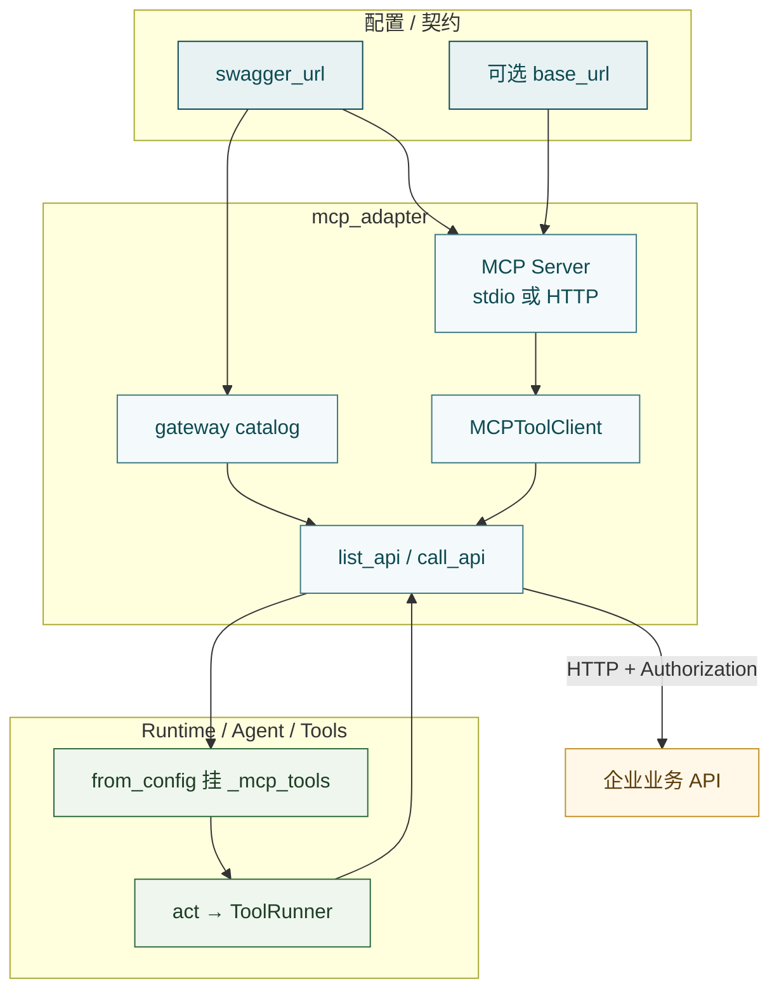

# MCP Adapter

**MCP Adapter**（`src/mcp_adapter/`）是 Hubloom 的**业务能力插头**：把 OpenAPI / Swagger（或线上已有 MCP）变成可调用工具，再经 Agent 的 `list_api` / `call_api` 打到真实 HTTP。

一句话：

> **契约进 → MCP Server（stdio 或 HTTP）→ `MCPToolClient` → 元工具 / 多路注册表 → 下游业务 API。**

```text
swagger_url（企业主路）
  → load_agent_mcp_bindings
    → catalog + stdio 全量 MCP + list_api/call_api
Runtime 挂上 _mcp_tools；Decide 选 act 后 ToolRunner 执行
  → call_api 透传用户 Token → 下游 Authorization
```

协议本身解决的是：模型要用统一方式**发现 / 调用**外部能力，而不绑死某一家私有 function calling。概念速览见 [MCP 协议](../core-concepts/mcp-protocol.md)；按配置接入见 [接入 Swagger](../usage/import-swagger.md)。

在 Hubloom 里它最对口的场景是：**已有（或将有）REST + OpenAPI**。不必把业务搬进内核，也不必为每个接口手写 `BaseTool`——契约生成工具，鉴权仍用原来的 Bearer / JWT；Hubloom 负责编排与「怎么发现、怎么调用」。对话 / 企微 / Events 换的是入口，办事往往还是同一批 API。

和 [Tools](tools.md) 的分工：Tools 管契约 / 注册 / Runner；本包管**工具从哪来、怎么连 Server、鉴权如何透传**。模型调用的仍是 `list_api` / `call_api` 这两个 Tool，背后转发到本包的客户端。

---

## 边界

**管：**

- 拉 / 规范化 OpenAPI，建 tag → 工具名的 **catalog**
- 起 MCP Server（stdio worker 或 HTTP），或连接远端 MCP URL
- `MCPToolClient`：`list_tools` / `execute_tool` / `close`
- 鉴权：用户 Token → MCP `_meta` → 下游 `Authorization`
- 装配入口：`load_agent_mcp_bindings`、`connect_*`、多路 `MultiMcpRegistry`

**不管：**

- 何时 `list_api` / `call_api`、Wait Profile → [Agent](agent.md)
- `ToolRegistry` / `ToolRunner`、元工具类实现 → [Tools](tools.md)（`builtin/api_tools.py`）
- 进程级何时 `enable`、写 request context、`aclose` → [Runtime](runtime.md)
- Skill 规程文案 → [Skill](skill.md)

---

## 主链路



**Runtime 已接上的主路径**（`mcp.enable=true`）：

1. 校验 `swagger_url`
2. `load_agent_mcp_bindings` → `GatewayCatalog` + stdio 全量 worker + `build_api_tools`
3. system 注入 API 分组名片；`_mcp_tools` 进每轮 Runner
4. 进程退出 `aclose` 关掉 MCP client，避免子进程泄漏

**Adapter 已具备、Runtime 主路径尚未挂上的：**

- 独立 HTTP MCP（`connect_http_mcp` / `worker --http`）
- 配置里的 `remotes` / 多路 `MultiMcpRegistry`（联调脚本可用；挂进 Agent 工具面是后续装配）

换业务域时，优先换 `swagger_url`、下游 Base、会话 Token，而不是重写 Runtime。

---

## 元工具怎么调（联调直觉）

Agent 面前只有两个 API 相关名字（实现见 [Tools](tools.md) 的 `api_tools.py`）：

**`list_api`** — 按分组看有哪些业务工具及 schema（只发现，不办事）：

```json
{ "tag": "pet" }
```

返回该 tag 下工具名与 parameters 的 JSON 文本。

**`call_api`** — 真正调用（创建 / 查询 / 更新 / 删除都走这里）：

```json
{
  "tag": "pet",
  "tool_name": "addPet",
  "arguments": { "name": "小花", "status": "available" }
}
```

`tag` 来自 system 里的「API 分组」名片；`tool_name` 一般来自上一次 `list_api`；无参接口可省略 `arguments`。

---

## 何时用 stdio，何时用 HTTP

- **stdio（Runtime 默认）** — 本地开发、单机联调：`load_agent_mcp_bindings` / `connect_full_mcp` 拉起 `worker --full` 子进程，无需另起容器。简单，但单管道难扛多会话高并发。
- **HTTP** — 要独立扩容、多客户端共用同一 MCP、或与 Runtime 进程解耦时：先 `worker --http`（或容器）监听，再用 `connect_http_mcp` 连上。元工具代码不变，换的是 Client 连接方式。

配置层也可写 `mcp.transport` / `url`；**当前 HubloomRuntime 主路径仍是 stdio + 单一 swagger**。先用 HTTP 联调不必改 Agent，见下一节脚本。

---

## 不经 Agent 先列工具

契约或 MCP 通不通，不必先起整站聊天。仓库根目录：

```bash
# 本地 stdio（读 config/env.yaml 的 swagger_url）
PYTHONPATH=src .venv/bin/python tests/test_mcp_list_tools.py --stdio

# 连已启动的 HTTP MCP（可先跑 test_mcp_serve_swagger.py 起服务）
PYTHONPATH=src .venv/bin/python tests/test_mcp_list_tools.py --url http://127.0.0.1:8001/mcp

# 多路示例：stdio 企业 API + 一个 HTTP
PYTHONPATH=src .venv/bin/python tests/test_mcp_list_tools.py --multi --url http://127.0.0.1:8001/mcp
```

能列出工具后，再查 Token 透传与 `call_api`；排障顺序建议：**契约 → list_tools → 带票 call → 再进 Runtime/Agent**。

---

## 为什么建成这样

**契约驱动，而不是手写每个 Tool**  
接口往往几十上百个；为每个 operation 写子类会和 Swagger 漂移。选择 OpenAPI 进、工具出：`spec` 拉规范，`server` 用 FastMCP.from_openapi 生成全量工具，`gateway/catalog` 抽 tag 分组给 prompt 与 `list_api`。

**模型面前两个元工具，背后仍是全量 MCP**  
全量 tools 塞进 Decide 会爆上下文；按 tag 起很多 MCP 子进程又难运维。折中：背后一个全量 Server；模型只见 `list_api(tag)` / `call_api(...)`；prompt 里挂「API 分组」目录——先选域，再发现，再调用。

**传输双模式**  
见上文「何时用 stdio，何时用 HTTP」。对外仍是同一 `MCPToolClient` 接口，元工具不必为传输分叉。

**多路 MCP 与企业主路分开**  
线上已有 MCP（搜索等）和「Swagger 转出来的企业 API」语义不同，不宜硬塞进同一套 tag / `call_api`。用 endpoint + `MultiMcpRegistry`，工具名可加 `{id}__` 前缀防撞。配置能解析；**Runtime 尚未把 remotes 挂进工具面**。

**鉴权按请求透传**  
用户 Token 进 request context → `call_api` 放入 MCP `_meta` → Server 中间件取出 → 下游 `Authorization`。不要把用户票写进 yaml 当全局密钥。`auth_scheme` 约定前缀；正式业务鉴权应走会话 Token。

---

## 包与文件地图

```text
src/mcp_adapter/
  discovery.py     # load_agent_mcp_bindings / connect_full_mcp / connect_http_mcp / 多路
  auth.py          # _meta ↔ Authorization；中间件
  spec/            # 拉 Swagger、规范化、过滤
  gateway/         # catalog、分组名片 format_catalog_for_prompt
  server/          # OpenAPI → FastMCP；worker --full / --http
  client/          # MCPToolClient、MultiMcpRegistry、调用结果
  config/          # transport / url / remotes 等模型
```

| 你想了解… | 优先看 |
| --- | --- |
| Runtime 怎么挂上 | `discovery.load_agent_mcp_bindings` |
| 元工具怎么转发 | `tools/builtin/api_tools.py` + `client/session.py` |
| 分组名片 | `gateway/catalog.py` |
| 起 Server | `server/worker.py` · `server/app.py` |
| 鉴权透传 | `auth.py` |
| 不经 Agent 列工具 | `tests/test_mcp_list_tools.py` · `tests/test_mcp_serve_swagger.py` |

---

## 鉴权要点

```text
Host / Serve 注入 bearer_token
  → Runtime set_request_context
  → call_api：resolve_auth_token(get_bearer_token())
  → MCP execute_tool(..., auth_token=..., auth_scheme=...)
  → Server 中间件读 _meta
  → 下游 HTTP Authorization: Bearer|JWT …
```

- 多用户场景：**按请求透传**，勿把用户 Token 写进 `env.yaml`
- 独立 HTTP 部署时，透传语义须与 stdio 对齐，避免「本地能带票、远端丢票」
- Adapter 侧 `resolve_auth_token` **不**自动回退环境里的服务账号；联调若要服务级票，应显式传入

---

## 常见误解

- **MCP Adapter = Tools 包** — Tools 是执行面；本包是「从哪来、怎么连、怎么带票」
- **每个 REST 一个 Python Tool 类** — 主路径是契约 → 全量 MCP + 两元工具
- **配了 `remotes` 就会出现在聊天工具面** — 配置与 Adapter 支持；**Runtime 主路径尚未挂多路**
- **只支持 stdio** — HTTP 模式已有；默认 Runtime 仍走 stdio
- **Token 写在 yaml 最省事** — 多用户会串权；应用 request context
- **Skill 可以代替 MCP 调 API** — Skill 约束怎么调；真正 HTTP 仍走 `call_api`

---

## 延伸阅读

- 概念：[MCP 协议](../core-concepts/mcp-protocol.md)
- 上一篇：[Tools](tools.md)
- 下一篇：[Skill](skill.md)
- 装配：[Runtime](runtime.md)
- 使用：[接入 Swagger](../usage/import-swagger.md)
- 联调脚本：`tests/test_mcp_list_tools.py` · `tests/test_mcp_serve_swagger.py`
- 模块总览：[模块导读](README.md)
