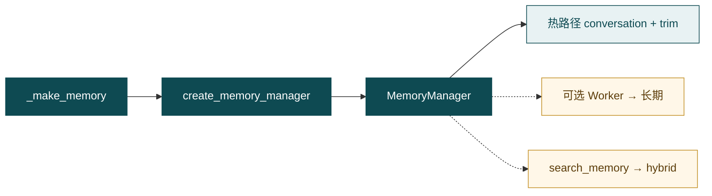
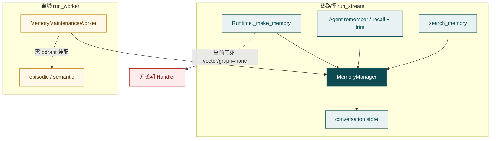
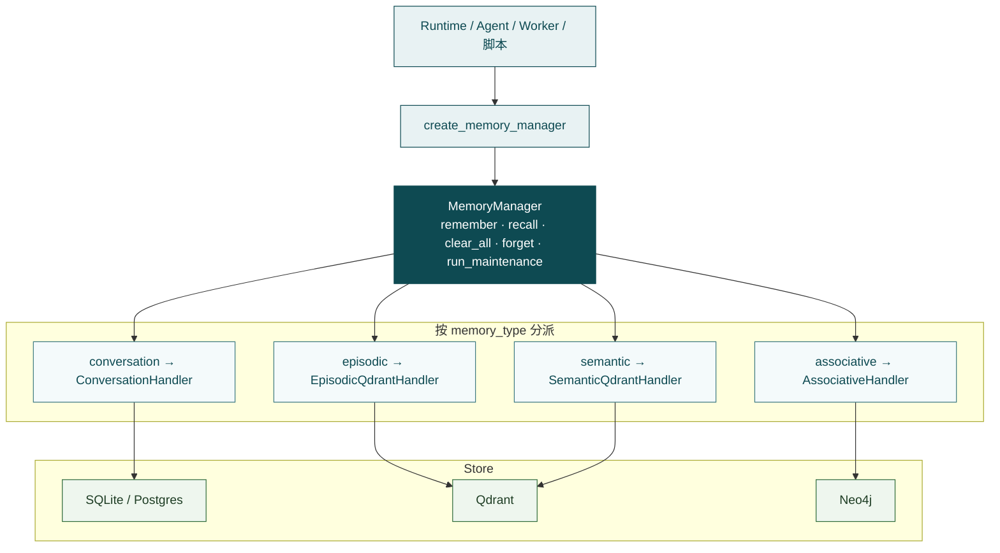
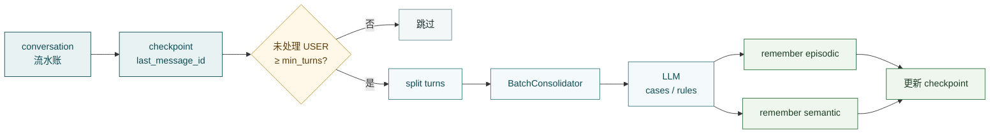
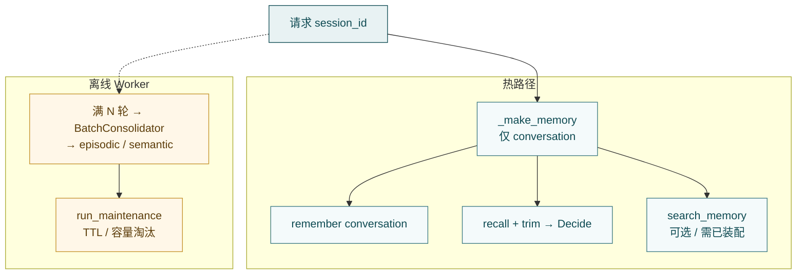

# Memory

**Memory**（`src/memory/`）负责把对话里「要接着用」的信息**存下来、再取出来**：默认是按会话的流水账；长期笔记（向量 / 图）可选，且与会话共用同一隔离键。

一句话：

> **热路径写读 conversation；长期按需装配 + 离线巩固；对话里用 `search_memory` 按 query 搜——不是把全部历史永久塞进每一次提示。**



部署开关见 [会话与记忆](../advanced/memory.md)（进阶大纲，细节随后补）。测试入口见 [测试计划](../community/testing.md)。

---

## Memory 是什么（为何需要）

模型本身不会自动记住多轮上下文，也不会隔天还记得用户偏好。Hubloom 在外面做两层：

| 层 | 像什么 | 怎么读 |
| --- | --- | --- |
| **会话（conversation）** | 这条线刚聊过什么（含 tool 回合） | **按时间**最近 N 条 |
| **长期（episodic / semantic / associative）** | 提炼过的偏好 / 事实 / 关系 | **按 query**（向量或图） |

和邻居别混：

- **Skill** — 办事规矩（规程文件），不是聊天记录  
- **RAG** — 共享产品手册等外部文档，见 [Retrieval](retrieval.md)  
- **Memory** — 「这个 session / namespace 名下记得住什么」

隔离键：会话与（若开启的）长期都挂在同一个 **`session_id` / `namespace`**。换用户换键；不是「新开窗口就共用全站笔记本」，也不是「会话分户、长期全站共享」。

---

## 边界

**管：**

- `MemoryManager` 统一 `remember` / `recall` / `clear_all` / `forget` / `run_maintenance`
- 按 `memory_type` 分派 Handler + Store（会话 SQLite/Postgres；长期 Qdrant / Neo4j）
- 会话历史裁剪助手（`trim_conversation_history`）
- 长期召回适配（`MemoryContextProvider`）与离线 Worker / consolidator
- 与 Tools 配合的 `search_memory` 语义（实现在 `tools/builtin/memory_tool.py`）

**不管：**

- 何时 `remember`、何时拼历史进 Decide → [Agent](agent.md)（`run.py` / `assemble.py`）
- 每请求 `_make_memory`、会话 Store 生命周期 → [Runtime](runtime.md)
- 工具注册与 Runner → [Tools](tools.md)
- 共享文档检索 → [Retrieval](retrieval.md)
- 运维级开关与部署细节 → [会话与记忆](../advanced/memory.md)

---

## 类型与后端

| 类型 | 存什么 | 怎么读 | 后端 |
| --- | --- | --- | --- |
| `conversation` | 完整 `Message`（含 `tool_calls` / tool 结果） | 时间序 `get_recent` | SQLite 或 Postgres（`memory.conversation_store`） |
| `episodic` | 情景笔记 `content` + 向量 | query 相似度 | Qdrant（需 `vector_backend=qdrant`） |
| `semantic` | 偏好 / 事实笔记 + 向量 | query 相似度 | 同上 |
| `associative` | 实体 / 关系 | 图邻域 | Neo4j（需 `graph_backend=neo4j`） |

工厂 [`create_memory_manager`](../../src/memory/factory.py)：

- **conversation 必选**；长期按 backend 可选挂载  
- `vector_backend="none"` / `graph_backend="none"` → **不挂**对应 Handler  
- **显式** `recall` / `remember` 未挂载类型 → 报错；`mode=hybrid` 会**跳过**缺失 Handler，返回空列表（不是空库可搜，是根本没装配）

参数随类型变：会话必须 `message=`；长期 `episodic` / `semantic` 必须 `content=`；`associative` 可用 `content` 和/或关系 metadata。

---

## 在 Hubloom 主路径上干什么

1. **每请求建记忆面** — `HubloomRuntime._make_memory(session_id)` → `create_memory_manager(namespace=session_id, …)`  
2. **热路径写会话** — Agent `_remember` → `remember(memory_type="conversation", message=…)`（用户话、助手、tool 回合）  
3. **热路径读会话** — `assemble.load_conversation` → `recall(conversation)` → `trim_conversation_history`（按估算 token 裁偏旧内容；**不删库**）  
4. **挂检索工具** — `_make_runner` **总会**注册 `SearchMemoryTool(memory)`；能否搜到长期取决于是否挂了 Handler（当前 Runtime 未挂时 hybrid 得空，工具返回「未找到…」）  
5. **离线巩固（可选）** — `python -m memory.run_worker`：读会话 → LLM 提炼 → `remember(episodic/semantic)`；Worker 侧由 `enable_long_term` 决定是否装配长期 backend（见下）



粗链路：Serve → Runtime 按 session 建 Manager → Agent 写读会话；长期进对话靠 `search_memory`（且 Handler 已挂）；巩固不在当次用户请求里做。  
说明：图中热路径与 Worker **不是同一个 Manager 实例**——Worker 会按 namespace **另建** Manager，读写的是同一套会话库 /（若开启）Qdrant。

---

## 现状（必读）：Runtime 只挂会话

[`HubloomRuntime._make_memory`](../../src/runtime.py) **写死**：

```python
create_memory_manager(
    namespace=session_id,
    db_path=self.memory_db_path,
    conversation_store=self.conversation_store,
    vector_backend="none",
    graph_backend="none",
)
```

因此：

| 事实 | 含义 |
| --- | --- |
| 对话主路径默认只有会话历史 | SQLite（默认）或 Postgres，见 `memory.conversation_store` |
| **总会**注册 `search_memory` | 没有长期 Handler 时 hybrid 为空，工具侧表现为搜不到 |
| `memory.enable_long_term` | **主要驱动 Worker**：为 true 时 Worker 装配 `vector_backend=qdrant` **且** `graph_backend=neo4j`（与 `config/env.example.yaml` 注释一致） |
| ≠ Runtime 已连 Qdrant | 联调长期请用演示脚本显式开 qdrant，或跑 Worker，或以后把 Runtime 接到配置 |

会话 Store 在 `from_config` 时创建一次、按请求复用；`namespace` / `session_id` 每请求绑定。

长期检索默认带分数门槛（Qdrant 侧约 **0.55**）：低相关直接丢。「写成了但搜不到」常见原因：没装配 Handler、门槛过滤、query/embedder 不匹配——不一定是没写入。

---

## 关键入口与目录

```text
src/memory/
  factory.py              # create_memory_manager
  manager.py              # MemoryManager 统一入口
  handlers/               # conversation / episodic / semantic / associative
  store/                  # SQLite / Postgres / Qdrant / Neo4j
  context.py              # trim_conversation_history 等
  memory_context.py       # MemoryContextProvider（给 search_memory）
  memory_worker.py        # 离线巩固 + 维护
  run_worker.py           # CLI：python -m memory.run_worker
  consolidator.py / batch_consolidator.py / lifecycle.py
```

| 角色 | 路径 |
| --- | --- |
| 工厂 / Manager | `factory.py` · `manager.py` |
| 会话落库 | `handlers/conversation_handler.py` · `store/conversation_*` |
| 长期向量 | `handlers/*_qdrant_handler.py` · `store/qdrant_memory_store.py` |
| 图 | `handlers/associative_handler.py` · `store/neo4j_store.py` |
| 拼进提示 | `src/agent/assemble.py` + `memory/context.py` |
| 工具 | `src/tools/builtin/memory_tool.py` |
| Runtime 装配 | `src/runtime.py`（`_make_memory` / `_make_runner`） |

会话表核心列（便于读库排障）：`session_id`、`role` / `content`、`tool_calls`、`tool_call_id`、`created_at`。索引按 `(session_id, created_at)` 取最近消息。

---

## 设计：分层与读写

对外只认 **`MemoryManager`**；底下按 `memory_type` 分派 Handler → Store。业务代码一般不直接碰 Store。



**怎么存**

| 类型 | 写入 | 要点 |
| --- | --- | --- |
| conversation | `remember(..., message=Message)` | 整行落库（含 tool 过程）；热路径几乎每轮 |
| episodic / semantic | `remember(..., content=...)` | embed → upsert Qdrant；来自 Worker 提炼或显式脚本 |
| associative | `remember` + 关系 metadata | 可选；图边 / 实体 |

**怎么读（提取进上下文）**

| 类型 | 入口 | 行为 |
| --- | --- | --- |
| conversation | `recall(memory_type="conversation", top_k=N)` | `get_recent` 按 `created_at`；**忽略 query** |
| 进提示前 | `assemble.load_conversation` → `trim_conversation_history` | 按估算 token 裁偏旧；**不删库** |
| 长期单路 | `recall(memory_type="episodic"|"semantic", query=...)` | embed(query) → 向量搜 + 分数门槛 |
| 长期多路（默认） | `recall(query=..., mode="hybrid")` | episodic + semantic 合并去重，截断到 `top_k` |
| 图 | `recall(memory_type="associative", …)` | 结果在 `RecallResult.graph` |
| 对话工具 | `search_memory` → `MemoryContextProvider.recall_for_context` | hybrid + 可选图摘要 |

长期默认门槛约 **0.55**（Qdrant store）；低于门槛直接丢。教学脚本可把门槛降到 `0.0`，生产应保留。

当前 Runtime **不会**每轮自动把长期预取进 system；要用长期，靠模型调 `search_memory`（且 Handler 已挂）。

**两路分工**

| | 热路径（`run_stream`） | 离线（`run_worker`） |
| --- | --- | --- |
| 谁触发 | Runtime → Agent | cron / CLI |
| 主要写 | conversation | **BatchConsolidator** → episodic / semantic（**不写** associative） |
| 主要读 | 时间序会话 + trim | 不服务当次用户请求 |
| 长期进对话 | `search_memory`（需已装配） | — |

| 若做成… | 我们选择… | 主要理由 |
| --- | --- | --- |
| 会话 / 长期两套互不相干 API | 统一 Manager + 按类型 Handler | 调用简单，扩展靠工厂 |
| 会话也做向量检索 | 会话按时间；长期按 query | 读法对齐数据形态 |
| 提示太长就删库 | 组装层 trim，库内保留 | 巩固与追溯还要历史 |
| 长期全站共享 | 与 session 同隔离键 | 防串户 |
| 每轮在线提炼长期 | 热路径会话 + 离线 Worker | 控延迟与费用 |
| 记忆与文档一个库 | Memory / RAG 分库分工具 | 语义与生命周期不同 |

---

## 巩固：从会话提炼长期

对话热路径**不**做 LLM 提炼。长期笔记的主生产路径是离线 **`MemoryMaintenanceWorker`**（`python -m memory.run_worker`）。



要点：

1. **门槛** — `memory.consolidate_min_turns`（配置进 `WorkerConfig.min_turns`，默认 3）。不够轮次直接跳过。  
2. **游标** — `ConsolidationCheckpointStore`：本地 SQLite 表 `memory_consolidation_checkpoint`，路径用 `memory.db_path`（即使会话走 Postgres，checkpoint 仍落这份 SQLite）。只处理游标之后的新消息，避免重复提炼。  
3. **批量提炼** — `MemoryBatchConsolidator`：按 USER 回合切段；**case → episodic**（意图 / 做法 / 教训等）；**semantic_rules → semantic**（跨案例稳定规则，不写一次性事件）。**不写**图关系。  
4. **开关** — `memory.enable_long_term: true` 时，Worker 同时设 `vector_backend=qdrant` 与 `graph_backend=neo4j`（需 `qdrant.*` / `neo4j.*` 可连）。为 false 时二者皆为 `none`，巩固扫描不会写长期。  
5. **另一条 API** — `MemoryConsolidator`（`consolidator.py`）可对单轮 user/assistant 抽 episodic / semantic / **relations**；**主离线路径用的是 BatchConsolidator**，不是每轮对话自动调它。

CLI 常用：`--session <id>` 只跑一户；`--consolidate-only` / `--maintain-only` 拆开巩固与淘汰。

---

## 生命周期：裁剪与淘汰

两层寿命策略不同，不要混：

### 会话（conversation）

- **存储层不做 TTL 狂删**；Handler 的 `run_maintenance` 对会话**故意返回 0**。  
- 过长靠组装层 **`trim_conversation_history`**：裁的是进模型的窗口，库内历史仍在（巩固与审计还要用）。  
- 单条 **`forget` 不支持**；要清空用 `clear_all(memory_type="conversation")`。

### 长期（episodic / semantic）

- Handler 默认挂 **`TTLBasedPolicy(ttl_days=30, max_items=1000)`**（`lifecycle.py`）。  
- 维护入口：`MemoryManager.run_maintenance()` → 仅 **episodic / semantic** Handler → Store 的 `ttl_evict`（按 `last_accessed_at`）+ `capacity_evict`（超额时按 **importance↑、last_accessed↑、created_at↑** 先删更不重要的）。  
- **谁调用**：Worker `run_once(..., maintain=True)`（默认同一次跑完巩固后做淘汰）；也可 `--maintain-only`。热路径对话**不会**每轮跑维护。  
- 单条删除：`forget(item_id, memory_type=...)`（conversation 在 Manager 层会直接报错）；整库：`clear_all`。  
- `importance`（0–100，metadata）在容量淘汰时生效；Batch 写入 case/rule 时会带上重要性。

### 总控制流



旋钮速查：`top_k`（会话组装默认 `history_limit=40`）、会话 token 预算（trim）、`mode=hybrid`、`score_threshold`、`consolidate_min_turns`、`TTLBasedPolicy` 的 `ttl_days` / `max_items`、`importance`（容量淘汰排序）。

---

## 动手（压缩）

仓库根目录。不必起聊天服务。

**会话** — [`tests/test_memory_conversation.py`](../../tests/test_memory_conversation.py)

```bash
PYTHONPATH=src .venv/bin/python tests/test_memory_conversation.py
```

验证：同一 `session_id` 下 `remember` 用户 / 助手 tool_calls / tool 结果后，`recall(conversation)` 能按时间回放（含工具消息）。

**长期** — [`tests/test_memory_longterm.py`](../../tests/test_memory_longterm.py)（需本地 Qdrant；读 `config/env.yaml` 的 qdrant 配置）

```bash
PYTHONPATH=src .venv/bin/python tests/test_memory_longterm.py
```

验证：显式 `vector_backend=qdrant` 写入 episodic/semantic 后，按 `query` + `mode=hybrid` 召回。脚本用假 embedder，会把门槛降到 `0.0`——**仅演示**；生产应保留门槛 + 真实 embedding。

**Worker（可选）**

```bash
PYTHONPATH=src uv run python -m memory.run_worker
# 或 --session <id> / --maintain-only / --consolidate-only
```

`enable_long_term: true` 时 Worker 才装配 Qdrant + Neo4j；与 Runtime 热路径是否挂长期是两件事。巩固靠 checkpoint 增量推进，维护走 `run_maintenance`（见上文「巩固」「生命周期」）。

---

## 和上下游

| 模块 | 关系 |
| --- | --- |
| [Runtime](runtime.md) | `_make_memory` / `_make_runner`；会话 Store 生命周期 |
| [Agent](agent.md) | `_remember`、`load_conversation`、拼 Decide 上下文 |
| [Tools](tools.md) | 注册 `SearchMemoryTool`；执行面不负责后端装配 |
| [Retrieval](retrieval.md) | 共享文档 vs 按 namespace 的聊天/笔记；工具 `search_documents` vs `search_memory` |

---

## 常见误解

- **开了 `enable_long_term` 对话就能搜笔记** — 当前 Runtime 仍 `vector/graph=none`；该开关主要服务 Worker（且会同时要求 Qdrant + Neo4j）  
- **`search_memory` 挂上了 = 有长期库** — 工具总会挂；Handler 未挂则 hybrid 为空  
- **会话能按语义搜** — conversation 的 `query` 当前忽略；主读法是时间序  
- **trim 会清掉 SQLite** — 只裁进提示的窗口，库内历史仍在  
- **每聊一句就自动提炼长期** — 巩固在离线 Worker，且要满 `consolidate_min_turns`；Batch 路径只写向量笔记  
- **会话也会按 30 天 TTL 删** — TTL/容量只打在 episodic / semantic；会话靠 trim  
- **Memory = RAG** — 分库分工具；隔离语义不同  

---

## 延伸阅读

- 进阶（大纲）：[会话与记忆](../advanced/memory.md)
- 配置：[配置项](../reference/configuration.md)
- 测试：[测试计划](../community/testing.md)
- 上一篇：[Skill](skill.md)
- 装配 / 编排：[Runtime](runtime.md) · [Agent](agent.md)
- 文档检索：[Retrieval](retrieval.md)
- 回 [模块导读](README.md)
