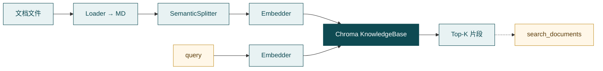
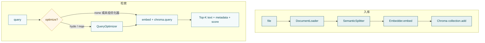

# Retrieval（RAG）

**Retrieval**（`src/retrieval/` + `src/embedders/`）把外部文档切块、向量化进**共享知识库**，再按问题检索相关片段。它不管聊天记录，也不调业务 API。

一句话：

> **文件 → Markdown → 结构切块 → embedding → Chroma；提问再 embed → Top-K 片段 →（目标）`search_documents`。**



---

## Retrieval 是什么（为何需要）

大模型上下文里通常没有你的产品手册、制度条文。不加约束时，模型容易用通用知识瞎猜。RAG 先检索相关文档片段，再让模型结合片段作答。

和邻居的分界：

| | 管什么 | 隔离 |
| --- | --- | --- |
| **会话 Memory** | 这条对话线刚聊过什么 | `session_id` |
| **长期 Memory** | 用户名下提炼笔记 | 同 namespace |
| **Retrieval** | 共享（或项目级）文档库 | 默认**不按** session 分户 |
| **MCP / API** | 业务系统此刻状态与操作 | 按鉴权 / 契约 |

实时状态（「A 区 3 号现在空闲吗」）更适合调 API；手册未必有此刻数据。细节互链见 [Memory](memory.md)。

---

## 边界

**管：**

- 多格式 → Markdown（`DocumentLoader`）
- 结构感知切块（`SemanticSplitter`）
- `KnowledgeBase`：入库 / 检索 / 删除 / 清空（Chroma）
- 可选查询优化（`QueryOptimizer`：HyDE / MQE）
- 启动辅助：`create_knowledge_base` / `ingest_rag_sources` / `is_rag_enabled`
- 工具类 `SearchDocumentsTool`（`search_documents`，实现在 `tools/builtin/retrieval_tool.py`）

**不管：**

- 会话 / 长期记忆 → [Memory](memory.md)
- 何时 `act(search_documents)` → [Agent](agent.md)
- 工具注册与 Runner → [Tools](tools.md)
- 进程级是否挂 KB → [Runtime](runtime.md)（**当前未挂**，见下）

---

## 现状（必读）：Runtime 未挂载

模块与工具类已就绪；**`HubloomRuntime` 主路径零引用** RAG：不建 `KnowledgeBase`，`_make_runner` 也不注册 `search_documents`。

因此：

| 事实 | 含义 |
| --- | --- |
| `rag.enable` / `rag.docs` / `rag.kb_dir` 会进 `HubloomConfig` | 字段已解析；**全仓尚无调用方**消费（`is_rag_enabled` / `ingest_rag_sources` 也未被 Serve/Runtime 调用） |
| 对话 Agent 默认不会搜文档 | 与 Memory 不同：Memory 至少挂会话 + `search_memory`；RAG 工具都未挂 |
| 学管线 | 跑演示脚本即可 |
| 要在线可用 | 需后续：建 KB → 入库 → 注册 `SearchDocumentsTool` → Runtime 挂上 |

`is_rag_enabled(rag_docs_raw, enabled=...)` 逻辑（供未来装配用）：

- `enabled is False` → 关  
- `enabled is True` → 还须 `docs` 非空  
- `enabled is None`（省略）→ 有非空 `docs` 则视为开  

配置示例：

```yaml
rag:
  enable: false
  kb_dir: data/knowledge_db   # 装配时作 persist_dir；KB 类默认目录名是 data/chroma_kb
  docs: ''   # 逗号分隔文件或目录；相对仓库根
```

装配时可用 `llm.*` 的 api_key / base_url 构造 `OpenAIEmbedder`；入库与检索须**同一套**模型与维度。

---

## 设计：入库 / 切块 / 检索

Hubloom RAG **不是**「整篇塞进一个向量再全文关键词搜」，也**不是** jieba 一类分词 + 倒排。主选择是：

1. 统一成 Markdown（方便按标题理解）  
2. 按语义结构切块（标题路径 + Token 上限 + 重叠）  
3. 每块各算一条向量，与正文、元数据写入 Chroma  
4. 提问也变成向量，相似度取 Top-K  

核心类型：`KnowledgeBase`（`add_document` / `search` / `delete_document` / `clear`）。



### 如何存（入库）

`KnowledgeBase.add_document(file_path)` 固定五步：

```text
file
  → ① Loader：Markdown 字符串
  → ② Splitter：若干 { content, metadata }
  → ③ 组装行：id = {doc_id}_{chunk_id}；documents + 合并后的 metadatas
  → ④ Embedder：对 documents 分批 embed（默认 batch=8）
  → ⑤ collection.add(ids, documents, embeddings, metadatas)
```

**① Loader（`DocumentLoader`）**

| 类型 | 策略 |
| --- | --- |
| 代码后缀（`.py` 等） | 读原文，包成 Markdown 代码块 |
| 其它（`.md` / pdf / docx…） | **MarkItDown** 转成 Markdown 正文 |

后面切块只认「带结构的文本」，不为每种二进制格式各写一套切法。

**② 切块** → 见下一小节。

**③–⑤ 写入 Chroma**

文档级 metadata：`doc_id`、`doc_name`（文件名）、`source_type`（后缀）、`indexed_at`。  
块级 metadata 来自 Splitter（`chunk_id` / `section_path` / `heading` / 前后 chunk 指针等）；Chroma 只接受标量，`None` 会滤掉。

批量：`ingest_rag_sources(kb, paths)` 展开目录（跳过 `.git` / `__pycache__` / `node_modules` / `.venv` / `venv`，以及隐藏目录/文件）；**同名 `doc_name` 已在库则跳过**（按文件名，不是内容哈希）。改内容同名需先 `delete_document(doc_id)`（按 **doc_id**，可用 `get_document_list()` 查）再入，或换策略。空切块时仍返回 `doc_id`，但不会写入向量行。

### 如何切（`SemanticSplitter`）

```text
Markdown
  → 解析标题层级（# 优先，其次中文编号）→ sections
  → 每 section：正文按估算 Token 切分
  → 块正文前可加 section_path 前缀（「A > B」）
  → _finalize：合并过短块 → 相邻块句级 overlap → 生成 metadata
```

| 参数 | 默认 | 作用 |
| --- | --- | --- |
| `chunk_token_size` | 384 | 单块上限 |
| `overlap_token_size` | 64 | 从前一块尾部按句裁一段叠到下一块头 |
| `min_chunk_token_size` | 100 | 过短块并入上一块 |

**Token 怎么估（不是分词器）：** 中文约 0.7 / 字，英文单词约 1.3 / 词，数字串约 1——只用来**控块大小**，不参与检索匹配。  
有标题时，有效上限会扣掉 `section_path` 前缀占用的 Token，避免「路径 + 正文」超限。无标题则降级按段落 / 长段再切句。

设计意图：命中片段可读、少碎、边界不那么脆——不是整篇一个向量，也不是无视结构均匀切字。

### 如何读（检索）

```text
kb.search(query, top_k, where?, optimize)
  →（可选）QueryOptimizer：hyde 用假设答案作 query；mqe 多变体各搜一遍再去重排序
  → embed(query 或改写结果)
  → chroma.query → distance
  → score = 1.0 - distance
  → [{ id, text, metadata, score }, ...]
```

要点：

- 默认 `optimize="none"`：直接向量搜；`KnowledgeBase.search` 默认 `top_k=3`，工具 `SearchDocumentsTool` 默认 `top_k=5`  
- `optimize != none` **且** 构造 `KnowledgeBase` 时传入了 `query_optimizer=` 才改写；否则退回直接搜  
- 注意：工厂 **`create_knowledge_base(...)` 目前不接收** `query_optimizer`——要挂优化器须直接 `KnowledgeBase(embedder=..., persist_dir=..., query_optimizer=...)`  
- 可选 `where` 做 Chroma 元数据过滤  
- MQE：多路结果按 `id` 去重，按 `score` 降序截断到 `top_k`  
- 入库与检索必须同一 Embedder / 维度，否则分数无意义  

工具侧：`SearchDocumentsTool` 把命中格式化（含 `section_path` / `doc_name` / score）交给模型。

### 可选：QueryOptimizer

| 策略 | 做什么 | 适合 |
| --- | --- | --- |
| `none` | 原 query 检索 | 默认；控成本 |
| `hyde` | LLM 先写假设答案，再拿答案去搜 | 抽象 / 概括题 |
| `mqe` | 改写多条变体并行搜再合并 | 模糊 / 开放题 |

依赖额外 LLM；挂在 **`KnowledgeBase(..., query_optimizer=QueryOptimizer(llm))`**，不是 `create_knowledge_base` 参数。

### 设计取舍

| 若做成… | 我们选择… | 主要理由 |
| --- | --- | --- |
| 分词倒排做主检索 | 向量相似度 Top-K | 语义召回、中英混合更稳 |
| 按格式各写切块器 | 先 Markdown 再结构切块 | 管线单一 |
| 每用户一本手册库 | 默认共享知识库 | 与 Memory 生命周期不同 |
| 与长期记忆同一后端 | Chroma vs Qdrant 等分库 | 隔离语义清晰 |
| 默认 HyDE/MQE | 默认直接搜，优化可选 | 控成本 |
| 等 Runtime 挂好再写模块 | 模块先完备 + 演示脚本 | 可独立验证 |

---

## 关键入口与目录

```text
src/retrieval/
  rag_bootstrap.py       # is_rag_enabled / create_knowledge_base / ingest_rag_sources
  knowledge_base.py      # KnowledgeBase（Chroma）
  loader.py              # DocumentLoader
  semantic_splitter.py   # SemanticSplitter
  query_optimizer.py     # HyDE / MQE
src/embedders/           # Embedder 抽象；OpenAIEmbedder
src/tools/builtin/retrieval_tool.py   # search_documents
```

| 角色 | 路径 |
| --- | --- |
| 工厂 / 批量入库 | `rag_bootstrap.py` |
| 入库与检索 | `knowledge_base.py` |
| 切块 | `semantic_splitter.py` |
| 工具 | `tools/builtin/retrieval_tool.py` |
| 向量 | `embedders/` |

目标装配形态（**尚未**落在 Runtime；配置字段与 bootstrap 函数已备好但未被主路径调用）：

```text
启动：create_knowledge_base(persist_dir=kb_dir, embedder=...) 
      → ingest_rag_sources(kb, parse_rag_doc_paths(docs))
      （可选）KnowledgeBase(..., query_optimizer=...) 代替工厂
请求：_make_runner 注册 SearchDocumentsTool(kb)
Decide → act(search_documents) → ToolRunner → 片段回上下文 → 作答
```

---

## 动手（压缩）

仓库根目录。临时 Chroma + 假 embedder；**不必**起聊天服务，也**不必** Qdrant。

```bash
PYTHONPATH=src .venv/bin/python tests/test_retrieval.py
```

脚本 [`tests/test_retrieval.py`](../../tests/test_retrieval.py)：`create_knowledge_base` → `add_document("docs/README.md")` → `search(..., optimize="none")` → 结束 `clear()`。

验证：有入库 chunks、有命中条数、正文与问题相关 → 管线通。假 embedder 下 **分数别当真**；换真实 embedding 后才有参考价值。

---

## 和上下游

| 模块 | 关系 |
| --- | --- |
| [Memory](memory.md) | 共享文档 vs 按 namespace 的聊天/笔记；`search_documents` vs `search_memory` |
| [Tools](tools.md) | 工具类已有；Runtime 是否注册是装配问题 |
| [Runtime](runtime.md) | **当前未接** KB / `search_documents` |
| [Agent](agent.md) | 挂上后才可能 `act(search_documents)` |
| [MCP Adapter](mcp-adapter.md) | 办事调 API；文档问答走本模块 |

---

## 常见误解

- **开了 `rag.enable` 对话就能搜文档** — Runtime 未挂工具；且配置目前也**没有**被主路径读取去建库  
- **RAG = 长期记忆** — 分库分工具；隔离语义不同  
- **改了文件同名会自动更新** — `ingest_rag_sources` 按 `doc_name` 跳过，不是内容哈希；删除按 `doc_id`  
- **传了 hyde 就一定优化** — 须直接构造 `KnowledgeBase` 并挂 `QueryOptimizer`；`create_knowledge_base` 不接线  
- **切块 Token = 分词检索** — Token 只控块大小；匹配靠向量相似度  
- **实时库存查手册** — 此刻状态用 MCP；手册是相对静态知识  

---

## 延伸阅读

- 配置：[配置项](../reference/configuration.md)
- 测试：[测试计划](../community/testing.md) · [`tests/test_retrieval.py`](../../tests/test_retrieval.py)
- 上一篇：[Memory](memory.md)
- 下一篇建议：[A2A Adapter](a2a-adapter.md)（按需）或回 [模块导读](README.md)
- 工具面：[Tools](tools.md)
- 装配：[Runtime](runtime.md)
