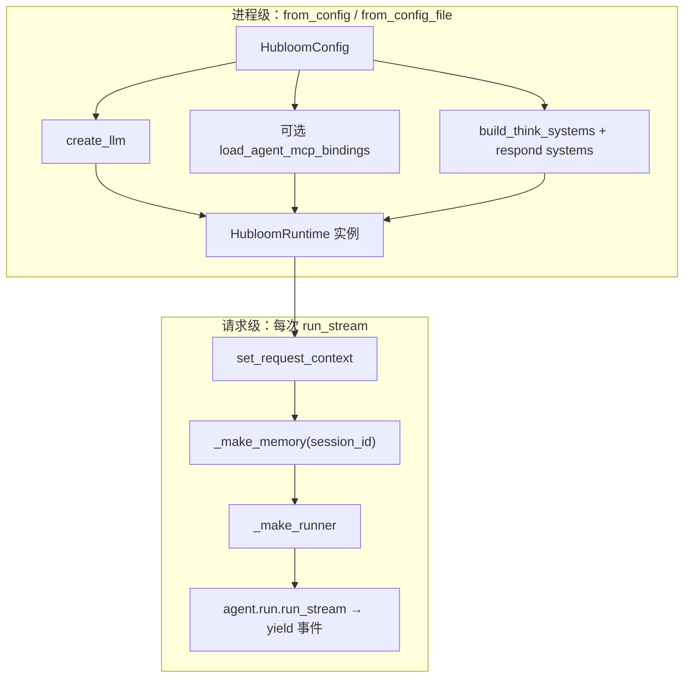

# Runtime

本章讲 **`HubloomRuntime`（进程级运行时）**：把配置装配成可复用的 Agent 能力，并按会话跑每一轮。

服务启动时调用 `from_config`：加载 `HubloomConfig`，创建 LLM；可选拉起 MCP；编译 Skill → Playbook；挂 `SessionStore` 与默认 Wait Profile；拼 Typed ReAct 用的 system。这一步整个进程只做一次。

之后每次用户开口，走 `run_stream`（可覆盖 `wait_profile`）：写入 request context，按 session 装配 memory / tools，再委托 `agent.run.run_stream`（Decide → Gate → Act/Ask/Confirm/Finish）。interactive 挂起后用 `resume_stream` 续同一 Run。

进程退出时调用 `aclose`，关闭 MCP 客户端。

Runtime **不**负责渲染前端，也**不**替代 Agent 内核编排。示例站改接新事件见后续 Step；装配单测：`tests/test_runtime_agent_assembly.py`。

---

## 一句话职责

> **进程级装配一次 → 按 `session_id` 执行 `run_stream` / `resume_stream` → `aclose` 释放 MCP。**

```python
agent = await HubloomRuntime.from_config(cfg)
async for item in agent.run_stream(trigger, session_id=..., wait_profile="turn_based"):
    ...
await agent.aclose()
```

---

## 边界（管什么 / 不管什么）

| 管                                                                | 不管（链走）                                                                    |
| ----------------------------------------------------------------- | ------------------------------------------------------------------------------- |
| 读 `HubloomConfig`、建 LLM、可选拉起 MCP、拼 Think/Respond system | Think / Present / Respond 循环细节 → [Agent](agent.md)                          |
| 每轮挂 memory、拼 `ToolRunner`、写入 request context              | `list_api` 如何打到 HTTP → [Tools](tools.md) · [MCP Adapter](mcp-adapter.md)    |
| 对外 `run_stream` / `aclose` 生命周期                             | 路由、SSE 包装、企微回调 → [示例站](examples-chat.md) · [企业微信](im-wecom.md) |

Runtime **不是** HTTP 框架本身，也**不是**业务 Service 层；它是「把 Agent 跑起来」的装配与会话入口。

---

## 谁在用 Runtime

| 调用方                          | 关系                                                               |
| ------------------------------- | ------------------------------------------------------------------ |
| `main.py` → `examples.chat.app` | 演示站进程内创建 Runtime，再挂 `/v1/chat` 等                       |
| 自有后端 / 门户                 | 直接 `from_config` / `from_config_file`，自己喂 `trigger` 与 Token |
| 事件 Webhook、企微入口          | **同一套** Runtime；换的是入口适配，不是另起一套编排               |

通常一个进程里 **一个 Runtime 实例** 复用；不要每个 HTTP 请求 `from_config` 一次（MCP 子进程与 system 文案都很重）。

---

## 两个生命周期



| 生命周期   | 做什么                                                                                              | 频率                                          |
| ---------- | --------------------------------------------------------------------------------------------------- | --------------------------------------------- |
| **进程级** | 日志、LLM、MCP bindings + 元工具、Think/Respond system、默认 `present_mode`                         | 启动时一次（改配置 / Swagger 后通常重启重建） |
| **请求级** | Bearer / session 进 context、清本轮 `read_skill` 状态、按 session 建 memory、拼本轮 tools、委托编排 | 每个 `run_stream`                             |

这是读 `runtime.py` 时最重要的心智模型。

---

## 配置如何进来

1. `config/env.yaml`（或 `HUBLOOM_CONFIG` 指向的文件）
2. `HubloomConfig.from_file`（`src/config.py`）
3. `HubloomRuntime.from_config(cfg)`，或一步到位的 `from_config_file(path)`

路径约定：相对路径相对**配置文件所在仓库根**（`source_path` 的上一级，见 `_project_root`），例如 `skills_dir`、`memory_db_path`。

本章只点名与 Runtime 强相关的块；全表见 [配置项说明](../reference/configuration.md)。

| 配置块（概念）                                            | Runtime 里怎么用                                              |
| --------------------------------------------------------- | ------------------------------------------------------------- |
| `llm.*`                                                   | `create_llm`；缺 `api_key` 直接报错                           |
| `mcp.enable` / `swagger_url` / `base_url` / `auth_scheme` | 决定是否 `load_agent_mcp_bindings`；scheme/token 进子进程 env |
| `skills_dir` / `skills_exclude`                           | Think system 名片 + 每轮 `build_skill_tools`                  |
| 日志开关（`agent_log` 等）                                | `configure_agent_logging`                                     |

用户业务 Token **不是**配置文件职责，见下文 `run_stream(bearer_token=...)`。

---

## `from_config` 装配清单

按源码顺序（`HubloomRuntime.from_config`）：

1. **校验** `llm.api_key`
2. **`configure_agent_logging`**
3. **`create_llm`**（`core.factory`）
4. 若 `enable_mcp`：
   - 校验 `swagger_url`
   - 预置部分 MCP 相关 context
   - 组装 `child_env`（`MCP_AUTH_SCHEME` / 可选 `MCP_TOKEN`）
   - `load_agent_mcp_bindings` → `mcp_setup` + `_mcp_tools`（即 `list_api` / `call_api`）
5. **`build_think_systems`**：注入 skills 名片；若有 MCP 则注入 API 分组 catalog
6. **`build_respond_markdown_system` / `build_respond_a2ui_system`**
7. 填入 dataclass 并返回

实例上常驻的字段包括：`cfg`、`llm`、`think_system` / `think_system_after`、两套 respond system、`default_present_mode`、`mcp_setup`、`_mcp_tools`、`max_think_rounds`。

> system 字符串的**内容怎么写**属 Agent / prompts；这里只需知道：**装配时就算好，跑流时反复传入**。

---

## `run_stream` 每轮做什么

签名要点：

| 参数               | 含义                                                                            |
| ------------------ | ------------------------------------------------------------------------------- |
| `trigger`          | 单条用户 `Message`，或表单回传的 `assistant` + `tool` 消息列表                  |
| `session_id`       | **必填**；多轮与 memory 命名空间                                                |
| `bearer_token`     | 当前用户鉴权 → context → MCP `call_api` 透传；空则回退配置/环境里的 `MCP_TOKEN` |
| `present_mode`     | 覆盖默认；`auto` 时交 Present 再选 Markdown / A2UI                              |
| `trigger_source`   | 如 `user` / 事件侧标记，供编排区分来源                                          |
| `max_think_rounds` | 可覆盖实例默认                                                                  |

每轮步骤：

1. 解析 `present_mode`、校验 `session_id`
2. **`set_request_context`**（token、session、MCP 相关 URL/scheme）
3. **`clear_read_skill_turn_state`**（本轮 `read_skill` 计数清零）
4. **`_make_memory(session_id)`** → `MemoryManager`（当前工厂路径里 vector/graph 默认为 `none` 的会话向用法）
5. **`_make_runner`**：`SearchMemoryTool` + skill 工具 + 进程级 `_mcp_tools` → `ToolRegistry` / `ToolRunner`
6. **`async for`** 委托 `agent.run.run_stream(...)`，原样 **yield** `AgentEvent | RunResult`

注意：

- **MCP 客户端在进程级**，每轮只是复用 `_mcp_tools` 背后的同一 client；
- **memory / runner 按轮（按 session）新建**，避免会话串台。

---

## `context`：请求上下文

文件：`src/context.py`。

用 **contextvars** 在单次异步调用链里传递「当前请求」信息，避免把 Token 塞进每个工具参数或全局可变单例。

Runtime 在 `run_stream`（以及 MCP 装配前后）会 **写入**，例如：

- `bearer_token`、`session_id`
- `mcp_auth_scheme` / `mcp_swagger_url` / `mcp_base_url`

工具与 MCP 侧 **读取**（如 `get_bearer_token()`），再交给鉴权解析与透传。

和配置的分工：

| 来源            | 典型内容                               |
| --------------- | -------------------------------------- |
| `HubloomConfig` | 进程级：模型、Swagger 地址、是否开 MCP |
| request context | 请求级：这个用户的 Token、这个 session |

另有 A2A 相关 context（远程过程队列、入站防环等），嵌入主路径时可先忽略，细节见 [A2A Adapter](a2a-adapter.md)。

---

## 生命周期与资源

| API                                | 作用                                                  |
| ---------------------------------- | ----------------------------------------------------- |
| `from_config` / `from_config_file` | 创建并装配                                            |
| `run_stream`                       | 跑一轮（可多次）                                      |
| `aclose`                           | 关闭 `mcp_setup.bindings.client`，避免 MCP 子进程泄漏 |

进程退出前应 `await runtime.aclose()`。改了 `swagger_url` 或 MCP 相关配置后，一般需要**重启进程**（重建 Runtime），不能指望只改 yaml 热更新子进程。

---

## 代码地图

| 你想了解…                 | 优先看                                     |
| ------------------------- | ------------------------------------------ |
| Runtime 本体              | `src/runtime.py`                           |
| 配置模型与读文件          | `src/config.py`                            |
| 请求级 Token / session    | `src/context.py`                           |
| 演示入口                  | `main.py` → `examples/chat/`               |
| LLM 工厂                  | `src/core/factory.py`（`create_llm`）      |
| Think/Respond system 组装 | `src/agent/assemble.py`（由 Runtime 调用） |
| 真正编排循环              | `src/agent/run.py`（`run_stream`）         |
| MCP 装配                  | `src/mcp_adapter/discovery.py`             |

---

## 和上下游

| 方向     | 模块                                     | 关系                                                       |
| -------- | ---------------------------------------- | ---------------------------------------------------------- |
| 下游     | [Agent](agent.md)                        | Runtime 把 llm / memory / tools / system 塞进 `run_stream` |
| 下游     | [Tools](tools.md)                        | `_make_runner` 组装本轮工具面                              |
| 下游     | [MCP Adapter](mcp-adapter.md)            | `from_config` 时 `load_agent_mcp_bindings`                 |
| 下游     | [Skill](skill.md) / [Memory](memory.md)  | system 名片 + 每轮 skill/memory 工具                       |
| 上游入口 | [示例站](examples-chat.md)、Events、企微 | 创建 Runtime 并调用 `run_stream`                           |

概念总图：[架构](../core-concepts/architecture.md)（偏产品拼装）；本章偏**这一个类**的装配与生命周期。

---

## 常见误解

| 误解                        | 实际                                                    |
| --------------------------- | ------------------------------------------------------- |
| Runtime = 整个 HTTP 服务    | 服务在示例站 / 你的应用里；Runtime 是可嵌入的 Agent 核  |
| 每个请求 `from_config` 一次 | 应进程内复用实例；请求只调 `run_stream`                 |
| 不传 `session_id` 也能聊    | 会直接 `ValueError`                                     |
| 用户 Token 写进 `env.yaml`  | 应 `run_stream(bearer_token=...)`（或网关注入后再传入） |
| 改完 Swagger 不用重启       | catalog 与 MCP 子进程在装配时创建，通常需重建 Runtime   |

---

## 下一步

| 需求            | 去哪                                      |
| --------------- | ----------------------------------------- |
| 编排与 SSE 细节 | [Agent](agent.md)                         |
| 工具面怎么挂    | [Tools](tools.md)                         |
| 嵌入到自有服务  | [嵌入 Runtime](../usage/embed-runtime.md) |
| 模块总览        | [模块导读](README.md)                     |

← [模块导读](README.md) · 👉 [Agent →](agent.md)
