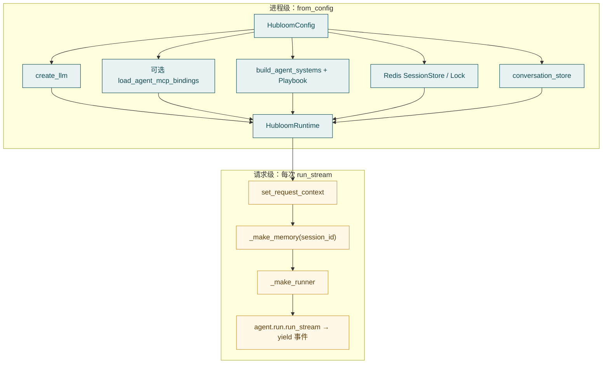

# Runtime

**`HubloomRuntime`**（主要在 `src/runtime.py`）是可嵌入的办事内核：启动时按配置装配一套可复用能力，之后按会话执行每一轮，并把事件交给宿主（Serve 或自有应用）。

一句话：

> **进程级装配一次 → 按 `session_id` 跑 `run_stream` / `resume_stream` → `aclose` 释放资源。**

```python
runtime = await HubloomRuntime.from_config(cfg)
async for item in runtime.run_stream(trigger, session_id=..., wait_profile="interactive"):
    ...
await runtime.aclose()
```

概念速览见 [Runtime（核心概念）](../core-concepts/runtime.md)。

---

## 边界

**管：**

- 读 `HubloomConfig`，建 LLM；可选拉起 MCP
- 装配 system、Playbook、Redis 会话/锁、conversation_store
- 每轮绑定 request context、按 session 建 memory / ToolRunner
- 对外生命周期：`from_config` → `run_stream` / `resume_stream` → `aclose`

**不管：**

- HTTP 路由与 SSE 编码 → [Hubloom Serve](hubloom-serve.md)
- Decide / Gate / 动作循环细节 → [Agent](agent.md)
- `list_api` / `call_api` 如何打企业 HTTP → [Tools](tools.md) · [MCP Adapter](mcp-adapter.md)
- Skill 文件怎么写 → [Skill](skill.md) · [编写 Skill](../usage/write-skill.md)

Runtime **不是** HTTP 框架，也**不是**业务 Service；它是「把 Agent 跑起来」的装配与会话入口。拆开是为了：同一套编排可以挂在 Serve、门户、Events、企微上，而不把 HTTP / IM 细节渗进内核。

---

## 谁在用

- **Hubloom Serve** — 进程内创建一个 Runtime，`/v1/chat` 等调 `run_stream`
- **自有后端 / 门户** — 直接 `from_config` / `from_config_file`，自己传 trigger 与 Token
- **Events / 企微** — 同一套 Runtime；换的是入口适配，不是另起编排

通常一个进程里 **复用一个 Runtime 实例**。不要每个 HTTP 请求都 `from_config`：MCP 要起子进程、拉 OpenAPI、编 catalog；system / Playbook 也要扫 skills——这些成本应按进程摊，不按请求摊。

---

## 两个生命周期（先建立这张图）

要解决的问题很具体：**哪些东西贵、且跨请求不变；哪些东西便宜、且每用户每轮都不同。** 混在一起要么每请求冷启动（慢、泄漏子进程），要么把 Token / session 挂在全局（串台、越权）。



- **进程级**（启动一次）：LLM、MCP 客户端与元工具、system、Playbook、Redis 挂起态/锁、会话历史存储、默认 Wait Profile。这些绑定的是**环境**（模型、Swagger、技能目录），不是某个用户。改配置 / Swagger 后通常要**重启重建** Runtime——catalog 与子进程在装配时定死，热改会半新半旧。
- **请求级**（每轮对话）：写入 Token / session 到 context、清本轮 `read_skill` 状态、按 session 建 memory 与工具面、委托 `agent.run`，结束后清 context。这些绑定的是**这一轮是谁、聊哪条会话**；必须可并发、可隔离。

切分原则：

| 放进程级                                          | 放请求级                                               |
| ------------------------------------------------- | ------------------------------------------------------ |
| 贵、启动慢、跨用户可共享                          | 含用户身份 / 会话身份、不能共享                        |
| 例：MCP client、system 名片、Playbook、Redis 连接 | 例：`bearer_token`、`session_id`、本轮 memory / runner |

这是读 `runtime.py` 时最重要的心智模型。

---

## 配置如何进来

1. `config/env.yaml`（或 `HUBLOOM_CONFIG`）
2. `HubloomConfig.from_file`（`src/config.py`）
3. `HubloomRuntime.from_config(cfg)`，或 `from_config_file(path)`

相对路径相对**配置文件所在仓库根**（见 `_project_root`），例如 `skills_dir`、`memory.db_path`。

和 Runtime 强相关的块：

- `llm.*` — `create_llm`；缺 `api_key` 直接报错
- `redis.url` — **必填**；挂起态与 session 锁（interactive 跨请求续跑、同 session 串行，都靠它）
- `mcp.*` — 是否 `load_agent_mcp_bindings`；scheme 等进子进程 env
- `skills_dir` / `skills_exclude` — system 名片 + Playbook + 每轮 skill 工具
- `memory.conversation_store` — sqlite / postgres 会话历史
- `agent.default_wait_profile` — 默认 Wait Profile

用户业务 Token **不要**写进 yaml：配置是进程共享的；Token 是用户私有的。写进 yaml 等于所有会话共用一把钥匙。正确路径是 `run_stream(bearer_token=...)`（或 Serve 从 Header 注入后再传入）。全表见 [配置项说明](../reference/configuration.md)。

---

## `from_config` 装配清单

按当前源码顺序（`HubloomRuntime.from_config`）：

1. 校验 `llm.api_key`
2. `configure_agent_logging`
3. `create_llm`
4. 若 `mcp.enable`：校验 `swagger_url` → `load_agent_mcp_bindings` → 得到 MCP 元工具（如 `list_api` / `call_api`）
5. `build_agent_systems` — Skill 名片；有 MCP 时注入 API 分组 catalog
6. 从 skills 编译 **Playbook**
7. 创建 **Redis** SessionStore + session 锁（未注入自定义 store/lock 时）
8. 创建 **conversation_store**
9. 返回 `HubloomRuntime` 实例

实例上常驻：`cfg`、`llm`、`system_before` / `system_after`、`playbook`、`mcp_setup` / `_mcp_tools`、`session_store` / `session_lock`、`conversation_store`、`default_wait_profile` 等。

system 在装配时算好、跑流时反复传入：名片与 API catalog 相对稳定，不必每轮扫盘重编；需要本轮特例时用 `system_extra` 追加，而不是整份重装。文案**怎么写**属 Agent / prompts。

`session_store` / `session_lock` 可注入，是为了测试或自有基础设施替换 Redis，而不改 `run_stream` 签名。

---

## `run_stream` 每轮做什么

常用参数：

- `trigger` — 用户 `Message`（或消息列表）
- `session_id` — **必填**；多轮与 memory 的命名空间。没有它，历史、挂起态、锁都无处归属
- `bearer_token` — 当前用户鉴权 → context → MCP 透传（打业务 API 用「这个用户」的身份，而不是服务账号）
- `wait_profile` — 覆盖默认（`interactive` / `turn_based` / `no_wait`）。同一 Runtime 可服务「人对着屏幕可挂起」和「事件触发绝不等」——差别在入口参数，不在两套内核
- `trigger_source` — 如 `user`；事件/企微可标不同来源，便于策略与审计区分
- `system_extra` — 本轮追加进 system（企微短回复等会用到），避免为渠道差异重建 Runtime

步骤：

1. 校验 `session_id`
2. 解析 Wait Profile；选用实例 Playbook（可被参数覆盖）
3. `_bind_request_context`（Token、session、MCP 相关 URL/scheme）+ 清本轮 `read_skill` 状态
4. `_make_memory(session_id)` → `MemoryManager`（会话向；长期记忆另议）
5. `_make_runner`：`SearchMemoryTool` + skill 工具 + 进程级 `_mcp_tools`
6. 委托 `agent.run.run_stream(...)`，原样 **yield** 事件 / `RunResult`
7. `finally`：`clear_request_context`

注意：

- **MCP 客户端在进程级**；每轮复用 `_mcp_tools` 背后的同一 client——避免每句对话拉起子进程
- **memory / runner 按轮（按 session）新建**——memory 绑 `session_id`；runner 绑本轮工具面与 memory。共享会串历史或串 Token 调用链
- Runtime **不解释**事件语义，只透传；宿主（Serve / 门户）决定 SSE、日志还是落库

### `resume_stream`

interactive 下进入 `awaiting_user` 后，用同一 `session_id`（及 `run_id` / `await_token`）续跑。这是**恢复挂起的同一 Run**，不是再开一轮并行 `run_stream`——否则挂起态、已执行步骤与锁会对不上。Serve 的 `/v1/chat/resume` 最终也落到这里。

---

## `context`：请求上下文

文件：`src/context.py`。

用 **contextvars** 在单次异步调用链里传递「当前请求」信息。工具（尤其 `call_api`）深处需要 Token，但不宜给每个 `execute` 加鉴权参数——参数面会脏、也容易漏传。context 让 Runtime 在边界写入、工具在深处读取；`finally` 里 `clear_request_context`，避免异步任务间残留。

Runtime 在跑流前写入，例如：`bearer_token`、`session_id`、`mcp_auth_scheme` / `mcp_swagger_url` / `mcp_base_url`。工具与 MCP 侧读取（如 `get_bearer_token()`）再透传。

对照：

- **HubloomConfig** — 进程级：模型、Swagger、是否开 MCP、Redis…（环境）
- **request context** — 请求级：这个用户的 Token、这个 session（身份）

---

## 关键文件

- `src/runtime.py` — Runtime 本体
- `src/config.py` — 配置模型与读文件
- `src/context.py` — 请求级 Token / session
- `src/core/factory.py` — `create_llm`
- `src/agent/assemble.py` — system 组装（由 Runtime 调用）
- `src/agent/run.py` — 真正编排循环
- `src/mcp_adapter/discovery.py` — MCP 装配
- `src/server/app.py` — Serve 如何调用 Runtime

---

## 生命周期与资源

- `from_config` / `from_config_file` — 创建并装配
- `run_stream` / `resume_stream` — 跑一轮（可多次）
- `aclose` — 关闭 MCP client、conversation_store、Redis 连接

MCP 子进程与 Redis 连接不会因 Python 对象被 GC 就干净退出；进程退出前应 `await runtime.aclose()`，否则容易残留进程/连接。改了 `swagger_url` 或 MCP 相关配置后，需要**重启进程**重建 Runtime（与「进程级定死 catalog」同一原因）。

---

## 常见误解

- **Runtime = 整个 HTTP 服务** — 服务在 Serve / 你的应用里；Runtime 是可嵌入的核（多入口共用一套编排）
- **每个请求 `from_config` 一次** — 把进程级成本当成请求级付；应复用实例，只调 `run_stream`
- **不传 `session_id` 也能聊** — 会直接报错；没有命名空间就无法安全存历史与挂起态
- **用户 Token 写进 `env.yaml`** — 配置共享、Token 私有；应 `bearer_token=`（或网关注入后再传入）
- **改完 Swagger 不用重启** — catalog 与 MCP 子进程在装配时固定，通常需重建 Runtime

---

## 延伸阅读

- 上一篇：[Hubloom Serve](hubloom-serve.md)
- 下一篇：[Agent](agent.md)
- 工具面：[Tools](tools.md) · [MCP Adapter](mcp-adapter.md)
- 嵌入自有服务：[嵌入 Runtime](../usage/embed-runtime.md)
- 模块总览：[模块导读](README.md)
