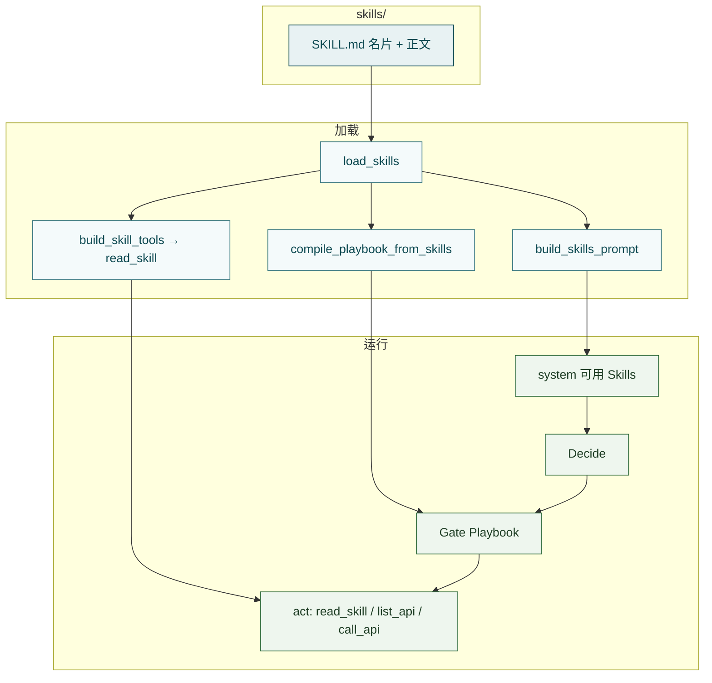

# Skill

**Skill**（仓库 `skills/` + `src/skill/`）是给 Agent 的**领域规程包**：用 Markdown 写清某类事该怎么做、先做什么、禁止什么。它不是业务代码，也不会替企业后端落库。

一句话：

> **名片进 system → 对上任务再 `read_skill` 读正文 → 仍靠 MCP 办事；可选 `playbook` 给 Gate 硬拦。**

```text
skills/<id>/SKILL.md
  → load_skills（name / description / body / playbook）
  → build_skills_prompt → system「可用 Skills」名片
  → build_skill_tools → 唯一工具 read_skill
  → compile_playbook_from_skills → Runtime Playbook → Gate
```

概念速览见 [Skill（核心概念）](../core-concepts/skill.md)；动手写见 [创建第一个 Skill](../guide/first-skill.md) · [编写 Skill](../usage/write-skill.md)。

---

## Skill 是什么（为何需要）

大模型会临场发挥；企业办事却要**可重复的规矩**：先查列表再动手、删除要确认、账号类禁止代办等。Skill 把这些写成文件，让通用 Agent 在对上场景时按专家方式做事，而不是每次靠临时提示词从头教。

和工具的差别：

- **MCP / API** — 能调哪些能力、参数是什么  
- **Skill** — 遇到这类事该怎么做、注意什么、哪些不能做  

设计关键是**按需展开**：

1. 平时只让模型知道「有哪些 Skill、各自何时用」（元数据名片，体积小）  
2. 当前任务对得上某条 `description` 时，再 `read_skill` 加载正文  
3. 真正查数、改状态仍走 `list_api` / `call_api`——Skill **说明规矩，不代替 HTTP**

可以想成：名片 ≈ 岗位说明；正文 ≈ 操作手册；工具箱仍是 MCP。

---

## 边界

**管（本模块 + 技能文件）：**

- `skills/*/SKILL.md` 的目录约定与扫描（`load_skills`）
- 名片文案（`build_skills_prompt`）
- frontmatter 里可选 **`playbook`**（供 Gate 编译）
- 与 Tools 配合的 `read_skill` 语义（实现在 `tools/builtin/skill_tools.py`）

**不管：**

- 何时读 Skill、何时 `act` / `ask` / `await_confirm` → [Agent](agent.md)
- HTTP / OpenAPI → [MCP Adapter](mcp-adapter.md)
- 每轮挂工具、注入 system、编译 Playbook → [Runtime](runtime.md)
- 长篇写法教程 → [编写 Skill](../usage/write-skill.md)

---

## 目录与 `SKILL.md`

一个 Skill = 一个文件夹；**运行时真正参与的只有 `SKILL.md`**：

```text
skills/
  README.md                 # 给人看，不注入模型
  account-access/
    SKILL.md                # 必填：YAML 元数据 + Markdown 正文
    scripts/                # 可选；Runtime 不执行
    references/             # 可选；不会自动注入
    assets/                 # 可选；不会自动使用
```

- 只扫**一层**子目录下的 `SKILL.md`（不要指望 `skills/foo/bar/SKILL.md` 自动成独立技能）
- 文件夹名 = 技能 **id**（`read_skill`、`skills_exclude` 常用它）；以 `.` 开头的目录忽略
- `scripts/` / `references/` / `assets/` 可给人看或本地手跑，**不要**写进规程当成 Agent 必经步骤

文件两段：

```markdown
---
name: account-access
description: >
  做什么 + 什么时候该用（触发匹配的关键）。
playbook:                    # 可选；见下文
  forbid_tools: []
---

# 标题

具体步骤、检查清单、禁区、示例。对上任务后才 read_skill 进来。
```

> **元数据 ≈ 目录卡片；正文 ≈ 操作手册。**  
> `description` 既写「做什么」也写「何时用」，越清楚越容易被选中。

---

## 在 Hubloom 主路径上干什么

1. **告诉 Agent 有哪些规矩** — Runtime / `build_agent_systems` 扫描技能，把 name + description 写进 system「可用 Skills」  
2. **按需给出怎么做** — Decide 选 `act(read_skill, …)` 后，正文进上下文；模型再按规程 `list_api` / `call_api` 或 `ask` / `await_confirm`  
3. **可选硬规程** — frontmatter `playbook` 合并成 Playbook，Decide 之后 Gate 可拦违规 `act` / 过早 `finish`  
4. **不代替业务调用** — 没有「执行这个 Skill」的独立按钮；读完手册仍靠工具或对人说话把事做完



和邻居的分工：Skill = 规程；MCP = 能力；Tools = 把 `read_skill` 等挂上；Runtime = 装配；Agent = 决策与等人。

---

## Playbook（可选硬拦）

`load_skills` 会读出 frontmatter 里的 `playbook` 字典；Runtime `from_config` 时 `compile_playbook_from_skills` **合并**各 Skill（同 id 的 `require_steps` 会并工具列表）。

最小字段（工具名须与注册名一致）：

```yaml
playbook:
  forbid_tools: [echo_bad]
  require_steps:
    - id: register_pet
      tools: [echo_pet]
  confirm_tools: [echo_pet]
```

- **空 / 无 playbook** = 纯能力环，Gate 全放行（只靠正文软约束）  
- **`forbid_tools`** — 禁止 `act` 这些工具  
- **`require_steps`** — 所列工具曾**成功**执行前，禁止 `finish`  
- **`confirm_tools`** — 须先 `await_confirm` 且用户确认后，才允许 `act`

细则与事件轨迹见 [Agent](agent.md) 的 Gate / Playbook 节。仓库默认 `skills/` 里不一定都写了 `playbook`；有正文软约束即可，需要硬拦时再加。

---

## 流程例子：选型后再动手

仓库 `select-before-act`：用户要对列表里某一条动手但未给唯一 ID 时，须先查列表、展示候选、等人选；删除还要二次确认。

假设用户说：「把那个叫旺财的宠物删掉。」（`wait_profile=interactive`）

```text
① Decide 看 Skills 名片 → 命中 select-before-act
② act(read_skill, skill=select-before-act) → 正文进上下文
③ act(list_api / call_api) → 拉候选列表（MCP）
④ ask 或 await_confirm → 展示候选 / 确认删除 → 按 Wait Profile 等人
⑤ 用户 resume 选定并确认
⑥ act(call_api 删除) → 仍是 MCP
⑦ 规程要求时再拉列表复核 → finish
```

Skill **没有**自己发 HTTP；它规定「第几步才能调哪类 API、何时必须停」。接口清单仍以 OpenAPI / `list_api` 为准。

---

## 不经 Agent 先摸清加载

脚本 [`tests/test_skill.py`](../../tests/test_skill.py) 把主路径拆成三步（仓库根目录执行）：

```bash
PYTHONPATH=src .venv/bin/python tests/test_skill.py
```

1. **`load_skills` + `build_skills_prompt`** — 只打印名片（name + description），不含正文  
2. **`build_skill_tools` + `list_definitions`** — 通常只有一个 `read_skill`；靠参数 `skill` 区分读哪份  
3. **`ToolRunner.run("read_skill", {"skill": "account-access"})`** — 不调大模型，直接读出正文前缀  

对应真实对话：名片在 system；`read_skill` 在业务 tools 里；Decide 选 `act` 后由 `exec_acts` 执行。同一 skill 每轮成功读一次为限（Runtime 每轮 `clear_read_skill_turn_state`）。

---

## 关键文件

- `src/skill/load.py` — `load_skills` / `build_skills_prompt`  
- `src/tools/builtin/skill_tools.py` — `read_skill` / `clear_read_skill_turn_state`  
- `src/agent/policy.py` — `compile_playbook_from_skills`  
- `src/agent/assemble.py` — `build_agent_systems` 注入名片  
- `src/runtime.py` — 编译 Playbook、每轮挂 skill 工具  
- `skills/*/SKILL.md` — 规程正文  

改完 Skill 文件后需**重启 Serve / 重建 Runtime** 才生效（当前无热加载）。事件分册 `skills/events/` 另有约定，见 [进阶](../advanced/README.md)。

---

## 常见误解

- **Skill = 可执行脚本包** — 主路径只读 `SKILL.md`；不跑 `scripts/`  
- **读完 Skill 就会自动调 API** — 仍要 Decide `act(call_api)`；Skill 只给规矩  
- **每个 Skill 一个 Tool** — 工具面通常一个 `read_skill`，用参数选 id  
- **正文一启动就进 system** — 默认只进名片；正文按需读  
- **有 Skill 就不需要 Playbook** — 正文是软约束；`playbook` 才是 Gate 硬拦  
- **编排还在 Think / Respond** — 现为 Typed ReAct；等人用 Wait Profile  

---

## 延伸阅读

- 概念：[Skill](../core-concepts/skill.md)
- 上一篇：[MCP Adapter](mcp-adapter.md)
- 下一篇建议：[Memory](memory.md)（按需）或回 [模块导读](README.md)
- 编排与 Gate：[Agent](agent.md)
- 装配：[Runtime](runtime.md)
- 写法：[编写 Skill](../usage/write-skill.md) · [创建第一个 Skill](../guide/first-skill.md)
