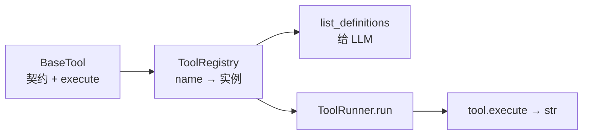
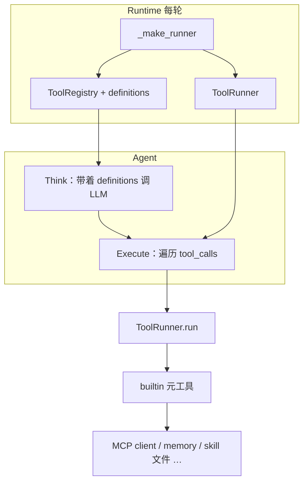

# Tools

本章讲 **`src/tools`（工具面）**：给 LLM 看的函数契约、按名注册、以及真正执行时的 Runner。

Agent 在 Think 里决定要不要调工具；一旦决定，Execute 阶段会拿着 `tool_calls` 去问 `ToolRunner`：「这个名字对应哪个工具？参数对不对得上？执行结果文本是什么？」Tools 包回答的就是这一层。它**不**决定何时调用，也**不**自己去拼 OpenAPI / 发业务 HTTP——那些分别在 Agent 编排与 MCP Adapter。

主路径上，Runtime 每轮 `_make_runner` 会把本轮要用的工具实例塞进 `ToolRegistry`，再把 `list_definitions()` 交给 Think、把 `ToolRunner` 交给 Execute。用户说「查一下柜子」、模型选出 `list_api` / `call_api`，最后落到业务 API，中间必经这里。

读完本章，你应能分清 **框架三件套**（`BaseTool` / `ToolRegistry` / `ToolRunner`）与 **内置元工具**（`list_api` 等），并指出「谁装配工具面、谁决定调用、谁打到 HTTP」。

---

## 一句话职责

> **定义工具契约 → 注册并生成给 LLM 的 definitions → 按名执行，返回文本结果。**

包入口：`src/tools/`（`base` / `registry` / `runner` + `builtin/`）。

最小心智模型：

```python
registry = ToolRegistry.from_tools([SearchMemoryTool(memory), *skill_tools, *mcp_tools])
runner = ToolRunner(registry)
defs = registry.list_definitions()   # 给 Think / LLM
text, is_error = await runner.run("call_api", {"tag": "...", "tool_name": "..."})
```

---

## 边界（管什么 / 不管什么）

| 管                                                                     | 不管（链走）                                                            |
| ---------------------------------------------------------------------- | ----------------------------------------------------------------------- |
| `BaseTool` 契约（name / description / parameters / `execute` → `str`） | 何时 Think、何时交 Present/Respond → [Agent](agent.md)                  |
| `ToolRegistry` 注册与 `list_definitions`                               | 进程级拉 MCP、拼 system 名片 → [Runtime](runtime.md)                    |
| `ToolRunner` 按名执行、白名单、有限重试                                | `call_api` 背后的 stdio/HTTP 与鉴权透传 → [MCP Adapter](mcp-adapter.md) |
| `builtin/` 元工具实现（读 skill、搜记忆、转 MCP…）                     | Skill 文件怎么写 → [Skill](skill.md)；记忆后端 → [Memory](memory.md)    |

Tools **不是**业务 Service 层，也**不是**「每个 REST 接口一个 Tool 类」的仓库。主路径用**少量元工具**覆盖大量业务 API。

---

## 框架三层



| 层       | 文件          | 做什么                                                                                                         |
| -------- | ------------- | -------------------------------------------------------------------------------------------------------------- |
| **契约** | `base.py`     | 抽象基类；子类声明 `name` / `description` / `parameters`（JSON Schema），实现 `async execute(**kwargs) -> str` |
| **注册** | `registry.py` | `register` / `get` / `from_tools`；`list_definitions()` 产出 Think 用的 tools 列表                             |
| **执行** | `runner.py`   | `run(name, args) -> (text, is_error)`；可选 `allowed_tools`；失败时有限次重试                                  |

约定要点：

- 返回值是**给模型看的文本**（纯文本或 JSON 字符串），不是结构化业务对象。
- 找不到工具、不在白名单、执行抛错，Runner 仍返回字符串，并用 `is_error=True` 标记，供 Agent 落 `ToolResultEvent` / 继续推理。
- `ToolRegistry` 注释里提到的 **tags 分组按需注入**尚未实现；当前是「本轮注册表里有什么，LLM 就能看见什么」。

---

## 调用链（谁接到谁）



| 步骤           | 负责方                                 | 说明                                                       |
| -------------- | -------------------------------------- | ---------------------------------------------------------- |
| 拼本轮工具实例 | [Runtime](runtime.md) `_make_runner`   | 例如 `SearchMemoryTool` + skill 工具 + 进程级 `_mcp_tools` |
| 决定是否调用   | [Agent](agent.md) Think                | LLM 产出 `tool_calls`                                      |
| 逐个执行       | `agent/loop/execute.py` → `ToolRunner` | `await runner.run(name, args)`                             |
| 具体副作用     | 各 `builtin` 工具                      | 读盘、查记忆、经 MCP `execute_tool` 等                     |

---

## 内置元工具（`builtin/`）

「元工具」= Agent 可见的少量入口；背后再去发现/调用大量业务能力或读本地细则。

| 工具名             | 类 / 工厂                              | 作用                                                  | 下游                                           |
| ------------------ | -------------------------------------- | ----------------------------------------------------- | ---------------------------------------------- |
| `list_api`         | `ListAPITool`（`build_api_tools`）     | 按 OpenAPI **tag** 列出该分组业务工具及 schema        | catalog + MCP `list_tools`                     |
| `call_api`         | `CallAPITool`（`build_api_tools`）     | 按 tag + tool_name 调用真实业务接口                   | MCP `execute_tool`；Token 来自 request context |
| `read_skill`       | `ReadSkillTool`（`build_skill_tools`） | 按需读取 `SKILL.md` 正文；本轮同 skill 成功读一次为限 | `skills/` 目录                                 |
| `search_memory`    | `SearchMemoryTool`                     | 检索长期记忆（情景 / 语义 / 可选图）                  | `MemoryManager`                                |
| `search_documents` | `SearchDocumentsTool`                  | 外部文档知识库检索（可选）                            | `retrieval`                                    |
| `list_agents`      | `ListAgentsTool`                       | 列出可委托的远程 A2A Agent（可选）                    | `a2a_adapter`                                  |
| `delegate_task`    | `DelegateTaskTool`                     | 委托远程 Agent（可选）                                | `a2a_adapter`                                  |

主路径 Runtime 当前默认挂上的是：**`search_memory` + skill 工具 +（若开启 MCP）`list_api` / `call_api`**。检索与 A2A 工具是否入面，取决于上层是否显式注册，不是 `BaseTool` 框架自动发现。

`list_api` / `call_api` 与「每个 API 一个 Tool」的对比：

| 做法           | 结果                                                              |
| -------------- | ----------------------------------------------------------------- |
| 元工具（现行） | LLM 始终只见两三个 API 相关名字；先 `list_api(tag)` 再 `call_api` |
| 一接口一 Tool  | definitions 爆炸，system / tools 列表难维护                       |

鉴权：`call_api` 通过 `get_bearer_token()` 等读 **request context**（Runtime `run_stream` 写入）；空则回退配置/环境中的 `MCP_TOKEN`。细节见 [MCP 协议](../core-concepts/mcp-protocol.md) 与 [Runtime](runtime.md) 的 context 一节。

本轮 `read_skill` 去重：`clear_read_skill_turn_state()` 由 Runtime 在每轮开始调用，避免跨轮误伤。

---

## 和 Runtime 装配的关系

进程级（`from_config`）：若 `mcp.enable`，`load_agent_mcp_bindings` 得到 catalog + 客户端，并 `build_api_tools` → 常驻在 Runtime 的 `_mcp_tools`。

请求级（每次 `run_stream`）：

1. `clear_read_skill_turn_state()`
2. `_make_memory(session_id)`
3. `_make_runner(memory)`：`SearchMemoryTool(memory)` + `build_skill_tools(...)` + `_mcp_tools`
4. `ToolRegistry.from_tools` → `ToolRunner` + `list_definitions()`
5. 交给 `agent.run.run_stream(..., runner=..., tools=...)`

因此：**换会话 = 换 memory 工具实例；MCP 元工具实例可跨请求复用同一 client。** 并发与 MCP 管道限制见 Runtime / MCP 章，不在 Tools 框架内解决。

---

## 代码地图

| 你想了解…          | 优先看                                                         |
| ------------------ | -------------------------------------------------------------- |
| 工具基类           | `src/tools/base.py`                                            |
| 注册与 definitions | `src/tools/registry.py`                                        |
| 执行与重试         | `src/tools/runner.py`                                          |
| API 元工具         | `src/tools/builtin/api_tools.py`                               |
| Skill 元工具       | `src/tools/builtin/skill_tools.py`                             |
| 记忆 / 检索 / A2A  | `builtin/memory_tool.py` · `retrieval_tool.py` · `a2a_tool.py` |
| 谁拼本轮工具面     | `src/runtime.py`（`_make_runner`）                             |
| 谁调用 Runner      | `src/agent/loop/execute.py`                                    |

---

## 和上下游

| 方向 | 模块                                                      | 关系                                    |
| ---- | --------------------------------------------------------- | --------------------------------------- |
| 上游 | [Runtime](runtime.md)                                     | 装配 Registry / Runner / definitions    |
| 上游 | [Agent](agent.md)                                         | Think 用 definitions；Execute 调 Runner |
| 下游 | [MCP Adapter](mcp-adapter.md)                             | `list_api` / `call_api` 转发            |
| 下游 | [Skill](skill.md) / [Memory](memory.md)                   | `read_skill` / `search_memory`          |
| 可选 | [Retrieval](retrieval.md) · [A2A Adapter](a2a-adapter.md) | 文档检索、跨 Agent 委托                 |

---

## 常见误解

| 误解                                 | 实际                                        |
| ------------------------------------ | ------------------------------------------- |
| Tools = 所有业务 API 的类列表        | 主路径是元工具；业务接口在 MCP / OpenAPI 侧 |
| `ToolRunner` 决定要不要调工具        | 决定权在 Think；Runner 只负责执行           |
| 在 `tools/` 里读 `env.yaml` 装配整面 | 装配在 Runtime；tools 提供积木              |
| `execute` 应返回 dict / Pydantic     | 约定返回 **str**（给模型）                  |
| 注册表 tags 已可按组裁剪             | 尚未实现；当前整表可见                      |
