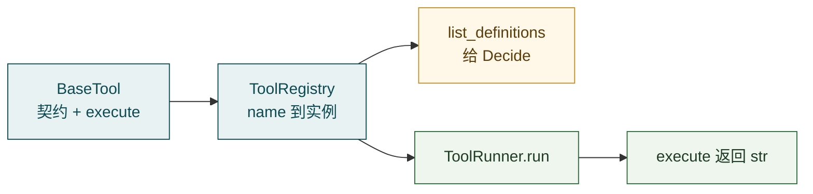
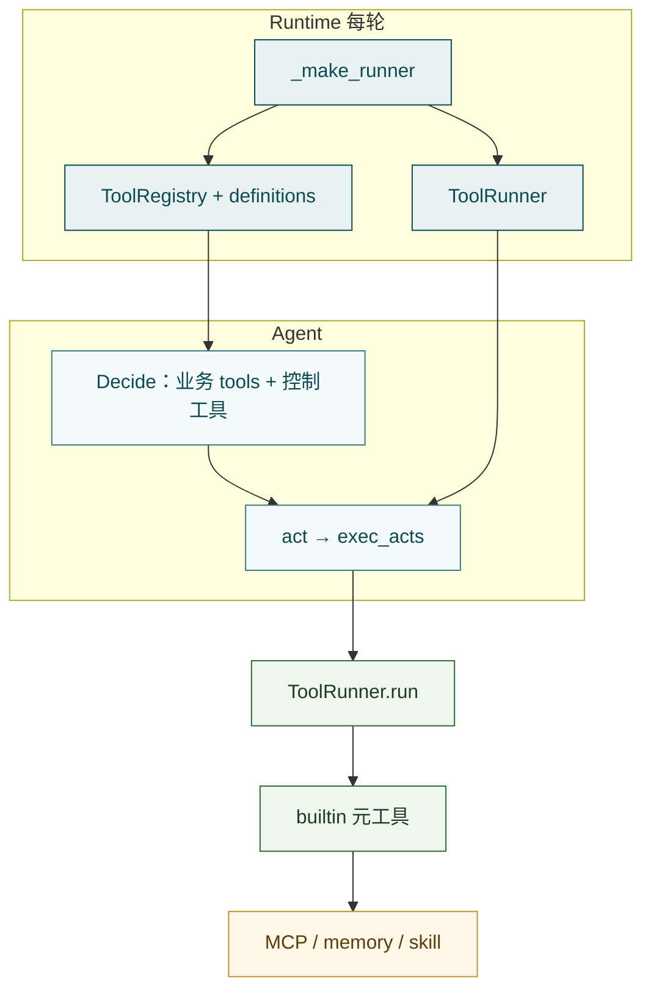

# Tools

**Tools**（`src/tools/`）是 Agent 的**执行面**：约定「一个工具长什么样」、按名字挂上本轮可用的实例，并在模型选出 `tool_calls` 之后真正跑起来，把结果收成**给模型看的文本**。

一句话：

> **契约 → 注册 / definitions → 按名执行；返回 `str`，用 `is_error` 标记成败。**

它在链路里的位置很窄、也很关键：

```text
Runtime 每轮 _make_runner
  → ToolRegistry + list_definitions + ToolRunner
Agent Decide 看到业务 tools（另加控制工具 agent_ask 等）
  → 若选 act → exec_acts → ToolRunner.run(name, args)
    → 某个 BaseTool.execute → 文本观察进 Journal
```

用户说「查一下柜子」、模型先 `list_api` 再 `call_api`，中间必经这里。  
Tools **不**决定何时调用（那是 [Agent](agent.md) 的 Decide / Gate），也**不**自己拼 OpenAPI、发业务 HTTP（那是 [MCP Adapter](mcp-adapter.md)）。主路径也不是「每个 REST 接口一个 Tool 类」，而是**少量元工具**覆盖大量业务 API。

概念上可记三层：

- **框架**：`BaseTool` / `ToolRegistry` / `ToolRunner`
- **内置元工具**：`list_api` / `call_api` / `read_skill` / `search_memory`，以及可选的检索、A2A
- **装配**：谁在什么时候把哪些实例塞进注册表——主要是 Runtime

注意：`agent_ask` / `agent_await_confirm` / `agent_finish` 是 Agent 侧的**控制工具**，定义在 `agent/actions.py`，在编排里与业务 `tools` **合并**后交给 Decide；它们**不属于** `src/tools/`。

---

## 边界

**管：**

- `BaseTool` 契约：`name` / `description` / `parameters` / `async execute → str`
- `ToolRegistry`：注册、按名查找、`list_definitions()`
- `ToolRunner`：按名执行、可选白名单、有限重试
- `builtin/` 里各元工具实现

**不管：**

- 何时 `act` / `ask` / `finish` → [Agent](agent.md)
- 进程级拉 MCP、拼 system 名片、写 request context → [Runtime](runtime.md)
- `call_api` 背后的 stdio / HTTP / 鉴权透传细节 → [MCP Adapter](mcp-adapter.md)
- Skill 怎么写、记忆后端怎么配 → [Skill](skill.md) · [Memory](memory.md)

---

## 框架三层



**`BaseTool`（`base.py`）**  
子类声明名字、描述、JSON Schema 参数，实现 `execute(**kwargs) -> str`。约定返回给模型看的文本（纯文本或 JSON 字符串），不是业务对象 / Pydantic。

**`ToolRegistry`（`registry.py`）**  
`register` / `get` / `from_tools`；`list_definitions()` 产出 Decide 用的 tools 列表。注释里提到的 **tags 分组按需注入尚未实现**——本轮注册表里有什么，LLM 就能看见什么。

**`ToolRunner`（`runner.py`）**  
`run(name, args) -> (text, is_error)`。可选 `allowed_tools` 白名单；执行抛错时默认最多 **2** 次尝试（中间短 sleep）。找不到工具、不在白名单、执行失败：仍返回字符串，并 `is_error=True`，供 Agent 写成 `ToolResultEvent` / Journal 观察后继续 Decide。

最小用法：

```python
registry = ToolRegistry.from_tools([SearchMemoryTool(memory), *skill_tools, *mcp_tools])
runner = ToolRunner(registry)
defs = registry.list_definitions()   # 交给 Decide（业务侧）
text, is_error = await runner.run("call_api", {"tag": "...", "tool_name": "..."})
```

---

## 调用链：谁接到谁



1. **Runtime** `_make_runner`：拼本轮工具实例 → Registry / Runner / definitions  
2. **Agent** Decide：带着 definitions（外加控制工具）调 LLM；若得到 `ActAction`  
3. **`exec_acts`**（`agent/loop/exec_act.py`）：逐个 `await runner.run(name, args)`，yield `ToolCallEvent` / `ToolResultEvent`  
4. **各 builtin**：读盘、查记忆、经 MCP `execute_tool` 等产生副作用与文本结果  

「为什么」：把执行从编排里拆开，Agent 只关心 Typed 动作与观察；换 MCP / Skill / 记忆实现时不必改环。

---

## 内置元工具（`builtin/`）

「元工具」= Agent 可见的少量入口；背后再去发现大量业务能力或读本地细则。

- **`list_api`**（`ListAPITool` / `build_api_tools`）— 按 OpenAPI **tag** 列出该分组业务工具及 schema → catalog + MCP `list_tools`
- **`call_api`**（`CallAPITool`）— 按 tag + tool_name 调真实业务接口 → MCP `execute_tool`；Token 来自 request context（空则回退配置/环境 `MCP_TOKEN`）
- **`read_skill`**（`ReadSkillTool` / `build_skill_tools`）— 按需读 `SKILL.md` 正文；本轮同 skill 成功读一次为限
- **`search_memory`**（`SearchMemoryTool`）— 检索记忆（主路径会挂；具体后端能力看 Memory 配置）
- **`search_documents`**（可选）— 外部文档库 → [Retrieval](retrieval.md)
- **`list_agents` / `delegate_task`**（可选）— A2A 委托 → [A2A Adapter](a2a-adapter.md)

主路径 Runtime 默认挂上的是：**`search_memory` + skill 工具 +（若开启 MCP）`list_api` / `call_api`**。检索与 A2A 是否入面，取决于上层是否显式注册，不是框架自动扫盘。

**为什么用元工具而不是一接口一 Tool：**  
LLM 始终只见两三个 API 相关名字，先 `list_api(tag)` 再 `call_api`；若每个 REST 一个 Tool，definitions 会爆炸，system / tools 列表难维护。

鉴权：`call_api` 读 `get_bearer_token()` 等（Runtime `run_stream` 写入的 context）。详见 [MCP 协议](../core-concepts/mcp-protocol.md) 与 [Runtime](runtime.md) 的 context 一节。

本轮 `read_skill` 去重：`clear_read_skill_turn_state()` 由 Runtime 在每轮绑定 context 时调用，避免跨轮误伤。

---

## 和 Runtime 装配的关系

**进程级（`from_config`）**  
若 `mcp.enable`：`load_agent_mcp_bindings` → catalog + 客户端 → `build_api_tools` → 常驻 Runtime 的 `_mcp_tools`。

**请求级（每次 `run_stream` / `resume_stream`）**

1. `_bind_request_context`（含 `clear_read_skill_turn_state`）
2. `_make_memory(session_id)`
3. `_make_runner(memory)`：`SearchMemoryTool(memory)` + `build_skill_tools(...)` + `_mcp_tools`
4. `ToolRegistry.from_tools` → `ToolRunner` + `list_definitions()`
5. 交给 `agent.run.run_stream` / `resume_stream`（`runner=` / `tools=`）

因此：**换会话 = 换 memory 工具实例；MCP 元工具可跨请求复用同一 client。** 并发与 MCP 管道限制见 Runtime / MCP，不在 Tools 框架内解决。

---

## 关键文件

- `src/tools/base.py` — 基类  
- `src/tools/registry.py` — 注册与 definitions  
- `src/tools/runner.py` — 执行与重试  
- `src/tools/builtin/api_tools.py` — `list_api` / `call_api`  
- `src/tools/builtin/skill_tools.py` — `read_skill`  
- `builtin/memory_tool.py` · `retrieval_tool.py` · `a2a_tool.py` — 记忆 / 检索 / A2A  
- `src/runtime.py` — `_make_runner`  
- `src/agent/loop/exec_act.py` — 谁调用 Runner  
- `src/agent/actions.py` — 控制工具（不在本包）

---

## 常见误解

- **Tools = 所有业务 API 的类列表** — 主路径是元工具；业务接口在 MCP / OpenAPI 侧  
- **`ToolRunner` 决定要不要调工具** — 决定权在 Agent Decide；Runner 只负责执行  
- **`agent_ask` 也在 `tools/builtin`** — 控制工具在 Agent；业务工具在这里  
- **在 `tools/` 里读 `env.yaml` 装配整面** — 装配在 Runtime；tools 提供积木  
- **`execute` 应返回 dict / Pydantic** — 约定返回 **str**  
- **注册表 tags 已可按组裁剪** — 尚未实现；当前整表可见  
- **调用链还在 Think / Execute 文件** — 现为 Decide + `exec_acts`

---

## 延伸阅读

- 上一篇：[Agent](agent.md) — 何时 `act`、事件与 Journal  
- 下一篇建议：[MCP Adapter](mcp-adapter.md) — `list_api` / `call_api` 如何打到 HTTP  
- 装配入口：[Runtime](runtime.md)  
- Skill / 记忆：[Skill](skill.md) · [Memory](memory.md)  
- 模块总览：[模块导读](README.md)
