# Agent Cortex（灵枢）设计思路

本文档记录灵枢项目核心基础设施的设计说明，当前包含八大部分：

| 篇章 | 范围 |
|------|------|
| **第一篇** | `core/` 大模型（LLM）适配层 |
| **第二篇** | `memory/` 记忆系统（四种记忆 + Factory + Manager） |
| **第三篇** | `retrieval/` RAG 知识库（文档摄入 + 结构分块 + 向量检索） |
| **第四篇** | `context/` 上下文装配（GSSC + ContextAssembler） |
| **第五篇** | `agents/` 意图澄清智能体（ReActAgent + StructuredIntent） |
| **第六篇** | `agents/` 规划执行智能体（PlanExecuteAgent + 专业 Agent 分发） |
| **第七篇** | `agents/` 质量审查智能体（ReflectionAgent + ReflectionVerdict） |
| **第八篇** | `agents/` 中枢编排（CortexHub · ReAct → PlanExecute → Reflection → 修订） |

**灵枢主链路（当前已实现）**：用户一条输入 → **第八篇 Hub** 编排 → 第五篇 ReAct 澄清 →（可选）第六篇 PlanExecute →（可选）第七篇 Reflection →（可选）按审查意见修订重跑 → 对用户展示 `user_reply` + `deliverable` + 审查摘要。基础设施由第一～四篇支撑（ReAct 阶段读 memory / RAG / context；Plan / Reflection 当前不重复装配 GSSC）。

---

# 第一篇 · `core` LLM 封装设计思路

本文章描述 **`core` 目录下大模型（LLM）适配层** 的设计目标、分层结构、数据协议、流式事件模型与实现细节，便于后续在中枢（ReAct / PlanExecute / Reflection）上层直接依赖本层，而无需关心具体 SDK。

---

## 一、在整体架构中的位置

灵枢是「用户 ↔ 多专业 Agent」之间的调度中枢。中枢各阶段都需要反复调用大模型：

| 中枢阶段 | 典型 LLM 用法 |
|----------|----------------|
| ReAct（意图澄清） | 多轮对话、可能流式展示给用户 |
| PlanExecute（规划分发） | 结构化输出、tool calling 选 Agent / 拆任务 |
| Reflection（质量审查） | 非流式一次性评判更常见，也可流式 |

因此 `core` 的 LLM 层职责是：

- **对上**：提供稳定、与厂商无关的 `Message` / `LLMOutput` / 流式事件接口。
- **对下**：对接 **OpenAI 兼容 HTTP API**（官方 OpenAI、阿里云 DashScope 兼容模式、各类代理网关等）。
- **不做**：会话记忆、RAG、Agent 注册、任务规划——这些属于更上层模块。

```
┌─────────────────────────────────────────┐
│  灵枢业务层（ReAct / PlanExecute / …）   │
└──────────────────┬──────────────────────┘
                   │ 只依赖 LLMProvider
┌──────────────────▼──────────────────────┐
│  core/  LLM 适配层（本文档范围）          │
│  models · provider · exceptions ·       │
│  factory · llm                          │
└──────────────────┬──────────────────────┘
                   │ AsyncOpenAI (兼容 API)
┌──────────────────▼──────────────────────┐
│  外部：OpenAI / DashScope / 其他网关     │
└─────────────────────────────────────────┘
```

---

## 二、设计目标与原则

### 2.1 目标

1. **厂商解耦**：业务代码只认识 `LLMProvider`、`Message`、`LLMOutput`，不直接 `import openai`。
2. **异步优先**：全链路 `async`，适配多 Agent 并发、FastAPI、流式 SSE；不维护同步双实现，降低复杂度。
3. **流式一等公民**：除一次性 `generate` 外，提供事件化的 `generate_stream`，便于 UI 实时输出与工具调用过程展示。
4. **Tool Calling 可编排**：流式场景下正确聚合 `tool_calls`，最终统一落入 `LLMOutput`，供 PlanExecute 等阶段消费。
5. **可扩展**：通过 `factory.create_llm(provider=...)` 预留多后端；MVP 仅实现 OpenAI 兼容路径。

### 2.2 原则

| 原则 | 说明 |
|------|------|
| 稳定领域模型 | 输入 `Message`、输出 `LLMOutput`，与 Chat Completions 协议对齐但不过度绑定某一 SDK 类型 |
| 错误语义化 | SDK 异常映射为 `RateLimitExceeded`、`ContextLengthExceeded` 等，上层可按类型处理 |
| 配置外置 | 密钥、base_url、model、默认采样参数来自环境变量或工厂入参 |
| 渐进实现 | 流式链路先跑通；非流式 `generate` 在抽象层已定义，实现可后续补齐 |

---

## 三、模块划分与文件职责

```
core/
├── models.py       # 领域数据：Role, Message, ToolCall, LLMOutput, …
├── provider.py     # 抽象接口 LLMProvider + 流式事件类型
├── exceptions.py   # LLM 层统一异常层次
├── factory.py      # 根据配置构造具体 LLM 实例
└── llm.py          # OpenAI 兼容实现类 LLM
```

| 文件 | 职责 | 依赖关系 |
|------|------|----------|
| `models.py` | 与业务、持久化友好的数据结构 | 无 core 内依赖 |
| `provider.py` | 定义「能做什么」：生成 / 流式生成 | 依赖 `models` |
| `exceptions.py` | 定义「失败时是什么」 | 独立 |
| `llm.py` | 定义「怎么做」：调 API、解析 chunk | `provider`, `models`, `exceptions` |
| `factory.py` | 组装实例、读 `.env` | `llm`, `provider` |

**不**把 OpenAI 类型（`ChatCompletion` 等）泄漏到 `models`；仅在 `LLMOutput.raw_response` 保留可选原始对象供调试。

---

## 四、领域模型（`models.py`）

### 4.1 `Role`

与 Chat Completions 的 `role` 字段一一对应：`system` / `user` / `assistant` / `tool`。使用 `str, Enum` 便于序列化与 JSON 互转。

### 4.2 `Message`

单条对话消息，是中枢维护「会话历史」、拼装请求的核心单元：

| 字段 | 含义 |
|------|------|
| `role` | 发言者 |
| `content` | 文本或多模态片段列表（类型预留 `list[dict]`） |
| `tool_calls` | 仅 `assistant`：模型本轮发起的工具调用列表 |
| `tool_call_id` | 仅 `tool`：回传工具结果时关联的调用 ID |
| `name` | 部分服务商要求 tool 消息携带工具名 |

**Tool calling 闭环**（上层编排需遵守）：

```
assistant(tool_calls=[...])  →  执行工具  →  tool(content=结果, tool_call_id=id)  →  再调 LLM
```

### 4.3 `ToolCall`

已解析的工具调用：`id`、`name`、`arguments: dict`（非 JSON 字符串），方便直接派发执行。

### 4.4 `StopReason`

从 API 的 `finish_reason` 映射而来，供业务分支：

| 值 | 含义 | 上层典型动作 |
|----|------|----------------|
| `STOP` | 正常结束 | 展示结果 / 结束本轮 |
| `TOOL_CALLS` | 模型要求调工具 | 执行工具并续写上下文 |
| `LENGTH` | 超长截断 | 提示用户或压缩上下文 |
| `ERROR` | 未知结束或异常占位 | 记录日志、重试或降级 |

### 4.5 `LLMOutput`

**单次模型调用的业务结果**，屏蔽 SDK 细节：

| 字段 | 含义 |
|------|------|
| `content` | 助手文本 |
| `tool_calls` | 解析后的工具调用列表 |
| `stop_reason` | 结束原因 |
| `usage` | Token 统计（可选） |
| `raw_response` | 原始响应（可选，调试） |

流式与非流式**最终都应能产出同一结构的 `LLMOutput`**，这样 Reflection 等模块只需处理一种类型。

### 4.6 `TokenUsage`

`prompt_tokens` / `completion_tokens` / `total_tokens`，用于计费与观测。

---

## 五、抽象接口与流式协议（`provider.py`）

### 5.1 `LLMProvider`（抽象基类）

两个入口，参数对称：

```python
async def generate(messages, tools=None, stop=None, **kwargs) -> LLMOutput
async def generate_stream(messages, tools=None, stop=None, **kwargs) -> AsyncIterator[LLMStreamEvent]
```

| 方法 | 用途 |
|------|------|
| `generate` | 一次拿完整结果；适合审查、短回复、无需 UI 刷字的场景 |
| `generate_stream` | 边生成边推送事件；适合对话 UI、工具参数渐进展示 |

公共参数：

- `messages: list[Message]` — 多轮上下文。
- `tools: list[dict] | None` — 工具定义，每项含 `name` / `description` / `parameters`（OpenAI function 形态）。
- `stop: list[str] | None` — 停止词。
- `**kwargs` — 透传覆盖（如临时改 `temperature`），在 `_build_params` 中合并。

**实现状态**：`generate_stream` 已在 `LLM` 中实现；`generate` 抽象已声明，实现为 `pass`（待补）。

### 5.2 流式事件模型

流式不直接返回 SDK 的 `chunk`，而是 **语义化事件**，便于 UI 与编排层订阅：

```
                    generate_stream()
                           │
         ┌─────────────────┼─────────────────┐
         ▼                 ▼                 ▼
    DeltaEvent    ToolCallStartEvent    ToolCallArgsEvent
    (文本增量)      (工具名出现)          (参数 JSON 片段)
         │                 │                 │
         └─────────────────┼─────────────────┘
                           ▼
                  StreamEndEvent(LLMOutput)
                           │
              （失败时）StreamErrorEvent(error)
```

| 事件类 | 字段 | 触发时机 |
|--------|------|----------|
| `DeltaEvent` | `delta: str` | 模型输出文本片段 |
| `ToolCallStartEvent` | `call_id`, `name` | 流式 chunk 中首次出现工具名 |
| `ToolCallArgsEvent` | `call_id`, `args_delta` | 工具参数 JSON 增量 |
| `StreamEndEvent` | `output: LLMOutput` | 流结束，携带聚合后的完整结果 |
| `StreamErrorEvent` | `error: Exception` | 请求前或读流中失败（已映射为领域异常） |

**设计取舍：流式错误用事件而非 raise**

- 请求建立前失败（如参数错误、网络错误）：`yield StreamErrorEvent(...)` 后结束。
- 读流中途失败：同样 yield 错误事件。
- **调用方必须** `isinstance(event, StreamErrorEvent)` 处理；不会在 `async for` 外自动抛异常。这样单条流可在 UI 层优雅展示错误而不中断整个应用进程。

---

## 六、具体实现（`llm.py`）

### 6.1 客户端与构造

```python
self.client = AsyncOpenAI(api_key=api_key, base_url=base_url)
```

| 构造参数 | 作用 |
|----------|------|
| `api_key` | 认证 |
| `base_url` | 兼容端点（如 DashScope `.../compatible-mode/v1`） |
| `model` | 默认模型名 |
| `params` | 默认请求参数（如 `temperature`、`max_tokens`），在 `_build_params` 中合并 |

**说明**：Client 级参数（`timeout`、`max_retries`）可从环境变量 `OPENAI_TIMEOUT` 等扩展；当前 MVP 仅传 `api_key` + `base_url`。

### 6.2 请求构建 `_build_params`

合并顺序（后者覆盖前者）：

1. `model`、`messages`（经 `_convert_messages`）、`stream`
2. `**self.params`（实例级默认）
3. `tools`（经 `_convert_tools`）、`stop`（若有）
4. `**kwargs`（单次调用覆盖）

### 6.3 消息转换 `_convert_messages`

`Message` → OpenAI API 字典：

- `role` → `msg.role.value`
- `content` 原样传递
- `tool_calls` → API 要求的 `{id, type, function: {name, arguments: json字符串}}`
- `tool_call_id` / `name` 在 tool 消息时附加

保证中枢其它模块只操作 `Message`，无需了解 JSON 序列化细节。

### 6.4 工具定义转换 `_convert_tools`

```python
[{"type": "function", "function": tool} for tool in tools]
```

与 OpenAI Chat Completions 的 `tools` 数组格式一致。

### 6.5 流式主流程 `generate_stream`

```
1. _build_params(stream=True)
2. await client.chat.completions.create(**params)  → 得到异步流
   └─ 失败 → yield StreamErrorEvent(mapped_exception)

3. 初始化聚合状态：content, tool_buffers, finish_reason, usage

4. async for chunk in stream:
   ├─ delta.content        → 累加 content，yield DeltaEvent
   ├─ delta.tool_calls     → 按 index 写入 tool_buffers，yield Start/Args 事件
   └─ chunk.usage / finish_reason → 记录

5. 流结束后：
   ├─ 将 tool_buffers 中 arguments_buffer json.loads → list[ToolCall]
   ├─ finish_reason → StopReason
   └─ yield StreamEndEvent(LLMOutput(...))
```

#### 工具调用流式聚合（关键点）

API 在流式下将每个 `tool_call` 拆成多个 chunk，通过 `tool_calls[].index` 区分并行多工具：

```
tool_buffers[index] = {
    "id": "",
    "name": "",
    "arguments_buffer": "",  # 逐 chunk 拼接 JSON 字符串
}
```

流结束后再 `json.loads` 为 `dict`；解析失败则降级为 `{}`，避免整流崩溃。

#### `finish_reason` 映射

| API `finish_reason` | `StopReason` |
|---------------------|--------------|
| `stop` | `STOP` |
| `tool_calls` | `TOOL_CALLS` |
| `length` | `LENGTH` |
| 其它 / 缺失 | 当前实现为 `ERROR`（兼容端点可能不回传 finish_reason，后续可优化为「有内容则 STOP」） |

### 6.6 非流式 `generate`（待实现）

规划两种实现方式（二选一）：

1. **独立请求**：`stream=False` 调 `create`，解析单包响应 → `LLMOutput`（实现简单、逻辑与流式分离）。
2. **复用流式**：消费 `generate_stream`，遇 `StreamEndEvent` 返回 `output`，遇 `StreamErrorEvent` 则 `raise output.error`（逻辑只维护一份，略多开销）。

中枢的 Reflection、短 prompt 等更适合 `generate`；对话 UI 用 `generate_stream`。

### 6.7 异常映射 `_map_exception`

| OpenAI SDK 异常 | 领域异常 |
|-----------------|----------|
| `RateLimitError` | `RateLimitExceeded` |
| `APITimeoutError` | `LLMTimeout` |
| `BadRequestError`（含 context_length_exceeded） | `ContextLengthExceeded` |
| `BadRequestError`（其它） | `LLMAPIError` |
| `APIError` | `LLMAPIError` |
| 其它 | `LLMAPIError` |

映射在 `StreamErrorEvent` 与未来的 `generate` 抛错中复用。

---

## 七、工厂与配置（`factory.py`）

### 7.1 `create_llm`

```python
create_llm(
    provider="openai",      # 小写，预留扩展
    api_key=None,           # 默认 os.getenv("OPENAI_API_KEY")
    base_url=None,          # 默认 os.getenv("OPENAI_BASE_URL")
    model=None,             # 默认 os.getenv("OPENAI_MODEL")
    params=None,            # 默认 {}
) -> LLMProvider
```

- 启动时 `load_dotenv()` 加载 `.env`。
- `api_key` 缺失时立即 `ValueError`，避免拖到 HTTP 才失败。
- `provider == "openai"` 时返回 `LLM(...)`；其它值 `Unsupported LLM provider`。

### 7.2 环境变量约定

| 变量 | 含义 |
|------|------|
| `OPENAI_API_KEY` | API 密钥 |
| `OPENAI_BASE_URL` | 兼容 API 根路径 |
| `OPENAI_MODEL` | 默认模型（如 `qwen3-max`） |
| `OPENAI_TIMEOUT` | 计划用于 Client `timeout`（实现待接） |

### 7.3 本地验证

```bash
uv run python -m core.factory
```

必须以 **模块方式** 运行（`-m core.factory`），否则相对导入 `from .llm import LLM` 会失败。

---

## 八、上层调用约定

### 8.1 非流式（目标形态）

```python
llm = create_llm()
output = await llm.generate(messages)
if output.stop_reason == StopReason.TOOL_CALLS:
    for tc in output.tool_calls:
        ...
```

### 8.2 流式（当前可用）

```python
async for event in llm.generate_stream(messages):
    if isinstance(event, DeltaEvent):
        # UI 追加 event.delta
    elif isinstance(event, StreamEndEvent):
        output = event.output  # 完整 LLMOutput，与 generate 对齐
    elif isinstance(event, StreamErrorEvent):
        # 处理 event.error（RateLimitExceeded 等）
```

**注意**：`generate_stream` 是异步生成器，**不要** `await llm.generate_stream(...)`，应直接 `async for ... in llm.generate_stream(...)`。

### 8.3 与灵枢三范式的对应关系（规划）

| 范式 | 建议 LLM 用法 |
|------|----------------|
| ReAct | `generate_stream` + 多轮 `Message` 历史 |
| PlanExecute | `generate` 或 `generate_stream`，`tools` 描述可用 Agent / 子任务 |
| Reflection | 优先 `generate` 一次评判；需解释过程时可流式 |

---

## 九、异常体系（`exceptions.py`）

```
LLMException
├── ContextLengthExceeded
├── RateLimitExceeded
├── LLMTimeout
└── LLMAPIError
```

上层捕获建议：

- `ContextLengthExceeded` → 压缩上下文 / 换模型。
- `RateLimitExceeded` → 退避重试。
- `LLMTimeout` → 加大 timeout 或重试。
- `LLMAPIError` → 记录原始信息、告警。

流式场景下这些异常出现在 `StreamErrorEvent.error` 中。

---

## 十、数据流总览

### 10.1 请求路径

```
list[Message]
    → _convert_messages() → API messages[]
    → _build_params()     → { model, messages, stream, tools?, stop?, **params }
    → AsyncOpenAI.chat.completions.create()
```

### 10.2 响应路径（流式）

```
AsyncStream[chunk]
    → 逐 chunk 解析 delta / tool_calls / usage / finish_reason
    → yield 各类 LLMStreamEvent
    → 聚合 → LLMOutput
    → yield StreamEndEvent(output)
```

---

## 十一、当前实现状态与后续计划

### 11.1 已完成

- [x] 领域模型 `Message` / `LLMOutput` / `ToolCall` / `StopReason` / `TokenUsage`
- [x] `LLMProvider` 抽象与流式事件协议
- [x] `LLM.generate_stream` 完整实现（含 tool 流式聚合）
- [x] `_convert_messages` / `_convert_tools` / `_build_params`
- [x] OpenAI 异常 → 领域异常
- [x] `create_llm` 工厂 + `.env`
- [x] DashScope 等兼容端点实测可通

### 11.2 待完成 / 待优化

| 项 | 说明 |
|----|------|
| `generate` 实现 | 抽象已定义，当前为 `pass` |
| `OPENAI_TIMEOUT` | 传入 `AsyncOpenAI(timeout=...)` |
| `model` 非空校验 | 在 `create_llm` 中与 `api_key` 同级校验 |
| `finish_reason` 缺失 | 成功流无 finish_reason 时不应标为 `ERROR` |
| 流式 `usage` | 部分厂商需 `stream_options={"include_usage": true}` |
| `core/__init__.py` | 明确包导出 |
| 显式 import | `llm.py` 避免 `from .provider import *` |
| 多 Provider | 在 factory 增加分支（Anthropic、本地模型等） |

---

## 十二、设计评价摘要

**优势**：分层清晰；流式事件化利于 UI 与中枢编排；tool calling 聚合考虑到位；异常与配置与 SDK 解耦；异步-only 符合服务化方向。

**风险点**：`generate` 未实现导致抽象与实现不一致；流式错误事件模式要求调用方纪律；`stop_reason` 在兼容 API 上的边界需打磨。

整体而言，本层已具备作为 **灵枢 LLM 基础设施** 的骨架；ReAct 意图澄清阶段已通过 `generate_stream` + Tool Calling 接入（见第五篇）。

---

## 附录：目录与依赖一览

```
models.py      Role, Message, ToolCall, StopReason, TokenUsage, LLMOutput
provider.py    LLMStreamEvent*, LLMProvider
exceptions.py  LLMException*
factory.py     create_llm()
llm.py         class LLM(LLMProvider)
```

**外部依赖**：`openai`（AsyncOpenAI）、`python-dotenv`（工厂加载环境变量）。

---

# 第二篇 · `memory` 记忆系统设计思路（当前实现）

本篇章描述灵枢 **`memory/` 记忆子系统** 的完整设计：**四种记忆类型**、**多存储后端**（SQLite / Qdrant / Neo4j）、**Handler + Store 分层**、**MemoryManager 统一 API**、**create_memory_manager 工厂**，以及与中枢三范式、ContextAssembler 的协作方式。

> **默认生产路径**（`create_memory_manager`）：conversation → SQLite；episodic + semantic → **Qdrant 向量库**（共用单 Collection）；associative → **Neo4j 图库**。旧版 SQLite 向量实现保留，可通过 `vector_backend="sqlite"` 回退。

---

## 一、在灵枢整体架构中的位置

README 将记忆分为 **短期对话**、**长期向量记忆**、**联想图记忆**，由 **ContextAssembler**（第四篇）在调 LLM 前组装上下文；ReActAgent（第五篇）负责每轮 recall 与回合结束提炼。`memory` 模块负责「存什么、取什么、何时淘汰」，不负责 Agent 调度或任务规划。

```
用户 / API
    │
    ▼
灵枢中枢（ReAct → PlanExecute → Reflection）
    │
    ├── core/LLM              生成与流式输出
    │
    └── memory/               本文档范围
            ├── conversation      多轮 Message（工作记忆）
            ├── episodic          情景事实片段（向量检索）
            ├── semantic          稳定知识/偏好（向量检索）
            └── associative       实体关系联想（图遍历）
    │
    ▼
context/ContextAssembler + MemoryContextProvider   裁剪 + 拼 prompt（ReAct 已接入）
```

| 中枢阶段 | 记忆用法 |
|----------|----------|
| **ReAct** | 强依赖 `conversation`；`recall(mode=hybrid)` 补 episodic/semantic；可选 `recall(associative)` 补关系骨架 |
| **PlanExecute** | `recall` 历史约束；conversation 保留本轮 |
| **Reflection** | 可选长期记忆对照；少改 conversation |

---

## 二、四种记忆类型：职责、存储与对比

四种类型 **逻辑用途不同**，**物理存储分离**。不要混用：对话原文只进 conversation；可向量检索的片段进 episodic/semantic；实体关系进 associative。

| 维度 | Conversation | Episodic | Semantic | Associative |
|------|--------------|----------|----------|-------------|
| **记什么** | 完整 `Message` | 发生过的事实、事件摘要 | 稳定偏好、规则、抽象知识 | 实体 + 实体间关系 |
| **类比** | 工作记忆 / 聊天窗口 | 情节记忆 | 语义记忆 | 联想记忆 |
| **隔离键** | `session_id` | `namespace` | `namespace` | `namespace` |
| **默认存储** | SQLite `conversation_memory` | Qdrant（`memory_type=episodic`） | Qdrant（`memory_type=semantic`） | Neo4j `:Entity` / `:MemoryRef` |
| **怎么取** | 按时间最近 N 条 | query 向量 ANN | query 向量 ANN | 实体名 → 图邻域扩展 |
| **返回类型** | `list[Message]` | `list[EpisodicItem]` | `list[SemanticItem]` | `AssociativeRecallResult`（在 `RecallResult.graph`） |
| **生命周期** | 仅 `clear_session` | TTL + 容量（Qdrant scroll 驱逐） | TTL + 容量（更长默认） | 暂无自动驱逐（`run_maintenance` 返回 0） |

### 2.1 分工原则（向量 vs 图）

| 问题 | 用哪种记忆 |
|------|------------|
| 「和这句话**像不像**？」 | episodic / semantic（Qdrant cosine） |
| 「A 和 B **什么关系**、从 A 能联想到谁？」 | associative（Neo4j `RELATES_TO` 等） |
| 「当前对话上下文是什么？」 | conversation |

**协作**：图上用 `MemoryRef` 节点指向 Qdrant 的 `memory_id`，正文仍在向量库，图只存骨架与链接。

### 2.2 写入规范（避免污染）

```
每轮对话
  → conversation.remember(message=USER/ASSISTANT)   # 必须带 role

任务节点 / 会话结束（由中枢或 LLM 提炼）
  → episodic.remember(content="事实摘要…")
  → semantic.remember(content="稳定偏好…")           # 勿把一次性事件写 semantic
  → associative.remember(metadata={from_name, to_name, relation_label, …})

禁止
  → 整段聊天记录直接写 episodic（应先提炼短句）
  → 粗俗/长句当实体名（实体用规范名，细节放 episodic + link_memory）
```

### 2.3 推荐隔离键 `namespace` / `session_id`

格式 **`{kind}:{owner}:{scope}`**（见 `EpisodicItem` docstring）：

| 场景 | 示例 |
|------|------|
| 开发自测 | `mem:tester_id:default` |
| 生产用户 | `mem:usr_8f3a2b1c:default` |
| 单次会话 | `mem:usr_8f3a2b1c:sess_abc123` |

- **factory** 中 `namespace` 同时作为 conversation 的 `session_id`、Qdrant/Neo4j 的隔离键。
- 单条长期记忆可用 **`ref_session_id`**（metadata）指向来源会话。

---

## 三、分层架构：Factory → Manager → Handler → Store

```
业务层（灵枢 / API / test_memory_manager）
        │
        ▼
create_memory_manager()          memory/factory.py
        │  组装 Store、Embedder、各 Handler
        ▼
MemoryManager                    memory/manager.py
        │  remember / recall / forget / clear_all / run_maintenance
        │  按 memory_type 路由；RecallResult 分型返回
        │
        ├─ ConversationHandler     → ConversationSQLitesStore   → SQLite
        ├─ EpisodicQdrantHandler   → QdrantMemoryStore        → Qdrant (+ Embedder)
        ├─ SemanticQdrantHandler   → QdrantMemoryStore（共用）  → Qdrant (+ Embedder)
        └─ AssociativeHandler      → Neo4jStore                 → Neo4j Aura / 自建
```

| 层级 | 职责 |
|------|------|
| **Factory** | 根据 `vector_backend` / `graph_backend` 选择实现；统一 `namespace` |
| **Manager** | 对外唯一入口；参数校验（`message` vs `content` vs associative `metadata`） |
| **Handler** | 单类记忆的业务语义：embed、拼 Item、生命周期策略、图三元组 |
| **Store** | 持久化与检索；无中枢编排规则 |
| **lifecycle** | `TTLBasedPolicy` + `QdrantMemoryStoreScope`（按 memory_type 限定驱逐） |
| **embedders** | `OpenAIEmbedder`（兼容 DashScope 等 OpenAI 兼容端点） |

**原则**：范式层 **只依赖 `MemoryManager` 或 factory**，不直接 `import` 具体 Store。

### 3.1 存储拓扑（当前默认）

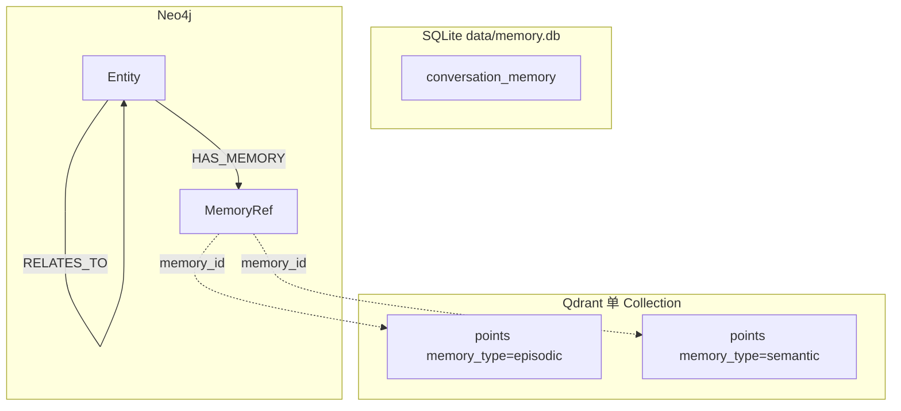

---

## 四、工厂 `create_memory_manager`（`memory/factory.py`）

### 4.1 调用方式

```python
from memory.factory import create_memory_manager

mem = create_memory_manager(
    namespace="mem:tester_id:default",
    db_path="data/memory_test.db",
    vector_backend="qdrant",      # 或 "sqlite" 回退旧实现
    graph_backend="neo4j",        # 或 "none" 不启用联想记忆
    qdrant_collection="agentcortex_memory_v1024",
    embedder=None,                # 默认 OpenAIEmbedder()
)
```

### 4.2 参数说明

| 参数 | 默认 | 作用 |
|------|------|------|
| `namespace` | （必填） | episodic/semantic/associative 的 `namespace`；conversation 的 `session_id` |
| `db_path` | `data/memory.db` | SQLite 路径（conversation 必选） |
| `vector_backend` | `"qdrant"` | `qdrant` → `EpisodicQdrantHandler` + `SemanticQdrantHandler` 共用一個 `QdrantMemoryStore` |
| `vector_backend` | `"sqlite"` | `EpisodicHandler` + `SemanticHandler`（关键词 + SQLite 内向量） |
| `graph_backend` | `"neo4j"` | 注册 `AssociativeHandler` + `Neo4jStore` |
| `graph_backend` | `"none"` | 不注册 associative |
| `qdrant_url` / `qdrant_collection` | 读 `.env` | 覆盖 Qdrant 连接与集合名 |
| `neo4j_uri` | 读 `NEO4J_URI` | 覆盖 Neo4j 连接 |
| `embedder` | `OpenAIEmbedder()` | 注入 mock 或其它嵌入实现 |

### 4.3 工厂组装流程

```
create_memory_manager(namespace)
    │
    ├─► ConversationSQLitesStore(db_path)
    │       └─► ConversationHandler(session_id=namespace)
    │
    ├─► [vector_backend == qdrant]
    │       ├─► QdrantMemoryStore(url, collection)
    │       ├─► OpenAIEmbedder()
    │       ├─► EpisodicQdrantHandler(store, embedder, namespace)
    │       └─► SemanticQdrantHandler(store, embedder, namespace)
    │
    ├─► [vector_backend == sqlite]
    │       ├─► EpisodicSQLiteStore(db_path)
    │       └─► SemanticSQLiteStore(db_path) + embedder
    │
    └─► [graph_backend == neo4j]
            ├─► Neo4jStore(uri) → ensure_schema 在首次写入时
            └─► AssociativeHandler(store, namespace)

    return MemoryManager(handlers={...})
```

---

## 五、MemoryManager 统一封装（`memory/manager.py`）

### 5.1 设计目标

1. **一个入口**：业务只调 `mem.remember` / `mem.recall`，用 `memory_type` 区分。
2. **返回分型**：`RecallResult` 按类型填充 `messages` / `items` / `graph`，避免混用。
3. **hybrid 有界**：默认 hybrid 只合并 **episodic + semantic**，不含 conversation 与 associative（防止把对话序和图结构塞进同一列表）。

### 5.2 `RecallResult`

```python
@dataclass
class RecallResult:
    memory_type: MemoryType | None
    messages: list[Message] | None = None           # conversation
    items: list[EpisodicItem | SemanticItem] | None # 向量长期记忆
    graph: AssociativeRecallResult | None = None      # associative
```

### 5.3 `remember` — 统一存储

| memory_type | 必填 | Manager 行为 |
|-------------|------|----------------|
| `conversation` | `message: Message` | → `ConversationHandler.append` |
| `episodic` | `content: str` | → `EpisodicQdrantHandler.remember`（内部 embed → `add_episodic`） |
| `semantic` | `content: str` | → `SemanticQdrantHandler.remember`（embed → `add_semantic`） |
| `associative` | `content` 和/或 `metadata` | → `AssociativeHandler.remember`（见下表） |

**长期记忆 metadata（episodic/semantic）**：

- `ref_session_id`：来源会话（写入 Item 字段，不留在 metadata JSON）
- `importance`：0–100，影响 Qdrant 容量驱逐顺序

**associative metadata 约定**：

| metadata 键 | 作用 |
|-------------|------|
| `from_name` + `to_name` | 建立 `RELATES_TO`（`content` 可作 `relation_label`） |
| `from_entity_type` / `to_entity_type` | 实体类型，默认 `other` |
| `entity_name` | 仅建/更新单个实体（缺省用 `content` 作实体名） |
| `entity_id` + `memory_type` + `memory_id` | `link_memory` 挂接 Qdrant 点 |
| `hops` / `include_memory_refs` | 主要用于 recall 的 `filters` |

### 5.4 `recall` — 统一检索

| 调用方式 | 行为 | 使用字段 |
|----------|------|----------|
| `memory_type="conversation"` | 最近 `top_k` 条 Message | `.messages` |
| `memory_type="episodic"` | 向量检索（cosine + `score_threshold`） | `.items` |
| `memory_type="semantic"` | 向量检索 | `.items` |
| `memory_type="associative"` | 实体名/别名 → 邻域图 | `.graph` |
| 不传 `memory_type` | 见 `RecallMode` | `.items`（仅向量） |

**`RecallMode`**（`memory_type` 未传时）：

| mode | 参与类型 |
|------|----------|
| `keyword` | 仅 episodic（Qdrant 下仍为向量检索，参数名保留兼容） |
| `semantic` | 仅 semantic |
| `hybrid` | episodic + semantic → `_deduplicate` → `top_k` |
| `graph` | 不参与多路；associative 须显式 `memory_type="associative"` |

**Qdrant 检索 filters**：`source`、`ref_session_id`、`embedding_model`（payload 索引过滤）。

**associative 检索 filters**：`hops`（1–2）、`include_memory_refs`（默认 true，无 `HAS_MEMORY` 时 Neo4j 可能 WARN）。

### 5.5 `forget` / `clear_all` / `run_maintenance`

| 方法 | 行为 |
|------|------|
| `forget(id, memory_type=...)` | episodic/semantic：按 Qdrant point id；associative：按 Entity id；conversation 不支持 |
| `clear_all(memory_type=...)` | 指定类型清空；不传则清空**所有已注册** handler |
| `run_maintenance()` | 仅 episodic/semantic 执行 TTL/容量（经 `QdrantMemoryStoreScope` 分类型驱逐） |

### 5.6 Manager 内部分派（总览）

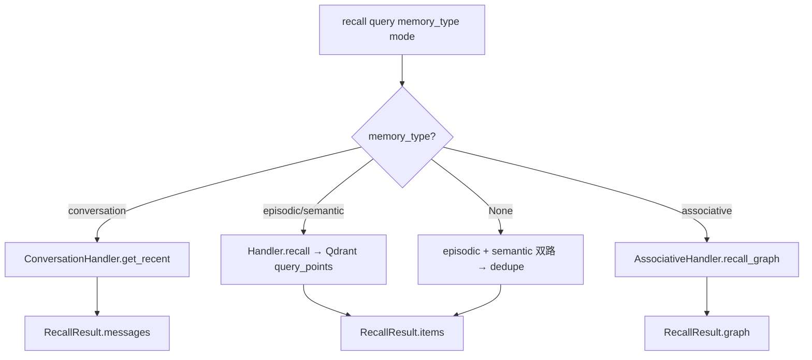

---

## 六、各记忆类型实现流程（默认 Qdrant + Neo4j）

### 6.1 Conversation（对话记忆）

**组件**：`ConversationHandler` + `ConversationSQLitesStore`

**写入流程**：

```
MemoryManager.remember(conversation, message=Message)
    → ConversationHandler.append
    → asyncio.to_thread(store.add_message, session_id, message, ...)
    → INSERT conversation_memory
```

**读取流程**：

```
MemoryManager.recall(conversation, top_k=N)
    → store.get_recent(session_id, N)
    → list[Message] 按 created_at 正序
```

**特点**：同步 SQLite 用 `check_same_thread=False`；**不做**单条 forget、存储层 TTL；长度由 `top_k` / Assembler 控制。

---

### 6.2 Episodic（情景记忆 · Qdrant）

**组件**：`EpisodicQdrantHandler` + `QdrantMemoryStore` + `OpenAIEmbedder`

**写入流程**：

```
remember(content, metadata?)
    │
    ├─► embedder.embed([content]) → vector
    ├─► 构建 EpisodicItem（namespace, content_hash, importance, ref_session_id…）
    └─► store.add_episodic(item, embedding)
            ├─► _ensure_collection(dim)   # 首次建 Collection
            ├─► _ensure_payload_indexes  # namespace, memory_type（Cloud 必需）
            └─► upsert point（payload.memory_type = "episodic"）
```

**读取流程**：

```
recall(query, top_k, score_threshold?)
    │
    ├─► embedder.embed([query])
    └─► store.search_episodic(namespace, query_embedding, top_k, score_threshold)
            ├─► query_points + Filter(namespace, memory_type=episodic)
            ├─► 命中后更新 payload.last_accessed_at / access_count（二次 upsert）
            └─► list[EpisodicItem]
```

**score_threshold**：相似度下限，默认 `QDRANT_SCORE_THRESHOLD`（0.55），Handler 可覆盖。

**生命周期**：`TTLBasedPolicy(30d, 1000)` → `QdrantMemoryStoreScope("episodic")` → `ttl_evict` / `capacity_evict`。

---

### 6.3 Semantic（语义记忆 · Qdrant）

**组件**：`SemanticQdrantHandler` + **同一** `QdrantMemoryStore` + 同一 `Embedder`

与 episodic **共用 Collection**，靠 `payload.memory_type = "semantic"` 隔离。

**写入**：`embed` → `SemanticItem`（含 `embedding_model` / `embedding_dim`）→ `add_semantic`。

**读取**：`search_semantic`（逻辑同 episodic，阈值与 filters 相同机制）。

**生命周期**：`TTLBasedPolicy(90d, 300)` + `QdrantMemoryStoreScope("semantic")`。

**注意**：Collection **向量维度**须与 embedding 模型一致；换模型应换 `QDRANT_COLLECTION` 或新集合，否则会维度校验报错。

---

### 6.4 Associative（联想记忆 · Neo4j）

**组件**：`AssociativeHandler` + `Neo4jStore`

**图模型（MVP）**：

| 节点/边 | 说明 |
|---------|------|
| `:Entity` | `id`, `namespace`, `name`, `entity_type`, `aliases`, `metadata_json`, … |
| `:MemoryRef` | `memory_type`, `memory_id`（指向 Qdrant point） |
| `-[:RELATES_TO]->` | 实体间关系，`relation_label`, `weight` |
| `-[:HAS_MEMORY]->` | Entity → MemoryRef |

**写入流程（关系）**：

```
remember(content="居住", metadata={from_name, to_name, relation_label, ...})
    → AssociativeHandler.remember
    → store.relate(namespace, from_name, to_name, ...)
            ├─ MERGE 两端 Entity
            └─ MERGE RELATES_TO 边
    返回 relation elementId
```

**写入流程（挂接向量记忆）**：

```
remember(metadata={entity_id, memory_type, memory_id, content_preview?})
    → store.link_memory → MERGE MemoryRef + HAS_MEMORY
```

**读取流程**：

```
recall(memory_type=associative, query="陈艳")
    → AssociativeHandler.recall_graph
    → store.recall_neighbors(namespace, query, hops, limit)
            ├─ MATCH 种子 Entity（name 或 aliases）
            ├─ 扩展 RELATES_TO 邻域（1–2 跳）
            └─ 可选加载 HAS_MEMORY → GraphMemoryRef 列表
    → RecallResult.graph = AssociativeRecallResult(seed, entities, relations, memory_refs)
```

**专用 API**（推荐中枢显式调用）：`remember_relation`、`remember_entity`、`link_memory`、`recall_graph`。

**生命周期**：当前无图淘汰；`run_maintenance` 返回 0。

**连接注意**：Aura 使用 `neo4j+s://`；`NEO4J_USER` 一般为 `neo4j`；Mac 上若仅 `nslookup 8.8.8.8` 可解析而 Python 失败，需修系统 DNS 或 `/etc/hosts`（见 `Neo4jStore._check_dns_or_hint`）。

---

## 七、核心端到端工作流

### 7.1 单次用户轮次（推荐）

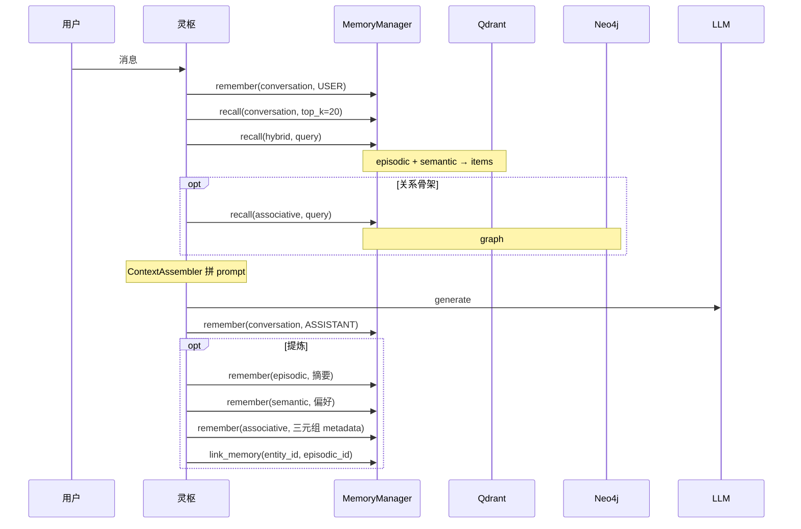

### 7.2 跨记忆协作（图 + 向量）

```
写入（会话结束）
  LLM 提炼 → [{from, rel, to}, 事实摘要, 稳定偏好]
      ├─ associative.remember(metadata=三元组)     → Neo4j
      ├─ episodic.remember(摘要)                   → Qdrant → id
      └─ associative.link_memory(实体, episodic_id)

读取（用户提问）
  ├─ associative.recall("陈艳")  → 邻居：上海、项目…
  └─ episodic/semantic.recall    → 相似事实与偏好
  → Assembler：关系骨架 + 向量细节 + 最近对话
```

---

## 八、Qdrant 存储要点（`QdrantMemoryStore`）

| 项 | 说明 |
|----|------|
| 单 Collection | episodic + semantic 共用，**必须** payload 区分 `memory_type` |
| 索引 | `namespace`、`memory_type` keyword 索引（Cloud 过滤必需） |
| 检索 | `query_points` + `score_threshold` |
| 驱逐 | scroll 拉取 → 按 `last_accessed_at` / `importance` 删除 |
| 作用域 | `QdrantMemoryStoreScope` 使 episodic/semantic **分开** TTL/容量 |

旧 SQLite 路径（`vector_backend=sqlite`）：episodic 关键词 LIKE；semantic 最近 800 条内存 cosine——仅作回退与对比。

---

## 九、Neo4j 存储要点（`Neo4jStore`）

| 项 | 说明 |
|----|------|
| Schema | `neo4j_schema.cypher`：`Entity`/`MemoryRef` 唯一约束与索引 |
| 隔离 | 所有 Cypher 带 `namespace` |
| 与 Qdrant | `MemoryRef.memory_id` = Qdrant point id；删向量需另调 `forget(episodic\|semantic)` |
| 冒烟 | `uv run python -m memory.store.neo4j_store` |

---

## 十、生命周期（Lifecycle）

| 类型 | 策略 | 实现 |
|------|------|------|
| episodic | TTL 30d，max 1000 | `TTLBasedPolicy` + `QdrantMemoryStoreScope("episodic")` |
| semantic | TTL 90d，max 300 | 同上，`"semantic"` |
| conversation | 无 | 仅 `clear_all` |
| associative | 无 | 预留 P2 |

驱逐顺序（容量）：`importance ASC` → `last_accessed_at ASC` → `access_count ASC` → `created_at ASC`（先删最不重要）。

`last_accessed_at`：Qdrant 在 **search 命中** 时更新；写入时设为当前时间。

---

## 十一、检索与 Hybrid 说明

### 11.1 Hybrid（向量双路）

```
recall(query, mode=hybrid, top_k=k)
    → episodic.recall(per_k) + semantic.recall(per_k)
    → _deduplicate(by id + content)
    → 截断 top_k
```

当前 **无 RRF 打分**；名为 hybrid，实为双路合并。P2 可做 RRF + 跨 episodic/semantic 重排。

### 11.2 Associative 与 Hybrid 分离

associative **不会**在 `mode=hybrid` 时自动并入；避免图结构与 `EpisodicItem` 列表混用。需要关系时 **显式** `memory_type="associative"`。

### 11.3 content_hash

写入时自动 SHA256 前 32 hex；索引已预留；**尚未**强制去重 upsert（P1）。

---

## 十二、与 ContextAssembler 的衔接（已实现）

ReActAgent 每轮通过 `MemoryContextProvider` + `ContextAssembler` 注入；格式如下：

```
发给 LLM 的 messages ≈
    [system: 人设 + 规则 + intent 输出规范]
  + [system: [MEMORY]…[/MEMORY]]              ← hybrid episodic/semantic
  + [system: [GRAPH]…[/GRAPH]]                ← associative 图摘要
  + [system: [DOCUMENTS]…[/DOCUMENTS]]        ← RAG 预取
  + [conversation 最近 N 条 Message]
  + [user: 当前输入]
```

长期记忆与图记忆均以 **文本摘要块** 注入，不破坏 tool 消息结构。回合结束后由 `MemoryConsolidator` 提炼写回 episodic/semantic/associative，并通过 `link_memory` 挂接图与向量（见第五篇）。

---

## 十三、模块与文件一览（当前）

```
memory/
├── manager.py                 # MemoryManager、RecallResult
├── factory.py                 # create_memory_manager
├── models.py                  # EpisodicItem、SemanticItem、Graph*、AssociativeRecallResult
├── types.py                   # MemoryType（含 associative）、RecallMode、EntityType
├── lifecycle.py               # TTLBasedPolicy
├── utils.py                   # 时间字符串、content_hash
├── handlers/
│   ├── base.py
│   ├── conversation_handler.py
│   ├── episodic_handler.py          # SQLite 回退
│   ├── episodic_qdrant_handler.py   # 默认 episodic
│   ├── semantic_handler.py
│   ├── semantic_qdrant_handler.py   # 默认 semantic
│   └── associative_handler.py
├── store/
│   ├── conversation_sqlite_store.py
│   ├── episodic_sqlite_store.py
│   ├── semantic_sqlite_store.py
│   ├── qdrant_memory_store.py
│   ├── qdrant_scope.py
│   ├── neo4j_store.py
│   └── neo4j_schema.cypher
├── embedders/
│   └── openai_embedder.py
├── consolidator.py            # 回合结束 LLM 提炼 + link_memory
└── test_memory_manager.py     # uv run python -m memory.test_memory_manager
```

### 环境变量

| 变量 | 用途 |
|------|------|
| `OPENAI_API_KEY` / `OPENAI_BASE_URL` / `OPENAI_EMBEDDING_MODEL` | Embedder |
| `QDRANT_URL` / `QDRANT_API_KEY` / `QDRANT_COLLECTION` | Qdrant Cloud |
| `QDRANT_SCORE_THRESHOLD` | 默认相似度下限（0.55） |
| `NEO4J_URI` / `NEO4J_USER` / `NEO4J_PASSWORD` / `NEO4J_DATABASE` | Neo4j Aura |
| `NEO4J_SKIP_DNS_CHECK` | 设为 1 跳过启动 DNS 诊断 |

---

## 十四、实现状态与后续计划

### 14.1 已完成

- [x] 四种记忆类型与 `MemoryType` 枚举  
- [x] `MemoryManager` 统一 API + `RecallResult.graph`  
- [x] `create_memory_manager`（qdrant + neo4j 默认）  
- [x] Qdrant 单 Collection + payload 索引 + episodic/semantic Handler  
- [x] Neo4j Entity / RELATES_TO / MemoryRef / HAS_MEMORY + AssociativeHandler  
- [x] TTL + 容量驱逐（Qdrant + scope）  
- [x] `test_memory_manager` 端到端验证  
- [x] `MemoryContextProvider`：hybrid + associative → ContextAssembler  
- [x] `MemoryConsolidator`：回合结束 LLM 提炼 → episodic/semantic/associative  
- [x] `link_memory`：图实体 `HAS_MEMORY` → Qdrant `memory_id`  

### 14.2 待办（接灵枢）

| 优先级 | 项 |
|--------|-----|
| P1 | `remember` 按 `content_hash` 去重 |
| P1 | hybrid RRF；图→向量联合 recall（先图后 filter） |
| P1 | 澄清阶段（`is_clear=false`）是否跳过提炼写入（可配置） |
| P2 | 图关系 TTL；别名模糊匹配；Neo4j 与 Qdrant 链接一致性任务 |

---

## 十五、设计评价摘要

**优势**：四种记忆边界清晰；Factory 一键组装多后端；Manager 统一入口且返回分型；Qdrant/Neo4j 分工明确（相似 vs 关系）；旧 SQLite 实现可回退，利于对比测试。

**注意**：hybrid 不含 associative；换 embedding 模型须换 Qdrant 集合；Neo4j 与 Qdrant 的 `HAS_MEMORY` 需业务维护最终一致；Mac DNS/代理可能影响 Aura 连接。

整体而言，**memory 层已具备四种记忆的生产级骨架**，并与 ReAct 意图澄清阶段完成 **读（预取）+ 写（提炼 + link）** 闭环；**第八篇 Hub** 已串联 ReAct → PlanExecute，长期记忆仍以 ReAct 回合为主入口。

---

# 第三篇 · `retrieval` RAG 知识库设计思路（当前实现）

本篇章描述灵枢 **`retrieval/` 文档知识库子系统** 的完整设计：**多格式文档加载**、**结构感知语义分块**、**ChromaDB 向量持久化**、**可选 LLM 查询优化（MQE / HyDE）**，以及与 `memory`、中枢 Agent、ContextAssembler 的边界与协作方式。

> **当前阶段**：已实现 **入库（index）+ 检索（retrieve）** 闭环；已注册 **`SearchDocumentsTool`** 供 ReAct 按需检索；完整 RAG「检索 → 生成引用回答」在 PlanExecute 阶段规划。冒烟入口：`retrieval/demo_rag.py`。

---

## 一、在灵枢整体架构中的位置

RAG 解决的是 **「用户上传的静态文档 / 知识文件里有什么」**，与 `memory` 解决的 **「这个 Agent / 用户历史上发生过什么」** 是两条线：

| 维度 | `memory/` | `retrieval/`（本文档） |
|------|-----------|------------------------|
| 数据来源 | 对话提炼、任务写入、图三元组 | 本地/业务文档（docx、pdf、md、代码等） |
| 典型内容 | 事实摘要、偏好、实体关系 | 手册、项目说明、面试材料、规范 |
| 默认存储 | Qdrant（episodic/semantic）+ Neo4j + SQLite | **ChromaDB** 本地持久化（`data/knowledge_db`） |
| 隔离键 | `namespace` / `session_id` | `doc_id`（单文档）+ 块级 `chunk_id` |
| 谁写入 | 中枢 / 提炼流水线 | `KnowledgeBase.add_document` 显式索引 |
| 谁读取 | `MemoryManager.recall` | `KnowledgeBase.search` |

```
用户 / API
    │
    ▼
灵枢中枢（ReAct → PlanExecute → Reflection）
    │
    ├── core/LLM                    生成、流式、Tool Calling
    │
    ├── memory/                     会话 + 长期记忆 + 图联想
    │       conversation / episodic / semantic / associative
    │
    └── retrieval/                  本文档范围
            KnowledgeBase             文档知识库（Chroma）
            ├── DocumentLoader        MarkItDown → Markdown
            ├── SemanticSplitter      标题树 + Token 分块 + overlap
            ├── QueryOptimizer        MQE / HyDE（可选）
            └── OpenAIEmbedder        与 memory 共用嵌入实现
    │
    ▼
context/ContextAssembler       记忆 items + RAG 片段 + conversation → prompt（ReAct 已接入）
```

| 中枢阶段 | RAG 用法 |
|----------|------------------|
| **ReAct** | 每轮 **自动预取** `kb.search` → `[DOCUMENTS]`；不足时 Agent 调 **`search_documents`** |
| **PlanExecute** | 子任务若依赖某份规范/项目文档，按 `doc_id` 或全局检索 |
| **Reflection** | 可选：对照检索片段检查回答是否「有据」 |

**`core` 明确不做 RAG**；**`memory` 不存整篇 docx**。文档正文走 `retrieval`，提炼后的事实可走 `memory.episodic`。

---

## 二、设计目标与原则

### 2.1 目标

1. **多格式统一入口**：PDF / Word / Excel / PPT / HTML 等经 MarkItDown 转为 Markdown，再分块，避免为每种格式写解析器。
2. **结构感知分块**：识别 Markdown `#` 与中文编号标题（一、二、（一）），块内保留 **标题路径**（`section_path`），利于溯源与结构类问题。
3. **向量检索可用**：Chroma 同时存 `documents`、`embeddings`、`metadatas`；检索返回文本、元数据、相似度分数。
4. **查询可增强**：可选 MQE（多查询扩展）、HyDE（假设文档嵌入），在 **不改索引** 的前提下提升 recall。
5. **与 memory 解耦**：独立 Collection / 目录；复用 `OpenAIEmbedder`，但不与 Qdrant 记忆 Collection 混用。

### 2.2 原则

| 原则 | 说明 |
|------|------|
| 检索 ≠ 回答 | `search` 只负责找片段；最终答案需 LLM **综合** 片段（且应声明「依据不足则不知道」） |
| 查询分层 | **用户原话** → **Agent 检索 query**（规划）→ **QueryOptimizer**（可选 MQE/HyDE）→ 向量检索 |
| 元数据一等公民 | 每块带 `doc_id`、`section_path`、`heading`、`prev/next_chunk_id`，为邻块扩展、过滤留口子 |
| 渐进交付 | 先跑通 index + retrieve；generate、rerank、hybrid BM25、Agent Tool 后续接 |

### 2.3 非目标（当前版本）

- 不做会话级「自动把聊天记录写入知识库」（那是 `memory.conversation` / `episodic`）。
- 不做多租户权限、文档版本 diff、增量 re-index 策略（仅 `delete_document` / `clear`）。
- 不做跨文档的全局 rerank 服务（MQE 仅在单库内合并去重）。

---

## 三、分层架构与模块划分

```
业务层（demo_rag / 未来 Agent Tool）
        │
        ▼
KnowledgeBase                    retrieval/knowledge_base.py
        │  add_document / search / delete_document / clear / get_document_list
        │
        ├─ DocumentLoader            retrieval/loader.py
        │      MarkItDown | 代码文件 → Markdown
        │
        ├─ SemanticSplitter          retrieval/semantic_splitter.py
        │      标题树 → section → token 切块 → overlap → metadata
        │
        ├─ OpenAIEmbedder            memory/embedders/openai_embedder.py（复用）
        │
        ├─ QueryOptimizer（可选）     retrieval/query_optimizer.py
        │      MQE / HyDE，依赖 core.create_llm()
        │
        └─ ChromaDB PersistentClient
               collection: documents（默认）
               path: data/knowledge_db（可配置）
```

| 文件 | 职责 |
|------|------|
| `loader.py` | 读盘 → 统一 Markdown 文本 |
| `semantic_splitter.py` | Markdown/纯文本 → `{content, metadata}[]` |
| `knowledge_base.py` | 编排入库、嵌入、Chroma CRUD、检索与 MQE/HyDE 合并 |
| `query_optimizer.py` | LLM 改写查询（检索前） |
| `demo_rag.py` | 冒烟：clear → index → search（none / mqe / hyde） |

**依赖关系**：`retrieval` → `memory.embedders`、`core`（仅 QueryOptimizer）；**不**依赖 `MemoryManager`。

---

## 四、领域数据与 Chroma 存储模型

### 4.1 单块（chunk）逻辑结构

入库前 `SemanticSplitter` 产出：

```python
{
    "content": str,      # 正文；常含 "一级 > 二级\n\n段落…" 路径前缀
    "metadata": {
        "chunk_id": "chunk_0",
        "chunk_index": 0,
        "total_chunks": N,
        "section_path": "一、项目A > （一）背景",   # 标题路径，用 " > " 连接
        "heading": "（一）背景",                    # 当前 section 直属标题
        "prev_chunk_id": "chunk_{i-1}" | None,
        "next_chunk_id": "chunk_{i+1}" | None,
    }
}
```

`KnowledgeBase.add_document` 合并文档级字段后写入 Chroma：

| 字段 | 类型 | 含义 |
|------|------|------|
| `doc_id` | str | 文档 UUID（hex），删除与列表去重键 |
| `doc_name` | str | 文件名，如 `AI项目….docx` |
| `source_type` | str | 扩展名，如 `.docx` |
| `indexed_at` | str | 索引时间 `YYYY-MM-DD HH:MM:SS` |
| 上述 chunk 元数据 | — | 全部写入 payload（`None` 会过滤掉） |

**Chroma 存储 ID**：`{doc_id}_{chunk_id}`，例如 `046dc66f…_chunk_12`。

### 4.2 检索命中结构

`search` 返回 `List[Dict]`，每项：

| 字段 | 含义 |
|------|------|
| `id` | Chroma 中的 storage_id |
| `text` | 块正文 |
| `metadata` | 完整 payload |
| `score` | `1.0 - distance`（Chroma 默认 L2 距离时；分数越高越相似） |

### 4.3 与 memory 向量库对比

| 项 | memory（Qdrant） | retrieval（Chroma） |
|----|------------------|---------------------|
| 用途 | 情景/语义记忆 | 文档知识库 |
| 过滤 | `namespace`、`memory_type` | `where={"doc_id": "…"}`（Chroma metadata 过滤） |
| 分数阈值 | `QDRANT_SCORE_THRESHOLD` | **未实现**（检索全返回 top_k） |
| 嵌入模型 | 同 `OpenAIEmbedder` | 同左，**换模型需重建索引** |

---

## 五、文档加载（`DocumentLoader`）

### 5.1 流程

```
file_path
    │
    ├─ 扩展名在 _custom_converters？ → 用户注册回调
    ├─ 扩展名在 code_extensions？   → 读源码，包装为 Markdown 代码块
    └─ 否则                           → MarkItDown.convert → text_content
```

### 5.2 MarkItDown

- 依赖：`markitdown[docx]`（`pyproject.toml` 已声明；docx 需 `mammoth`、`lxml`）。
- 失败时抛出 `ImportError` 或 MarkItDown 自带 `MissingDependencyException`（缺可选格式依赖时）。

### 5.3 代码文件

扩展名映射为语言标识后输出：

```markdown
# filename.py

```python
...
```
```

便于后续按文件粒度索引代码库（当前 demo 以 docx 为主）。

---

## 六、结构感知分块（`SemanticSplitter`）

### 6.1 默认参数

| 参数 | 默认值 | 含义 |
|------|--------|------|
| `chunk_token_size` | 384 | 单块目标 token 上限（估算） |
| `overlap_token_size` | 64 | 与上一块尾部重叠 token |
| `min_chunk_token_size` | 100 | 过短块合并到前一块 |
| `max_heading_chars` | 40 | 超过则不当「中文编号标题」 |

### 6.2 Token 估算（中英文混合）

```
tokens ≈ ceil(中文字数×0.7 + 英文词数×1.3 + 数字组数×1.0)
```

用于控长与 overlap 截取，**非** tiktoken 精确值，但与中文技术文档场景足够。

### 6.3 标题识别优先级

1. Markdown：`^(#{1,6})\s+(.+)$`
2. 中文/数字编号（行首匹配，且整行 ≤ `max_heading_chars`）：
   - `第一章`、`第二节`
   - `一、`、`二.`
   - `（一）`、`(二)`
   - `1.`、`2、`

### 6.4 分块主流程

```
原始 Markdown 文本
    │
    ▼
_parse_sections()          扫描标题行 → 标题树 path_stack
    │                      每 section：level, heading, path[], content（直属正文）
    ├─ 无标题 → _split_flat_text()  按段落聚合
    │
    ▼
_split_sections_into_chunks()
    │  每 section：path_prefix = " > ".join(path)
    │  effective_size = chunk_token_size - path_prefix 的 token 成本
    │  _token_split(content) → 子块；块正文前加 path_prefix
    │
    ▼
_finalize_chunks()
    │  过短块合并
    │  除首块外：上一块尾部按句 overlap
    │  生成 chunk_id / prev_chunk_id / next_chunk_id
    │
    ▼
List[{ content, metadata }]
```

### 6.5 切割边界策略

`_token_split` 优先在 `\n\n` 段落边界合并；超长段落用 `_split_long_paragraph` 按 `。！？.!?;；` 分句再拼。

**设计意图**：块语义尽量完整；overlap 减少「答案跨两块」时的断裂。

### 6.6 对「结构类问题」的含义

例如「一共有几个大项目」：答案往往分布在 **多个 section 的标题/路径** 上，而非某一个「技术栈」长段落。分块器已在 `section_path` / `heading` 和正文前缀中保留结构信息，但 **纯向量检索** 仍可能把 query 吸到细节段——需更大 `top_k`、更好 query、或后续 **元数据 boost / 混合检索**（见待办）。

---

## 七、知识库核心（`KnowledgeBase`）

### 7.1 构造

```python
KnowledgeBase(
    embedder: Embedder,                    # 通常 OpenAIEmbedder()
    persist_dir: str = "data/chroma_kb",   # demo 用 data/knowledge_db
    collection_name: str = "documents",
    query_optimizer: QueryOptimizer | None = None,
)
```

启动时 `chromadb.PersistentClient` + `get_or_create_collection`。

### 7.2 `add_document(file_path, doc_id=None) → doc_id`

| 步骤 | 动作 |
|------|------|
| 1 | `doc_id = uuid4().hex`（可传入固定 id） |
| 2 | `loader.load` → `markdown_text` |
| 3 | `splitter.split` → `chunk_dicts`；空则直接返回 doc_id |
| 4 | 组装 `ids`、`documents`、`metadatas`；`storage_id = f"{doc_id}_{chunk_id}"` |
| 5 | `embedder.embed` **分批** `batch_size=8`（兼容 API 批量限制） |
| 6 | `collection.add(ids, documents, embeddings, metadatas)` |

**注意**：`demo_rag` 每次 `kb.clear()` 会 **删除整个 collection** 再重建，适合开发；生产应改为按 `doc_id` 增量更新。

### 7.3 `search(query, top_k=3, where=None, optimize="none")`

```
optimize == "none"
    → _vector_search(query)

optimize == "mqe" 且 query_optimizer 非空
    → optimizer.optimize(query, "mqe") → List[str] 变体
    → 每个变体 _vector_search(..., top_k)
    → extend 后 _deduplicate_and_sort(..., top_k)   # 按 id 去重，保留先出现的分数

optimize == "hyde"
    → optimizer.optimize(query, "hyde") → 假设段落 str
    → _vector_search(hyde_text, top_k)
```

`_vector_search`：

1. `query_emb = embedder.embed([query])[0]`
2. `collection.query(query_embeddings=[query_emb], n_results=top_k, where=where, include=[documents, metadatas, distances])`
3. 格式化为 `{id, text, metadata, score}` 列表

### 7.4 其他 API

| 方法 | 行为 |
|------|------|
| `delete_document(doc_id)` | `collection.delete(where={"doc_id": doc_id})` |
| `clear()` | 删 collection 再 `get_or_create_collection` |
| `get_document_list()` | `collection.get(include=["metadatas"])`，按 `doc_id` 去重 |

---

## 八、查询优化（`QueryOptimizer`）

依赖 `core.provider.LLMProvider`（`create_llm()`）。

### 8.1 MQE（Multi-Query Expansion）

**思路**：一个用户/Agent 问法 → LLM 生成多个语义相近、表述不同的 query → 分别检索 → 合并去重 → 取 top_k。

Prompt 要点：生成 N 个变体，换行分隔，无编号；失败则回退 `[原 query]`；保证原 query 在列表中。

**局限**：去重时 **同一 id 只保留第一次出现的分数**，非 max-pool；变体过多会增加 embed + query 次数。

### 8.2 HyDE（Hypothetical Document Embeddings）

**思路**：先让 LLM 写一段「像文档里会出现的回答段落」，用该段落 embedding 去检索，拉近 query 与文档表述空间。

Prompt 要点：百科全书/技术文档风格；失败回退原 query。

**适用**：概念性、描述性问题；对 **纯计数/目录** 类问题效果不稳定，仍依赖 Agent 写好检索意图。

### 8.3 与 Agent 改写 query 的关系

```
用户：「AI项目一共有几个项目？」
         │
         ▼（规划，尚未在代码中实现）
Agent Tool：改写为
    「文档章节 一 二 三 项目列表」
    「AI项目 工作内容 大标题」
         │
         ▼（可选）
QueryOptimizer：MQE 或 HyDE
         │
         ▼
KnowledgeBase.search
```

**两层互补**：Agent 负责 **任务理解 → 检索意图**；MQE/HyDE 负责 **在已有意图下扩写或假设文档**。仅 HyDE 不能替代 Agent 对「要数项目」的 query 设计。

---

## 九、端到端实现流程

### 9.1 入库（Indexing）

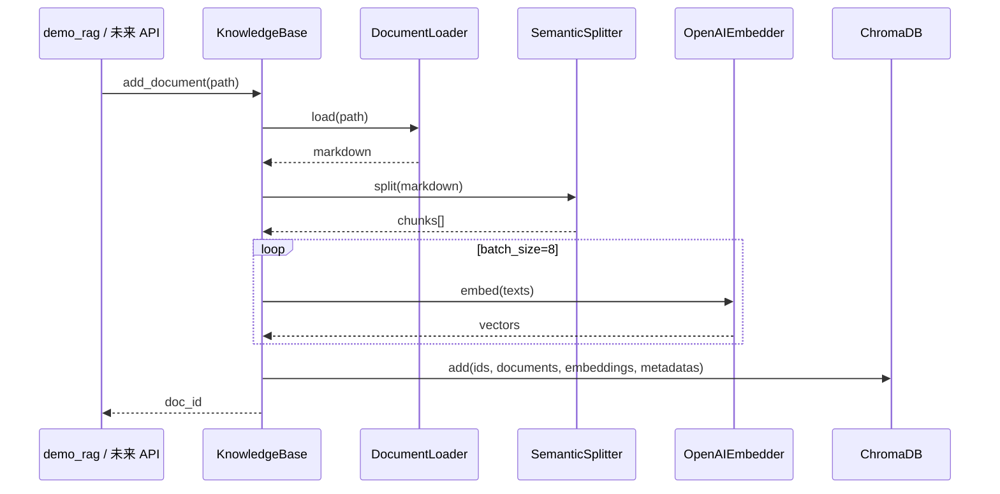

### 9.2 检索（Retrieval）

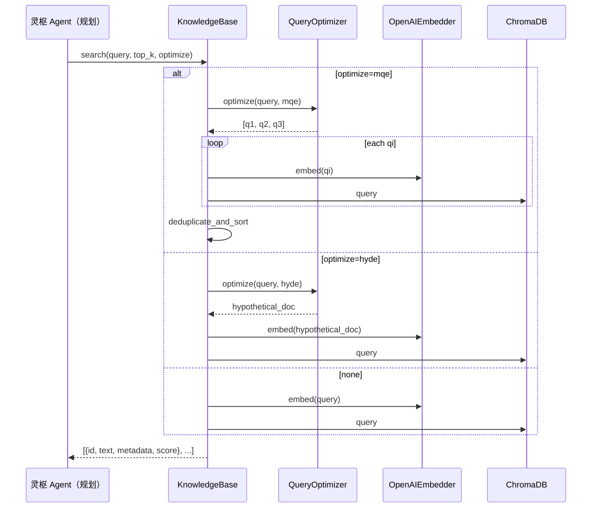

### 9.3 完整 RAG（规划，未实现）

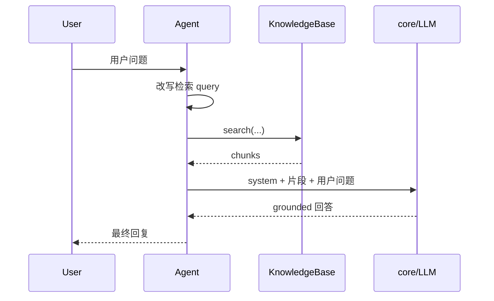

---

## 十、与 `memory`、ContextAssembler 的协作

### 10.1 何时用 RAG vs 记忆

| 场景 | 用 retrieval | 用 memory |
|------|--------------|-----------|
| 「这份 docx 里第三个项目用的什么框架？」 | ✓ 检索文档块 | 可选：若曾提炼过可 episodic 补 |
| 「上次你说陈艳在哪个项目？」 | ✗ | ✓ episodic + associative |
| 「我的编码偏好是什么？」 | △ 若写在文档里可 RAG | ✓ semantic 更合适 |
| 会话最近 5 轮原文 | ✗ | ✓ conversation |

### 10.2 ContextAssembler 拼接顺序（已实现）

与第二篇第十二章、第四篇一致，RAG / 记忆 / 图分别作为 **独立 SYSTEM 块** 注入：

```
[system: 人设与规则]
[system: ## 检索到的文档片段\n片段1\n---\n片段2…]   ← retrieval
[system: ## 长期记忆\n…]                            ← memory items
[system: ## 实体关系\n…]                            ← associative graph
[conversation 最近 N 条]
[user: 当前问题]
```

生成 prompt 应要求：**仅依据片段回答；片段不足则说明无法从文档得出结论**。

### 10.3 Agent Tool 形态（已实现）

- **`SearchDocumentsTool`**（`tools/builtin/retrieval_tool.py`）：Agent 按需检索知识库；与 ReAct 每轮 `_prefetch_documents` 互补。
- 返回格式化字符串；若要将结果再传入 Assembler，应使用 `KnowledgeBase.search` 的原始 `List[Dict]`，避免双层 `[DOCUMENTS]` 标签。

```python
# 伪代码
async def search_knowledge_base(query: str, top_k: int = 8, doc_id: str | None = None):
    where = {"doc_id": doc_id} if doc_id else None
    return await kb.search(query, top_k=top_k, where=where, optimize="none")
```

System prompt 要求：结构/计数类问题先改写 query（章节、项目名、一/二/三），再调用工具。

---

## 十一、运行方式与环境变量

### 11.1 冒烟测试

```bash
# 项目根目录
PYTHONPATH=. uv run python retrieval/demo_rag.py
```

当前 `demo_rag.py` 行为：

1. `OpenAIEmbedder()` + `QueryOptimizer(create_llm())`
2. `KnowledgeBase(persist_dir="data/knowledge_db", …)`
3. `kb.clear()` → `add_document(默认 docx 路径)` → 打印 `doc_id`、文档数
4. `search(query, top_k=3, optimize="none" | "mqe" | "hyde")` 并打印命中预览

默认 query 示例：`AI项目一共有几个项目`（用于观察结构类问题的检索局限）。

### 11.2 环境变量

| 变量 | 用途 |
|------|------|
| `OPENAI_API_KEY` | Embedder + QueryOptimizer（LLM） |
| `OPENAI_BASE_URL` | 兼容网关 / DashScope 等 |
| `OPENAI_EMBEDDING_MODEL` | 默认 `text-embedding-v3`（以 embedder 代码为准） |
| LLM 相关 | 与 `core` 篇一致（`create_llm` 读取的配置） |

**持久化目录**：`data/knowledge_db/`（`chroma.sqlite3` + 向量段文件），已在 `.gitignore` 中忽略为宜。

### 11.3 依赖（`pyproject.toml`）

- `chromadb`：向量库
- `markitdown[docx]`：Office 等转 Markdown
- `openai`：嵌入与 LLM
- 复用 `memory.embedders`，无额外 RAG 专用 embed 包

---

## 十二、模块与文件一览（当前）

```
retrieval/
├── __init__.py
├── loader.py                 # DocumentLoader
├── semantic_splitter.py      # SemanticSplitter
├── knowledge_base.py         # KnowledgeBase
├── query_optimizer.py        # QueryOptimizer（MQE / HyDE）
└── demo_rag.py               # 冒烟：入库 + 三种 optimize 检索

data/knowledge_db/            # Chroma 持久化（运行时生成，非源码）
```

**跨模块复用**：

```
memory/embedders/openai_embedder.py   ← KnowledgeBase.embedder
core/（create_llm, Message, LLMProvider）← QueryOptimizer.llm
```

---

## 十三、检索质量说明（实践结论）

以默认 docx《AI项目个人工作内容及实现思路》为例，query=`AI项目一共有几个项目`，`top_k=3`，`optimize=none` 时：

- 常命中 **技术栈、实现细节** 块（score ~0.32–0.36），而非各章「一、二、三」总览块。
- **原因**：向量语义更接近「项目/技术」长文，而非「计数」；query 未 Agent 改写；`top_k` 偏小。
- **交给 LLM 仅这 3 段**：难以可靠回答「共几个项目」，可能幻觉或答「不知道」。
- **改进方向**（与待办一致）：Agent 改写 query、增大 `top_k`、MQE、按 `section_path` 去重排序、标题块加权、混合 BM25、检索后 generate。

---

## 十四、实现状态与后续计划

### 14.1 已完成

- [x] `DocumentLoader`（MarkItDown + 代码文件 Markdown 化）
- [x] `SemanticSplitter`（中文/Markdown 标题、token 控长、overlap、丰富 metadata）
- [x] `KnowledgeBase`（add / search / delete / clear / list）
- [x] Chroma 持久化 + 分批 embedding
- [x] `QueryOptimizer`（MQE、HyDE）及 `search(optimize=…)` 集成
- [x] `demo_rag.py` 端到端冒烟

- [x] `SearchDocumentsTool` + ReAct 只读工具白名单
- [x] ContextAssembler 注入 RAG 片段块（ReAct `_prefetch_documents`）

### 14.2 待办（接灵枢）

| 优先级 | 项 |
|--------|-----|
| P0 | PlanExecute 阶段：检索后 **LLM generate**（grounded 回答 + 引用） |
| P1 | `top_k` / `score_threshold` 可配置；MQE 去重改为 **同 id 取 max score** |
| P1 | 检索结果利用 `prev_chunk_id` / `next_chunk_id` **邻块扩展** |
| P1 | 按 `doc_id` 增量索引，避免每次 `clear()` |
| P2 | 混合检索（BM25 + 向量）或 `heading` / `section_path` 加权 |
| P2 | 多 collection / 租户 `namespace`；文档更新 re-index 策略 |
| P2 | 评测集：结构类、事实类、跨段类 query 的 recall@k |

---

## 十五、设计评价摘要

**优势**：链路清晰（load → split → embed → chroma）；`SemanticSplitter` 对中文项目文档友好；与 `memory`、Qdrant 职责分离；MQE/HyDE 可选且不绑死索引；复用 `OpenAIEmbedder` 降低配置面。

**注意**：当前是 **retrieve-only**，完整 RAG 还差 generate 与 Agent 编排；纯向量对结构/计数题偏弱；`demo` 全量 `clear` 不宜生产；换 embedding 模型须 **重建** Chroma 索引；`QueryOptimizer._hyde` 中一处使用 dict 消息、一处使用 `Message`，建议统一为 `Message` 以免与 LLM 封装不一致。

整体而言，**retrieval 层已具备可扩展的文档知识库骨架**，ReAct 阶段已完成 **预取 + Tool 按需检索**；下一步重点是 PlanExecute  grounded 生成与结构类检索增强。

---

# 第四篇 · `context` 上下文装配设计思路（当前实现）

本篇章描述灵枢 **`context/` 上下文子系统** 的完整设计：**GSSC 四阶段流水线**、**`ContextAssembler` 多源装配**、与 `memory` / `retrieval` / `core` 的协作边界，以及单次 LLM 调用前的端到端工作流程。

> **当前阶段**：已实现 `ContextAssembler.assemble()`、**ReActAgent 主循环接入**、`MemoryContextProvider`（`[MEMORY]` + `[GRAPH]`）、`[DOCUMENTS]` 预取；tool 消息 `tool_calls` 字段透传仍为 P1。

---

## 一、在灵枢整体架构中的位置

`context` 不负责「存记忆」或「检文档」，只负责在 **每次调 LLM 之前**，把多源信息裁剪、排序、组装成 **`List[Message]`**，供 `core.LLMProvider` 直接使用。

```
用户输入
    │
    ▼
灵枢中枢（ReAct / PlanExecute / Reflection）  ← 规划：何时 recall / search
    │
    ├── memory/          remember / recall → items、messages、graph
    ├── retrieval/       KnowledgeBase.search → [{text, metadata, score}]
    │
    ▼
context/                 本文档范围
    ContextAssembler.assemble(...)
    │
    ▼
core/LLM               generate / generate_stream
```

| 模块 | 职责 | 与 Context 的关系 |
|------|------|-------------------|
| `memory` | 持久化与检索对话/长期记忆/图 | 提供 `histories`、`memories`（调用方 recall 后传入） |
| `retrieval` | 文档向量库 | 提供 `documents`（`kb.search` 结果，**非** Tool 已格式化的整段字符串） |
| `tools` | `SearchDocumentsTool` 等 | Agent 侧检索；结果若为 dict 列表则直传 assembler，避免双层 `[DOCUMENTS]` |
| `context` | Token 预算内的 prompt 组装 | **唯一**输出 `Message` 列表的模块 |
| `core` | 调模型 | 只消费 assembler 输出，不关心记忆从哪来 |

**设计原则**：存储与检索在下游模块完成；**装配与裁剪**集中在 `ContextAssembler`，避免 Agent 手写拼接 prompt。

---

## 二、设计模式：GSSC 流水线

采用 **Gather → Select → Structure → Compress**（简称 **GSSC**）四阶段，将「收集候选 → 预算内筛选 → 固定消息形态 → 超限再裁」拆开，便于单独测试与调参。

```
┌─────────┐   ┌─────────┐   ┌───────────┐   ┌──────────┐
│ Gather  │ → │ Select  │ → │ Structure │ → │ Compress │ → List[Message]
│ 汇集候选 │   │ 去重筛选 │   │ 角色与块   │   │ 首尾保留  │
└─────────┘   └─────────┘   └───────────┘   └──────────┘
```

| 阶段 | 方法 | 作用 |
|------|------|------|
| **G**ather | `_gather` | 将 system / memory / document / history 统一为 **candidate** 字典，打上 `type`、`priority`、`score` |
| **S**elect | `_select` | 去重、相关性阈值、按优先级+分数排序、在 Token 预算内贪心选取 |
| **S**tructure | `_structure` | 转为 `core.models.Message`：SYSTEM 块 + 多轮历史 + 末尾 USER（当前任务） |
| **C**ompress | `_compress` | 若总 token 仍超 `max_tokens`，保留首条 SYSTEM 与最后 USER，中间从后往前保留 |

对外唯一入口：

```python
messages = assembler.assemble(
    system_prompt="...",           # 必备：人设、工具规则
    memories=[...],                # 可选：长期记忆条目
    documents=[...],               # 可选：RAG 命中列表
    histories=[...],               # 可选：conversation 最近 N 条 Message
    current_task="用户本轮输入",    # 可选：作为最后一条 USER
)
# → await llm.generate_stream(messages)
```

---

## 三、输入协议与数据来源

### 3.1 `assemble` 参数

| 参数 | 类型 | 来源（典型） | 说明 |
|------|------|--------------|------|
| `system_prompt` | `str` | Agent / 中枢配置 | 角色设定、工具使用规则；**始终保留** |
| `memories` | `List[Any]` | `MemoryManager.recall` → `.items` | 需有 `content`；`EpisodicItem` / `SemanticItem` 或 `dict` |
| `documents` | `List[Dict]` | `KnowledgeBase.search` | 每项含 `text`、`metadata`、`score`；与 `SearchDocumentsTool` 内部字段一致 |
| `histories` | `List[Message]` | `ConversationHandler` / SQLite store `get_recent` | 完整多轮；存储层不负责裁剪条数 |
| `current_task` | `str` | 当前用户 query | 非空时追加为 **最后一条** `Role.USER` |

### 3.2 构造参数

| 参数 | 默认 | 含义 |
|------|------|------|
| `max_tokens` | `3000` | 上下文总 Token 预算（估算值） |
| `system_reserve_ratio` | `0.2` | 为 system 类内容预留的比例（见 §八注意） |
| `min_relevance` | `0.3` | memory/document 最低 `score`，低于则丢弃（system 不过滤） |

### 3.3 Candidate 内部结构

`_make_candidate` 统一字段：

```python
{
    "type": "system" | "memory" | "document" | "history",
    "content": str,
    "priority": int,      # 越大越优先
    "score": float,       # 相关性，用于过滤与排序
    "original_role": str, # 仅 history：user/assistant/tool/system
}
```

---

## 四、Gather：多源汇集与优先级

### 4.1 优先级模型

| type | priority | 默认 score | 注入形态 |
|------|----------|------------|----------|
| `system` | 100 | 1.0 | 原始 system_prompt |
| `memory` | 70 | 0.7（对象无 score 时） | 前缀 `[相关记忆]` |
| `document` | 50 | 来自 RAG `score` | `[来源: … \| 章节: … \| 相关度: …]\n{text}` |
| `history` | 30 | 0.5 | 保留 `original_role`，不在此阶段改 role |

**意图**：人设 > 长期记忆 > 文档片段 > 历史轮次（在 Select 预算竞争时，记忆与文档优先于更早的对话）。

### 4.2 文档格式化（与 RAG 对齐）

Gather 阶段对每条 RAG 命中格式化，与 `tools/builtin/retrieval_tool.py` 展示逻辑一致，便于日后 Tool 返回 dict 列表后直接 `assemble`：

```
[来源: AI项目….docx | 章节: … > 二、数控机床… | 相关度: 0.36]
{chunk 正文}
```

Structure 阶段再将多条 document 包入：

```
[DOCUMENTS]
…
[/DOCUMENTS]
```

**注意**：若把 `SearchDocumentsTool.execute()` 返回的 **整段字符串**（已含 `[DOCUMENTS]`）当作一条 `documents` 传入，会出现 **双层标签**；应传 `KnowledgeBase.search` 的原始 `List[Dict]`。

### 4.3 历史对话

- 按调用方传入顺序逐条加入 candidate（通常已是时间正序的 `get_recent`）。
- **不做**去重（每条 history 独立 fingerprint 豁免）。

---

## 五、Select：去重、过滤与预算

### 5.1 流程

```
candidates
    → 按 (priority, score) 降序排序
    → 去重：同 type + content 前 50 字指纹，保留高分条；history 跳过
    → 过滤：type==system 或 score >= min_relevance
    → 强制加入 system_prompt（1 条）
    → 贪心：在 other_budget 内按排序依次加入 memory / document / history
    → selected[]
```

`other_budget = max_tokens - int(max_tokens * system_reserve_ratio)`。

### 5.2 设计含义

- **相关性门槛**：弱化低分 RAG / 记忆噪声。
- **贪心填充**：实现简单；在预算紧张时，**高 priority 的 memory、document 可能占满**，history 在 Select 阶段即被截断（Compress 无法恢复未选中的历史）。

---

## 六、Structure：输出消息形态

组装后的 **推荐顺序**（与多数 Chat Completions 习惯一致）：

```
[0] SYSTEM     — system_prompt（人设、工具规则）
[1] SYSTEM     — [MEMORY]…[/MEMORY]（若有 memories）
[2] SYSTEM     — [DOCUMENTS]…[/DOCUMENTS]（若有 documents）
[3..n]         — histories（USER / ASSISTANT / TOOL / SYSTEM 原角色）
[n+1] USER     — current_task（当前轮用户输入）
```

**为何记忆/文档用 SYSTEM 块**：避免打乱 user/assistant 交替；模型仍可从 SYSTEM 中读取「背景事实」与「引用文档」。

**与 tool calling**：当前 Structure **仅复制** `content` 与 `role`；若 history 含 `tool_calls` / `tool_call_id`，需在 P0 中透传（见 §十一）。

---

## 七、Compress：超限裁剪策略

当 `sum(estimate_tokens(msg)) > max_tokens`：

| 部分 | 策略 |
|------|------|
| **首部** | 固定 `messages[0]`（仅第一条 SYSTEM，通常是 system_prompt） |
| **尾部** | 固定 `messages[-1]`（通常为 current_task 的 USER） |
| **中间** | `messages[1:-1]` 从 **后往前** 贪心装入剩余 budget，再反转为正序 |

**意图**：保证「人设 + 当前问题」不丢；优先保留 **靠近当前轮** 的中间内容（较新的 SYSTEM 块或对话）。

**局限**：`[MEMORY]`、`[DOCUMENTS]` 若在 `messages[1]`、`messages[2]`，超限时可能被裁掉，而仅保留 `messages[0]` 的人设（见 §八）。

---

## 八、Token 估算

与 `retrieval/semantic_splitter` 类似，采用中英文混合 **启发式估算**（非 tiktoken）：

```
tokens ≈ 中文字数×0.7 + 英文词数×1.3 + 数字组数×1.0
```

用于 Select 贪心与 Compress 判断；与真实模型 tokenizer 存在偏差，适合脚手架阶段，生产可换精确计数。

---

## 九、端到端工作流程

### 9.1 单次用户轮次（推荐，中枢侧编排）

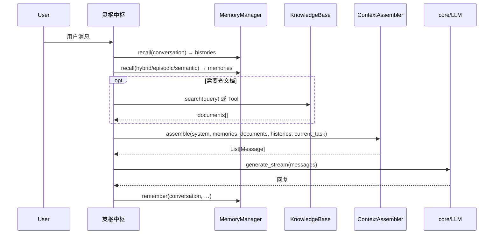

### 9.2 与 conversation 存储的分工

| 层级 | 职责 |
|------|------|
| `ConversationSQLitesStore` | **全量**持久化每轮 Message |
| `ContextAssembler` | 读取最近 N 条后，按 **Token 预算** 裁剪再发给 LLM |

对话条数上限由调用方 `get_recent(limit=…)` 控制；最终能否进入 prompt 由 assembler 的 Select + Compress 决定。

### 9.3 冒烟测试（`__main__`）

```bash
PYTHONPATH=. uv run python -m context.assembler
```

行为：

1. 从 `data/memory.db` 读取 `SESSION_ID` 最近 20 条真实对话；
2. 注入模拟 `memories`、`documents`；
3. 对 `max_tokens ∈ {500, 1500, 4000}` 分别 `assemble` 并打印消息条数与 token 估算。

用于验证 **预算越小 → 中间内容越少**，而不依赖完整 Agent。

---

## 十、模块与文件一览（当前）

```
context/
├── __init__.py          # 导出 ContextAssembler、MemoryContextProvider
├── assembler.py         # GSSC 实现 + 本地冒烟
└── memory_context.py    # 长期记忆召回 → assembler 输入适配
```

**依赖**：

- `core.models`：`Message`、`Role`
- 冒烟可选：`memory.store.conversation_sqlite_store`

**不依赖** `MemoryManager`、`KnowledgeBase`（由调用方注入数据，保持 context 层无存储耦合）。

---

## 十一、实现状态与后续计划

### 11.1 已完成

- [x] GSSC 四阶段：`Gather` / `Select` / `Structure` / `Compress`
- [x] 多源输入：`system_prompt`、`memories`、`documents`、`histories`、`current_task`
- [x] 优先级：system > memory > document > history
- [x] `[MEMORY]` / `[DOCUMENTS]` / `[GRAPH]` 块与 RAG metadata 格式化
- [x] Compress：固定保留人设 + `[MEMORY]` + `[DOCUMENTS]` + `[GRAPH]`
- [x] `MemoryContextProvider` + ReAct `_bootstrap_context` 集成
- [x] 本地冒烟（真实 conversation + 多档 budget）

### 11.2 待办（接灵枢）

| 优先级 | 项 |
|--------|-----|
| P0 | history 透传 `tool_calls`、`tool_call_id`、`name`（tool calling 闭环） |
| P1 | Select：**为 history 预留独立 token 配额**，避免被 memory/document 挤光 |
| P1 | `system_reserve_ratio` 真正约束 SYSTEM 类消息总长度 |
| P2 | 精确 tokenizer；多模态 `content: list` 支持 |

---

## 十二、设计评价摘要

**优势**：GSSC 阶段清晰，与 memory/RAG 解耦；输出直接兼容 `core` 的 `Message` 列表；`[MEMORY]` / `[DOCUMENTS]` 标签便于模型与人类调试；优先级体现「人设与事实优先于远历史」；冒烟脚本可复现预算效果。

**注意**：Select 阶段 history 优先级仍最低，预算紧张时远历史易丢失。

整体而言，**context 层已与 ReAct 意图澄清闭环**，是灵枢「memory + retrieval → LLM」链路上的 **拼 prompt 最后一环**；PlanExecute 当前以 `StructuredIntent` + 子 Agent 上下文为主，尚未在每步 Execute 中复用 ContextAssembler（见 **第八篇**）。

---

# 第五篇 · `agents` 意图澄清智能体设计思路（当前实现）

本篇章描述灵枢 **`agents/` 意图澄清阶段** 的完整设计：**ReActAgent** 定位、**StructuredIntent**  handoff 协议、与 `memory` / `retrieval` / `context` 的协作、**流式事件**模型，以及单轮端到端工作流程。

> **当前阶段**：已实现 **ReAct**（第五篇）、**PlanExecute**（第六篇）、**Reflection**（第七篇）、**Hub 编排**（第八篇，含审查打回后的指定步骤修订重跑）。端到端入口：`agents/test_hub.py`。

---

## 一、在灵枢整体架构中的位置

ReAct 在灵枢三范式中负责 **第一阶段：意图澄清**，不是任务执行器。

| 维度 | ReAct（意图澄清） | PlanExecute（规划执行） |
|------|-------------------|-------------------------|
| **目标** | 弄清用户要什么 | 拆解并完成任务 |
| **输出** | `StructuredIntent` + 简短 `user_reply` | 完整交付物 / 子 Agent 结果 |
| **工具** | 只读：`search_documents`、`search_memory` | 写入、派发、生成型工具 |
| **记忆写** | 回合结束 **提炼** episodic/semantic/associative | 任务节点可追加事实 |
| **何时结束** | `is_clear=true` 或仍需追问（`is_clear=false`） | 计划步骤全部完成 |

```
用户输入（单轮或 REPL 多轮）
    │
    ▼
CortexHub.run_turn_stream（第八篇）
    │
    ├──► ReActAgent（第五篇）     意图澄清；写 conversation / 提炼长期记忆
    │         └── StructuredIntent + user_reply
    │
    ├──► PlanExecuteAgent（第六篇）  is_clear + should_invoke_plan → Plan → Execute → deliverable
    │
    ├──► ReflectionAgent（第七篇）   审查 ExecutionResult → ReflectionVerdict
    │
    └──►（可选）修订重跑            verdict.passed=false → 重跑 related_step_ids + revision_feedback

ReAct 侧：context/ + memory/ + retrieval/ + core/LLM + agents/intent.py
PlanExecute 侧：plan_execute.py + plan_models.py + specialists/
Hub 侧：hub.py + hub_models.py + test_hub.py + default_registry.py
```

**设计原则**：ReAct **不**代用户完成长文交付（完整合同、长清单）；只澄清并结构化，执行留给 PlanExecute。

---

## 二、核心组件

### 2.1 模块一览

```
agents/
├── base.py              # Agent 抽象基类（history、memory 引用）
├── react.py             # ReActAgent：流式主循环、上下文引导、回合结束
├── intent.py            # StructuredIntent、parse、IntentStreamFilter
├── plan_execute.py      # PlanExecuteAgent（第六篇）
├── plan_models.py       # ExecutionPlan / ExecutionResult 等
├── reflection.py        # ReflectionAgent（第七篇）
├── reflection_models.py # ReflectionVerdict / ReflectionIssue
├── specialists/         # LLMSpecialistAgent + RegistryStepDelegate
├── test_reflection.py   # Reflection 冒烟
├── hub.py               # CortexHub 编排（第八篇）
├── hub_models.py        # HubTurnOutcome、路由常量
├── default_registry.py  # build_default_registry() 供 Hub / test_plan_execute 复用
├── test_hub.py          # Hub 端到端：单轮 + --repl
├── events.py            # AgentEvent 族（含 HubPhase / HubTurnComplete）
├── test.py              # ReAct 单阶段冒烟
├── test_plan_execute.py # PlanExecute 冒烟（流式 Plan + Execute）
└── __init__.py

context/
├── memory_context.py    # MemoryContextProvider：hybrid + associative → assembler 输入
└── assembler.py         # GSSC 装配（ReAct 每轮 _bootstrap_context 调用）

memory/
└── consolidator.py      # MemoryConsolidator：LLM 提炼 → remember + link_memory

tools/builtin/
├── retrieval_tool.py    # SearchDocumentsTool
└── memory_tool.py       # SearchMemoryTool
```

### 2.2 ReActAgent 构造参数（要点）

| 参数 | 作用 |
|------|------|
| `memory_manager` | 长期记忆预取与提炼写入 |
| `conversation_store` + `session_id` | 对话历史 SQLite 存读（二者同时配置才生效） |
| `context_assembler` | GSSC 装配；未配置则每轮重置为 `[SYSTEM, USER]` |
| `knowledge_base` | 每轮 RAG 预取 `[DOCUMENTS]` |
| `consolidate_memory` | 回合结束是否 LLM 提炼写长期记忆（默认 `True`） |
| `emit_structured_intent` | 是否要求模型输出 `` ```intent` `` 块 |
| `prefetch_memory_top_k` / `prefetch_docs_top_k` | 预取条数 |

---

## 三、StructuredIntent：与 PlanExecute 的 handoff 协议

### 3.1 字段说明

```python
@dataclass
class StructuredIntent:
    is_clear: bool          # 意图是否已足够清晰，可进入执行阶段
    intent: str             # 意图类型（蛇形英文），如 contract_drafting / general_chat
    summary: str            # 一句结构化任务描述，供 PlanExecute 规划
    slots: dict             # 已澄清的关键信息
    missing: list[str]      # 仍缺的信息项（is_clear=false 时必填）
    user_reply: str         # 给用户看的短回复（与流式正文一致）
```

### 3.2 模型输出格式

每轮回复须包含：

1. **user_reply 正文**（流式展示；不含 `user_reply:` 字段名前缀）
2. **`` ```intent` JSON 块 ``**（流式中通过 `IntentStreamFilter` 隐藏，仅在事件中暴露）

```intent
{
  "is_clear": false,
  "intent": "general_task",
  "summary": "咨询试用期内因频繁迟到解除劳动合同的合法性",
  "slots": { "employee_name": "张三", "employment_status": "试用期内" },
  "missing": ["是否有书面劳动合同与考勤证据"],
  "user_reply": "…"
}
```

解析失败时：追加 `INTENT_REFORMAT_NUDGE` 非流式补全；仍失败则 fallback `intent=unknown`。

### 3.3 intent 类型参考

| intent | 含义 | Hub 路由（`should_invoke_plan()`） |
|--------|------|-------------------------------------|
| `document_qa` | 从文档/知识库查事实 | `is_clear=true` → 进 Plan |
| `contract_drafting` | 撰写/修改合同 | 同上 |
| `general_task` | 其他需规划的任务 | 同上 |
| `general_chat` | 闲聊、无需规划 | `is_clear=true` → **不进** Plan |
| 任意 + `is_clear=false` | 仍需澄清 | **不进** Plan（继续 ReAct） |

---

## 四、单轮工作流程（端到端）

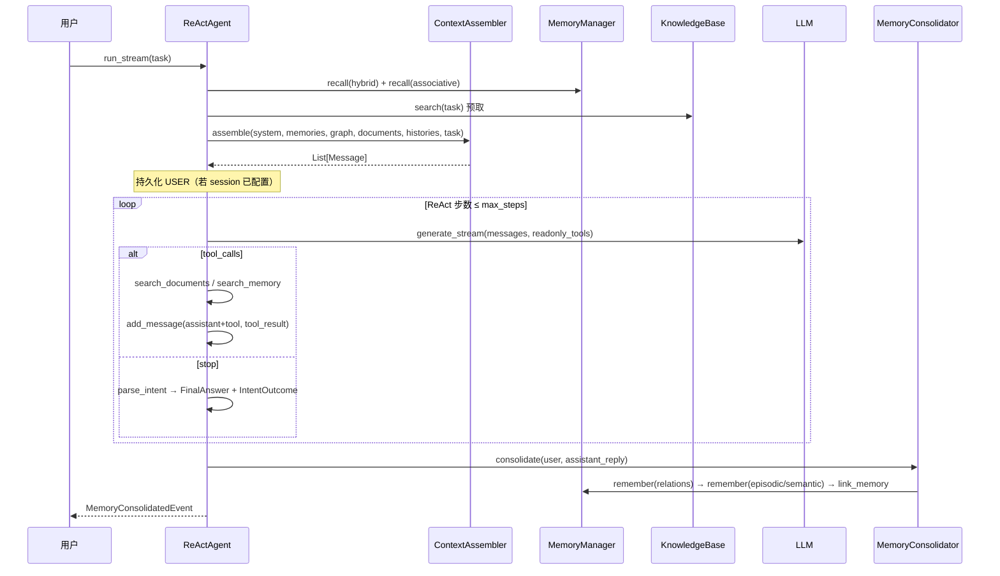

### 4.1 阶段说明

| 阶段 | 方法 | 说明 |
|------|------|------|
| **引导上下文** | `_bootstrap_context` | 预取记忆/RAG/历史 → `ContextAssembler.assemble` |
| **推理循环** | `run_stream` | 流式 LLM；`IntentStreamFilter` 隐藏 intent JSON |
| **只读工具** | `ToolRunner` | 白名单：`search_documents`、`search_memory` |
| **结束回合** | `_finish_turn` | 解析 intent → 事件 → 持久化 ASSISTANT |
| **记忆提炼** | `MemoryConsolidator` | 关系先于向量；`link_memory` 挂接图与 Qdrant |

### 4.2 对话历史存读

- **条件**：`conversation_store` 与 `session_id` **同时**传入
- **写**：USER（bootstrap）、ASSISTANT（含 tool_calls）、TOOL 结果、最终回复
- **读**：`get_recent(limit=history_limit)` → assembler `histories`
- **注意**：与 `MemoryManager.remember(conversation)` 是两条入口；ReAct 当前走 **Store 直连**

---

## 五、记忆：读与写分工

### 5.1 读（每轮自动）

| 来源 | 机制 | 注入形态 |
|------|------|----------|
| episodic + semantic | `MemoryContextProvider.recall(hybrid)` | `[MEMORY]` |
| associative | 同 Provider 显式图检索 | `[GRAPH]` |
| documents | `_prefetch_documents` | `[DOCUMENTS]` |
| conversation | `_load_conversation_histories` | 多轮 Message |
| 按需补充 | `search_memory` / `search_documents` Tool | 工具结果进 history |

### 5.2 写（回合结束）

`MemoryConsolidator` 用 LLM 从「用户 + 助手回复」提炼：

```
1. relations  → Neo4j 实体与边
2. episodic   → Qdrant 事实短句
3. semantic   → Qdrant 稳定偏好
4. link_memory → 实体 HAS_MEMORY → MemoryRef → Qdrant memory_id
```

**当前策略**：澄清阶段（`is_clear=false`）也会提炼；后续可加 `consolidate_only_when_clear` 开关。

---

## 六、流式事件（对外协议）

| 事件 | 时机 | 用途 |
|------|------|------|
| `TextDeltaEvent` | 流式 token | 用户可见回复（已过滤 intent 块） |
| `ToolCallEvent` / `ToolResultEvent` | 工具调用 | Trace / UI |
| `RunStatsEvent` | 回合结束前 | 步数、耗时 |
| `IntentOutcomeEvent` | 解析成功 | Hub / PlanExecute 读 `intent` |
| `FinalAnswerEvent` | 最终 | `content` + `intent` |
| `MemoryConsolidatedEvent` | 提炼后 | episodic/semantic/relations/links |
| `ErrorEvent` | 异常 | 错误信息 |

Hub 消费示例：

```python
intent = agent.get_last_intent()
if intent is None or not intent.is_clear:
    # 继续 ReAct 或多轮澄清
elif intent.should_invoke_plan():
    # → PlanExecute(intent)
else:
    # general_chat：FinalAnswer 已足够
    pass
```

---

## 七、System Prompt 要点

默认 system 由 `_build_default_system(tools)` 生成，包含：

1. **意图澄清专家**角色与禁止事项（不写完整交付物）
2. `INTENT_TYPE_HINTS` — intent 类型说明
3. `INTENT_OUTPUT_INSTRUCTION` — user_reply + `` ```intent` `` 格式
4. 已注册**只读工具**列表（动态）

过早 STOP 时：`premature_stop_nudge` / `forced_finalize_nudge` 促使模型输出合法 intent 块。

---

## 八、冒烟与验证

```bash
# 意图澄清 + 记忆 + RAG 端到端
PYTHONPATH=. uv run agents/test.py

# 记忆 API 独立验证
uv run python -m memory.test_memory_manager

# ContextAssembler 预算裁剪
PYTHONPATH=. uv run python -m context.assembler
```

`agents/test.py` 需配置：`memory_manager`、`conversation_store`、`session_id`、`ContextAssembler`、`KnowledgeBase`、只读 Tool 注册。

---

## 九、实现状态与后续计划

### 9.1 已完成

- [x] `ReActAgent` 流式主循环 + 只读 Tool 白名单
- [x] `StructuredIntent` + `` ```intent` `` 解析 / 补全 / 流式隐藏
- [x] `_bootstrap_context`：MemoryContextProvider + RAG + conversation + Assembler
- [x] `IntentOutcomeEvent` + `get_last_intent()` + `should_invoke_plan()`
- [x] `SearchDocumentsTool` / `SearchMemoryTool`
- [x] `MemoryConsolidator` + `link_memory` 自动挂接
- [x] `MemoryConsolidatedEvent` + `agents/test.py` 可读 trace
- [x] **PlanExecute MVP**（详见 **第六篇**）：`PlanExecuteAgent` + 专业 Agent 流式分发 + `agents/test_plan_execute.py`
- [x] **Reflection MVP**（详见 **第七篇**）
- [x] **Hub 编排**（详见 **第八篇**）：`CortexHub` + `agents/test_hub.py`（`--repl`）

### 9.2 待办

| 优先级 | 项 |
|--------|-----|
| P1 | 澄清阶段限制工具调用次数，避免无效 `search_documents` 连搜（见第八篇 §注意） |
| P1 | `consolidate_only_when_clear`：澄清阶段可选跳过长期记忆写入 |
| P1 | link 策略收紧：正文须含实体名才 `link_memory` |
| P2 | ReAct `accept_stop` 回调：无 `` ```intent` `` 时自动 nudge（Hub 未强制） |

---

## 十、设计评价摘要

**优势**：ReAct 职责边界清晰（只澄清、不交付）；StructuredIntent 为 PlanExecute 提供稳定 handoff；读写在 memory/context/retrieval 层解耦；事件流便于 CLI 与后续 WebSocket；只读 Tool 与预取互补。

**注意**：`agents/test.py` 仅单轮 ReAct；`test_plan_execute.py` 仍可直接喂 intent 做阶段调试；澄清阶段在知识库无相关法律文档时可能多轮 `search_*`（单条用户消息内 ReAct `max_steps` 可达 6～8）；多轮 REPL 共用 `session_id` 时历史会合并 slots，测试「首轮必澄清」需新 session 或清库。

整体而言，**ReAct 已与 Hub、PlanExecute、Reflection 形成可运行主链路**（第八篇）；阶段冒烟脚本仍保留便于拆分调试。

---

# 第六篇 · `agents` 规划执行智能体设计思路（当前实现）

本篇章描述灵枢 **PlanExecute 阶段** 的完整设计：**PlanExecuteAgent** 定位、与第五篇 **StructuredIntent** 的 handoff、**Plan → Execute → Aggregate** 三阶段流水线、**专业 Agent 注册与流式分发**，以及可插拔组件与冒烟验证。

> **当前阶段**：已实现 **PlanExecute MVP**（LLM 规划 + Registry 流式执行 + 默认汇总）；**Hub 自动串联**见第八篇；**修订重跑**（`revision_feedback` + `rerun_step_ids` + `prior_outputs`）已实现。待办：步级 GSSC、并行 Execute、按任务类型定制 Aggregator。

---

## 一、在灵枢整体架构中的位置

PlanExecute 在灵枢三范式中负责 **第二阶段：规划与执行**，消费 ReAct 产出的 `StructuredIntent`，产出可交付的 `ExecutionResult`。

| 维度 | ReAct（第五篇） | PlanExecute（本篇） |
|------|-----------------|---------------------|
| **输入** | 用户自然语言 | `StructuredIntent`（`summary` + `slots`） |
| **输出** | 短 `user_reply` + intent JSON | `deliverable` + `trace` + 原始 `plan` |
| **LLM 用法** | 多轮对话 + 只读 Tool | Plan 一次规划；每步专业 Agent 一次生成 |
| **记忆/RAG** | 每轮预取 + 回合结束写回 | 当前 MVP：**未**逐步装配 GSSC；意图与前置步骤文本注入子任务 |
| **结束条件** | 解析出 `StructuredIntent` | 计划步骤全部跑完（成功/失败/跳过）后汇总 |

```
StructuredIntent（ReAct handoff）
    │
    ▼
PlanExecuteAgent.execute_stream(intent)
    │
    ├── Plan      LLMPlanGenerator → ExecutionPlan（```plan``` JSON）
    ├── Execute   按 step_id 串行；registry.resolve → delegate_stream
    └── Aggregate DefaultResultAggregator → deliverable
    │
    ▼
ExecutionResult（→ Hub 展示 / Reflection 审查）
```

**入口约束**（在 `execute_stream` 开头校验）：

- `intent.is_clear` 必须为 `true`，否则 `ErrorEvent` 并返回。
- `intent.should_invoke_plan()` 必须为 `true`（如 `general_chat` 不应进入本阶段）。
- 测试脚本 `agents/test_plan_execute.py` 直接构造 intent，用于**阶段调试**；生产路径由 **第八篇 Hub** 在 `is_clear` 后调用。

**刻意不做**：PlanExecute 内不再嵌「轻量自检」层（原 `PlanSelfChecker` 已移除）；交付物质量审查由 **ReflectionAgent**（第七篇）承担；**优化（改稿）** 由 Hub 触发 PlanExecute 重跑，不在 Reflection 内改 `deliverable`。

---

## 二、数据协议（`plan_models.py`）

| 类型 | 含义 |
|------|------|
| `ExecutionStep` | 单步：`step_id`、`agent_type`、`task_description`、`expected_output`、`dependencies` |
| `ExecutionPlan` | Plan 产出：`task_type`、`rationale`、`steps`、`unfulfillable_steps` |
| `SubTaskResult` | 专业 Agent 单步返回：`success`、`content`、`agent_id`、`elapsed_ms` |
| `ExecutionStepTrace` | Execute 轨迹：`status`（success/failed/skipped）、`output` / `error` |
| `ExecutionResult` | 最终：`deliverable`、`trace`、`partial_success`、`plan`、`source_intent` |

`partial_success` 语义：当 **部分步骤成功、部分失败** 时为 `true`；**全部成功** 时为 `false`（命名偏历史，阅读 trace 为准）。

---

## 三、可插拔组件（`plan_execute.py`）

| 协议 / 类 | 职责 | 默认实现 |
|-----------|------|----------|
| `PlanGenerator` | `StructuredIntent` → `ExecutionPlan` | `StubPlanGenerator`（单步占位） |
| `LLMPlanGenerator` | LLM 生成 ```plan``` JSON，解析为 `ExecutionPlan` | 生产用；失败回退 Stub |
| `AgentRegistry` | 列出 / 按 `agent_type` 解析专业 Agent 元数据 | `InMemoryAgentRegistry` |
| `StepDelegate` | 将一步分发给专业 Agent | `StubStepDelegate`（占位失败） |
| `RegistryStepDelegate` | 映射到 `LLMSpecialistAgent` 并流式执行 | 见 `agents/specialists/` |
| `ResultAggregator` | 多步 `trace` → 单一 `deliverable` | `DefaultResultAggregator`（按 step_id 拼接 `## 步骤 N`） |

`PlanExecuteAgent` 构造参数：`plan_generator`、`registry`、`step_delegate`、`aggregator`、`step_timeout_retry`（失败重试次数，默认 1 次重试）。

---

## 四、Plan 阶段

### 4.1 规划 Prompt 要点（`PLAN_GENERATION_SYSTEM`）

- 每一步的 `agent_type` **必须**来自 Registry 提供的可用类型列表。
- 无可用 Agent 的类型写入 `unfulfillable_steps`，不得出现在 `steps`。
- `dependencies` 只能引用更小的 `step_id`。
- 输出格式：`` ```plan` `` 包裹的 JSON。

### 4.2 解析与校验

- `parse_plan_json(text)`：支持 `` ```plan` `` / `` ```json` `` 或裸 JSON。
- `plan_from_dict(...)`：构建 `ExecutionStep` 列表；若 `agent_type` 不在 Registry 已知集合，记入 `unfulfillable_steps` 并跳过该步。
- 若解析后 `steps` 为空，回退 `StubPlanGenerator` 单步计划。

### 4.3 流式 Plan（测试与 UI）

`LLMPlanGenerator.create_plan_stream(intent)`：

1. 产出 `PlanTextDeltaEvent`（原始 JSON 增量）。
2. 结束时产出 `PlanReadyEvent(plan=ExecutionPlan)`。
3. 流式失败时 `ErrorEvent` + fallback 计划。

`PlanExecuteAgent.execute_stream` 内若未传 `plan`，则调用 `plan_generator.create_plan`（非流式）；测试脚本**单独**调用 `create_plan_stream` 以便终端先看到 Plan 流式输出，再以 `skip_plan_generation=True` 只跑 Execute。

---

## 五、Execute 阶段

### 5.1 串行调度逻辑

对 `plan.steps` 按 `step_id` 排序后 **严格串行**（无依赖步骤也顺序执行，暂不支持并行）：

1. **依赖检查**：`dependencies` 中任一步未在 `completed_outputs` 中 → `StepStatus.SKIPPED` + `StepErrorEvent`。
2. **Registry 解析**：`registry.resolve(step.agent_type)` → `agent_info`（含 `agent_id`）；无匹配 → SKIPPED。
3. **StepStartEvent**：携带 `step_id`、`description`、`agent_type`、`agent_id`。
4. **上下文 `context`**（传给专业 Agent）：
   - `intent`：`StructuredIntent.to_dict()`
   - `plan_task_type`
   - `dependency_outputs`：`{ dep_step_id: 前置步骤全文 }`
   - `step`：当前步 `to_dict()`
5. **流式执行**：`RegistryStepDelegate.delegate_stream` → `StepOutputDeltaEvent` → 最终 `SubTaskResult`。
6. 成功：写入 `completed_outputs[step_id]`，追加 `ExecutionStepTrace`，`StepCompleteEvent`。
7. 失败：`StepErrorEvent`，该步不进入 `completed_outputs`（后续依赖步可能 SKIP）。

### 5.2 专业 Agent（`agents/specialists/`）

| 模块 | 说明 |
|------|------|
| `worker.py` | `LLMSpecialistAgent`：系统提示词 + 用户 prompt（任务 / 预期产出 / intent / 前置步骤）；`run` 与 `run_stream` |
| `delegate.py` | `RegistryStepDelegate`：按 `agent_type` 或 `agent_id` 解析 worker，转发流式事件 |
| `create_default_specialists(llm)` | 内置 `programming`（prog-001）、`legal`（legal-001） |

用户 prompt 中 **「前置步骤产出」** 段确保例如「先技术规格、后法律条款」时，步骤 2 能看见步骤 1 全文。

### 5.3 接入新专业 Agent（两处对齐）

仅改 Registry **不够**；Execute 侧必须能调到对应工人：

1. **`InMemoryAgentRegistry.register(...)`**（或持久化 Registry 实现）  
   字段示例：`agent_id`、`agent_type`、`capabilities`、`description`。

2. **`create_default_specialists(llm)`**（或构造 `RegistryStepDelegate(llm, specialists={...})`）  
   增加 `LLMSpecialistAgent(..., system_prompt=...)`，`agent_type` / `agent_id` 与 Registry 一致。

复杂 Agent（多轮 Tool、写库）可自定义 `StepDelegate`，实现 `delegate` 与可选 `delegate_stream`（产出 `StepOutputDeltaEvent` + 末尾 `SubTaskResult`）。

---

## 六、Aggregate 与结果

`DefaultResultAggregator`：按 `step_id` 升序，将所有 **成功** 步骤的 `output` 拼为：

```markdown
## 步骤 1
…

## 步骤 2
…
```

若存在失败步，前缀说明失败 `step_id`；若全无产出，返回占位文案。

`execute_stream` 尾声：

- `RunStatsEvent`：计划步数、实际分发次数、失败次数、耗时。
- `ExecutionResultEvent`：`result=ExecutionResult`。
- `FinalAnswerEvent`：`content=deliverable`（便于与 ReAct 事件消费方统一）。

`get_last_result()`：供 Hub / Reflection 读取上一轮完整结果。

---

## 七、流式事件（PlanExecute 扩展）

| 事件 | 时机 | 用途 |
|------|------|------|
| `PlanTextDeltaEvent` | Plan LLM 流式 | 终端 / UI 展示原始 plan JSON |
| `PlanReadyEvent` | Plan 解析完成 | 测试脚本拿到 `ExecutionPlan` |
| `PlanCreatedEvent` | Execute 开始 | 步骤条；`steps` 为 dict 列表 |
| `StepStartEvent` | 单步开始 | 展示任务与 agent 信息 |
| `StepOutputDeltaEvent` | 专业 Agent 流式 | 逐步打字机输出 |
| `StepCompleteEvent` | 单步成功 | `summary` 为完整步骤产出 |
| `StepErrorEvent` | 依赖/Registry/执行失败 | 错误信息 |
| `ExecutionResultEvent` | 全流程结束 | 完整 `ExecutionResult` |
| `RunStatsEvent` | 结束前 | 统计 |
| `FinalAnswerEvent` | 同上 | 用户可见 deliverable |
| `ErrorEvent` | 任意阶段失败 | 错误终止 |

---

## 八、与第五篇、第八篇的衔接

**生产路径**（`CortexHub`，见第八篇）：ReAct 结束后 `react.get_last_intent()`，Hub 内根据 `is_clear` / `should_invoke_plan()` 决定是否 `execute_stream`。

**阶段调试**（绕过 Hub）：

```bash
PYTHONPATH=. uv run agents/test_plan_execute.py
```

流程：手写或打印 `StructuredIntent` → Registry → **Plan 流式** → **Execute 逐步流式** → deliverable。

**修订重跑**（Hub 在 Reflection 不通过后调用）：

```python
await plan_execute.execute_stream(
    intent,
    plan=existing_plan,
    skip_plan_generation=True,
    revision_feedback=...,
    rerun_step_ids=[2],
    prior_outputs={1: "步骤1沿用产出"},
)
```

---

## 九、端到端时序（MVP）

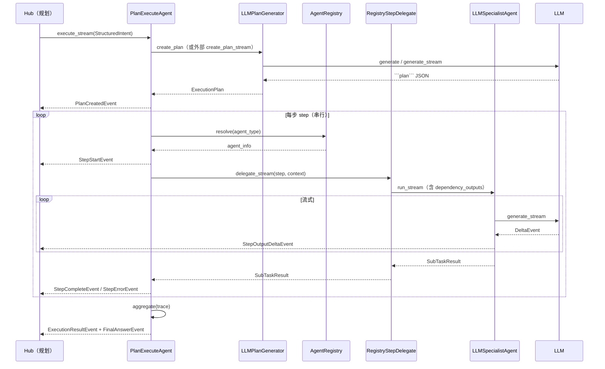

---

## 十、实现状态与后续计划

### 10.1 已完成

- [x] `PlanExecuteAgent`：`execute` / `execute_stream`（支持 `skip_plan_generation` + 预置 `plan`）
- [x] `LLMPlanGenerator` + `parse_plan_json` / `plan_from_dict` + Registry 约束 `agent_type`
- [x] `LLMPlanGenerator.create_plan_stream` + `PlanTextDeltaEvent` / `PlanReadyEvent`
- [x] `InMemoryAgentRegistry` + 串行 Execute + 依赖注入 `dependency_outputs`
- [x] `RegistryStepDelegate` + `LLMSpecialistAgent`（programming / legal）+ `delegate_stream`
- [x] `DefaultResultAggregator` + `ExecutionResult` / `get_last_result()`
- [x] `agents/test_plan_execute.py` 流式冒烟
- [x] **修订重跑**：`revision_feedback`、`rerun_step_ids`、`prior_outputs`；未重跑步骤显示「沿用上一轮」
- [x] **Hub 串联**（第八篇）：`stream_plan_separately` 先 `create_plan_stream` 再 `skip_plan_generation=True` 执行

### 10.2 待办

| 优先级 | 项 |
|--------|-----|
| P1 | Execute 步级 **ContextAssembler**（按子任务预取 memory/RAG） |
| P1 | **无依赖步骤并行** Execute（DAG 调度） |
| P1 | `ResultAggregator` 策略：合同类任务以**最后一步**为 deliverable，而非全文拼接 |
| P2 | 持久化 Registry / 专业 Agent 配置外置（YAML 或 DB） |
| P2 | PlanExecute 回合结束写 episodic（任务级记忆，建议由 Hub 触发一次） |
| P2 | Reflection 对照 RAG / 记忆（只读 Tool） |

---

## 十一、设计评价摘要

**优势**：与 ReAct 职责分离清晰；`StructuredIntent` → `ExecutionPlan` → 专业 Agent 链路可观测（流式事件齐全）；Registry + Delegate 双扩展点；依赖步骤全文下传；修订重跑可只改失败步并沿用前置产出。

**注意**：Aggregator 默认拼接所有成功步，交付物可能冗长；`partial_success` 命名易误解；Plan 与 Execute 未共享 ReAct 的 GSSC 预取。

整体而言，**PlanExecute 已通过第八篇 Hub 与 ReAct、Reflection 贯通**；下一步重点是执行阶段 RAG/记忆与汇总策略优化。

---

# 第七篇 · `agents` 质量审查智能体设计思路（当前实现）

本篇章描述灵枢 **Reflection 阶段** 的完整设计：**ReflectionAgent** 定位、与第六篇 **ExecutionResult** 的 handoff、**LLM 只读审查** 流程、**ReflectionVerdict** 输出协议，以及与 Hub「优化」分工。

> **当前阶段**：已实现 **Reflection MVP**（L0 + L1 LLM 审查 + `agents/test_reflection.py`）；**Hub 自动审查与修订闭环**见第八篇。待办：审查阶段只读对照 RAG。

---

## 一、在灵枢整体架构中的位置

Reflection 在灵枢三范式中负责 **第三阶段：质量审查（反思）**，**不**负责第四阶段「优化」——优化由 **Hub 再次调用 PlanExecute** 完成。

| 维度 | PlanExecute（第六篇） | Reflection（本篇） |
|------|----------------------|-------------------|
| **输入** | `StructuredIntent` | `ExecutionResult`（含 `deliverable`、`trace`、`plan`、`source_intent`） |
| **输出** | `deliverable` + 执行轨迹 | `ReflectionVerdict`（`passed` + `issues` + `recommendation`） |
| **LLM 角色** | 规划 + 专业 Agent 生成 | 只读批判性审查 |
| **是否改稿** | 是（生成正文） | **否**（只指出问题） |
| **典型失败后续** | — | Hub 读 `issues` → 重跑 PlanExecute 某步或整段 |

```
ExecutionResult（PlanExecute 输出）
    │
    ▼
ReflectionAgent.review_stream(result)
    │
    ├── L0 规则（trace 失败 / deliverable 空 → 直接 verdict，不调 LLM）
    └── L1 LLM 审查（intent + plan + trace + deliverable）
    │
    ▼
ReflectionVerdict（→ Hub 决定是否交付 / 是否重跑 Plan）
```

**与「执行 → 反思 → 优化」的对应**：

| 教科书步骤 | 灵枢实现 |
|------------|----------|
| 执行 | PlanExecute（第六篇） |
| 反思 | ReflectionAgent（本篇） |
| 优化 | **Hub + PlanExecute 再执行**（非 `optimization.py`） |

---

## 二、核心输出：`ReflectionVerdict`（`reflection_models.py`）

Hub 与测试脚本的主消费对象是 **`ReflectionVerdict`**，不是流式正文。

| 字段 | 类型 | 含义 |
|------|------|------|
| `passed` | `bool` | **True**：建议将当前 `deliverable` 视为可交付；**False**：不应直接交付 |
| `summary` | `str` | 一两句审查总评 |
| `issues` | `list[ReflectionIssue]` | 结构化问题列表 |
| `recommendation` | `str` | 给 Hub 的下一步建议（如「重跑 step 1、2，统一源代码归属表述」） |
| `review_report` | `str` | LLM 审查说明全文（流式拼接，便于日志/UI） |

`ReflectionIssue` 单条：

| 字段 | 说明 |
|------|------|
| `severity` | `error`（有则强制 `passed=false`）或 `warning` |
| `category` | 如 `consistency`、`completeness`、`intent_mismatch`、`execution_failure` |
| `message` | 人类可读描述 |
| `related_step_ids` | 关联的 plan 步骤编号，供 Hub 重跑时定位 |

解析逻辑：`parse_reflection_json` → `verdict_from_dict`；若存在 `error` 级 `issues`，即使 JSON 里 `passed=true` 也会置为 `false`。

---

## 三、模块一览

```
agents/
├── reflection.py          # ReflectionAgent、L0 规则、prompt 组装、流式审查
├── reflection_models.py   # ReflectionVerdict、ReflectionIssue
├── test_reflection.py     # 独立冒烟（手写 ExecutionResult，不依赖 ReAct/Hub）
└── events.py              # ReflectionStart / ReflectionTextDelta / ReflectionComplete
```

**不**继承 `Agent.run(task: str)` 语义：入口为 `review(result: ExecutionResult)` / `review_stream(result)`，与 `PlanExecuteAgent.execute_stream(intent)` 对称。

---

## 四、审查流程（`reflection.py`）

### 4.1 L0 规则前置（无 LLM）

在调用 LLM 前检查 `ExecutionResult`：

- `trace` 中存在 `FAILED` / `SKIPPED`；
- `deliverable` 为空；
- 或 `partial_success == true`（与 trace 失败等价场景）。

满足则直接产出 `ReflectionVerdict(passed=false, issues=...)`，并 `yield ReflectionCompleteEvent`，**节省 token、结果确定**。

### 4.2 L1 LLM 审查

**System**（`REFLECTION_SYSTEM`）：审查员角色；四维检查（完整性、一致性、意图符合、可交付性）；禁止重写交付物；要求 `` ```reflection` `` JSON。

**User**（`_build_review_user_prompt`）拼接：

1. `source_intent`（StructuredIntent JSON）  
2. `plan`（ExecutionPlan JSON）  
3. `trace` 每步摘要（单步 output 过长则截断，默认约 2500 字/步）  
4. `deliverable` 全文  

**流式**：`llm.generate_stream` → `ReflectionTextDeltaEvent`；结束解析 `` ```reflection` `` → `ReflectionVerdict`。

### 4.3 API

| 方法 | 说明 |
|------|------|
| `review(result)` | 非流式，返回 `ReflectionVerdict` |
| `review_stream(result)` | 产出事件流，末尾 `ReflectionCompleteEvent(verdict=...)` |
| `get_last_verdict()` | 上一轮结论，供 Hub 读取 |

---

## 五、流式事件

| 事件 | 时机 |
|------|------|
| `ReflectionStartEvent` | 开始审查（`step_count`、`partial_success`） |
| `ReflectionTextDeltaEvent` | 审查说明 token 增量 |
| `ReflectionCompleteEvent` | **携带 `ReflectionVerdict`**（Hub 收束点） |
| `ErrorEvent` | LLM/解析失败 |

**刻意不发 `FinalAnswerEvent`**：避免与 ReAct/Plan 的「用户最终回复」混淆；用户可见交付物仍来自 Plan 的 `deliverable`，审查意见由 Hub 决定如何展示。

---

## 六、Hub 消费方式（已实现 · `agents/hub.py`）

```python
async for ev in hub.run_turn_stream(user_message):
    ...  # 透传 ReAct / Plan / Reflection / revision 全阶段事件
outcome = hub.get_last_outcome()

# outcome.route: clarify_only | direct_reply | plan_execute | plan_reflect | plan_revise_reflect
# outcome.user_reply, outcome.deliverable, outcome.reflection_verdict, outcome.revision_rounds
```

审查不通过且 `max_revision_rounds > 0` 时，Hub 调用 `_run_revision_pipeline`：从 `ReflectionIssue.related_step_ids` 收集需重跑步骤（含下游依赖扩展），将 `recommendation` 与 error 级 `issues` 拼为 `revision_feedback`，`execute_stream(..., skip_plan_generation=True)` 仅重跑相关步。

**灵枢 Hub 与 PlanExecute Registry 的区别**（避免混淆）：

| | 灵枢 Hub | PlanExecute `AgentRegistry` |
|--|----------|----------------------------|
| 路由对象 | ReAct / PlanExecute / Reflection **阶段** | plan 内每一步的 **agent_type** |
| 位置 | 三阶段模块之外 | `plan_execute.py` / `specialists/` 内部 |

---

## 七、端到端时序（Reflection 段）

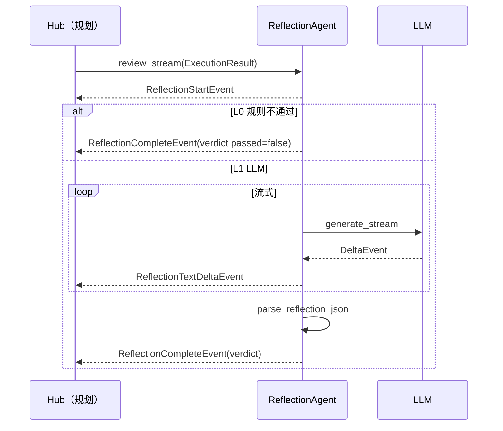

---

## 八、冒烟与验证

```bash
# 默认 fixture：短样例（可能因跨步表述差异被 LLM 判为不通过，属审查正常行为）
PYTHONPATH=. uv run agents/test_reflection.py

# 明显错误：付款 8 万 vs slots 预算 5 万
REFLECTION_FIXTURE=fail PYTHONPATH=. uv run agents/test_reflection.py

# L0：步骤失败，不调 LLM
REFLECTION_FIXTURE=exec_fail PYTHONPATH=. uv run agents/test_reflection.py
```

测试脚本打印：**输入 ExecutionResult 摘要** → **流式审查说明** → **完整 ReflectionVerdict JSON** → Hub 使用示意。

也可用真实 Plan 跑完后的 `ExecutionResult` 复制进 fixture，做联调。

---

## 九、实现状态与后续计划

### 9.1 已完成

- [x] `ReflectionVerdict` / `ReflectionIssue` 与 `to_dict()`
- [x] `ReflectionAgent`：`review` / `review_stream` / `get_last_verdict()`
- [x] L0 规则：失败 trace、空 deliverable、partial_success
- [x] LLM 审查 + `` ```reflection` `` 解析 + `error` 级 issues 强制不通过
- [x] `ReflectionStartEvent` / `ReflectionTextDeltaEvent` / `ReflectionCompleteEvent`
- [x] `agents/test_reflection.py` 三档 fixture

### 9.2 待办

| 优先级 | 项 |
|--------|-----|
| P2 | Reflection 可选对照 `search_documents`（只读，审查员补证据） |
| P2 | 审查策略：主合同与附件冲突时降级为 `warning`（可配置） |
| P2 | L0 与 LLM 结论冲突时的仲裁策略 |

---

## 十、设计评价摘要

**优势**：输入输出边界清晰（`ExecutionResult` → `ReflectionVerdict`）；只读审查不改稿；`related_step_ids` 已驱动 Hub 修订重跑；L0+L1 分层节省成本。

**注意**：独立测试需手写 `ExecutionResult`；`fixture=pass` 不保证 `passed=true`；流式 `review_report` 以解析后的 `verdict` 为准。

整体而言，**Reflection 已通过第八篇 Hub 接入主链路**；优化（改稿）由 Hub 调 PlanExecute 重跑，不在 Reflection 内改 `deliverable`。

---

# 第八篇 · `agents` 中枢编排设计思路（当前实现）

本篇章描述灵枢 **Hub 编排层** 的完整设计：**CortexHub** 如何串联第五篇 ReAct、第六篇 PlanExecute、第七篇 Reflection，**路由规则**、**对用户展示协议**、**多轮 REPL**、以及 **Reflection 打回后的修订重跑**。

> **当前阶段**：已实现 `agents/hub.py`、`agents/hub_models.py`、`agents/test_hub.py`（单轮默认 + `--repl` 多轮）。入口命令：`PYTHONPATH=. uv run agents/test_hub.py` 与 `PYTHONPATH=. uv run agents/test_hub.py --repl`。

---

## 一、在灵枢整体架构中的位置

Hub 是 **阶段级路由器**，不是 Plan 内的 `agent_type` 分发器。

| | **CortexHub（本篇）** | **PlanExecute Registry（第六篇）** |
|--|----------------------|-----------------------------------|
| 路由对象 | ReAct / PlanExecute / Reflection / revision | plan 中每一步的 `programming` / `legal` 等 |
| 输入 | 用户一条自然语言 | `StructuredIntent` |
| 输出 | `HubTurnOutcome` + 事件流 | `ExecutionResult` |
| 是否调 LLM | 否（委托三范式） | 是（Plan + 专业 Agent） |

```
                    ┌─────────────────────────────────────┐
                    │         CortexHub（本篇）            │
                    │  run_turn_stream(user_message)      │
                    └──────────────┬──────────────────────┘
                                   │
         ┌─────────────────────────┼─────────────────────────┐
         ▼                         ▼                         ▼
   ReActAgent              PlanExecuteAgent           ReflectionAgent
   （第五篇）               （第六篇）                  （第七篇）
         │                         │                         │
         │ StructuredIntent        │ ExecutionResult         │ ReflectionVerdict
         └─────────────────────────┴─────────────────────────┘
                                   │
                    （可选）修订：重跑部分 step + 再审查
                                   │
                                   ▼
                         对用户：① user_reply ② deliverable ③ 审查摘要
```

**记忆与对话存储边界**（与前期共识一致）：

| 组件 | 读 `memory.db` / 长期记忆 | 写 conversation / consolidator |
|------|---------------------------|--------------------------------|
| ReAct | ✅ 每轮预取 + 工具 | ✅ |
| PlanExecute | ❌ MVP 未装配 GSSC | ❌ |
| Reflection | ❌ | ❌ |
| Hub | ❌ | ❌（仅编排；可选未来 `TaskRunStore`） |

多轮澄清依赖 **同一 `session_id`** 下 ReAct 加载历史；Plan 每轮用当轮 `intent` 对象 handoff，不把整份 `deliverable` 塞回聊天表。

---

## 二、核心类型与路由

### 2.1 `HubTurnOutcome`（`hub_models.py`）

| 字段 | 含义 |
|------|------|
| `route` | 本轮结束路由（见下表） |
| `user_reply` | ReAct 给用户看的短回复（确认或追问） |
| `deliverable` | PlanExecute 汇总产出（未进 Plan 时为 `None`） |
| `intent` | 当轮 `StructuredIntent`（若有） |
| `execution_result` | 当轮 `ExecutionResult`（若有） |
| `reflection_verdict` | 当轮 `ReflectionVerdict`（若跑了 Reflection） |
| `revision_rounds` | 本轮修订重跑次数（0 表示未修订） |

### 2.2 路由常量

| `route` | 条件 | 对用户展示 |
|---------|------|------------|
| `clarify_only` | `intent.is_clear == false` | 仅 ① `user_reply`（追问） |
| `direct_reply` | `is_clear` 且 `should_invoke_plan()` 为 false（如 `general_chat`） | 仅 ① |
| `plan_execute` | 跑了 Plan，未开 Reflection 或审查前即结束 | ① + ② |
| `plan_reflect` | Plan + Reflection，`revision_rounds=0` | ① + ② + ③ |
| `plan_revise` | 发生过修订但未再跑 Reflection（少见） | ① + ② + ③ |
| `plan_revise_reflect` | 修订后再次 Reflection | ① + ② + ③ |

路由判定代码逻辑（`hub.py`）：

1. 始终先 `react.run_stream(message)`，透传全部 ReAct 事件。  
2. `get_last_intent()` 为空 → `clarify_only`。  
3. `not intent.is_clear` → `clarify_only`。  
4. `not intent.should_invoke_plan()` → `direct_reply`。  
5. 否则进入 Plan 管线；若 `run_reflection` → `plan_reflect`。  
6. `verdict.passed == false` 且 `max_revision_rounds > 0` → `revision` 阶段 → 再 Reflection → `plan_revise_reflect`。

---

## 三、`CortexHub` API

### 3.1 构造参数

| 参数 | 默认 | 说明 |
|------|------|------|
| `react` | 必填 | 已配置 memory / kb / session 的 `ReActAgent` |
| `plan_execute` | 必填 | 含 `LLMPlanGenerator` + `RegistryStepDelegate` |
| `reflection` | 可选 | `ReflectionAgent`；`None` 则跳过审查 |
| `run_reflection` | `True` | 且 `reflection is not None` 时才审查 |
| `stream_plan_separately` | `True` | 先 `create_plan_stream` 再 `skip_plan_generation` 执行（与 `test_plan_execute` 一致） |
| `max_revision_rounds` | `1` | Reflection 不通过后最多修订几轮（每轮含重跑 + 再审查） |

### 3.2 主入口

```python
async for ev in hub.run_turn_stream(user_message):
    ...  # AgentEvent：含 HubPhaseEvent、各阶段原事件、HubTurnCompleteEvent
outcome = hub.get_last_outcome()
```

**Hub 不实现**内部 `while` 替用户多轮追问：多轮 = 外层多次调用 `run_turn_stream`（CLI `--repl` 或 API 循环）。

---

## 四、单轮时序

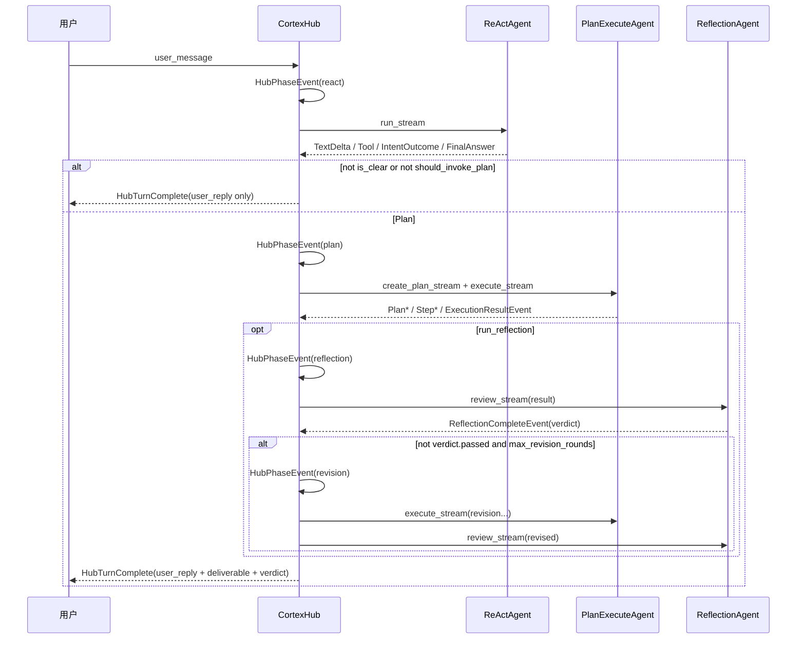

---

## 五、Plan 管线（`_run_plan_pipeline`）

当 `stream_plan_separately=True` 且 `plan_generator` 为 `LLMPlanGenerator`：

1. `create_plan_stream(intent)` → 透传 `PlanTextDeltaEvent` / `PlanReadyEvent`。  
2. `execute_stream(intent, plan=plan, skip_plan_generation=True)` → Execute 事件。  
3. 末尾 `ExecutionResultEvent`；`get_last_result()` 供 Reflection 使用。

否则单次 `execute_stream(intent)`（Plan 与 Execute 合在一次生成器内）。

---

## 六、修订重跑（`_run_revision_pipeline`）

**触发**：Reflection `passed=false`，且 `result.plan` 非空、`max_revision_rounds > 0`。

**步骤 ID 收集**（`_collect_rerun_step_ids`）：

1. 所有 `severity=error` 的 `ReflectionIssue.related_step_ids`；  
2. 若无，则所有 issue 的 `related_step_ids`；  
3. 若无，则 trace 中 `FAILED` 步骤；  
4. 兜底：plan 最后一步。

**依赖扩展**：`expand_rerun_step_ids(plan, ids)` — 若某步依赖已重跑步，则该步一并重跑。

**prior_outputs**：未在重跑集合内的成功步，从上一轮 `trace` 复制 `output`，Execute 时标记「沿用上一轮」，不再次调用 LLM。

**revision_feedback**：`recommendation` + error 级 issue 文案，经 `RegistryStepDelegate` → `LLMSpecialistAgent` 的 `context["revision_feedback"]` 注入用户 prompt（见 `specialists/worker.py`）。

修订后再跑一轮 Reflection；若 `passed` 则结束，否则受 `max_revision_rounds` 限制。

---

## 七、流式事件（Hub 扩展）

| 事件 | 说明 |
|------|------|
| `HubPhaseEvent(phase=...)` | `react` / `plan` / `reflection` / `revision`，供 CLI 打印阶段标题 |
| `HubTurnCompleteEvent` | 本轮收束：route、user_reply、deliverable、intent、result、verdict |

其余事件与各阶段原有事件相同，Hub **透传**不包装。

**FinalAnswerEvent 语义**：ReAct 与 Plan 均可能发出；进入 Plan 后，任务完成以 `ExecutionResult.deliverable` 为准；`user_reply` 为 ReAct 侧确认摘要（如「已确认合同要素…」）。

---

## 八、组装与冒烟（`test_hub.py`）

### 8.1 依赖注入

`test_hub.py` 内 `_build_hub()` 与 `test.py` 对齐：

- `namespace = "mem:hub_test:default"`  
- `ConversationSQLitesStore("data/memory.db")`  
- `create_memory_manager` + `KnowledgeBase`  
- `ToolRegistry`：`SearchDocumentsTool` + `SearchMemoryTool`  
- `build_default_registry()` → `PlanExecuteAgent` + `ReflectionAgent`  

### 8.2 运行方式

```bash
# 单轮（默认示例：软件开发合同需求）
PYTHONPATH=. uv run agents/test_hub.py

# 自定义单轮输入
PYTHONPATH=. uv run agents/test_hub.py "帮我起草一份解除劳动合同协议书…"

# 多轮 REPL（同 session，澄清后自动 Plan）
PYTHONPATH=. uv run agents/test_hub.py --repl
```

### 8.3 环境变量

| 变量 | 默认 | 说明 |
|------|------|------|
| `RUN_REFLECTION` | `1` | `0` / `false` 跳过 Reflection |
| `HUB_MAX_REVISION_ROUNDS` | `1` | 每轮用户输入后，审查不通过时最多修订次数 |

### 8.4 终端展示约定

`HubStreamPrinter` 在每轮结束打印：

- **①** `user_reply`（来自 ReAct）  
- **②** `deliverable`（来自 PlanExecute；澄清轮无）  
- **③** Reflection 摘要（`passed` / `summary`；未跑审查则无）  

行尾 `[hub] route=... revision_rounds=...` 便于脚本化断言。

---

## 九、多轮 REPL 行为说明

- 外层 `while input()` 多次调用 `hub.run_turn_stream`，**不是** Hub 内自动追问。  
- ReAct 同一 `session_id` 读取 SQLite 对话历史，后续轮可合并前文 slots（例如首轮问合同、次轮补当事人）。  
- **测试注意**：若 `memory.db` 已有同 session 历史，首轮可能被判定 `is_clear=true` 直接进入 Plan；要验证「必须先澄清」应使用新 `session_id` 或清库。  
- 澄清阶段单条用户消息内，ReAct 可能因多次 `search_documents` / `search_memory` 出现 **多步**（`max_steps=8`），终端显示为「ReAct 第 N 轮」，属单轮内部循环，非 Hub 多轮。

---

## 十、实现状态与后续计划

### 10.1 已完成

- [x] `CortexHub.run_turn_stream`：ReAct → 路由 → Plan（流式 Plan + Execute）  
- [x] 可选 Reflection + `HubTurnCompleteEvent`  
- [x] `verdict.passed=false` → 修订重跑 + 再审查（`plan_revise_reflect`）  
- [x] `HubTurnOutcome` / 路由常量 / `revision_rounds`  
- [x] `agents/test_hub.py` 单轮 + `--repl`  
- [x] `agents/default_registry.py` 共享 Registry 构建  
- [x] `memory_context` hybrid 召回失败降级（不拖垮整轮）  

### 10.2 待办

| 优先级 | 项 |
|--------|-----|
| P1 | Hub 收尾可选写一条 ASSISTANT 摘要入 conversation（产品展示用） |
| P1 | `TaskRunStore`：持久化 `ExecutionResult` + `ReflectionVerdict`（任务中心） |
| P1 | 澄清阶段工具预算（限制 `search_*` 次数，避免无效检索） |
| P2 | HTTP/WebSocket API 层封装 `run_turn_stream` |
| P2 | `max_revision_rounds` 与 Reflection 不通过时的用户可见「修订说明」 |
| P2 | 按 `intent` 类型选择 Aggregator（合同只展示 legal 步） |

---

## 十一、设计评价摘要

**优势**：单一入口串联三范式，事件透传利于 UI；`user_reply` 与 `deliverable` 分开展示，符合「先确认意图、再交付成果」；修订重跑只改相关步，节省 token；与 Registry 职责分离，架构清晰。

**注意**：Hub 不替代 ReAct 的澄清质量；知识库无法条时 ReAct 可能多步检索；Neo4j/Qdrant 环境异常时关联记忆降级但不挡主链路；`设计思路` 第五～七篇早期「Hub 未实现」描述已过时，以本篇为准。

整体而言，**灵枢 MVP 主链路已在 Hub 层闭合**；后续产品化重点为 API 化、任务存档、澄清阶段检索策略与 Plan 步级 context 增强。
