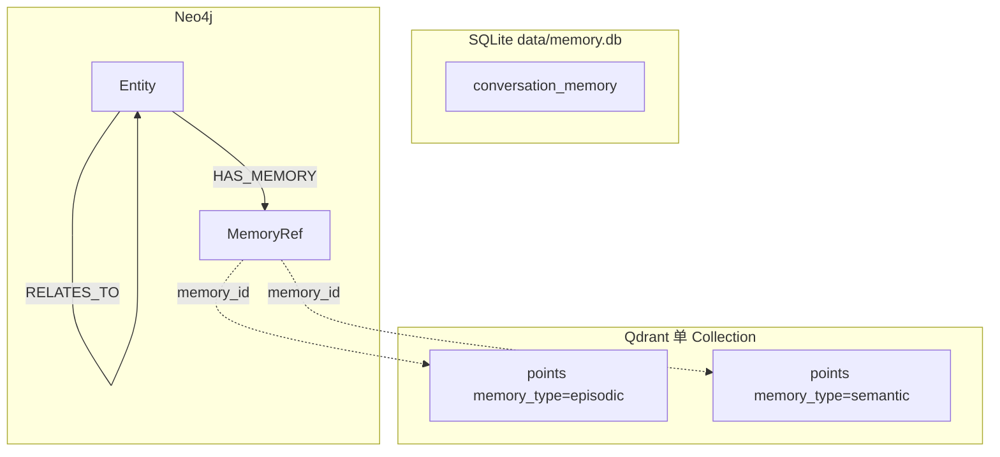
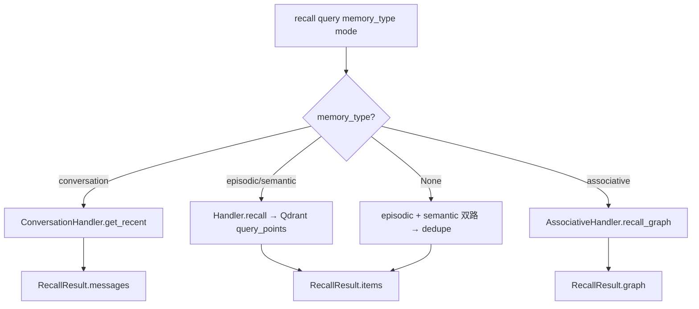
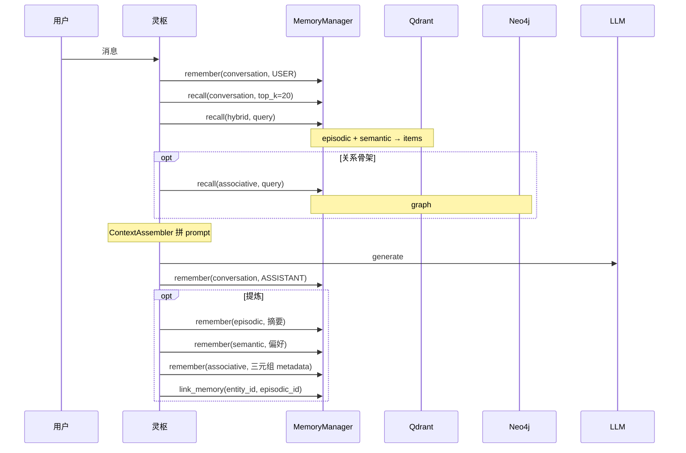

# Agent Cortex（灵枢）设计思路

本文档记录灵枢项目核心基础设施的设计说明，当前包含两大部分：

| 篇章 | 范围 |
|------|------|
| **第一篇** | `core/` 大模型（LLM）适配层 |
| **第二篇** | `memory/` 记忆系统（四种记忆 + Factory + Manager） |

---

# 第一篇 · `core` LLM 封装设计思路

本文章描述 **`core` 目录下大模型（LLM）适配层** 的设计目标、分层结构、数据协议、流式事件模型与实现细节，便于后续在中枢（ReAct / PlanExecute / Reflection）上层直接依赖本层，而无需关心具体 SDK。

---

## 一、在整体架构中的位置

灵枢是「用户 ↔ 多专业 Agent」之间的调度中枢。中枢各阶段都需要反复调用大模型：

| 中枢阶段 | 典型 LLM 用法 |
|----------|----------------|
| ReAct（意图澄清） | 多轮对话、可能流式展示给用户 |
| PlanExecute（规划分发） | 结构化输出、tool calling 选 Agent / 拆任务 |
| Reflection（质量审查） | 非流式一次性评判更常见，也可流式 |

因此 `core` 的 LLM 层职责是：

- **对上**：提供稳定、与厂商无关的 `Message` / `LLMOutput` / 流式事件接口。
- **对下**：对接 **OpenAI 兼容 HTTP API**（官方 OpenAI、阿里云 DashScope 兼容模式、各类代理网关等）。
- **不做**：会话记忆、RAG、Agent 注册、任务规划——这些属于更上层模块。

```
┌─────────────────────────────────────────┐
│  灵枢业务层（ReAct / PlanExecute / …）   │
└──────────────────┬──────────────────────┘
                   │ 只依赖 LLMProvider
┌──────────────────▼──────────────────────┐
│  core/  LLM 适配层（本文档范围）          │
│  models · provider · exceptions ·       │
│  factory · llm                          │
└──────────────────┬──────────────────────┘
                   │ AsyncOpenAI (兼容 API)
┌──────────────────▼──────────────────────┐
│  外部：OpenAI / DashScope / 其他网关     │
└─────────────────────────────────────────┘
```

---

## 二、设计目标与原则

### 2.1 目标

1. **厂商解耦**：业务代码只认识 `LLMProvider`、`Message`、`LLMOutput`，不直接 `import openai`。
2. **异步优先**：全链路 `async`，适配多 Agent 并发、FastAPI、流式 SSE；不维护同步双实现，降低复杂度。
3. **流式一等公民**：除一次性 `generate` 外，提供事件化的 `generate_stream`，便于 UI 实时输出与工具调用过程展示。
4. **Tool Calling 可编排**：流式场景下正确聚合 `tool_calls`，最终统一落入 `LLMOutput`，供 PlanExecute 等阶段消费。
5. **可扩展**：通过 `factory.create_llm(provider=...)` 预留多后端；MVP 仅实现 OpenAI 兼容路径。

### 2.2 原则

| 原则 | 说明 |
|------|------|
| 稳定领域模型 | 输入 `Message`、输出 `LLMOutput`，与 Chat Completions 协议对齐但不过度绑定某一 SDK 类型 |
| 错误语义化 | SDK 异常映射为 `RateLimitExceeded`、`ContextLengthExceeded` 等，上层可按类型处理 |
| 配置外置 | 密钥、base_url、model、默认采样参数来自环境变量或工厂入参 |
| 渐进实现 | 流式链路先跑通；非流式 `generate` 在抽象层已定义，实现可后续补齐 |

---

## 三、模块划分与文件职责

```
core/
├── models.py       # 领域数据：Role, Message, ToolCall, LLMOutput, …
├── provider.py     # 抽象接口 LLMProvider + 流式事件类型
├── exceptions.py   # LLM 层统一异常层次
├── factory.py      # 根据配置构造具体 LLM 实例
└── llm.py          # OpenAI 兼容实现类 LLM
```

| 文件 | 职责 | 依赖关系 |
|------|------|----------|
| `models.py` | 与业务、持久化友好的数据结构 | 无 core 内依赖 |
| `provider.py` | 定义「能做什么」：生成 / 流式生成 | 依赖 `models` |
| `exceptions.py` | 定义「失败时是什么」 | 独立 |
| `llm.py` | 定义「怎么做」：调 API、解析 chunk | `provider`, `models`, `exceptions` |
| `factory.py` | 组装实例、读 `.env` | `llm`, `provider` |

**不**把 OpenAI 类型（`ChatCompletion` 等）泄漏到 `models`；仅在 `LLMOutput.raw_response` 保留可选原始对象供调试。

---

## 四、领域模型（`models.py`）

### 4.1 `Role`

与 Chat Completions 的 `role` 字段一一对应：`system` / `user` / `assistant` / `tool`。使用 `str, Enum` 便于序列化与 JSON 互转。

### 4.2 `Message`

单条对话消息，是中枢维护「会话历史」、拼装请求的核心单元：

| 字段 | 含义 |
|------|------|
| `role` | 发言者 |
| `content` | 文本或多模态片段列表（类型预留 `list[dict]`） |
| `tool_calls` | 仅 `assistant`：模型本轮发起的工具调用列表 |
| `tool_call_id` | 仅 `tool`：回传工具结果时关联的调用 ID |
| `name` | 部分服务商要求 tool 消息携带工具名 |

**Tool calling 闭环**（上层编排需遵守）：

```
assistant(tool_calls=[...])  →  执行工具  →  tool(content=结果, tool_call_id=id)  →  再调 LLM
```

### 4.3 `ToolCall`

已解析的工具调用：`id`、`name`、`arguments: dict`（非 JSON 字符串），方便直接派发执行。

### 4.4 `StopReason`

从 API 的 `finish_reason` 映射而来，供业务分支：

| 值 | 含义 | 上层典型动作 |
|----|------|----------------|
| `STOP` | 正常结束 | 展示结果 / 结束本轮 |
| `TOOL_CALLS` | 模型要求调工具 | 执行工具并续写上下文 |
| `LENGTH` | 超长截断 | 提示用户或压缩上下文 |
| `ERROR` | 未知结束或异常占位 | 记录日志、重试或降级 |

### 4.5 `LLMOutput`

**单次模型调用的业务结果**，屏蔽 SDK 细节：

| 字段 | 含义 |
|------|------|
| `content` | 助手文本 |
| `tool_calls` | 解析后的工具调用列表 |
| `stop_reason` | 结束原因 |
| `usage` | Token 统计（可选） |
| `raw_response` | 原始响应（可选，调试） |

流式与非流式**最终都应能产出同一结构的 `LLMOutput`**，这样 Reflection 等模块只需处理一种类型。

### 4.6 `TokenUsage`

`prompt_tokens` / `completion_tokens` / `total_tokens`，用于计费与观测。

---

## 五、抽象接口与流式协议（`provider.py`）

### 5.1 `LLMProvider`（抽象基类）

两个入口，参数对称：

```python
async def generate(messages, tools=None, stop=None, **kwargs) -> LLMOutput
async def generate_stream(messages, tools=None, stop=None, **kwargs) -> AsyncIterator[LLMStreamEvent]
```

| 方法 | 用途 |
|------|------|
| `generate` | 一次拿完整结果；适合审查、短回复、无需 UI 刷字的场景 |
| `generate_stream` | 边生成边推送事件；适合对话 UI、工具参数渐进展示 |

公共参数：

- `messages: list[Message]` — 多轮上下文。
- `tools: list[dict] | None` — 工具定义，每项含 `name` / `description` / `parameters`（OpenAI function 形态）。
- `stop: list[str] | None` — 停止词。
- `**kwargs` — 透传覆盖（如临时改 `temperature`），在 `_build_params` 中合并。

**实现状态**：`generate_stream` 已在 `LLM` 中实现；`generate` 抽象已声明，实现为 `pass`（待补）。

### 5.2 流式事件模型

流式不直接返回 SDK 的 `chunk`，而是 **语义化事件**，便于 UI 与编排层订阅：

```
                    generate_stream()
                           │
         ┌─────────────────┼─────────────────┐
         ▼                 ▼                 ▼
    DeltaEvent    ToolCallStartEvent    ToolCallArgsEvent
    (文本增量)      (工具名出现)          (参数 JSON 片段)
         │                 │                 │
         └─────────────────┼─────────────────┘
                           ▼
                  StreamEndEvent(LLMOutput)
                           │
              （失败时）StreamErrorEvent(error)
```

| 事件类 | 字段 | 触发时机 |
|--------|------|----------|
| `DeltaEvent` | `delta: str` | 模型输出文本片段 |
| `ToolCallStartEvent` | `call_id`, `name` | 流式 chunk 中首次出现工具名 |
| `ToolCallArgsEvent` | `call_id`, `args_delta` | 工具参数 JSON 增量 |
| `StreamEndEvent` | `output: LLMOutput` | 流结束，携带聚合后的完整结果 |
| `StreamErrorEvent` | `error: Exception` | 请求前或读流中失败（已映射为领域异常） |

**设计取舍：流式错误用事件而非 raise**

- 请求建立前失败（如参数错误、网络错误）：`yield StreamErrorEvent(...)` 后结束。
- 读流中途失败：同样 yield 错误事件。
- **调用方必须** `isinstance(event, StreamErrorEvent)` 处理；不会在 `async for` 外自动抛异常。这样单条流可在 UI 层优雅展示错误而不中断整个应用进程。

---

## 六、具体实现（`llm.py`）

### 6.1 客户端与构造

```python
self.client = AsyncOpenAI(api_key=api_key, base_url=base_url)
```

| 构造参数 | 作用 |
|----------|------|
| `api_key` | 认证 |
| `base_url` | 兼容端点（如 DashScope `.../compatible-mode/v1`） |
| `model` | 默认模型名 |
| `params` | 默认请求参数（如 `temperature`、`max_tokens`），在 `_build_params` 中合并 |

**说明**：Client 级参数（`timeout`、`max_retries`）可从环境变量 `OPENAI_TIMEOUT` 等扩展；当前 MVP 仅传 `api_key` + `base_url`。

### 6.2 请求构建 `_build_params`

合并顺序（后者覆盖前者）：

1. `model`、`messages`（经 `_convert_messages`）、`stream`
2. `**self.params`（实例级默认）
3. `tools`（经 `_convert_tools`）、`stop`（若有）
4. `**kwargs`（单次调用覆盖）

### 6.3 消息转换 `_convert_messages`

`Message` → OpenAI API 字典：

- `role` → `msg.role.value`
- `content` 原样传递
- `tool_calls` → API 要求的 `{id, type, function: {name, arguments: json字符串}}`
- `tool_call_id` / `name` 在 tool 消息时附加

保证中枢其它模块只操作 `Message`，无需了解 JSON 序列化细节。

### 6.4 工具定义转换 `_convert_tools`

```python
[{"type": "function", "function": tool} for tool in tools]
```

与 OpenAI Chat Completions 的 `tools` 数组格式一致。

### 6.5 流式主流程 `generate_stream`

```
1. _build_params(stream=True)
2. await client.chat.completions.create(**params)  → 得到异步流
   └─ 失败 → yield StreamErrorEvent(mapped_exception)

3. 初始化聚合状态：content, tool_buffers, finish_reason, usage

4. async for chunk in stream:
   ├─ delta.content        → 累加 content，yield DeltaEvent
   ├─ delta.tool_calls     → 按 index 写入 tool_buffers，yield Start/Args 事件
   └─ chunk.usage / finish_reason → 记录

5. 流结束后：
   ├─ 将 tool_buffers 中 arguments_buffer json.loads → list[ToolCall]
   ├─ finish_reason → StopReason
   └─ yield StreamEndEvent(LLMOutput(...))
```

#### 工具调用流式聚合（关键点）

API 在流式下将每个 `tool_call` 拆成多个 chunk，通过 `tool_calls[].index` 区分并行多工具：

```
tool_buffers[index] = {
    "id": "",
    "name": "",
    "arguments_buffer": "",  # 逐 chunk 拼接 JSON 字符串
}
```

流结束后再 `json.loads` 为 `dict`；解析失败则降级为 `{}`，避免整流崩溃。

#### `finish_reason` 映射

| API `finish_reason` | `StopReason` |
|---------------------|--------------|
| `stop` | `STOP` |
| `tool_calls` | `TOOL_CALLS` |
| `length` | `LENGTH` |
| 其它 / 缺失 | 当前实现为 `ERROR`（兼容端点可能不回传 finish_reason，后续可优化为「有内容则 STOP」） |

### 6.6 非流式 `generate`（待实现）

规划两种实现方式（二选一）：

1. **独立请求**：`stream=False` 调 `create`，解析单包响应 → `LLMOutput`（实现简单、逻辑与流式分离）。
2. **复用流式**：消费 `generate_stream`，遇 `StreamEndEvent` 返回 `output`，遇 `StreamErrorEvent` 则 `raise output.error`（逻辑只维护一份，略多开销）。

中枢的 Reflection、短 prompt 等更适合 `generate`；对话 UI 用 `generate_stream`。

### 6.7 异常映射 `_map_exception`

| OpenAI SDK 异常 | 领域异常 |
|-----------------|----------|
| `RateLimitError` | `RateLimitExceeded` |
| `APITimeoutError` | `LLMTimeout` |
| `BadRequestError`（含 context_length_exceeded） | `ContextLengthExceeded` |
| `BadRequestError`（其它） | `LLMAPIError` |
| `APIError` | `LLMAPIError` |
| 其它 | `LLMAPIError` |

映射在 `StreamErrorEvent` 与未来的 `generate` 抛错中复用。

---

## 七、工厂与配置（`factory.py`）

### 7.1 `create_llm`

```python
create_llm(
    provider="openai",      # 小写，预留扩展
    api_key=None,           # 默认 os.getenv("OPENAI_API_KEY")
    base_url=None,          # 默认 os.getenv("OPENAI_BASE_URL")
    model=None,             # 默认 os.getenv("OPENAI_MODEL")
    params=None,            # 默认 {}
) -> LLMProvider
```

- 启动时 `load_dotenv()` 加载 `.env`。
- `api_key` 缺失时立即 `ValueError`，避免拖到 HTTP 才失败。
- `provider == "openai"` 时返回 `LLM(...)`；其它值 `Unsupported LLM provider`。

### 7.2 环境变量约定

| 变量 | 含义 |
|------|------|
| `OPENAI_API_KEY` | API 密钥 |
| `OPENAI_BASE_URL` | 兼容 API 根路径 |
| `OPENAI_MODEL` | 默认模型（如 `qwen3-max`） |
| `OPENAI_TIMEOUT` | 计划用于 Client `timeout`（实现待接） |

### 7.3 本地验证

```bash
uv run python -m core.factory
```

必须以 **模块方式** 运行（`-m core.factory`），否则相对导入 `from .llm import LLM` 会失败。

---

## 八、上层调用约定

### 8.1 非流式（目标形态）

```python
llm = create_llm()
output = await llm.generate(messages)
if output.stop_reason == StopReason.TOOL_CALLS:
    for tc in output.tool_calls:
        ...
```

### 8.2 流式（当前可用）

```python
async for event in llm.generate_stream(messages):
    if isinstance(event, DeltaEvent):
        # UI 追加 event.delta
    elif isinstance(event, StreamEndEvent):
        output = event.output  # 完整 LLMOutput，与 generate 对齐
    elif isinstance(event, StreamErrorEvent):
        # 处理 event.error（RateLimitExceeded 等）
```

**注意**：`generate_stream` 是异步生成器，**不要** `await llm.generate_stream(...)`，应直接 `async for ... in llm.generate_stream(...)`。

### 8.3 与灵枢三范式的对应关系（规划）

| 范式 | 建议 LLM 用法 |
|------|----------------|
| ReAct | `generate_stream` + 多轮 `Message` 历史 |
| PlanExecute | `generate` 或 `generate_stream`，`tools` 描述可用 Agent / 子任务 |
| Reflection | 优先 `generate` 一次评判；需解释过程时可流式 |

---

## 九、异常体系（`exceptions.py`）

```
LLMException
├── ContextLengthExceeded
├── RateLimitExceeded
├── LLMTimeout
└── LLMAPIError
```

上层捕获建议：

- `ContextLengthExceeded` → 压缩上下文 / 换模型。
- `RateLimitExceeded` → 退避重试。
- `LLMTimeout` → 加大 timeout 或重试。
- `LLMAPIError` → 记录原始信息、告警。

流式场景下这些异常出现在 `StreamErrorEvent.error` 中。

---

## 十、数据流总览

### 10.1 请求路径

```
list[Message]
    → _convert_messages() → API messages[]
    → _build_params()     → { model, messages, stream, tools?, stop?, **params }
    → AsyncOpenAI.chat.completions.create()
```

### 10.2 响应路径（流式）

```
AsyncStream[chunk]
    → 逐 chunk 解析 delta / tool_calls / usage / finish_reason
    → yield 各类 LLMStreamEvent
    → 聚合 → LLMOutput
    → yield StreamEndEvent(output)
```

---

## 十一、当前实现状态与后续计划

### 11.1 已完成

- [x] 领域模型 `Message` / `LLMOutput` / `ToolCall` / `StopReason` / `TokenUsage`
- [x] `LLMProvider` 抽象与流式事件协议
- [x] `LLM.generate_stream` 完整实现（含 tool 流式聚合）
- [x] `_convert_messages` / `_convert_tools` / `_build_params`
- [x] OpenAI 异常 → 领域异常
- [x] `create_llm` 工厂 + `.env`
- [x] DashScope 等兼容端点实测可通

### 11.2 待完成 / 待优化

| 项 | 说明 |
|----|------|
| `generate` 实现 | 抽象已定义，当前为 `pass` |
| `OPENAI_TIMEOUT` | 传入 `AsyncOpenAI(timeout=...)` |
| `model` 非空校验 | 在 `create_llm` 中与 `api_key` 同级校验 |
| `finish_reason` 缺失 | 成功流无 finish_reason 时不应标为 `ERROR` |
| 流式 `usage` | 部分厂商需 `stream_options={"include_usage": true}` |
| `core/__init__.py` | 明确包导出 |
| 显式 import | `llm.py` 避免 `from .provider import *` |
| 多 Provider | 在 factory 增加分支（Anthropic、本地模型等） |

---

## 十二、设计评价摘要

**优势**：分层清晰；流式事件化利于 UI 与中枢编排；tool calling 聚合考虑到位；异常与配置与 SDK 解耦；异步-only 符合服务化方向。

**风险点**：`generate` 未实现导致抽象与实现不一致；流式错误事件模式要求调用方纪律；`stop_reason` 在兼容 API 上的边界需打磨。

整体而言，本层已具备作为 **灵枢 LLM 基础设施** 的骨架，后续应优先补齐 `generate` 与配置项（timeout、model 校验），再在上层接入 ReAct 意图澄清的最小闭环。

---

## 附录：目录与依赖一览

```
models.py      Role, Message, ToolCall, StopReason, TokenUsage, LLMOutput
provider.py    LLMStreamEvent*, LLMProvider
exceptions.py  LLMException*
factory.py     create_llm()
llm.py         class LLM(LLMProvider)
```

**外部依赖**：`openai`（AsyncOpenAI）、`python-dotenv`（工厂加载环境变量）。

---

# 第二篇 · `memory` 记忆系统设计思路（当前实现）

本篇章描述灵枢 **`memory/` 记忆子系统** 的完整设计：**四种记忆类型**、**多存储后端**（SQLite / Qdrant / Neo4j）、**Handler + Store 分层**、**MemoryManager 统一 API**、**create_memory_manager 工厂**，以及与中枢三范式、ContextAssembler 的协作方式。

> **默认生产路径**（`create_memory_manager`）：conversation → SQLite；episodic + semantic → **Qdrant 向量库**（共用单 Collection）；associative → **Neo4j 图库**。旧版 SQLite 向量实现保留，可通过 `vector_backend="sqlite"` 回退。

---

## 一、在灵枢整体架构中的位置

README 将记忆分为 **短期对话**、**长期向量记忆**、**联想图记忆**，由 **ContextAssembler**（规划）在调 LLM 前组装上下文。`memory` 模块负责「存什么、取什么、何时淘汰」，不负责 Agent 调度或任务规划。

```
用户 / API
    │
    ▼
灵枢中枢（ReAct → PlanExecute → Reflection）
    │
    ├── core/LLM              生成与流式输出
    │
    └── memory/               本文档范围
            ├── conversation      多轮 Message（工作记忆）
            ├── episodic          情景事实片段（向量检索）
            ├── semantic          稳定知识/偏好（向量检索）
            └── associative       实体关系联想（图遍历）
    │
    ▼
（规划）context/ContextAssembler   裁剪 + 拼 prompt
```

| 中枢阶段 | 记忆用法 |
|----------|----------|
| **ReAct** | 强依赖 `conversation`；`recall(mode=hybrid)` 补 episodic/semantic；可选 `recall(associative)` 补关系骨架 |
| **PlanExecute** | `recall` 历史约束；conversation 保留本轮 |
| **Reflection** | 可选长期记忆对照；少改 conversation |

---

## 二、四种记忆类型：职责、存储与对比

四种类型 **逻辑用途不同**，**物理存储分离**。不要混用：对话原文只进 conversation；可向量检索的片段进 episodic/semantic；实体关系进 associative。

| 维度 | Conversation | Episodic | Semantic | Associative |
|------|--------------|----------|----------|-------------|
| **记什么** | 完整 `Message` | 发生过的事实、事件摘要 | 稳定偏好、规则、抽象知识 | 实体 + 实体间关系 |
| **类比** | 工作记忆 / 聊天窗口 | 情节记忆 | 语义记忆 | 联想记忆 |
| **隔离键** | `session_id` | `namespace` | `namespace` | `namespace` |
| **默认存储** | SQLite `conversation_memory` | Qdrant（`memory_type=episodic`） | Qdrant（`memory_type=semantic`） | Neo4j `:Entity` / `:MemoryRef` |
| **怎么取** | 按时间最近 N 条 | query 向量 ANN | query 向量 ANN | 实体名 → 图邻域扩展 |
| **返回类型** | `list[Message]` | `list[EpisodicItem]` | `list[SemanticItem]` | `AssociativeRecallResult`（在 `RecallResult.graph`） |
| **生命周期** | 仅 `clear_session` | TTL + 容量（Qdrant scroll 驱逐） | TTL + 容量（更长默认） | 暂无自动驱逐（`run_maintenance` 返回 0） |

### 2.1 分工原则（向量 vs 图）

| 问题 | 用哪种记忆 |
|------|------------|
| 「和这句话**像不像**？」 | episodic / semantic（Qdrant cosine） |
| 「A 和 B **什么关系**、从 A 能联想到谁？」 | associative（Neo4j `RELATES_TO` 等） |
| 「当前对话上下文是什么？」 | conversation |

**协作**：图上用 `MemoryRef` 节点指向 Qdrant 的 `memory_id`，正文仍在向量库，图只存骨架与链接。

### 2.2 写入规范（避免污染）

```
每轮对话
  → conversation.remember(message=USER/ASSISTANT)   # 必须带 role

任务节点 / 会话结束（由中枢或 LLM 提炼）
  → episodic.remember(content="事实摘要…")
  → semantic.remember(content="稳定偏好…")           # 勿把一次性事件写 semantic
  → associative.remember(metadata={from_name, to_name, relation_label, …})

禁止
  → 整段聊天记录直接写 episodic（应先提炼短句）
  → 粗俗/长句当实体名（实体用规范名，细节放 episodic + link_memory）
```

### 2.3 推荐隔离键 `namespace` / `session_id`

格式 **`{kind}:{owner}:{scope}`**（见 `EpisodicItem` docstring）：

| 场景 | 示例 |
|------|------|
| 开发自测 | `mem:tester_id:default` |
| 生产用户 | `mem:usr_8f3a2b1c:default` |
| 单次会话 | `mem:usr_8f3a2b1c:sess_abc123` |

- **factory** 中 `namespace` 同时作为 conversation 的 `session_id`、Qdrant/Neo4j 的隔离键。
- 单条长期记忆可用 **`ref_session_id`**（metadata）指向来源会话。

---

## 三、分层架构：Factory → Manager → Handler → Store

```
业务层（灵枢 / API / test_memory_manager）
        │
        ▼
create_memory_manager()          memory/factory.py
        │  组装 Store、Embedder、各 Handler
        ▼
MemoryManager                    memory/manager.py
        │  remember / recall / forget / clear_all / run_maintenance
        │  按 memory_type 路由；RecallResult 分型返回
        │
        ├─ ConversationHandler     → ConversationSQLitesStore   → SQLite
        ├─ EpisodicQdrantHandler   → QdrantMemoryStore        → Qdrant (+ Embedder)
        ├─ SemanticQdrantHandler   → QdrantMemoryStore（共用）  → Qdrant (+ Embedder)
        └─ AssociativeHandler      → Neo4jStore                 → Neo4j Aura / 自建
```

| 层级 | 职责 |
|------|------|
| **Factory** | 根据 `vector_backend` / `graph_backend` 选择实现；统一 `namespace` |
| **Manager** | 对外唯一入口；参数校验（`message` vs `content` vs associative `metadata`） |
| **Handler** | 单类记忆的业务语义：embed、拼 Item、生命周期策略、图三元组 |
| **Store** | 持久化与检索；无中枢编排规则 |
| **lifecycle** | `TTLBasedPolicy` + `QdrantMemoryStoreScope`（按 memory_type 限定驱逐） |
| **embedders** | `OpenAIEmbedder`（兼容 DashScope 等 OpenAI 兼容端点） |

**原则**：范式层 **只依赖 `MemoryManager` 或 factory**，不直接 `import` 具体 Store。

### 3.1 存储拓扑（当前默认）



---

## 四、工厂 `create_memory_manager`（`memory/factory.py`）

### 4.1 调用方式

```python
from memory.factory import create_memory_manager

mem = create_memory_manager(
    namespace="mem:tester_id:default",
    db_path="data/memory_test.db",
    vector_backend="qdrant",      # 或 "sqlite" 回退旧实现
    graph_backend="neo4j",        # 或 "none" 不启用联想记忆
    qdrant_collection="agentcortex_memory_v1024",
    embedder=None,                # 默认 OpenAIEmbedder()
)
```

### 4.2 参数说明

| 参数 | 默认 | 作用 |
|------|------|------|
| `namespace` | （必填） | episodic/semantic/associative 的 `namespace`；conversation 的 `session_id` |
| `db_path` | `data/memory.db` | SQLite 路径（conversation 必选） |
| `vector_backend` | `"qdrant"` | `qdrant` → `EpisodicQdrantHandler` + `SemanticQdrantHandler` 共用一個 `QdrantMemoryStore` |
| `vector_backend` | `"sqlite"` | `EpisodicHandler` + `SemanticHandler`（关键词 + SQLite 内向量） |
| `graph_backend` | `"neo4j"` | 注册 `AssociativeHandler` + `Neo4jStore` |
| `graph_backend` | `"none"` | 不注册 associative |
| `qdrant_url` / `qdrant_collection` | 读 `.env` | 覆盖 Qdrant 连接与集合名 |
| `neo4j_uri` | 读 `NEO4J_URI` | 覆盖 Neo4j 连接 |
| `embedder` | `OpenAIEmbedder()` | 注入 mock 或其它嵌入实现 |

### 4.3 工厂组装流程

```
create_memory_manager(namespace)
    │
    ├─► ConversationSQLitesStore(db_path)
    │       └─► ConversationHandler(session_id=namespace)
    │
    ├─► [vector_backend == qdrant]
    │       ├─► QdrantMemoryStore(url, collection)
    │       ├─► OpenAIEmbedder()
    │       ├─► EpisodicQdrantHandler(store, embedder, namespace)
    │       └─► SemanticQdrantHandler(store, embedder, namespace)
    │
    ├─► [vector_backend == sqlite]
    │       ├─► EpisodicSQLiteStore(db_path)
    │       └─► SemanticSQLiteStore(db_path) + embedder
    │
    └─► [graph_backend == neo4j]
            ├─► Neo4jStore(uri) → ensure_schema 在首次写入时
            └─► AssociativeHandler(store, namespace)

    return MemoryManager(handlers={...})
```

---

## 五、MemoryManager 统一封装（`memory/manager.py`）

### 5.1 设计目标

1. **一个入口**：业务只调 `mem.remember` / `mem.recall`，用 `memory_type` 区分。
2. **返回分型**：`RecallResult` 按类型填充 `messages` / `items` / `graph`，避免混用。
3. **hybrid 有界**：默认 hybrid 只合并 **episodic + semantic**，不含 conversation 与 associative（防止把对话序和图结构塞进同一列表）。

### 5.2 `RecallResult`

```python
@dataclass
class RecallResult:
    memory_type: MemoryType | None
    messages: list[Message] | None = None           # conversation
    items: list[EpisodicItem | SemanticItem] | None # 向量长期记忆
    graph: AssociativeRecallResult | None = None      # associative
```

### 5.3 `remember` — 统一存储

| memory_type | 必填 | Manager 行为 |
|-------------|------|----------------|
| `conversation` | `message: Message` | → `ConversationHandler.append` |
| `episodic` | `content: str` | → `EpisodicQdrantHandler.remember`（内部 embed → `add_episodic`） |
| `semantic` | `content: str` | → `SemanticQdrantHandler.remember`（embed → `add_semantic`） |
| `associative` | `content` 和/或 `metadata` | → `AssociativeHandler.remember`（见下表） |

**长期记忆 metadata（episodic/semantic）**：

- `ref_session_id`：来源会话（写入 Item 字段，不留在 metadata JSON）
- `importance`：0–100，影响 Qdrant 容量驱逐顺序

**associative metadata 约定**：

| metadata 键 | 作用 |
|-------------|------|
| `from_name` + `to_name` | 建立 `RELATES_TO`（`content` 可作 `relation_label`） |
| `from_entity_type` / `to_entity_type` | 实体类型，默认 `other` |
| `entity_name` | 仅建/更新单个实体（缺省用 `content` 作实体名） |
| `entity_id` + `memory_type` + `memory_id` | `link_memory` 挂接 Qdrant 点 |
| `hops` / `include_memory_refs` | 主要用于 recall 的 `filters` |

### 5.4 `recall` — 统一检索

| 调用方式 | 行为 | 使用字段 |
|----------|------|----------|
| `memory_type="conversation"` | 最近 `top_k` 条 Message | `.messages` |
| `memory_type="episodic"` | 向量检索（cosine + `score_threshold`） | `.items` |
| `memory_type="semantic"` | 向量检索 | `.items` |
| `memory_type="associative"` | 实体名/别名 → 邻域图 | `.graph` |
| 不传 `memory_type` | 见 `RecallMode` | `.items`（仅向量） |

**`RecallMode`**（`memory_type` 未传时）：

| mode | 参与类型 |
|------|----------|
| `keyword` | 仅 episodic（Qdrant 下仍为向量检索，参数名保留兼容） |
| `semantic` | 仅 semantic |
| `hybrid` | episodic + semantic → `_deduplicate` → `top_k` |
| `graph` | 不参与多路；associative 须显式 `memory_type="associative"` |

**Qdrant 检索 filters**：`source`、`ref_session_id`、`embedding_model`（payload 索引过滤）。

**associative 检索 filters**：`hops`（1–2）、`include_memory_refs`（默认 true，无 `HAS_MEMORY` 时 Neo4j 可能 WARN）。

### 5.5 `forget` / `clear_all` / `run_maintenance`

| 方法 | 行为 |
|------|------|
| `forget(id, memory_type=...)` | episodic/semantic：按 Qdrant point id；associative：按 Entity id；conversation 不支持 |
| `clear_all(memory_type=...)` | 指定类型清空；不传则清空**所有已注册** handler |
| `run_maintenance()` | 仅 episodic/semantic 执行 TTL/容量（经 `QdrantMemoryStoreScope` 分类型驱逐） |

### 5.6 Manager 内部分派（总览）



---

## 六、各记忆类型实现流程（默认 Qdrant + Neo4j）

### 6.1 Conversation（对话记忆）

**组件**：`ConversationHandler` + `ConversationSQLitesStore`

**写入流程**：

```
MemoryManager.remember(conversation, message=Message)
    → ConversationHandler.append
    → asyncio.to_thread(store.add_message, session_id, message, ...)
    → INSERT conversation_memory
```

**读取流程**：

```
MemoryManager.recall(conversation, top_k=N)
    → store.get_recent(session_id, N)
    → list[Message] 按 created_at 正序
```

**特点**：同步 SQLite 用 `check_same_thread=False`；**不做**单条 forget、存储层 TTL；长度由 `top_k` / Assembler 控制。

---

### 6.2 Episodic（情景记忆 · Qdrant）

**组件**：`EpisodicQdrantHandler` + `QdrantMemoryStore` + `OpenAIEmbedder`

**写入流程**：

```
remember(content, metadata?)
    │
    ├─► embedder.embed([content]) → vector
    ├─► 构建 EpisodicItem（namespace, content_hash, importance, ref_session_id…）
    └─► store.add_episodic(item, embedding)
            ├─► _ensure_collection(dim)   # 首次建 Collection
            ├─► _ensure_payload_indexes  # namespace, memory_type（Cloud 必需）
            └─► upsert point（payload.memory_type = "episodic"）
```

**读取流程**：

```
recall(query, top_k, score_threshold?)
    │
    ├─► embedder.embed([query])
    └─► store.search_episodic(namespace, query_embedding, top_k, score_threshold)
            ├─► query_points + Filter(namespace, memory_type=episodic)
            ├─► 命中后更新 payload.last_accessed_at / access_count（二次 upsert）
            └─► list[EpisodicItem]
```

**score_threshold**：相似度下限，默认 `QDRANT_SCORE_THRESHOLD`（0.55），Handler 可覆盖。

**生命周期**：`TTLBasedPolicy(30d, 1000)` → `QdrantMemoryStoreScope("episodic")` → `ttl_evict` / `capacity_evict`。

---

### 6.3 Semantic（语义记忆 · Qdrant）

**组件**：`SemanticQdrantHandler` + **同一** `QdrantMemoryStore` + 同一 `Embedder`

与 episodic **共用 Collection**，靠 `payload.memory_type = "semantic"` 隔离。

**写入**：`embed` → `SemanticItem`（含 `embedding_model` / `embedding_dim`）→ `add_semantic`。

**读取**：`search_semantic`（逻辑同 episodic，阈值与 filters 相同机制）。

**生命周期**：`TTLBasedPolicy(90d, 300)` + `QdrantMemoryStoreScope("semantic")`。

**注意**：Collection **向量维度**须与 embedding 模型一致；换模型应换 `QDRANT_COLLECTION` 或新集合，否则会维度校验报错。

---

### 6.4 Associative（联想记忆 · Neo4j）

**组件**：`AssociativeHandler` + `Neo4jStore`

**图模型（MVP）**：

| 节点/边 | 说明 |
|---------|------|
| `:Entity` | `id`, `namespace`, `name`, `entity_type`, `aliases`, `metadata_json`, … |
| `:MemoryRef` | `memory_type`, `memory_id`（指向 Qdrant point） |
| `-[:RELATES_TO]->` | 实体间关系，`relation_label`, `weight` |
| `-[:HAS_MEMORY]->` | Entity → MemoryRef |

**写入流程（关系）**：

```
remember(content="居住", metadata={from_name, to_name, relation_label, ...})
    → AssociativeHandler.remember
    → store.relate(namespace, from_name, to_name, ...)
            ├─ MERGE 两端 Entity
            └─ MERGE RELATES_TO 边
    返回 relation elementId
```

**写入流程（挂接向量记忆）**：

```
remember(metadata={entity_id, memory_type, memory_id, content_preview?})
    → store.link_memory → MERGE MemoryRef + HAS_MEMORY
```

**读取流程**：

```
recall(memory_type=associative, query="陈艳")
    → AssociativeHandler.recall_graph
    → store.recall_neighbors(namespace, query, hops, limit)
            ├─ MATCH 种子 Entity（name 或 aliases）
            ├─ 扩展 RELATES_TO 邻域（1–2 跳）
            └─ 可选加载 HAS_MEMORY → GraphMemoryRef 列表
    → RecallResult.graph = AssociativeRecallResult(seed, entities, relations, memory_refs)
```

**专用 API**（推荐中枢显式调用）：`remember_relation`、`remember_entity`、`link_memory`、`recall_graph`。

**生命周期**：当前无图淘汰；`run_maintenance` 返回 0。

**连接注意**：Aura 使用 `neo4j+s://`；`NEO4J_USER` 一般为 `neo4j`；Mac 上若仅 `nslookup 8.8.8.8` 可解析而 Python 失败，需修系统 DNS 或 `/etc/hosts`（见 `Neo4jStore._check_dns_or_hint`）。

---

## 七、核心端到端工作流

### 7.1 单次用户轮次（推荐）



### 7.2 跨记忆协作（图 + 向量）

```
写入（会话结束）
  LLM 提炼 → [{from, rel, to}, 事实摘要, 稳定偏好]
      ├─ associative.remember(metadata=三元组)     → Neo4j
      ├─ episodic.remember(摘要)                   → Qdrant → id
      └─ associative.link_memory(实体, episodic_id)

读取（用户提问）
  ├─ associative.recall("陈艳")  → 邻居：上海、项目…
  └─ episodic/semantic.recall    → 相似事实与偏好
  → Assembler：关系骨架 + 向量细节 + 最近对话
```

---

## 八、Qdrant 存储要点（`QdrantMemoryStore`）

| 项 | 说明 |
|----|------|
| 单 Collection | episodic + semantic 共用，**必须** payload 区分 `memory_type` |
| 索引 | `namespace`、`memory_type` keyword 索引（Cloud 过滤必需） |
| 检索 | `query_points` + `score_threshold` |
| 驱逐 | scroll 拉取 → 按 `last_accessed_at` / `importance` 删除 |
| 作用域 | `QdrantMemoryStoreScope` 使 episodic/semantic **分开** TTL/容量 |

旧 SQLite 路径（`vector_backend=sqlite`）：episodic 关键词 LIKE；semantic 最近 800 条内存 cosine——仅作回退与对比。

---

## 九、Neo4j 存储要点（`Neo4jStore`）

| 项 | 说明 |
|----|------|
| Schema | `neo4j_schema.cypher`：`Entity`/`MemoryRef` 唯一约束与索引 |
| 隔离 | 所有 Cypher 带 `namespace` |
| 与 Qdrant | `MemoryRef.memory_id` = Qdrant point id；删向量需另调 `forget(episodic\|semantic)` |
| 冒烟 | `uv run python -m memory.store.neo4j_store` |

---

## 十、生命周期（Lifecycle）

| 类型 | 策略 | 实现 |
|------|------|------|
| episodic | TTL 30d，max 1000 | `TTLBasedPolicy` + `QdrantMemoryStoreScope("episodic")` |
| semantic | TTL 90d，max 300 | 同上，`"semantic"` |
| conversation | 无 | 仅 `clear_all` |
| associative | 无 | 预留 P2 |

驱逐顺序（容量）：`importance ASC` → `last_accessed_at ASC` → `access_count ASC` → `created_at ASC`（先删最不重要）。

`last_accessed_at`：Qdrant 在 **search 命中** 时更新；写入时设为当前时间。

---

## 十一、检索与 Hybrid 说明

### 11.1 Hybrid（向量双路）

```
recall(query, mode=hybrid, top_k=k)
    → episodic.recall(per_k) + semantic.recall(per_k)
    → _deduplicate(by id + content)
    → 截断 top_k
```

当前 **无 RRF 打分**；名为 hybrid，实为双路合并。P2 可做 RRF + 跨 episodic/semantic 重排。

### 11.2 Associative 与 Hybrid 分离

associative **不会**在 `mode=hybrid` 时自动并入；避免图结构与 `EpisodicItem` 列表混用。需要关系时 **显式** `memory_type="associative"`。

### 11.3 content_hash

写入时自动 SHA256 前 32 hex；索引已预留；**尚未**强制去重 upsert（P1）。

---

## 十二、与 ContextAssembler 的衔接（规划）

```
发给 LLM 的 messages ≈
    [system: 人设 + 规则]
  + [system/user: 长期记忆 items 摘要]
  + [system/user: associative graph 关系摘要]   ← 新增
  + [conversation 最近 N 条 Message]
  + [当前 user 输入]
```

长期记忆与图记忆均以 **文本摘要块** 注入，不破坏 tool 消息结构。

---

## 十三、模块与文件一览（当前）

```
memory/
├── manager.py                 # MemoryManager、RecallResult
├── factory.py                 # create_memory_manager
├── models.py                  # EpisodicItem、SemanticItem、Graph*、AssociativeRecallResult
├── types.py                   # MemoryType（含 associative）、RecallMode、EntityType
├── lifecycle.py               # TTLBasedPolicy
├── utils.py                   # 时间字符串、content_hash
├── handlers/
│   ├── base.py
│   ├── conversation_handler.py
│   ├── episodic_handler.py          # SQLite 回退
│   ├── episodic_qdrant_handler.py   # 默认 episodic
│   ├── semantic_handler.py
│   ├── semantic_qdrant_handler.py   # 默认 semantic
│   └── associative_handler.py
├── store/
│   ├── conversation_sqlite_store.py
│   ├── episodic_sqlite_store.py
│   ├── semantic_sqlite_store.py
│   ├── qdrant_memory_store.py
│   ├── qdrant_scope.py
│   ├── neo4j_store.py
│   └── neo4j_schema.cypher
├── embedders/
│   └── openai_embedder.py
└── test_memory_manager.py     # uv run python -m memory.test_memory_manager
```

### 环境变量

| 变量 | 用途 |
|------|------|
| `OPENAI_API_KEY` / `OPENAI_BASE_URL` / `OPENAI_EMBEDDING_MODEL` | Embedder |
| `QDRANT_URL` / `QDRANT_API_KEY` / `QDRANT_COLLECTION` | Qdrant Cloud |
| `QDRANT_SCORE_THRESHOLD` | 默认相似度下限（0.55） |
| `NEO4J_URI` / `NEO4J_USER` / `NEO4J_PASSWORD` / `NEO4J_DATABASE` | Neo4j Aura |
| `NEO4J_SKIP_DNS_CHECK` | 设为 1 跳过启动 DNS 诊断 |

---

## 十四、实现状态与后续计划

### 14.1 已完成

- [x] 四种记忆类型与 `MemoryType` 枚举  
- [x] `MemoryManager` 统一 API + `RecallResult.graph`  
- [x] `create_memory_manager`（qdrant + neo4j 默认）  
- [x] Qdrant 单 Collection + payload 索引 + episodic/semantic Handler  
- [x] Neo4j Entity / RELATES_TO / MemoryRef / HAS_MEMORY + AssociativeHandler  
- [x] TTL + 容量驱逐（Qdrant + scope）  
- [x] `test_memory_manager` 端到端验证  

### 14.2 待办（接灵枢）

| 优先级 | 项 |
|--------|-----|
| P0 | ContextAssembler：conversation + items + graph → prompt |
| P1 | `remember` 按 `content_hash` 去重 |
| P1 | hybrid RRF；图→向量联合 recall（先图后 filter） |
| P1 | 从 conversation 自动提炼写 episodic/semantic/associative |
| P2 | 图关系 TTL；别名模糊匹配；Neo4j 与 Qdrant 链接一致性任务 |

---

## 十五、设计评价摘要

**优势**：四种记忆边界清晰；Factory 一键组装多后端；Manager 统一入口且返回分型；Qdrant/Neo4j 分工明确（相似 vs 关系）；旧 SQLite 实现可回退，利于对比测试。

**注意**：hybrid 不含 associative；换 embedding 模型须换 Qdrant 集合；Neo4j 与 Qdrant 的 `HAS_MEMORY` 需业务维护最终一致；Mac DNS/代理可能影响 Aura 连接。

整体而言，**memory 层已具备四种记忆的生产级骨架**，下一步重点是 ContextAssembler 与中枢侧「何时写入、如何提炼三元组与摘要」的编排策略。
