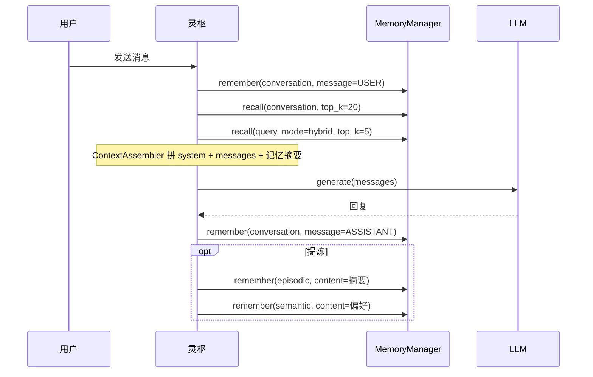

# Agent Cortex（灵枢）设计思路

本文档记录灵枢项目核心基础设施的设计说明，当前包含两大部分：

| 篇章 | 范围 |
|------|------|
| **第一篇** | `core/` 大模型（LLM）适配层 |
| **第二篇** | `memory/` 记忆系统（对话 + 长期记忆） |

---

# 第一篇 · `core` LLM 封装设计思路

本文章描述 **`core` 目录下大模型（LLM）适配层** 的设计目标、分层结构、数据协议、流式事件模型与实现细节，便于后续在中枢（ReAct / PlanExecute / Reflection）上层直接依赖本层，而无需关心具体 SDK。

---

## 一、在整体架构中的位置

灵枢是「用户 ↔ 多专业 Agent」之间的调度中枢。中枢各阶段都需要反复调用大模型：

| 中枢阶段 | 典型 LLM 用法 |
|----------|----------------|
| ReAct（意图澄清） | 多轮对话、可能流式展示给用户 |
| PlanExecute（规划分发） | 结构化输出、tool calling 选 Agent / 拆任务 |
| Reflection（质量审查） | 非流式一次性评判更常见，也可流式 |

因此 `core` 的 LLM 层职责是：

- **对上**：提供稳定、与厂商无关的 `Message` / `LLMOutput` / 流式事件接口。
- **对下**：对接 **OpenAI 兼容 HTTP API**（官方 OpenAI、阿里云 DashScope 兼容模式、各类代理网关等）。
- **不做**：会话记忆、RAG、Agent 注册、任务规划——这些属于更上层模块。

```
┌─────────────────────────────────────────┐
│  灵枢业务层（ReAct / PlanExecute / …）   │
└──────────────────┬──────────────────────┘
                   │ 只依赖 LLMProvider
┌──────────────────▼──────────────────────┐
│  core/  LLM 适配层（本文档范围）          │
│  models · provider · exceptions ·       │
│  factory · llm                          │
└──────────────────┬──────────────────────┘
                   │ AsyncOpenAI (兼容 API)
┌──────────────────▼──────────────────────┐
│  外部：OpenAI / DashScope / 其他网关     │
└─────────────────────────────────────────┘
```

---

## 二、设计目标与原则

### 2.1 目标

1. **厂商解耦**：业务代码只认识 `LLMProvider`、`Message`、`LLMOutput`，不直接 `import openai`。
2. **异步优先**：全链路 `async`，适配多 Agent 并发、FastAPI、流式 SSE；不维护同步双实现，降低复杂度。
3. **流式一等公民**：除一次性 `generate` 外，提供事件化的 `generate_stream`，便于 UI 实时输出与工具调用过程展示。
4. **Tool Calling 可编排**：流式场景下正确聚合 `tool_calls`，最终统一落入 `LLMOutput`，供 PlanExecute 等阶段消费。
5. **可扩展**：通过 `factory.create_llm(provider=...)` 预留多后端；MVP 仅实现 OpenAI 兼容路径。

### 2.2 原则

| 原则 | 说明 |
|------|------|
| 稳定领域模型 | 输入 `Message`、输出 `LLMOutput`，与 Chat Completions 协议对齐但不过度绑定某一 SDK 类型 |
| 错误语义化 | SDK 异常映射为 `RateLimitExceeded`、`ContextLengthExceeded` 等，上层可按类型处理 |
| 配置外置 | 密钥、base_url、model、默认采样参数来自环境变量或工厂入参 |
| 渐进实现 | 流式链路先跑通；非流式 `generate` 在抽象层已定义，实现可后续补齐 |

---

## 三、模块划分与文件职责

```
core/
├── models.py       # 领域数据：Role, Message, ToolCall, LLMOutput, …
├── provider.py     # 抽象接口 LLMProvider + 流式事件类型
├── exceptions.py   # LLM 层统一异常层次
├── factory.py      # 根据配置构造具体 LLM 实例
└── llm.py          # OpenAI 兼容实现类 LLM
```

| 文件 | 职责 | 依赖关系 |
|------|------|----------|
| `models.py` | 与业务、持久化友好的数据结构 | 无 core 内依赖 |
| `provider.py` | 定义「能做什么」：生成 / 流式生成 | 依赖 `models` |
| `exceptions.py` | 定义「失败时是什么」 | 独立 |
| `llm.py` | 定义「怎么做」：调 API、解析 chunk | `provider`, `models`, `exceptions` |
| `factory.py` | 组装实例、读 `.env` | `llm`, `provider` |

**不**把 OpenAI 类型（`ChatCompletion` 等）泄漏到 `models`；仅在 `LLMOutput.raw_response` 保留可选原始对象供调试。

---

## 四、领域模型（`models.py`）

### 4.1 `Role`

与 Chat Completions 的 `role` 字段一一对应：`system` / `user` / `assistant` / `tool`。使用 `str, Enum` 便于序列化与 JSON 互转。

### 4.2 `Message`

单条对话消息，是中枢维护「会话历史」、拼装请求的核心单元：

| 字段 | 含义 |
|------|------|
| `role` | 发言者 |
| `content` | 文本或多模态片段列表（类型预留 `list[dict]`） |
| `tool_calls` | 仅 `assistant`：模型本轮发起的工具调用列表 |
| `tool_call_id` | 仅 `tool`：回传工具结果时关联的调用 ID |
| `name` | 部分服务商要求 tool 消息携带工具名 |

**Tool calling 闭环**（上层编排需遵守）：

```
assistant(tool_calls=[...])  →  执行工具  →  tool(content=结果, tool_call_id=id)  →  再调 LLM
```

### 4.3 `ToolCall`

已解析的工具调用：`id`、`name`、`arguments: dict`（非 JSON 字符串），方便直接派发执行。

### 4.4 `StopReason`

从 API 的 `finish_reason` 映射而来，供业务分支：

| 值 | 含义 | 上层典型动作 |
|----|------|----------------|
| `STOP` | 正常结束 | 展示结果 / 结束本轮 |
| `TOOL_CALLS` | 模型要求调工具 | 执行工具并续写上下文 |
| `LENGTH` | 超长截断 | 提示用户或压缩上下文 |
| `ERROR` | 未知结束或异常占位 | 记录日志、重试或降级 |

### 4.5 `LLMOutput`

**单次模型调用的业务结果**，屏蔽 SDK 细节：

| 字段 | 含义 |
|------|------|
| `content` | 助手文本 |
| `tool_calls` | 解析后的工具调用列表 |
| `stop_reason` | 结束原因 |
| `usage` | Token 统计（可选） |
| `raw_response` | 原始响应（可选，调试） |

流式与非流式**最终都应能产出同一结构的 `LLMOutput`**，这样 Reflection 等模块只需处理一种类型。

### 4.6 `TokenUsage`

`prompt_tokens` / `completion_tokens` / `total_tokens`，用于计费与观测。

---

## 五、抽象接口与流式协议（`provider.py`）

### 5.1 `LLMProvider`（抽象基类）

两个入口，参数对称：

```python
async def generate(messages, tools=None, stop=None, **kwargs) -> LLMOutput
async def generate_stream(messages, tools=None, stop=None, **kwargs) -> AsyncIterator[LLMStreamEvent]
```

| 方法 | 用途 |
|------|------|
| `generate` | 一次拿完整结果；适合审查、短回复、无需 UI 刷字的场景 |
| `generate_stream` | 边生成边推送事件；适合对话 UI、工具参数渐进展示 |

公共参数：

- `messages: list[Message]` — 多轮上下文。
- `tools: list[dict] | None` — 工具定义，每项含 `name` / `description` / `parameters`（OpenAI function 形态）。
- `stop: list[str] | None` — 停止词。
- `**kwargs` — 透传覆盖（如临时改 `temperature`），在 `_build_params` 中合并。

**实现状态**：`generate_stream` 已在 `LLM` 中实现；`generate` 抽象已声明，实现为 `pass`（待补）。

### 5.2 流式事件模型

流式不直接返回 SDK 的 `chunk`，而是 **语义化事件**，便于 UI 与编排层订阅：

```
                    generate_stream()
                           │
         ┌─────────────────┼─────────────────┐
         ▼                 ▼                 ▼
    DeltaEvent    ToolCallStartEvent    ToolCallArgsEvent
    (文本增量)      (工具名出现)          (参数 JSON 片段)
         │                 │                 │
         └─────────────────┼─────────────────┘
                           ▼
                  StreamEndEvent(LLMOutput)
                           │
              （失败时）StreamErrorEvent(error)
```

| 事件类 | 字段 | 触发时机 |
|--------|------|----------|
| `DeltaEvent` | `delta: str` | 模型输出文本片段 |
| `ToolCallStartEvent` | `call_id`, `name` | 流式 chunk 中首次出现工具名 |
| `ToolCallArgsEvent` | `call_id`, `args_delta` | 工具参数 JSON 增量 |
| `StreamEndEvent` | `output: LLMOutput` | 流结束，携带聚合后的完整结果 |
| `StreamErrorEvent` | `error: Exception` | 请求前或读流中失败（已映射为领域异常） |

**设计取舍：流式错误用事件而非 raise**

- 请求建立前失败（如参数错误、网络错误）：`yield StreamErrorEvent(...)` 后结束。
- 读流中途失败：同样 yield 错误事件。
- **调用方必须** `isinstance(event, StreamErrorEvent)` 处理；不会在 `async for` 外自动抛异常。这样单条流可在 UI 层优雅展示错误而不中断整个应用进程。

---

## 六、具体实现（`llm.py`）

### 6.1 客户端与构造

```python
self.client = AsyncOpenAI(api_key=api_key, base_url=base_url)
```

| 构造参数 | 作用 |
|----------|------|
| `api_key` | 认证 |
| `base_url` | 兼容端点（如 DashScope `.../compatible-mode/v1`） |
| `model` | 默认模型名 |
| `params` | 默认请求参数（如 `temperature`、`max_tokens`），在 `_build_params` 中合并 |

**说明**：Client 级参数（`timeout`、`max_retries`）可从环境变量 `OPENAI_TIMEOUT` 等扩展；当前 MVP 仅传 `api_key` + `base_url`。

### 6.2 请求构建 `_build_params`

合并顺序（后者覆盖前者）：

1. `model`、`messages`（经 `_convert_messages`）、`stream`
2. `**self.params`（实例级默认）
3. `tools`（经 `_convert_tools`）、`stop`（若有）
4. `**kwargs`（单次调用覆盖）

### 6.3 消息转换 `_convert_messages`

`Message` → OpenAI API 字典：

- `role` → `msg.role.value`
- `content` 原样传递
- `tool_calls` → API 要求的 `{id, type, function: {name, arguments: json字符串}}`
- `tool_call_id` / `name` 在 tool 消息时附加

保证中枢其它模块只操作 `Message`，无需了解 JSON 序列化细节。

### 6.4 工具定义转换 `_convert_tools`

```python
[{"type": "function", "function": tool} for tool in tools]
```

与 OpenAI Chat Completions 的 `tools` 数组格式一致。

### 6.5 流式主流程 `generate_stream`

```
1. _build_params(stream=True)
2. await client.chat.completions.create(**params)  → 得到异步流
   └─ 失败 → yield StreamErrorEvent(mapped_exception)

3. 初始化聚合状态：content, tool_buffers, finish_reason, usage

4. async for chunk in stream:
   ├─ delta.content        → 累加 content，yield DeltaEvent
   ├─ delta.tool_calls     → 按 index 写入 tool_buffers，yield Start/Args 事件
   └─ chunk.usage / finish_reason → 记录

5. 流结束后：
   ├─ 将 tool_buffers 中 arguments_buffer json.loads → list[ToolCall]
   ├─ finish_reason → StopReason
   └─ yield StreamEndEvent(LLMOutput(...))
```

#### 工具调用流式聚合（关键点）

API 在流式下将每个 `tool_call` 拆成多个 chunk，通过 `tool_calls[].index` 区分并行多工具：

```
tool_buffers[index] = {
    "id": "",
    "name": "",
    "arguments_buffer": "",  # 逐 chunk 拼接 JSON 字符串
}
```

流结束后再 `json.loads` 为 `dict`；解析失败则降级为 `{}`，避免整流崩溃。

#### `finish_reason` 映射

| API `finish_reason` | `StopReason` |
|---------------------|--------------|
| `stop` | `STOP` |
| `tool_calls` | `TOOL_CALLS` |
| `length` | `LENGTH` |
| 其它 / 缺失 | 当前实现为 `ERROR`（兼容端点可能不回传 finish_reason，后续可优化为「有内容则 STOP」） |

### 6.6 非流式 `generate`（待实现）

规划两种实现方式（二选一）：

1. **独立请求**：`stream=False` 调 `create`，解析单包响应 → `LLMOutput`（实现简单、逻辑与流式分离）。
2. **复用流式**：消费 `generate_stream`，遇 `StreamEndEvent` 返回 `output`，遇 `StreamErrorEvent` 则 `raise output.error`（逻辑只维护一份，略多开销）。

中枢的 Reflection、短 prompt 等更适合 `generate`；对话 UI 用 `generate_stream`。

### 6.7 异常映射 `_map_exception`

| OpenAI SDK 异常 | 领域异常 |
|-----------------|----------|
| `RateLimitError` | `RateLimitExceeded` |
| `APITimeoutError` | `LLMTimeout` |
| `BadRequestError`（含 context_length_exceeded） | `ContextLengthExceeded` |
| `BadRequestError`（其它） | `LLMAPIError` |
| `APIError` | `LLMAPIError` |
| 其它 | `LLMAPIError` |

映射在 `StreamErrorEvent` 与未来的 `generate` 抛错中复用。

---

## 七、工厂与配置（`factory.py`）

### 7.1 `create_llm`

```python
create_llm(
    provider="openai",      # 小写，预留扩展
    api_key=None,           # 默认 os.getenv("OPENAI_API_KEY")
    base_url=None,          # 默认 os.getenv("OPENAI_BASE_URL")
    model=None,             # 默认 os.getenv("OPENAI_MODEL")
    params=None,            # 默认 {}
) -> LLMProvider
```

- 启动时 `load_dotenv()` 加载 `.env`。
- `api_key` 缺失时立即 `ValueError`，避免拖到 HTTP 才失败。
- `provider == "openai"` 时返回 `LLM(...)`；其它值 `Unsupported LLM provider`。

### 7.2 环境变量约定

| 变量 | 含义 |
|------|------|
| `OPENAI_API_KEY` | API 密钥 |
| `OPENAI_BASE_URL` | 兼容 API 根路径 |
| `OPENAI_MODEL` | 默认模型（如 `qwen3-max`） |
| `OPENAI_TIMEOUT` | 计划用于 Client `timeout`（实现待接） |

### 7.3 本地验证

```bash
uv run python -m core.factory
```

必须以 **模块方式** 运行（`-m core.factory`），否则相对导入 `from .llm import LLM` 会失败。

---

## 八、上层调用约定

### 8.1 非流式（目标形态）

```python
llm = create_llm()
output = await llm.generate(messages)
if output.stop_reason == StopReason.TOOL_CALLS:
    for tc in output.tool_calls:
        ...
```

### 8.2 流式（当前可用）

```python
async for event in llm.generate_stream(messages):
    if isinstance(event, DeltaEvent):
        # UI 追加 event.delta
    elif isinstance(event, StreamEndEvent):
        output = event.output  # 完整 LLMOutput，与 generate 对齐
    elif isinstance(event, StreamErrorEvent):
        # 处理 event.error（RateLimitExceeded 等）
```

**注意**：`generate_stream` 是异步生成器，**不要** `await llm.generate_stream(...)`，应直接 `async for ... in llm.generate_stream(...)`。

### 8.3 与灵枢三范式的对应关系（规划）

| 范式 | 建议 LLM 用法 |
|------|----------------|
| ReAct | `generate_stream` + 多轮 `Message` 历史 |
| PlanExecute | `generate` 或 `generate_stream`，`tools` 描述可用 Agent / 子任务 |
| Reflection | 优先 `generate` 一次评判；需解释过程时可流式 |

---

## 九、异常体系（`exceptions.py`）

```
LLMException
├── ContextLengthExceeded
├── RateLimitExceeded
├── LLMTimeout
└── LLMAPIError
```

上层捕获建议：

- `ContextLengthExceeded` → 压缩上下文 / 换模型。
- `RateLimitExceeded` → 退避重试。
- `LLMTimeout` → 加大 timeout 或重试。
- `LLMAPIError` → 记录原始信息、告警。

流式场景下这些异常出现在 `StreamErrorEvent.error` 中。

---

## 十、数据流总览

### 10.1 请求路径

```
list[Message]
    → _convert_messages() → API messages[]
    → _build_params()     → { model, messages, stream, tools?, stop?, **params }
    → AsyncOpenAI.chat.completions.create()
```

### 10.2 响应路径（流式）

```
AsyncStream[chunk]
    → 逐 chunk 解析 delta / tool_calls / usage / finish_reason
    → yield 各类 LLMStreamEvent
    → 聚合 → LLMOutput
    → yield StreamEndEvent(output)
```

---

## 十一、当前实现状态与后续计划

### 11.1 已完成

- [x] 领域模型 `Message` / `LLMOutput` / `ToolCall` / `StopReason` / `TokenUsage`
- [x] `LLMProvider` 抽象与流式事件协议
- [x] `LLM.generate_stream` 完整实现（含 tool 流式聚合）
- [x] `_convert_messages` / `_convert_tools` / `_build_params`
- [x] OpenAI 异常 → 领域异常
- [x] `create_llm` 工厂 + `.env`
- [x] DashScope 等兼容端点实测可通

### 11.2 待完成 / 待优化

| 项 | 说明 |
|----|------|
| `generate` 实现 | 抽象已定义，当前为 `pass` |
| `OPENAI_TIMEOUT` | 传入 `AsyncOpenAI(timeout=...)` |
| `model` 非空校验 | 在 `create_llm` 中与 `api_key` 同级校验 |
| `finish_reason` 缺失 | 成功流无 finish_reason 时不应标为 `ERROR` |
| 流式 `usage` | 部分厂商需 `stream_options={"include_usage": true}` |
| `core/__init__.py` | 明确包导出 |
| 显式 import | `llm.py` 避免 `from .provider import *` |
| 多 Provider | 在 factory 增加分支（Anthropic、本地模型等） |

---

## 十二、设计评价摘要

**优势**：分层清晰；流式事件化利于 UI 与中枢编排；tool calling 聚合考虑到位；异常与配置与 SDK 解耦；异步-only 符合服务化方向。

**风险点**：`generate` 未实现导致抽象与实现不一致；流式错误事件模式要求调用方纪律；`stop_reason` 在兼容 API 上的边界需打磨。

整体而言，本层已具备作为 **灵枢 LLM 基础设施** 的骨架，后续应优先补齐 `generate` 与配置项（timeout、model 校验），再在上层接入 ReAct 意图澄清的最小闭环。

---

## 附录：目录与依赖一览

```
models.py      Role, Message, ToolCall, StopReason, TokenUsage, LLMOutput
provider.py    LLMStreamEvent*, LLMProvider
exceptions.py  LLMException*
factory.py     create_llm()
llm.py         class LLM(LLMProvider)
```

**外部依赖**：`openai`（AsyncOpenAI）、`python-dotenv`（工厂加载环境变量）。

---

# 第二篇 · `memory` 记忆系统设计思路

本篇章描述灵枢 **`memory/` 目录下记忆子系统** 的设计：三种记忆类型的分工、统一调度入口、SQLite 持久化、生命周期策略，以及与中枢三范式（ReAct / PlanExecute / Reflection）的协作方式。

---

## 一、在灵枢整体架构中的位置

README 将记忆分为 **短期对话** 与 **长期记忆**，并由未来的 **ContextAssembler** 在调 LLM 前组装上下文。`memory` 模块负责「存什么、取什么、何时淘汰」，不负责 Agent 调度或任务规划。

```
用户 / API
    │
    ▼
灵枢中枢（ReAct → PlanExecute → Reflection）
    │
    ├── core/LLM          生成与流式输出
    │
    └── memory/           本文档范围
            ├── conversation   当前会话 Message 序（工作记忆）
            ├── episodic       情景事实片段（关键词检索）
            └── semantic       稳定知识/偏好（向量检索）
    │
    ▼
（规划）context/ContextAssembler  裁剪 + 拼 prompt
```

| 中枢阶段 | 记忆用法 |
|----------|----------|
| **ReAct** | 强依赖 `conversation` 多轮；可选 `recall` 长期记忆补背景 |
| **PlanExecute** | `recall` 历史任务/约束；conversation 保留本轮上下文 |
| **Reflection** | 可选 `recall` 同类任务；一般少改 conversation |

---

## 二、三种记忆类型：职责与对比

三种类型 **物理上三张表**，**逻辑上三种用途**。不要混用：对话原文只进 conversation；可检索的「要记住的事」进 episodic/semantic。

| 维度 | Conversation（对话） | Episodic（情景） | Semantic（语义） |
|------|----------------------|------------------|------------------|
| **记什么** | 完整 `Message`（user/assistant/tool） | 发生过的事实、结论摘要 | 稳定偏好、规则、抽象知识 |
| **类比** | 工作记忆 / 聊天窗口 | 情节记忆 | 语义记忆 |
| **隔离键** | `session_id` | `namespace` | `namespace` |
| **怎么取** | 按时间取最近 N 条 | 按 `query` 关键词（LIKE） | 按 `query` 向量相似度 |
| **query 作用** | 基本忽略 | 核心 | 核心 |
| **生命周期** | 仅 `clear_session` 整会话清空 | TTL + 容量 LRU | TTL + 容量 LRU（默认更久） |
| **返回类型** | `list[Message]` | `list[EpisodicItem]` | `list[SemanticItem]` |

### 2.1 写入规范（避免重复与污染）

```
每轮对话结束
  → conversation: remember(message=USER)
  → conversation: remember(message=ASSISTANT)   # 必须带 role，勿只用 content

任务节点 / 会话结束（可选，由中枢或 LLM 提炼）
  → episodic: remember(content="事实摘要…")
  → semantic: remember(content="用户偏好…")    # 仅稳定、可复用知识

禁止
  → 把整段聊天记录写入 episodic（应写提炼后的短句）
  → 把一次性事件写入 semantic（应写 episodic）
```

### 2.2 推荐隔离键格式

长期记忆与对话建议使用同一套 **`{kind}:{owner}:{scope}`** 命名习惯（见 `EpisodicItem` 文档）：

| 场景 | 示例 |
|------|------|
| 开发自测 | `mem:dev_alice:default` |
| 生产用户默认域 | `mem:usr_8f3a2b1c:default` |
| 单次聊天线程 | `mem:usr_8f3a2b1c:sess_abc123` |

- **conversation** 的 `session_id` 可与某次会话的 `scope` 对齐（例如直接用 `mem:usr_xxx:sess_yyy`）。
- **episodic/semantic** 的 `namespace` 可与用户默认域一致；单条记忆用字段 **`ref_session_id`** 指向来源会话。

---

## 三、分层架构（Handler + Store + Manager）

```
业务层（灵枢 / API）
        │
        ▼
MemoryManager          统一 API：remember / recall / forget / clear_all / run_maintenance
        │              通过 memory_type 路由
        ├─ ConversationHandler ──► ConversationSQLitesStore ──► conversation_memory
        ├─ EpisodicHandler       ──► EpisodicSQLiteStore     ──► episodic_memory
        └─ SemanticHandler       ──► SemanticSQLiteStore     ──► semantic_memory
                                      │
                                      └── OpenAIEmbedder（向量）
```

| 层级 | 职责 |
|------|------|
| **Manager** | 对外唯一入口；参数分型（`message` vs `content`）；`RecallResult` 分型返回 |
| **Handler** | 某一记忆类型的业务语义（命名空间、生命周期策略、embed） |
| **Store** | SQLite CRUD、检索、驱逐；不含中枢业务规则 |
| **lifecycle** | `TTLBasedPolicy`：TTL + 容量，与 Store 解耦 |

**原则**：范式层（ReAct 等）**只依赖 MemoryManager**，不直接 `import` 具体 Store。

---

## 四、数据库表与字段

默认单库 `data/memory.db`（可配置路径）。**新库**建表即含全字段；**旧库**在 Store 初始化时通过 `schema_migrate.ensure_columns` 自动 `ALTER TABLE` 补列。

### 4.1 `conversation_memory`（短期对话）

| 字段 | 类型 | 说明 |
|------|------|------|
| `id` | TEXT PK | 消息 ID |
| `session_id` | TEXT | 会话隔离键 |
| `role` | TEXT | system / user / assistant / tool |
| `content` | TEXT | 正文（或多模态 JSON 串） |
| `tool_calls` | TEXT | 工具调用 JSON |
| `tool_call_id` | TEXT | tool 回传关联 ID |
| `name` | TEXT | 工具名等 |
| `created_at` | TEXT | 本地时间，可排序 |
| `metadata_json` | TEXT | 扩展元数据 |
| `source` | TEXT | memory / document / knowledge |
| `token_count` | INTEGER | 可选，供上下文预算 |
| `turn_index` | INTEGER | 可选，回合序号 |

索引：`(session_id, created_at)`。

**不做**：单条删除、按 TTL 删旧消息（长度由上层 `recall(top_k)` / ContextAssembler 控制）。

### 4.2 `episodic_memory`（情景）

| 字段 | 类型 | 说明 |
|------|------|------|
| `id` | TEXT PK | 记忆 ID |
| `content` | TEXT | 记忆正文 |
| `namespace` | TEXT | 命名空间 |
| `source` | TEXT | 来源 |
| `metadata_json` | TEXT | 扩展元数据 |
| `created_at` / `last_accessed_at` | TEXT | 创建 / 最近访问（TEXT 排序） |
| `access_count` | INTEGER | 访问次数 |
| `ref_session_id` | TEXT | 来源会话（可选） |
| `content_hash` | TEXT | 正文哈希（写入时自动计算，便于未来去重） |
| `importance` | INTEGER | 0–100，越大越不易被容量淘汰 |

索引：`(namespace, last_accessed_at)`、`(namespace, created_at)`、`(namespace, content_hash)`、`(namespace, ref_session_id)`。

### 4.3 `semantic_memory`（语义）

在 episodic 基础上增加：

| 字段 | 类型 | 说明 |
|------|------|------|
| `embedding_json` | TEXT | 向量 JSON |
| `embedding_model` | TEXT | 模型名（如 text-embedding-v3） |
| `embedding_dim` | INTEGER | 维度 |

其余同 episodic（含 `ref_session_id`、`content_hash`、`importance`）。

---

## 五、MemoryManager 统一 API

实例化时注入三个 Handler（键名固定为 `episodic` / `semantic` / `conversation`）：

```python
mem = MemoryManager(handlers={
    "episodic": EpisodicHandler(store=..., namespace=namespace),
    "semantic": SemanticHandler(store=..., embedder=..., namespace=namespace),
    "conversation": ConversationHandler(store=..., session_id=session_id),
})
```

### 5.1 `remember` — 统一存储

| memory_type | 必填参数 | 说明 |
|-------------|----------|------|
| `conversation` | `message: Message` | 含 role；可选 `metadata`、`token_count`、`turn_index`、`source` |
| `episodic` | `content: str` | 可选 `metadata` 内 `ref_session_id`、`importance` |
| `semantic` | `content: str` | 同上；内部自动 embed 并写 `embedding_model` / `embedding_dim` |

`metadata` 约定（长期记忆，写入前由 Handler 提取专用键）：

- `ref_session_id`：关联会话
- `importance`：0–100，默认 0

### 5.2 `recall` — 统一获取

返回 **`RecallResult`**：

```python
@dataclass
class RecallResult:
    memory_type: MemoryType | None
    messages: list[Message] | None   # conversation
    items: list[MemoryItem] | None # EpisodicItem | SemanticItem
```

| 调用方式 | 行为 |
|----------|------|
| `memory_type="conversation"` | 最近 `top_k` 条 Message，`query` 忽略 |
| `memory_type="episodic"` | 关键词检索 |
| `memory_type="semantic"` | 向量检索 |
| 不传 `memory_type` | 长期记忆多路：`mode` 决定 episodic/semantic/hybrid |

**`RecallMode`**（仅长期记忆）：

| mode | 参与类型 |
|------|----------|
| `keyword` | 仅 episodic |
| `semantic` | 仅 semantic |
| `hybrid` | episodic + semantic，合并去重后取 top_k |

`filters` 支持：`source`、`ref_session_id`；semantic 另支持 `embedding_model`。

**注意**：默认 hybrid **不包含** conversation，避免把「时间序对话」与「检索片段」混在同一列表。

### 5.3 `forget` / `clear_all` / `run_maintenance`

| 方法 | 行为 |
|------|------|
| `forget(id, memory_type=...)` | 仅 episodic/semantic；conversation 抛错 |
| `clear_all(memory_type=...)` | 指定类型清空；不传则清空**全部已注册**类型 |
| `run_maintenance()` | 仅 episodic/semantic 执行 TTL/容量驱逐 |

---

## 六、核心工作流程

### 6.1 单次用户轮次（典型）



### 6.2 读取路径（recall 内部分派）

```
recall(...)
    │
    ├─ memory_type == "conversation"
    │       └─► ConversationHandler.recall → get_recent(session_id, limit)
    │
    ├─ memory_type == "episodic" | "semantic"
    │       └─► 单 Handler → search / search_semantic
    │               └─► 命中行更新 last_accessed_at、access_count
    │
    └─ memory_type is None（长期记忆）
            ├─ mode=keyword  → episodic
            ├─ mode=semantic → semantic
            └─ mode=hybrid   → 两者 → _deduplicate → RecallResult.items
```

### 6.3 写入路径（remember 内部分派）

```
remember(memory_type, ...)
    │
    ├─ conversation + message → append → INSERT conversation_memory
    │
    └─ episodic | semantic + content
            ├─ 构建 EpisodicItem / SemanticItem
            ├─ content_hash 自动计算
            ├─ semantic: embed → embedding_* 字段
            └─ INSERT 对应表
```

---

## 七、生命周期（Lifecycle）

仅 **episodic** 与 **semantic** 参与自动维护；**conversation** 不做存储层淘汰。

### 7.1 策略：`TTLBasedPolicy`

对每个 `namespace` 顺序执行：

1. **TTL 驱逐**：删除 `last_accessed_at < (now - ttl_days)` 的行。  
2. **容量驱逐**：若条数仍 `> max_items`，按 **`importance ASC` → `last_accessed_at ASC` → `access_count ASC` → `created_at ASC`** 删除至上限。

默认 Handler 配置：

| 类型 | ttl_days | max_items |
|------|----------|-----------|
| episodic | 30 | 1000 |
| semantic | 90 | 300 |

语义记忆保留更久、条数更少，符合「稳定知识慢变、情景事实更易过期」的设定。

### 7.2 `last_accessed_at` 何时更新

- **recall 命中**时：Store 在 `search` / `search_semantic` 返回前 UPDATE 该行。  
- **remember 写入**时：新建行使用当前时间。

未命中、从未被 recall 的条目仅依赖 TTL 与容量淘汰。

### 7.3 何时调用 `run_maintenance`

建议时机（由上层约定，非 Store 自动）：

- 每日定时任务；
- 某 `namespace` 下 `remember` 累计 N 次后；
- 用户登出 / 会话归档时。

返回值为本次删除总行数，便于日志与监控。

### 7.4 conversation 的生命周期

| 操作 | 说明 |
|------|------|
| 增长 | 每轮 `remember(conversation, message=...)` |
| 裁剪 | **不在 DB 删旧条**；`recall(conversation, top_k)` 或 Assembler 只取最近 N 条 |
| 结束 | `clear_all(memory_type="conversation")` 或换 `session_id` 开新会话 |

---

## 八、检索与去重细节

### 8.1 Episodic 关键词

- 空 query：按 `last_accessed_at` 取最近条。  
- 非空：对 query 分词/片段后多关键字 `LIKE`，再截断 `top_k`。  

适合中文短句 MVP；规模化可换 SQLite FTS5。

### 8.2 Semantic 向量

- 拉取 namespace 下最近 800 条候选，内存 cosine 排序取 top_k。  
- 写入时记录 `embedding_model` / `embedding_dim`，便于换模型时过滤旧向量。  

规模化应迁 Chroma / pgvector 等。

### 8.3 Hybrid 合并

- episodic 与 semantic 各取一批候选 → 按 `id` 与 `content` 去重 → 截断 `top_k`。  
- 当前 **无跨模态打分融合**（无 RRF）；名为 hybrid，实为双路召回合并。

### 8.4 `content_hash`

- 写入时若未提供，Store 用 SHA256 前 32 位 hex 自动填充。  
- 已为索引预留；**尚未**在 `remember` 时强制「哈希存在则跳过」——可后续加 upsert 策略。

---

## 九、与 ContextAssembler 的衔接（规划）

`memory` 只提供原料，Assembler 负责 **token 预算内** 拼装：

```
发给 LLM 的 messages ≈
    [system: 人设 + 规则]
  + [system 或 user: 长期记忆 recall 结果摘要]   ← items 转文本
  + [conversation recall 的 Message 列表]        ← 最近 N 条
  + [当前 user 输入]
```

长期记忆一般以 **摘要块** 注入，不替代 conversation 的 tool 消息结构。

---

## 十、模块与文件一览

```
memory/
├── manager.py              # MemoryManager、RecallResult
├── models.py               # EpisodicItem、SemanticItem
├── types.py                # MemoryType、RecallMode、MemorySource
├── lifecycle.py            # TTLBasedPolicy
├── utils.py                # 时间字符串、content_hash
├── handlers/
│   ├── base.py             # MemoryHandler 抽象
│   ├── conversation_handler.py
│   ├── episodic_handler.py
│   └── semantic_handler.py
├── store/
│   ├── base.py
│   ├── schema_migrate.py   # 旧库自动补列
│   ├── conversation_sqlite_store.py
│   ├── episodic_sqlite_store.py
│   └── semantic_sqlite_store.py
├── embedders/
│   ├── base.py
│   └── openai_embedder.py
└── test_memory_manager.py  # 本地验证：python -m memory.test_memory_manager
```

**环境变量（embedder）**：`OPENAI_API_KEY`、`OPENAI_BASE_URL`、`OPENAI_EMBEDDING_MODEL`。

---

## 十一、实现状态与后续计划

### 11.1 已完成

- [x] 三表 Schema + 旧库迁移补列  
- [x] 三 Handler + 三 Store  
- [x] MemoryManager 统一 remember / recall / forget / clear_all / run_maintenance  
- [x] TTL + 容量 LRU（含 importance）  
- [x] hybrid / keyword / semantic 召回  
- [x] ref_session_id、content_hash、embedding 元数据  

### 11.2 待办（接灵枢时）

| 优先级 | 项 |
|--------|-----|
| P0 | `create_memory_manager()` 工厂，统一 namespace / session_id |
| P0 | ContextAssembler：conversation + recall → prompt |
| P1 | `remember` 按 content_hash 去重或 upsert |
| P1 | semantic 相似度阈值，过滤低相关记忆 |
| P1 | 从 conversation 自动提炼写入 episodic/semantic |
| P2 | semantic 向量库；episodic FTS5 |
| P2 | 按 source 分生命周期策略；RRF hybrid 打分 |

---

## 十二、设计评价摘要

**优势**：三种记忆边界清晰；Manager 统一入口与参数分型；生命周期与访问统计完备；Schema 预留扩展字段；与 README 中长期记忆 + 对话历史一致。

**注意**：conversation 与长期记忆的 **API 形状不同但入口统一**；调用方必须根据 `RecallResult` 使用 `messages` 或 `items`；hybrid 为双路合并而非统一向量空间；conversation 不做 DB 内逐条淘汰，依赖 top_k 与 Assembler。

整体而言，**memory 层已具备接入灵枢 ReAct 多轮对话与跨会话回忆的骨架**，下一步重点是 ContextAssembler 与「何时写入 episodic/semantic」的编排策略。
